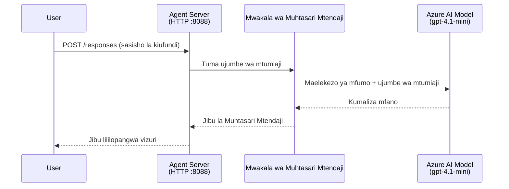
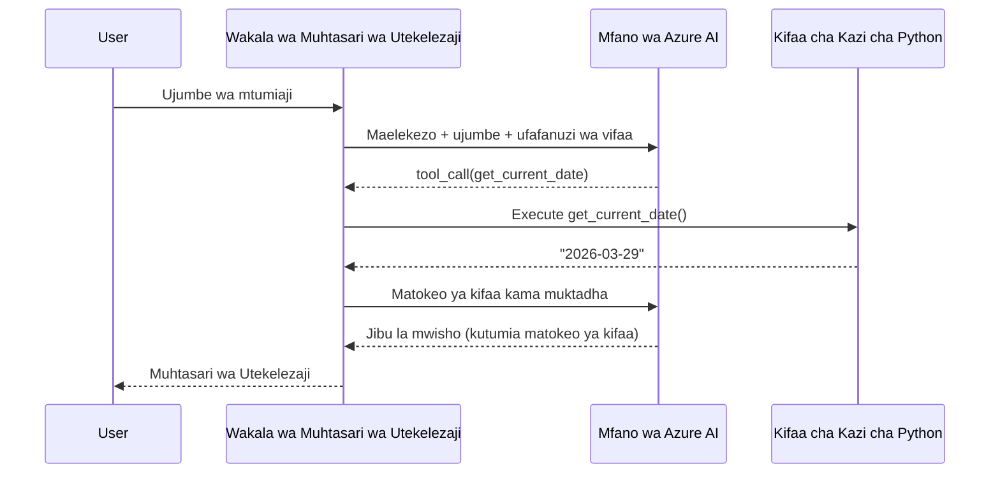

# Moduli 4 - Sanidi Maelekezo, Mazingira & Sakinisha Vitegemezi

Katika moduli hii, unaibadilisha faili za mawakala zilizojengwa moja kwa moja kutoka Moduli 3. Hapa ndipo unapoabadili mfumo wa kawaida kuwa **wakala wako** - kwa kuandika maelekezo, kuweka mabadiliko ya mazingira, hiari kuongeza zana, na kusakinisha vitegemezi.

> **Kumbusho:** Mnyongeza wa Foundry uliunda faili zako za mradi moja kwa moja. Sasa wewe ubadilishe. Tazama folda ya [`agent/`](../../../../../workshop/lab01-single-agent/agent) kwa mfano kamili wa wakala aliyebadilishwa.

---

## Jinsi vipengele vinavyolingana pamoja

### Mzunguko wa ombi (wakala mmoja)


> **Kwa zana:** Ikiwa wakala ana zana zilizosajiliwa, mfano unaweza kurudisha simu ya zana badala ya kukamilisha moja kwa moja. Mfumo hufanikisha zana hiyo kwa ndani, hurejesha matokeo kwa mfano, na mfano kisha hutengeneza jibu la mwisho.


---

## Hatua 1: Sanidi mabadiliko ya mazingira

Mfumo ulizalisha faili `.env` yenye thamani za sehemu. Unahitaji kujaza thamani halisi kutoka Moduli 2.

1. Katika mradi uliounda wa moja kwa moja, fungua faili la **`.env`** (łipo kwenye mzizi wa mradi).
2. Badilisha thamani za sehemu na maelezo halisi ya mradi wa Foundry:

   ```env
   PROJECT_ENDPOINT=https://<your-account>.services.ai.azure.com/api/projects/<your-project>
   MODEL_DEPLOYMENT_NAME=gpt-4.1-mini
   ```

3. Hifadhi faili.

### Wapi kupata thamani hizi

| Thamani | Jinsi ya kuipata |
|---------|------------------|
| **Kituo cha mradi** | Fungua upau wa Microsoft Foundry upande wa VS Code → bonyeza mradi wako → URL ya kituo inaonyeshwa kwenye maelezo. Inaonekana kama `https://<account-name>.services.ai.azure.com/api/projects/<project-name>` |
| **Jina la kupeleka mfano** | Katika upau wa Foundry, panua mradi wako → angalia chini ya **Models + endpoints** → jina linaorodheshwa kando ya mfano uliotumwa (mfano, `gpt-4.1-mini`) |

> **Usalama:** Kamwe usihifadhi faili `.env` katika udhibiti wa toleo. Tayari iko kwenye `.gitignore` kwa kawaida. Ikiwa haipo, ongeza:
> ```
> .env
> ```

### Jinsi mabadiliko ya mazingira huingia kazi

Mfuatano ni: `.env` → `main.py` (husoma kupitia `os.getenv`) → `agent.yaml` (huringa kwa mabadiliko ya mazingira ya kontena wakati wa kupeleka).

Katika `main.py`, mfumo husoma thamani hizi hivi:

```python
PROJECT_ENDPOINT = os.getenv("AZURE_AI_PROJECT_ENDPOINT") or os.getenv("PROJECT_ENDPOINT")
MODEL_DEPLOYMENT_NAME = os.getenv("AZURE_AI_MODEL_DEPLOYMENT_NAME", os.getenv("MODEL_DEPLOYMENT_NAME", "gpt-4.1-mini"))
```

Downi zote `AZURE_AI_PROJECT_ENDPOINT` na `PROJECT_ENDPOINT` zinakubaliwa (agent.yaml hutumia kiambishi `AZURE_AI_*`).

---

## Hatua 2: Andika maelekezo ya wakala

Hii ni hatua muhimu zaidi ya kubadilisha. Maelekezo huainisha tabia ya wakala wako, mwenendo, muundo wa matokeo, na vizingiti vya usalama.

1. Fungua `main.py` katika mradi wako.
2. Tafuta mfuatano wa maelekezo (mfumo una mfuatano wa chaguo-msingi/wa kawaida).
3. Ubali na uandike maelekezo yaliyo na undani na yenye muundo.

### Maelekezo mazuri hujumuisha nini

| Kipengele | Kusudi | Mfano |
|-----------|--------|--------|
| **Nafasi** | Kile wakala anaweza kufanya | "Wewe ni wakala wa muhtasari wa kiutendaji" |
| **Watazamaji** | Kwa nani majibu ni | "Viongozi wakuu wasio na uzoefu mkubwa wa kiufundi" |
| **Ufafanuzi wa ingizo** | Aina gani ya maombi hushughulikiwa | "Ripoti za matukio ya kiufundi, masasisho ya uendeshaji" |
| **Muundo wa matokeo** | Muundo kamili wa majibu | "Muhtasari wa Kiutendaji: - Kilichotokea: ... - Athari za biashara: ... - Hatua inayofuata: ..." |
| **Sheria** | Vizingiti na masharti ya kukataa | "Usiongeze taarifa zaidi kuliko ilivyopewa" |
| **Usalama** | Kuzuia matumizi mabaya na fikra potofu | "Ikiwa ingizo halieleweki, uliza ufafanuzi" |
| **Mifano** | Mifano ya ingizo/matokeo kuongoza tabia | Jumuisha mifano 2-3 yenye ingizo mbalimbali |

### Mfano: Maelekezo ya Wakala Muhtasari wa Kiutendaji

Hapa ni maelekezo yaliyotumika katika warsha ya [`agent/main.py`](../../../../../workshop/lab01-single-agent/agent/main.py):

```python
AGENT_INSTRUCTIONS = """You are an "Explain Like I'm an Executive" agent.

Purpose:
Your job is to translate complex technical or operational information into
clear, concise, and outcome-focused summaries that can be easily understood
by non-technical executives.

Audience:
Senior leaders with limited technical background who care about impact,
risk, and what happens next.

What you must do:
- Rephrase the input so it is understandable to a non-technical audience
- Prioritize clarity, brevity, and outcomes over technical accuracy
- Remove technical jargon, logs, metrics, stack traces, and deep root-cause details
- Translate technical causes into simple cause-and-effect statements
- Explicitly call out business impact
- Always include a clear next step or action
- Maintain a neutral, factual, and calm executive tone
- Do NOT add new facts or speculate beyond the input

Standard Output Structure (always use this wording):

Executive Summary:
- What happened: <plain-language description>
- Business impact: <clear, non-technical impact>
- Next step: <clear action or mitigation>

Rules:
- Keep responses under 100 words
- Do NOT add facts beyond the input
- If input is unclear, ask for clarification
"""
```

4. Badilisha mfuatano wa maelekezo uliopo ndani ya `main.py` na maelekezo yako maalum.
5. Hifadhi faili.

---

## Hatua 3: (Hiari) Ongeza zana maalum

Mawakala waliohusishwa wanaweza kutekeleza **kazi za Python za ndani** kama [zana](https://learn.microsoft.com/azure/foundry/agents/concepts/tool-catalog). Hii ni faida kuu ya mawakala waliotegemea msimbo ukilinganisha na mawakala wa maombi tu - wakala wako anaweza kuendesha mantiki yoyote ya upande wa seva.

### 3.1 Tafsiri kazi ya zana

Ongeza kazi ya zana ndani ya `main.py`:

```python
from agent_framework import tool

@tool
def get_current_date() -> str:
    """Returns the current date in YYYY-MM-DD format."""
    from datetime import date
    return str(date.today())
```

Dekoreta `@tool` hugeuza kazi ya kawaida ya Python kuwa zana ya wakala. Maelezo ya docstring yanakuwa maelezo ya zana ambayo mfano unaona.

### 3.2 Sajili zana kwa wakala

Unapo tengeneza wakala kupitia muktadha wa `.as_agent()`, pita zana kwenye kigezo `tools`:

```python
async with AzureAIAgentClient(
    project_endpoint=PROJECT_ENDPOINT,
    model_deployment_name=MODEL_DEPLOYMENT_NAME,
    credential=credential,
).as_agent(
    name="my-agent",
    instructions=AGENT_INSTRUCTIONS,
    tools=[get_current_date],
) as agent:
    server = from_agent_framework(agent)
    await server.run_async()
```

### 3.3 Jinsi simu za zana zinavyofanya kazi

1. Mtumiaji anatumia ombi.
2. Mfano unaamua kama zana inahitajika (kutegemea ombi, maelekezo, na maelezo ya zana).
3. Ikiwa zana inahitajika, mfumo huhamia kufanya kazi yako ya Python ndani ya kontena.
4. Thamani ya kurudisha ya zana hurudishwa kwa mfano kama muktadha.
5. Mfano hutengeneza jibu la mwisho.

> **Zana hufanya kazi upande wa seva** - zinaendeshwa ndani ya kontena lako, si katika kivinjari cha mtumiaji au mfano. Hii inamaanisha unaweza kufikia hifadhidata, API, mifumo ya faili, au maktaba yoyote ya Python.

---

## Hatua 4: Tengeneza na washa mazingira pepe ya Python

Kabla ya kusakinisha vitegemezi, tengeneza mazingira pekee ya Python.

### 4.1 Tengeneza mazingira pepe

Fungua terminal katika VS Code (`` Ctrl+` ``) na endesha:

```powershell
python -m venv .venv
```

Hii hutengeneza folda `.venv` ndani ya saraka ya mradi wako.

### 4.2 Washa mazingira pepe

**PowerShell (Windows):**

```powershell
.\.venv\Scripts\Activate.ps1
```

**Command Prompt (Windows):**

```cmd
.venv\Scripts\activate.bat
```

**macOS/Linux (Bash):**

```bash
source .venv/bin/activate
```

Unapaswa kuona `(.venv)` inaonekana mwanzoni mwa hoja ya terminal, ikionyesha mazingira pepe yamewashwa.

### 4.3 Sakinisha vitegemezi

Akaunti ya mazingira pepe ikiendelea, sakinisha vifurushi vinavyohitajika:

```powershell
pip install -r requirements.txt
```

Hii inasakinisha:

| Kifurushi | Kusudi |
|-----------|--------|
| `agent-framework-azure-ai==1.0.0rc3` | Muunganiko wa Azure AI kwa [Microsoft Agent Framework](https://learn.microsoft.com/agent-framework/overview/) |
| `agent-framework-core==1.0.0rc3` | Msingi wa runtime wa ujenzi wa mawakala (inajumuisha `python-dotenv`) |
| `azure-ai-agentserver-agentframework==1.0.0b16` | Runtime ya seva ya wakala iliyohudumiwa kwa [Foundry Agent Service](https://learn.microsoft.com/azure/foundry/agents/overview) |
| `azure-ai-agentserver-core==1.0.0b16` | Abstraksheni kuu za seva wa wakala |
| `debugpy` | Ufuatiliaji wa Python (huwezesha ufuatiliaji F5 katika VS Code) |
| `agent-dev-cli` | CLI ya maendeleo ya ndani kwa upimaji wa mawakala |

### 4.4 Thibitisha usakinishaji

```powershell
pip list | Select-String "agent-framework|agentserver"
```

Matokeo yanayotarajiwa:
```
agent-framework-azure-ai   1.0.0rc3
agent-framework-core       1.0.0rc3
azure-ai-agentserver-agentframework 1.0.0b16
azure-ai-agentserver-core  1.0.0b16
```

---

## Hatua 5: Thibitisha uthibitishaji

Wakala hutumia [`DefaultAzureCredential`](https://learn.microsoft.com/azure/developer/python/sdk/authentication/credential-chains#defaultazurecredential-overview) ambayo hujaribu njia mbalimbali za uthibitishaji kwa mpangilio huu:

1. **Mabadiliko ya mazingira** - `AZURE_CLIENT_ID`, `AZURE_TENANT_ID`, `AZURE_CLIENT_SECRET` (wakala wa huduma)
2. **Azure CLI** - hutambua kikao chako cha `az login`
3. **VS Code** - hutumia akaunti ulioingia nayo VS Code
4. **Kitambulisho Kilichosimamiwa** - hutumika wakati wa kuendesha Azure (wakati wa uwasilishaji)

### 5.1 Thibitisha kwa maendeleo ya ndani

Angalau moja ya hizi inapaswa kufanya kazi:

**Chaguo A: Azure CLI (inapendekezwa)**

```powershell
az account show --query "{name:name, id:id}" --output table
```

Inatarajiwa: Inaonyesha jina na kitambulisho cha usajili wako.

**Chaguo B: Kuingia VS Code**

1. Angalia chini-kushoto mwa VS Code kwa ikoni ya **Akaunti**.
2. Ikiwa unaona jina la akaunti yako, umeidhinishwa.
3. Ikiwa hauoni, bonyeza ikoni → **Ingia ili kutumia Microsoft Foundry**.

**Chaguo C: Wakala wa huduma (kwa CI/CD)**

```powershell
$env:AZURE_TENANT_ID = "<your-tenant-id>"
$env:AZURE_CLIENT_ID = "<your-client-id>"
$env:AZURE_CLIENT_SECRET = "<your-client-secret>"
```

### 5.2 Tatizo la kawaida la uthibitishaji

Ikiwa umeingia kwenye akaunti nyingi za Azure, hakikisha usajili sahihi umechaguliwa:

```powershell
az account set --subscription "<your-subscription-id>"
```

---

### Kidhibiti cha kuangalia

- [ ] Faili `.env` ina `PROJECT_ENDPOINT` na `MODEL_DEPLOYMENT_NAME` halali (si sehemu tu)
- [ ] Maelekezo ya wakala yamebadilishwa katika `main.py` - huainisha nafasi, watazamaji, muundo wa matokeo, sheria, na vizingiti vya usalama
- [ ] (Hiari) Zana maalum zimetafsiriwa na kusajiliwa
- [ ] Mazingira pepe yameundwa na kuwashwa (`(.venv)` inaonekana kwenye hoja ya terminal)
- [ ] `pip install -r requirements.txt` imekamilika bila makosa
- [ ] `pip list | Select-String "azure-ai-agentserver"` inaonyesha kifurushi kimesakinishwa
- [ ] Uthibitishaji ni halali - `az account show` hurudisha usajili wako AU umeingia VS Code

---

**Iliyopita:** [03 - Unda Wakala Aliyehudumiwa](03-create-hosted-agent.md) · **Ijayo:** [05 - Jaribu Kwenye Eneo Lao →](05-test-locally.md)

---

<!-- CO-OP TRANSLATOR DISCLAIMER START -->
**Kauli ya Kukataa**:
Nyaraka hii imetafsiriwa kwa kutumia huduma ya tafsiri ya AI [Co-op Translator](https://github.com/Azure/co-op-translator). Wakati tunajitahidi kuwa sahihi, tafadhali fahamu kwamba tafsiri za kiotomatiki zinaweza kuwa na makosa au upungufu wa usahihi. Nyaraka ya asili katika lugha yake ya asili inapaswa kuzingatiwa kama chanzo halali. Kwa habari muhimu, tafsiri ya kitaalamu ya binadamu inashauriwa. Hatubebi dhima kwa kutoelewana au tafsiri potofu zinazotokana na matumizi ya tafsiri hii.
<!-- CO-OP TRANSLATOR DISCLAIMER END -->