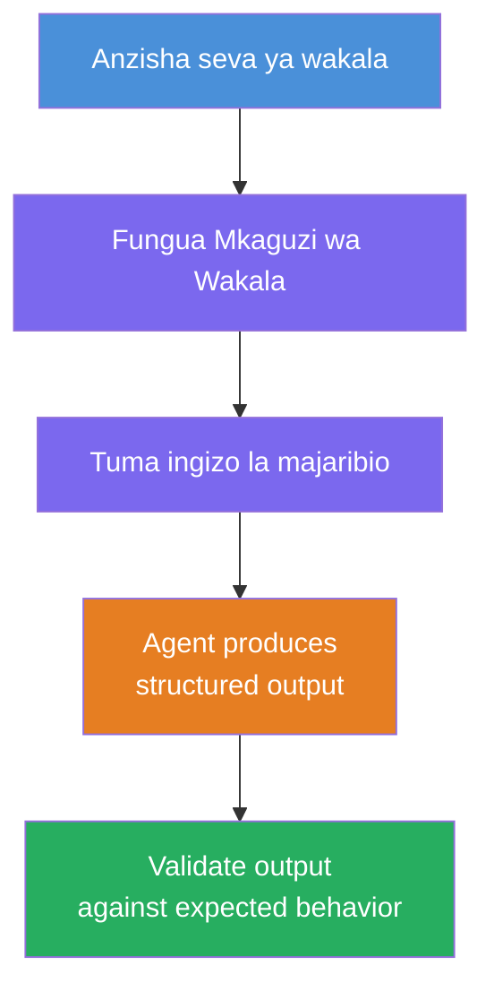
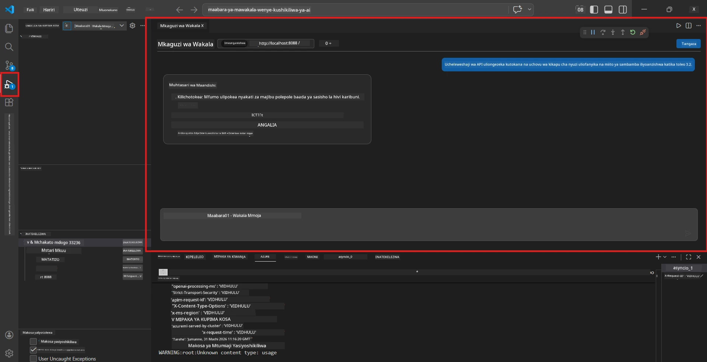
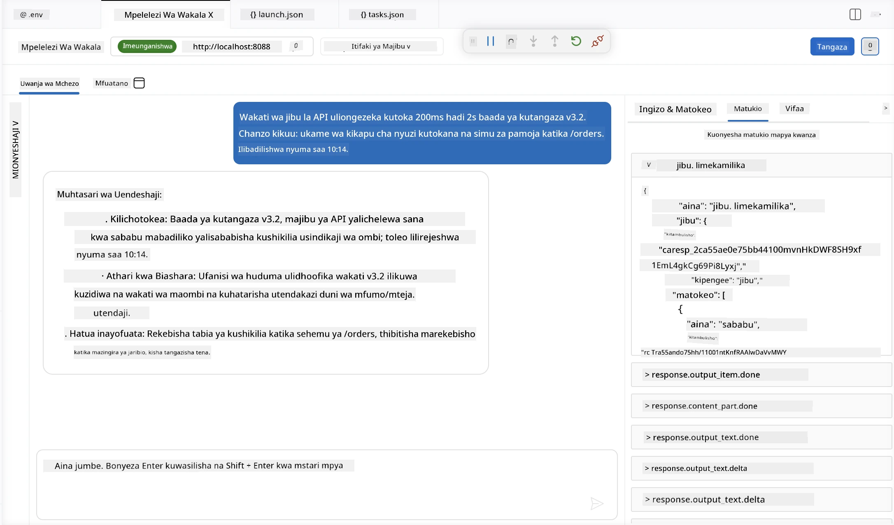

# Sehemu ya 4 - Jaribu Kwenye Mitaa

⏱️ ~Dakika 10

Katika sehemu hii, unaendesha wakala wako sehemu ya miti na kuthibitisha kuwa unafanya kazi ipasavyo kwa kutumia **majaribio ya utendaji wa njia ya furaha**. Utatumia Mtazamaji wa Wakala (UI ya kuona) au simu za moja kwa moja za HTTP kuthibitisha wakala anatoa majibu yaliyopangwa na sahihi.

### Mtiririko wa majaribio ya ndani



---

## Chaguo 1: Bonyeza F5 - Rekebisha na Mtazamaji wa Wakala (zinapendekezwa)

### Anzisha mtambuzi

1. Fungua folda ya **executive-summary-agent/** moja kwa moja katika VS Code (`File → Open Folder`).
2. Fungua paneli ya **Run and Debug** (`Ctrl+Shift+D`).
3. Chagua **Debug Local Agent Server** kutoka kwenye orodha.
4. Bonyeza **F5** (au bofya ▶ Anzisha Kudebugi).

> ⚠️ **Muhimu: Chagua Mfasiri wa Python**
> Ikiwa unapata "ModuleNotFoundError" au mtambuzi hauanze, lazima umwambie VS Code itumie mazingira ya virtual yako:
  > 1. Bonyeza `Ctrl+Shift+P` $\rightarrow$ andika **Python: Select Interpreter**.
  > 2. Chagua mfasiri aliyeko katika folda ya `.venv` ya mradi wako (mfano, `.\.venv\Scripts\python.exe` kwenye Windows).
  > 3. Anzisha upya kikao cha debug.
> Ikiwa bado unapata makosa, sasisha faili yako `tasks.json` kama ifuatavyo kwa mkono:
  > 1. Nenda kwenye faili `.vscode/tasks.json`
  > 2. Nenda kwa amri iliyotajwa: `Run Agent/Workflow HTTP Server`
  > 3. Sasisha thamani ya amri kama ifuatavyo: `"value": "${workspaceFolder}/.venv/bin/python",`

### Kinatokea

1. Server ya HTTP inaanza kwa `http://localhost:8088/responses`.
2. Paneli ya **Mtazamaji wa Wakala** inaonekana moja kwa moja - ni kiolesura cha gumzo cha kuona kwa ajili ya majaribio.
3. Vidhibiti vya kupumzika vimewezeshwa katika `main.py`.

Angalia Terminal kwa:
```
Starting executive summary hosted agent
Executive agent server running on http://localhost:8088
```

> **Ikiwa Mtazamaji wa Wakala haifunguki:** Bonyeza `Ctrl+Shift+P` → **Foundry Toolkit: Open Agent Inspector**.



> *Picha inaweza kuonyesha chapa ya zamani ya 'AI TOOLKIT' kutoka toleo la awali la kipando.*

---

## Chaguo 2: Jaribu kupitia Terminal (mbadala)

Anzisha wakala kwenye terminal moja, tuma maombi kutoka terminal nyingine:

```bash
# Terminal 1: Anza wakala
cd executive-summary-agent/
source .venv/bin/activate
python main.py
```

```bash
# Kituo cha 2: Tuma jaribio (curl)
curl -sS -X POST http://localhost:8088/responses \
  -H "Content-Type: application/json" \
  -d '{"input": "The API latency increased due to thread pool exhaustion caused by sync calls in v3.2.", "stream": false}'
```

---

## Majaribio ya matukio: uthibitishaji wa utendaji wa njia ya furaha

Endesha **matukio yote matatu** hapa chini. Haya yanathibitisha kuwa wakala wako hutoa output sahihi, iliyopangwa kwa ingizo halisi.



### Tukio la 1: Tukio la IT - Kuongezeka kwa ucheleweshaji wa API

**Ingizo:**
```
The API latency increased from 200ms to 2s after deploying v3.2.
Root cause: thread pool starvation from synchronous calls in /orders.
Rolled back at 10:14.
```

**Matukio yanayotarajiwa:**
- ✅ Inafuata muundo wa "Muhtasari Mtendaji" (Kilichotokea / Athari za biashara / Hatua inayofuata)
- ✅ Hakuna istilahi za kiufundi (hakuna "thread pool", hakuna "/orders", hakuna "v3.2")
- ✅ Inaonyesha wazi athari za biashara (mfano, watumiaji walikumbwa na ucheleweshaji)
- ✅ Inajumuisha hatua inayofuata (mfano, marekebisho yamewekwa, ufuatiliaji uko)

---

### Tukio la 2: Mlolongo wa Data - Kushindwa kwa ETL

**Ingizo:**
```
The nightly ETL job failed because the upstream schema changed. APAC dashboards show missing data.
```

**Matukio yanayotarajiwa:**
- ✅ Inasisitiza kushindwa kwa usasishaji wa data kwa lugha rahisi
- ✅ Inataja athari za dashibodi ya APAC
- ✅ Inajumuisha hatua ya kurekebisha
- ✅ Hainaji "ETL", "schema", wala istilahi nyingine za kiufundi

---

### Tukio la 3: Usalama - Kitambulisho kilicho wazi

**Ingizo:**
```
Static analysis flagged a hardcoded secret in the repository.
The secret may have been exposed in commit history.
```

**Matukio yanayotarajiwa:**
- ✅ Inaelezea tatizo la kitambulisho/usalama kwa lugha rafiki kwa mtendaji
- ✅ Inataja hatari inayoweza kutokea (ufikiaji bila idhini)
- ✅ Inaeleza hatua za kurekebisha (kuzungusha vitambulisho, ukaguzi)
- ✅ Hainajumuishi istilahi kama "uchambuzi thabiti", "rekodi ya makubaliano", au "kauli ngumu"

---

## Vigezo vya uthibitishaji

Kwa kila tukio, angalia:

| # | Vigezo | Hali ya kupita |
|---|----------|----------------|
| 1 | **Muundo** | Jibu linatumia muundo wa "Muhtasari Mtendaji" na alama tatu zote |
| 2 | **Lugha rahisi** | Hakuna istilahi za kiufundi zisizofahamika na mtendaji |
| 3 | **Usahihi** | Muhtasari unaendana na ingizo - hakuna maelezo ya uongo |
| 4 | **Ufupi** | Jibu liko chini ya maneno 100 |
| 5 | **Hatua inayofuata** | Hatua au kinga iliyoelezwa kwa uwazi |

---

## Vidokezo vya kuredani

| Tatizo | Suluhisho |
|-------|----------|
| Wakala haianzi | Angalia thamani za `.env`, hakikisha venv imewezeshwa, endesha `pip install -r requirements.txt` |
| Jibu tupu au la kawaida | Pitia maelekezo kwenye `main.py` - hakikisha muundo wa output umeelezwa |
| Jibu lina istilahi | Imarisha kanuni za "kuondoa istilahi za kiufundi" kwenye maelekezo |
| Mtazamaji wa Wakala haifunguki | `Ctrl+Shift+P` → **Foundry Toolkit: Open Agent Inspector** |
| Makosa ya modeli kwenye Terminal | Hakikisha `AZURE_AI_MODEL_DEPLOYMENT_NAME` inalingana kikamilifu (lugha ya herufi inazingatiwa) |

---

### ✅ Kiwango cha ukaguzi

- [ ] Wakala anza sehemu ya mitaa bila makosa
- [ ] Mtazamaji wa Wakala afunguke na aonyeshe kiolesura cha gumzo (ikiwa unatumia F5)
- [ ] **Tukio la 1** (tatizo la IT) - muhtasari mtendaji uliopangwa, hakuna istilahi
- [ ] **Tukio la 2** (mlolongo wa data) - muhtasari unaofaa na athari za biashara
- [ ] **Tukio la 3** (taarifa ya usalama) - mawasiliano ya hatari inayofaa
- [ ] Majibu yote yanafuata muundo uliobainishwa

> **Hifadhi majibu yako** (nakili au piga picha ya skrini) - utayalinganisha na matokeo ya wingu katika Sehemu ya 06.

---

**Iliyo hapo awali:** [03 - Configure & Code](03-configure-and-code.md) · **Ifuatayo:** [05 - Deploy to Foundry →](05-deploy-to-foundry.md)

---

<!-- CO-OP TRANSLATOR DISCLAIMER START -->
**Kionyozo**:
Hati hii imetafsiriwa kwa kutumia huduma ya tafsiri ya AI [Co-op Translator](https://github.com/Azure/co-op-translator). Ingawa tunajitahidi kupata usahihi, tafadhali fahamu kwamba tafsiri za kiotomatiki zinaweza kuwa na makosa au upungufu wa usahihi. Hati ya asili katika lugha yake halisi inapaswa kuchukuliwa kama chanzo cha mamlaka. Kwa taarifa muhimu, tafsiri ya kitaalamu inayofanywa na binadamu inapendekezwa. Hatutojibu kwa kuelewa vibaya au tafsiri potofu zinazotokea kutokana na matumizi ya tafsiri hii.
<!-- CO-OP TRANSLATOR DISCLAIMER END -->