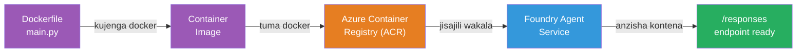
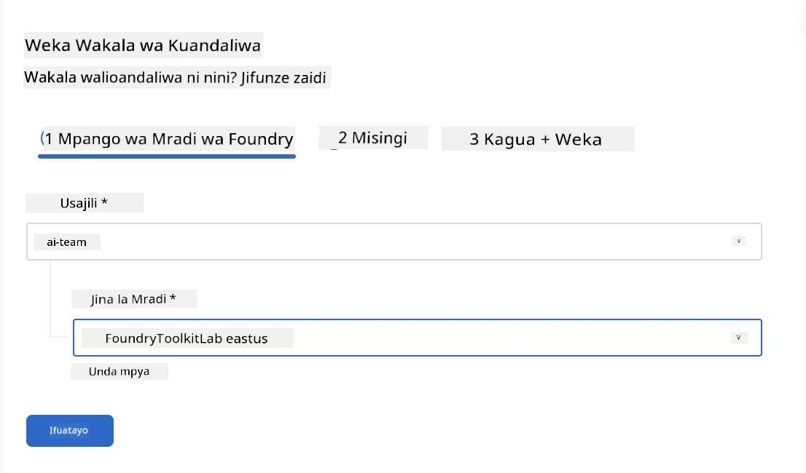
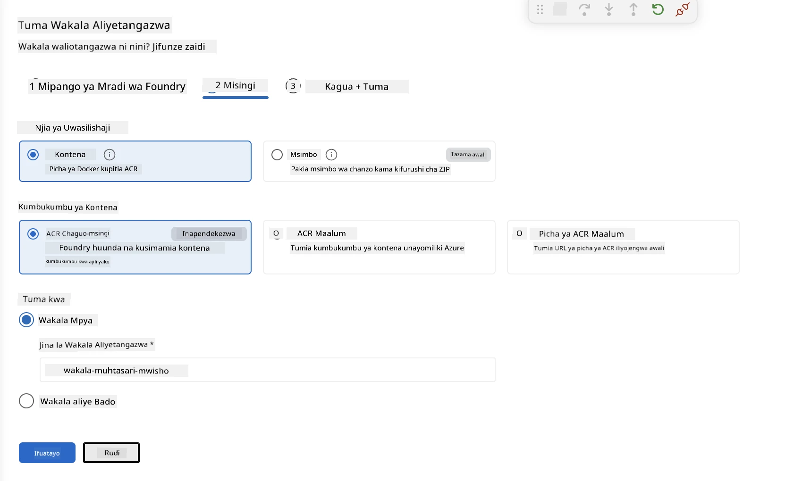
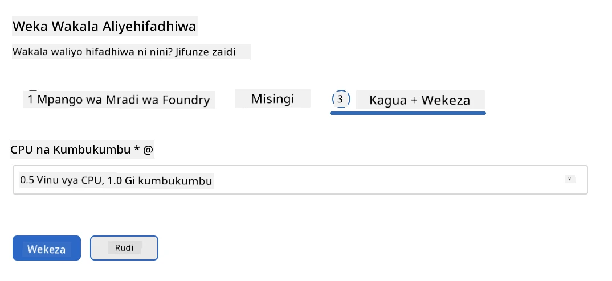
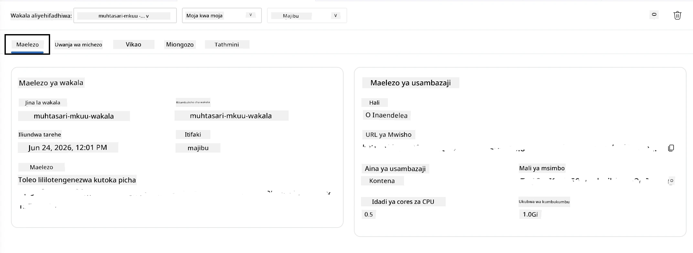

# Moduli 5 - Tuma kwa Huduma ya Wakala ya Foundry

⏱️ ~dakika 10

> ⚠️ **Watumiaji wa Njia B:** Moduli hii inahitaji usajili wa Foundry. Ikiwa unatumia Foundry Local, ruka hadi [Moduli 07 - Muhtasari](07-summary.md). Umefanikiwa kukamilisha mchakato wa maendeleo wa ndani!

Katika moduli hii, utaweka wakala wako uliothibitishwa ndani ya eneo lako katika Microsoft Foundry kama **Wakala Aliyeshotelwa**. Uwekaji hujenga picha ya kontena, huisukuma kwenda Azure Container Registry, na kuanzisha wakala katika miundombinu inayosimamiwa na Foundry.

### Mchakato wa Uwekaji

---

## Ukaguzi wa Mahitaji

Kabla ya kuweka, hakikisha:

- [ ] Wakala anapita matukio yote 3 ya ndani kutoka [Moduli 04](04-test-locally.md)
- [ ] Una jukumu la **Azure AI User** katika kiwango cha mradi ([Moduli 01, Weka RBAC](01-setup.md#deploy-a-model--assign-rbac))
- [ ] Umeshajukwaa ndani ya Azure kwenye VS Code (Aikoni ya Akaunti inaonyesha jina lako)

---

## Hatua 1: Anzisha uwekaji

### Chaguo A: Weka kutoka kwa Mchakato wa Mwakala (inapendekezwa)

Ikiwa Mchakato wa Mwakala umefunguliwa (kutoka kwenye majaribio):
1. Bofya kitufe cha **Deploy** upande wa juu kulia (aikoni ya wingu ↑).

### Chaguo B: Weka kutoka kwa Palette ya Amri

1. Bonyeza `Ctrl+Shift+P` → **Foundry Toolkit: Deploy Hosted Agent**.

---

## Hatua 2: Sanidi uwekaji

Msaada utakuliza:

| Ombi | Chaguo |
|--------|-----------|
| **Usajili** | Usajili wako wa Azure |
| **Mradi lengwa** | Mradi wako wa Foundry (mfano, `workshop-agents`) |

Bofya **next** kuendelea kusanidi wakala wako.

| Ombi | Chaguo |
|--------|-----------|
| **Mbinu ya Uwekaji** | Kontena |
| **Kwenye rejista ya kontena** | **ACR ya Msingi** (Microsoft Foundry huunda na kusimamia moja kwa ajili yako) |
| **Weka kwa** | Wakala Mpya (jina, `executive-summary-agent`) |

Bofya **next** kukagua na kuweka wakala wako.

| Ombi | Chaguo |
|--------|-----------|
| **CPU na kumbukumbu** | **Mito 0.25 ya CPU, kumbukumbu 0.5 Gi** (inatosha kwa warsha) |

---

## Hatua 3: Weka na tazama

1. Bofya **Deploy**.
2. Tazama paneli ya **Output** (chagua **Microsoft Foundry** kutoka kwenye menyu ya kushuka).
3. Uwekaji unafuatia hatua hizi:
   - **Jengo la Docker** - hujenga kontena kutoka kwa Dockerfile yako
   - **Sukuma Docker** - husukuma picha kwa ACR (dakika 1–3 kwa kuweka mara ya kwanza)
   - **Usajili wa wakala** - huunda wakala aliyehostiwa ndani ya Foundry
   - **Anzisha kontena** - huanza kwa utambulisho unaosimamiwa na mfumo

4. Ukimaliza, taarifa inaonekana:
   > **my-agent imewekwa kwa mafanikio.** `Tazama maelezo` `Endesha wakala`

5. Bofya **Endesha wakala** kufungua Kiwanda cha Wakala.

### Thamani za hali ya uwekaji

| Hali | Maana |
|--------|---------|
| **Inaendesha** | Kontena uko tayari, wakala anajibu |
| **Inasubiri** | Kontena ni kuanza - subiri sekunde 30–60 |
| **Imeshindwa** | Angalia maelezo (ona hitilafu hapo chini) |

---

## Makosa ya kawaida ya uwekaji

| Hitilafu | Sababu | Suluhisho |
|-------|-----------|-----|
| Ruhusa `agents/write` imekataliwa | Kukosa jukumu la **Azure AI User** katika kiwango cha mradi | [Moduli 01, Weka RBAC](01-setup.md#deploy-a-model--assign-rbac) |
| Docker haianzi | Docker Desktop haijaanzishwa | Anzisha Docker Desktop → hakikisha `docker info` |
| Idhini ya ACR | Utambulisho unaosimamiwa hauwezi kuvuta picha | Angalia [Moduli 08 - Utatuzi wa matatizo](08-troubleshooting.md) |

---

### ✅ Kituo cha udhibiti

- [ ] Uwekaji umekamilika bila makosa
- [ ] Wakala anaonekana chini ya **Wakala Waliyeshotelwa (Preview)** kwenye upau wa Foundry
- [ ] Hali ya kontena inaonyesha **Inaendesha**
- [ ] Tab ya Kiwanda cha Wakala imefunguliwa ikionyesha maelezo ya wakala na URL ya mwisho

---

**Iliyopita:** [04 - Jaribu Ndani](04-test-locally.md) · **Inayofuata:** [06 - Thibitisha Kiwandani →](06-verify-in-playground.md)

---

<!-- CO-OP TRANSLATOR DISCLAIMER START -->
**Kionyozo**:
Hati hii imetafsiriwa kwa kutumia huduma ya tafsiri ya AI [Co-op Translator](https://github.com/Azure/co-op-translator). Ingawa tunajitahidi kupata usahihi, tafadhali fahamu kwamba tafsiri za kiotomatiki zinaweza kuwa na makosa au upungufu wa usahihi. Hati ya asili katika lugha yake halisi inapaswa kuchukuliwa kama chanzo cha mamlaka. Kwa taarifa muhimu, tafsiri ya kitaalamu inayofanywa na binadamu inapendekezwa. Hatutojibu kwa kuelewa vibaya au tafsiri potofu zinazotokea kutokana na matumizi ya tafsiri hii.
<!-- CO-OP TRANSLATOR DISCLAIMER END -->