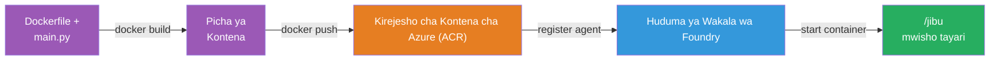
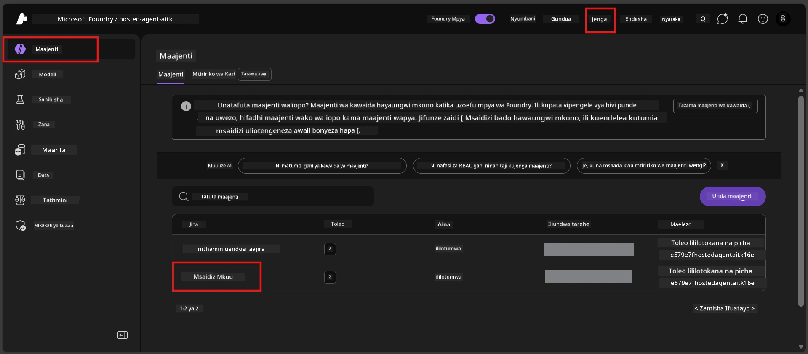

# Moduli 6 - Weka Huduma ya Wakala wa Foundry

Katika moduli hii, unaweka wakala wako uliojaribiwa ndani ya eneo lako kwa Microsoft Foundry kama [**Wakala Aliyeshikwa**](https://learn.microsoft.com/azure/foundry/agents/concepts/hosted-agents). Mchakato wa kuweka hutengeneza picha ya kontena ya Docker kutoka kwa mradi wako, huisukuma kwenye [Azure Container Registry (ACR)](https://learn.microsoft.com/azure/container-registry/container-registry-intro), na kuunda toleo la wakala aliyeshikwa katika [Huduma ya Wakala ya Foundry](https://learn.microsoft.com/azure/foundry/agents/overview).

### Mtiririko wa kuweka


---

## Ukaguzi wa mahitaji kabla ya kuweka

Kabla ya kuweka, hakikisha kila kipengele kilicho hapa chini. Kupuuza haya ndilo chanzo cha kawaida cha kushindwa kwa kuweka.

1. **Wakala anapita mitihani ya uangalizi ya ndani:**
   - Umefanya mitihani yote 4 katika [Moduli 5](05-test-locally.md) na wakala alijibu vyema.

2. **Una jukumu la [Mtumiaji wa Azure AI](https://learn.microsoft.com/azure/foundry/concepts/rbac-foundry#built-in-roles):**
   - Hili lilipewa katika [Moduli 2, Hatua ya 3](02-create-foundry-project.md). Ikiwa hauhakiki, thibitisha sasa:
   - Azure Portal → rasilimali yako ya mradi wa Foundry → **Udhibiti wa upatikanaji (IAM)** → kichupo cha **Uhifadhi wa majukumu** → tafuta jina lako → thibitisha **Azure AI User** ipo kwenye orodha.

3. **Umeingia Azure ndani ya VS Code:**
   - Angalia ikoni ya Akaunti upande wa chini kushoto katika VS Code. Jina la akaunti yako linapaswa kuonekana.

4. **(Hiari) Docker Desktop inaendesha:**
   - Docker inahitajika tu ikiwa kiendelezaji cha Foundry kinakusudia kujenga hapa eneo lako. Katika hali nyingi, kiendelezaji hufanikisha majengo ya kontena moja kwa moja wakati wa kuweka.
   - Ikiwa umeweka Docker, hakikisha inaendesha: `docker info`

---

## Hatua 1: Anza kuweka

Una njia mbili za kuweka - zote huishia kwa matokeo sawa.

### Chaguo A: Weka kutoka kwa Mchunguzi wa Wakala (inapendekezwa)

Ikiwa unaendesha wakala na debuga (F5) na Mchunguzi wa Wakala umefunguliwa:

1. Angalia **kona ya juu kulia** ya paneli ya Mchunguzi wa Wakala.
2. Bonyeza kitufe cha **Weka** (ikoni ya wingu yenye mshale unaoelekea juu ↑).
3. Mtaalamu wa kuweka unafunguka.

### Chaguo B: Weka kutoka kwenye Command Palette

1. Bonyeza `Ctrl+Shift+P` kufungua **Command Palette**.
2. Andika: **Microsoft Foundry: Deploy Hosted Agent** na uchague.
3. Mtaalamu wa kuweka unafunguka.

---

## Hatua 2: Sanidi kuweka

Mtaalamu wa kuweka anakuelekeza jinsi ya kusanidi. Jaza kila swali:

### 2.1 Chagua mradi lengwa

1. Menyu inayoanguka inaonyesha miradi yako ya Foundry.
2. Chagua mradi uliouunda katika Moduli 2 (mfano `workshop-agents`).

### 2.2 Chagua faili la wakala wa kontena

1. Utaombwa kuchagua sehemu ya kuanzisha wakala.
2. Chagua **`main.py`** (Python) - huu ndio faili ambalo mtaalamu hutumia kutambua mradi wako wa wakala.

### 2.3 Sanidi rasilimali

| Mipangilio | Thamani Inayopendekezwa | Maelezo |
|------------|-------------------------|---------|
| **CPU** | `0.25` | Kawaida, ya kutosha kwa warsha. Ongeza kwa mzigo wa uzalishaji |
| **Kumbukumbu** | `0.5Gi` | Kawaida, ya kutosha kwa warsha |

Hizi zinaendana na thamani katika `agent.yaml`. Unaweza kukubali chaguo la kawaida.

---

## Hatua 3: Thibitisha na weka

1. Mtaalamu anaonyesha muhtasari wa kuweka ukijumuisha:
   - Jina la mradi lengwa
   - Jina la wakala (kutoka `agent.yaml`)
   - Faili la kontena na rasilimali
2. Pitia muhtasari na bonyeza **Thibitisha na Weka** (au **Weka**).
3. Angalia maendeleo ndani ya VS Code.

### Kinachotokea wakati wa kuweka (hatua kwa hatua)

Kuweka ni mchakato wa hatua nyingi. Angalia paneli ya **Output** ya VS Code (chagua "Microsoft Foundry" kutoka kwenye menyu) ili kufuatilia:

1. **Ujenzi wa Docker** - VS Code hujenga picha ya kontena ya Docker kutoka kwenye `Dockerfile` yako. Utaona ujumbe wa tabaka za Docker:
   ```
   Step 1/6 : FROM python:<version>-slim
   Step 2/6 : WORKDIR /app
   ...
   Successfully built abc123def456
   ```

2. **Kusukuma Docker** - Picha husukumwa kwenye **Azure Container Registry (ACR)** inayohusiana na mradi wako wa Foundry. Hii inaweza kuchukua 1-3 dakika katika kuweka mara ya kwanza (picha ya msingi ni >100MB).

3. **Usajili wa wakala** - Huduma ya Wakala ya Foundry huunda wakala mpya aliyeshikwa (au toleo jipya ikiwa wakala tayari ipo). Metadata ya wakala kutoka `agent.yaml` inatumiwa.

4. **Kuanza kontena** - Kontena huanza katika miundombinu inayosimamiwa na Foundry. Jukwaa linampa [kitambulisho kinachosimamiwa na mfumo](https://learn.microsoft.com/azure/foundry/agents/concepts/agent-identity) na linaonyesha kiungo cha `/responses`.

> **Kuweka kwa mara ya kwanza ni polepole** (Docker inahitaji kusukuma tabaka zote). Kuweka kwa mara nyingine ni haraka kwa sababu Docker huchukua hifadhi tabaka zisizobadilika.

---

## Hatua 4: Thibitisha hali ya kuweka

Baada ya amri ya kuweka kumalizika:

1. Fungua upande wa **Microsoft Foundry** kwa kubonyeza ikoni ya Foundry kwenye Ukanda wa Shughuli.
2. Pancua sehemu ya **Hosted Agents (Preview)** chini ya mradi wako.
3. Unapaswa kuona jina la wakala wako (mfano `ExecutiveAgent` au jina kutoka `agent.yaml`).
4. **Bonyeza jina la wakala** ili kulipanua.
5. Utaona toleo moja au zaidi (mfano `v1`).
6. Bonyeza toleo kuona **Maelezo ya Kontena**.
7. Angalia uwanja wa **Hali**:

   | Hali | Maana |
   |------|-------|
   | **Imeanza** au **Inaendesha** | Kontena inaendesha na wakala yuko tayari |
   | **Inangojea** | Kontena inaanza (subiri sekunde 30-60) |
   | **Imefeli** | Kontena haikuanza (tazama kumbukumbu - angalia utatuzi hapa chini) |



> **Kama unaona "Inangojea" kwa zaidi ya dakika 2:** Kontena linaweza kuwa linapakua picha ya msingi. Subiri kidogo zaidi. Ikiwa linaendelea kuendelea, angalia kumbukumbu za kontena.

---

## Makosa ya kawaida ya kuweka na utatuzi

### Makosa 1: Ruhusa imetolewa vibaya - `agents/write`

```
Error: lacks the required data action 
Microsoft.CognitiveServices/accounts/AIServices/agents/write 
to perform POST /api/projects/{projectName}/assistants operation.
```

**Sababu kuu:** Huna jukumu la `Azure AI User` katika ngazi ya **mradi**.

**Hatua za kutatua vibaya:**

1. Fungua [https://portal.azure.com](https://portal.azure.com).
2. Katika eneo la utafutaji, andika jina la mradi wako wa Foundry na ubofye.
   - **Muhimu:** Hakikisha unaelekea kwenye rasilimali ya **mradi** (aina: "Microsoft Foundry project"), SI akaunti kuu/kituo.
3. Katika sehemu ya kushoto, bonyeza **Udhibiti wa upatikanaji (IAM)**.
4. Bonyeza **+ Ongeza** → **Ongeza uteuzi wa jukumu**.
5. Kwenye kichupo cha **Jukumu**, tafuta [**Azure AI User**](https://learn.microsoft.com/azure/foundry/concepts/rbac-foundry#built-in-roles) na ichague. Bonyeza **Ifuatayo**.
6. Kwenye kichupo cha **Wanachama**, chagua **Mtumiaji, kikundi, au mkurugenzi wa huduma**.
7. Bonyeza **+ Chagua wanachama**, tafuta jina lako/ barua pepe, chagua mwenyewe, bonyeza **Chagua**.
8. Bonyeza **Kagua + weka** → tena **Kagua + weka**.
9. Subiri 1-2 dakika kwa uteuzi wa jukumu kusambaa.
10. **Jaribu tena kuweka** kutoka Hatua ya 1.

> Jukumu lazima liwe katika kiwango cha **mradi**, sio tu kiwango cha akaunti. Hii ndilo chanzo #1 cha kawaida cha kushindikana kwa kuweka.

### Makosa 2: Docker haijaendesha

```
Error: Docker build failed / Cannot connect to Docker daemon
```

**Utatuzi:**
1. Anzisha Docker Desktop (tafuta kwenye menyu yako ya Anza au tray ya mfumo).
2. Subiri ionyeshe "Docker Desktop is running" (sekunde 30-60).
3. Hakiki: `docker info` kwenye terminal.
4. **Windows pekee:** Hakikisha WSL 2 backend imewezeshwa kwenye mipangilio ya Docker Desktop → **General** → **Tumia injini inayotegemea WSL 2**.
5. Jaribu tena kuweka.

### Makosa 3: Idhini ya ACR - `AcrPullUnauthorized`

```
Error: AcrPullUnauthorized
```

**Sababu kuu:** Kitambulisho kinachosimamiwa cha mradi wa Foundry hakina ruhusa ya kuvuta picha kutoka kwa rejista ya kontena.

**Utatuzi:**
1. Katika Azure Portal, nenda kwenye **[Container Registry](https://learn.microsoft.com/azure/container-registry/container-registry-intro)** (iko katika kundi la rasilimali moja na mradi wako wa Foundry).
2. Nenda kwenye **Udhibiti wa upatikanaji (IAM)** → **Ongeza** → **Ongeza uteuzi wa jukumu**.
3. Chagua jukumu la **[AcrPull](https://learn.microsoft.com/azure/container-registry/container-registry-roles)**.
4. Kwenye Wanachama, chagua **Kitambulisho kinachosimamiwa** → tafuta kitambulisho kinachosimamiwa cha mradi wa Foundry.
5. **Kagua + weka**.

> Hii kawaida huwekwa moja kwa moja na kiendelezaji cha Foundry. Ukiona kosa hili, inawezekana usanidi wa moja kwa moja umefeli.

### Makosa 4: Kutofautiana kwa jukwaa la kontena (Apple Silicon)

Ikiwa unafanya uwekaji kutoka Mac yenye Apple Silicon (M1/M2/M3), kontena lazima lijengwe kwa `linux/amd64`:

```bash
docker build --platform linux/amd64 -t myagent:v1 .
```

> Kiendelezaji cha Foundry hugatua hili moja kwa moja kwa watumiaji wengi.

---

### Kiangalia cha hatua

- [ ] Amri ya kuweka imemalizika bila makosa katika VS Code
- [ ] Wakala anaonekana chini ya **Hosted Agents (Preview)** kwenye ukanda wa Foundry
- [ ] Umebonyeza wakala → kuchagua toleo → kuona **Maelezo ya Kontena**
- [ ] Hali ya kontena inaonyesha **Imeanza** au **Inaendesha**
- [ ] (Kama kulikuwa na makosa) Ulitambua kosa, ukaweka utatuzi, na ukaweka tena kwa mafanikio

---

**Ya awali:** [05 - Jaribu Ndani ya Eneo](05-test-locally.md) · **Kufuata:** [07 - Thibitisha katika Playground →](07-verify-in-playground.md)

---

<!-- CO-OP TRANSLATOR DISCLAIMER START -->
**Onyo**:  
Hati hii imefasiriwa kwa kutumia huduma ya tafsiri ya AI [Co-op Translator](https://github.com/Azure/co-op-translator). Wakati tunajitahidi kwa usahihi, tafadhali fahamu kwamba tafsiri za kiotomatiki zinaweza kuwa na makosa au kasoro. Hati asili katika lugha yake ya asili inapaswa kuzingatiwa kama chanzo cha uhakika. Kwa taarifa muhimu, tafsiri ya kitaalamu ya binadamu inapendekezwa. Hatujawajibika kwa kutafsiri vibaya au kutoelewana kunakotokana na matumizi ya tafsiri hii.
<!-- CO-OP TRANSLATOR DISCLAIMER END -->