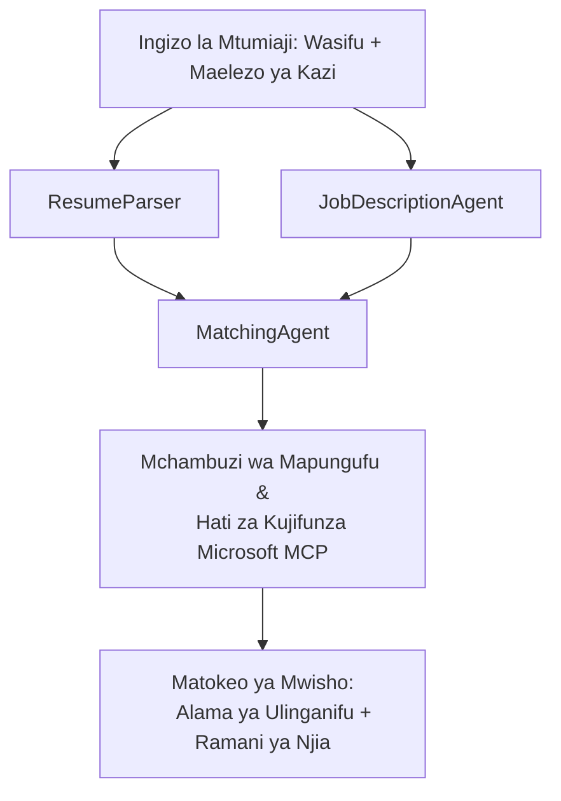

# PersonalCareerCopilot - Mtaalam wa Kurejea → Mtathmini wa Uendeshaji wa Kazi

Mfumo wa mawakala wengi unaotathmini jinsi CV inavyolingana na maelezo ya kazi, kisha hutengeneza ramani ya kujifunza binafsi ili kufunika mapengo.

---

## Wakala

| Wakala | Nafasi | Vifaa |
|-------|------|-------|
| **ResumeParser** | Hutoa ujuzi uliopangwa, uzoefu, vyeti kutoka kwa maandishi ya CV | - |
| **JobDescriptionAgent** | Hutoa ujuzi unahitajika/unaopendelea, uzoefu, vyeti kutoka kwa JD | - |
| **MatchingAgent** | Hulinganisha wasifu vs mahitaji → alama ya ulinganisho (0-100) + ujuzi uliolingana/ukosefu | - |
| **GapAnalyzer** | Huunda ramani ya kujifunza binafsi na rasilimali za Microsoft Learn | `search_microsoft_learn_for_plan` (MCP) |

## Mtiririko wa Kazi


---

## Anza Haraka

### 1. Weka mazingira

```powershell
cd workshop\lab02-multi-agent\PersonalCareerCopilot
python -m venv .venv
.\.venv\Scripts\Activate.ps1          # Windows PowerShell
# source .venv/bin/activate            # macOS / Linux
pip install -r requirements.txt
```

### 2. Sanidi vyeti

Nakili mfano wa faili la env na jaza maelezo ya mradi wako wa Foundry:

```powershell
cp .env.example .env
```

Hariri `.env`:

```env
PROJECT_ENDPOINT=https://<your-account>.services.ai.azure.com/api/projects/<your-project>
MODEL_DEPLOYMENT_NAME=gpt-4.1-mini
```

| Thamani | Mahali pa kuipata |
|-------|-----------------|
| `PROJECT_ENDPOINT` | Ukutani wa Microsoft Foundry kwenye VS Code → bofya kulia mradi wako → **Nakili Kwanza ya Mradi** |
| `MODEL_DEPLOYMENT_NAME` | Ukutani wa Foundry → panua mradi → **Miundo + Kwanza** → jina la uzinduzi |

### 3. Endesha kwa ndani

```powershell
python -m debugpy --listen 127.0.0.1:5679 -m agentdev run main.py --verbose --port 8088
```

Au tumia kazi ya VS Code: `Ctrl+Shift+P` → **Tasks: Run Task** → **Run Lab02 HTTP Server**.

### 4. Jaribu na Mchunguzi wa Wakala

Fungua Mchunguzi wa Wakala: `Ctrl+Shift+P` → **Foundry Toolkit: Open Agent Inspector**.

Bandika agizo hili la mtihani:

```
Resume:
Jane Doe
Senior Software Engineer with 5 years of experience in Python, Django, and AWS.
Built microservices handling 10K+ requests/second. Led a team of 4 developers.
Certifications: AWS Solutions Architect Associate.
Education: B.S. Computer Science, State University.

Job Description:
Senior Cloud Engineer at Contoso Ltd.
Required: Python, Azure, Kubernetes, Terraform, CI/CD pipelines.
Preferred: Go, monitoring (Prometheus/Grafana), cost optimization.
Experience: 5+ years in cloud infrastructure.
Certifications: Azure Solutions Architect Expert preferred.
```

**Inatarajiwa:** Alama ya ulinganisho (0-100), ujuzi ulioambatana/ukosefu, na ramani ya kujifunza binafsi yenye URL za Microsoft Learn.

### 5. Sambaza kwa Foundry

`Ctrl+Shift+P` → **Microsoft Foundry: Deploy Hosted Agent** → chagua mradi wako → thibitisha.

---

## Muundo wa mradi

```
PersonalCareerCopilot/
├── .env.example        ← Template for environment variables
├── .env                ← Your credentials (git-ignored)
├── agent.yaml          ← Hosted agent definition (name, resources, env vars)
├── Dockerfile          ← Container image for Foundry deployment
├── main.py             ← 4-agent workflow (instructions, MCP tool, WorkflowBuilder)
└── requirements.txt    ← Python dependencies
```

## Faili Muhimu

### `agent.yaml`

Hufafanua wakala mwenyeji kwa Huduma ya Wakala ya Foundry:
- `kind: hosted` - inaendesha kama kontena inayodhibitiwa
- `protocols: [responses v1]` - inaonyesha anwani ya HTTP ya `/responses`
- `environment_variables` - `PROJECT_ENDPOINT` na `MODEL_DEPLOYMENT_NAME` huingizwa wakati wa kurusha

### `main.py`

Inajumuisha:
- **Maelekezo ya Wakala** - mfululizo wa constants nne `*_INSTRUCTIONS`, moja kwa kila wakala
- **Chombo cha MCP** - `search_microsoft_learn_for_plan()` huomba `https://learn.microsoft.com/api/mcp` kupitia HTTP ya Streamable
- **Uundaji wa Wakala** - `create_agents()` meneja wa muktadha akitumia `AzureAIAgentClient.as_agent()`
- **Mchoro wa Mtiririko** - `create_workflow()` hutumia `WorkflowBuilder` kuunganisha mawakala kwa mifumo ya fan-out/fan-in/mfuatano
- **Kuanzisha seva** - `from_agent_framework(agent).run_async()` kwenye bandari 8088

### `requirements.txt`

| Kifurushi | Toleo | Kusudi |
|---------|---------|---------|
| `agent-framework-azure-ai` | `1.0.0rc3` | Muunganisho wa AI wa Azure kwa Microsoft Agent Framework |
| `agent-framework-core` | `1.0.0rc3` | Msimamizi mkuu (ujumuisha WorkflowBuilder) |
| `azure-ai-agentserver-agentframework` | `1.0.0b16` | Msimamizi wa seva ya wakala mwenyeji |
| `azure-ai-agentserver-core` | `1.0.0b16` | Abstractions kuu za seva ya wakala |
| `debugpy` | sasa hivi | Kupiga mshtuko wa Python (F5 katika VS Code) |
| `agent-dev-cli` | `--pre` | CLI ya maendeleo ya ndani + nyuma ya Mchunguzi wa Wakala |

---

## Utatuzi wa Matatizo

| Tatizo | Suluhisho |
|-------|-----|
| `RuntimeError: Missing required environment variable(s)` | Tengeneza `.env` na `PROJECT_ENDPOINT` na `MODEL_DEPLOYMENT_NAME` |
| `ModuleNotFoundError: No module named 'agent_framework'` | Washa venv na endesha `pip install -r requirements.txt` |
| Hakuna URL za Microsoft Learn katika matokeo | Hakikisha muunganisho wa intaneti kwenda `https://learn.microsoft.com/api/mcp` |
| Kadi moja tu ya pengo (imekatika) | Thibitisha `GAP_ANALYZER_INSTRUCTIONS` ina sehemu ya `CRITICAL:` |
| Bandari 8088 inatumika | Zima seva nyingine: `netstat -ano \| findstr :8088` |

Kwa utatuzi wa kina, ona [Module 8 - Troubleshooting](../docs/08-troubleshooting.md).

---

**Mwongozo kamili:** [Lab 02 Docs](../docs/README.md) · **Rudi kwa:** [Lab 02 README](../README.md) · [Nyumbani wa Warsha](../../../README.md)

---

<!-- CO-OP TRANSLATOR DISCLAIMER START -->
**Kamsingi cha Majukumu**:  
Hati hii imetafsiriwa kwa kutumia huduma ya tafsiri ya AI [Co-op Translator](https://github.com/Azure/co-op-translator). Ingawa tunajitahidi kwa usahihi, tafadhali fahamu kuwa tafsiri za kiotomatiki zinaweza kuwa na makosa au upungufu wa usahihi. Hati ya asili katika lugha yake ya asili inapaswa kuchukuliwa kama chanzo chenye mamlaka. Kwa taarifa muhimu, tafsiri ya kitaalamu ya binadamu inashauriwa. Hatuwajibiki kwa kutoelewana au tafsiri potovu zinazotokana na matumizi ya tafsiri hii.
<!-- CO-OP TRANSLATOR DISCLAIMER END -->