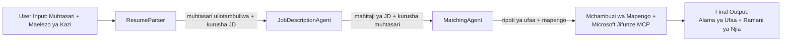

# PersonalCareerCopilot - Mtaalam wa Ulinganishaji wa Wasifu → Kazi

Programu ya mawakala wengi inayolenga michakato inayochambua ni kwa kiasi gani wasifu unalingana na maelezo ya kazi, kisha huunda ramani ya kujifunza binafsi kufanikisha mapungufu.

---

## Wakala

| Wakala | Nafasi | Vifaa |
|-------|------|-------|
| **ResumeParser** | Hutoka ujuzi uliopangwa, uzoefu, vyeti kutoka kwa maandishi ya wasifu | - |
| **JobDescriptionAgent** | Hutoa ujuzi unaohitajika/unaopendekezwa, uzoefu, vyeti kutoka kwa Maelezo ya Kazi | - |
| **MatchingAgent** | Hulinganisha wasifu dhidi ya mahitaji → alama ya kufaa (0-100) + ujuzi uliolingana/ukosefu | - |
| **GapAnalyzer** | Huunda ramani binafsi ya kujifunza kwa kutumia rasilimali za Microsoft Learn | `search_microsoft_learn_for_plan` (MCP) |

## Mtiririko wa Kazi


```mermaid
flowchart LR
    UserInput["User Input: Muhtasari + Maelezo ya Kazi"] --> ResumeParser
    ResumeParser -- "muhtasari uliotambuliwa + kurusha JD" --> JobDescriptionAgent
    JobDescriptionAgent -- "mahitaji ya JD + kurusha muhtasari" --> MatchingAgent
    MatchingAgent -- "ripoti ya ufaa + mapengo" --> GapAnalyzerMCP["Mchambuzi wa Mapengo +\nMicrosoft Jifunze MCP"]
    GapAnalyzerMCP --> FinalOutput["Final Output:\nAlama ya Ufaa + Ramani ya Njia"]
```

---

## Anza haraka

### 1. Weka mazingira

Folda hii ni utekelezaji wa rejeleo kwa miongozo ya Lab 02 inayotegemea mtiririko wa kazi. Faili yake `main.py` hutumia sehemu za maelekezo zilizopo pamoja na `WorkflowBuilder` kuunganisha mawakala wanne pamoja.

```powershell
cd workshop\lab02-multi-agent\PersonalCareerCopilot
python -m venv .venv
.\.venv\Scripts\Activate.ps1          # Windows PowerShell
# chanzo .venv/bin/activate            # macOS / Linux
pip install -r requirements.txt
```

### 2. Sanidi vibali

Tengeneza faili `.env` katika folda hii:

```powershell
copy .env .env.bak 2>$null; echo $null > .env
```

Hariri `.env`:

```env
FOUNDRY_PROJECT_ENDPOINT=https://<your-account>.services.ai.azure.com/api/projects/<your-project>
AZURE_AI_MODEL_DEPLOYMENT_NAME=gpt-4.1-mini
```

| Thamani | Mahali pa kuipata |
|-------|------------------|
| `FOUNDRY_PROJECT_ENDPOINT` | Upau wa zana za Foundry → bonyeza kulia mradi wako → **Nakili Kiungo cha Mradi** |
| `AZURE_AI_MODEL_DEPLOYMENT_NAME` | Upau wa Foundry → panua mradi → **Mifano + viunganishi** → jina la usambazaji |

### 3. Endesha kwa ndani

```powershell
python -m debugpy --listen 127.0.0.1:5679 main.py --port 8088
```

Au tumia kazi ya VS Code: `Ctrl+Shift+P` → **Tasks: Run Task** → **Run Agent HTTP Server**.

Kwa utambuzi wa F5, tumia **Debug Local Agent HTTP Server**.

### 4. Jaribu na Mchunguzi Wakala

Fungua Mchunguzi Wakala: `Ctrl+Shift+P` → **Foundry Toolkit: Open Agent Inspector**.

Bandika ombi hili la jaribio:

```
Resume:
Jane Doe
Senior Software Engineer with 5 years of experience in Python, Django, and AWS.
Built microservices handling 10K+ requests/second. Led a team of 4 developers.
Certifications: AWS Solutions Architect Associate.
Education: B.S. Computer Science, State University.

Job Description:
Senior Cloud Engineer at Contoso Ltd.
Required: Python, Azure, Kubernetes, Terraform, CI/CD pipelines.
Preferred: Go, monitoring (Prometheus/Grafana), cost optimization.
Experience: 5+ years in cloud infrastructure.
Certifications: Azure Solutions Architect Expert preferred.
```

**Inayotarajiwa:** Alama ya kufaa (0-100), ujuzi uliolingana/ukosefu, na ramani binafsi ya kujifunza yenye URL za Microsoft Learn.

### 5. Sambaza kwenye Foundry

`Ctrl+Shift+P` → **Foundry Toolkit: Deploy Hosted Agent** → chagua mradi wako → thibitisha.

---

## Muundo wa Mradi

```
PersonalCareerCopilot/
├── .env                ← Your credentials (git-ignored)
├── agent.yaml          ← Hosted agent definition (name, resources, env vars)
├── Dockerfile          ← Container image for Foundry deployment
├── main.py             ← 4-agent workflow (instructions, MCP tool, WorkflowBuilder)
└── requirements.txt    ← Python dependencies
```

## Faili Muhimu

### `agent.yaml`

Hufafanua wakala anayohudumiwa na Huduma ya Wakala wa Foundry:
- `kind: hosted` - hutumia chombo kilichosimamiwa
- `protocols` - itifaki ya `responses` na `version: 1.0.0`, inaonyesha kiungo cha HTTP `/responses`
- `environment_variables` - `AZURE_AI_MODEL_DEPLOYMENT_NAME` imetangazwa hapa; `FOUNDRY_PROJECT_ENDPOINT` huingizwa moja kwa moja wakati wa usambazaji

### `main.py`

Inajumuisha:
- **Maelekezo ya Wakala** - constants nne za `*_INSTRUCTIONS`, moja kwa kila wakala
- **Chombo cha MCP** - `search_microsoft_learn_for_plan()` huita `https://learn.microsoft.com/api/mcp` kupitia Streamable HTTP
- **Uundaji wa Wakala** - vipengele vinne vya `Agent()` + `AgentExecutor()` vinavyotumia `FoundryChatClient` moja
- **Michoro ya Mtiririko wa Kazi** - `WorkflowBuilder` huunganisha mawakala kama mfululizo: ResumeParser → JD Agent → MatchingAgent → GapAnalyzer
- **Anzishaji la seva** - `ResponsesHostServer` hutumika kwenye bandari 8088

### `requirements.txt`

| Pakiti | Kusudi |
|---------|----------|
| `agent-framework-foundry` | Msingi wa kuendesha: `Agent`, `AgentExecutor`, `WorkflowBuilder`, `@tool`, `FoundryChatClient` |
| `agent-framework-foundry-hosting` | `ResponsesHostServer` + ujumlisho wa Foundry kwa usambazaji |
| `mcp<2,>=1.24.0` | Mteja wa MCP kwa GapAnalyzer (`streamable_http_client`) |
| `debugpy` | Utambuzi wa mende wa Python (F5 katika VS Code) |

---

## Utatuzi wa Matatizo

| Tatizo | Suluhisho |
|-------|-----|
| `KeyError: 'FOUNDRY_PROJECT_ENDPOINT'` au `KeyError: 'AZURE_AI_MODEL_DEPLOYMENT_NAME'` | Tengeneza `.env` na weka `FOUNDRY_PROJECT_ENDPOINT` na `AZURE_AI_MODEL_DEPLOYMENT_NAME` zote mbili |
| `ModuleNotFoundError: No module named 'agent_framework'` | Washa venv kisha endesha `pip install -r requirements.txt` |
| Hakuna URL za Microsoft Learn kwenye matokeo | Hakikisha una muunganisho wa intaneti kwenda `https://learn.microsoft.com/api/mcp` |
| Kadi moja ya pengo tu (iliyokatizwa) | Hakikisha `GAP_ANALYZER_INSTRUCTIONS` inajumuisha sehemu ya `CRITICAL:` |
| Bandari 8088 inatumika | Zima seva nyingine: `netstat -ano \| findstr :8088` |

Kwa utatuzi wa kina wa matatizo, ona [Moduli 8 - Utatuzi wa Matatizo](../docs/08-troubleshooting.md).

---

**Mwongozo kamili:** [Lab 02 Docs](../docs/README.md) · **Rudi kwa:** [Lab 02 README](../README.md) · [Nyumbani kwa Warsha](../../../README.md)

---

<!-- CO-OP TRANSLATOR DISCLAIMER START -->
**Kionyozo**:
Hati hii imetafsiriwa kwa kutumia huduma ya tafsiri ya AI [Co-op Translator](https://github.com/Azure/co-op-translator). Ingawa tunajitahidi kupata usahihi, tafadhali fahamu kwamba tafsiri za kiotomatiki zinaweza kuwa na makosa au upungufu wa usahihi. Hati ya asili katika lugha yake halisi inapaswa kuchukuliwa kama chanzo cha mamlaka. Kwa taarifa muhimu, tafsiri ya kitaalamu inayofanywa na binadamu inapendekezwa. Hatutojibu kwa kuelewa vibaya au tafsiri potofu zinazotokea kutokana na matumizi ya tafsiri hii.
<!-- CO-OP TRANSLATOR DISCLAIMER END -->