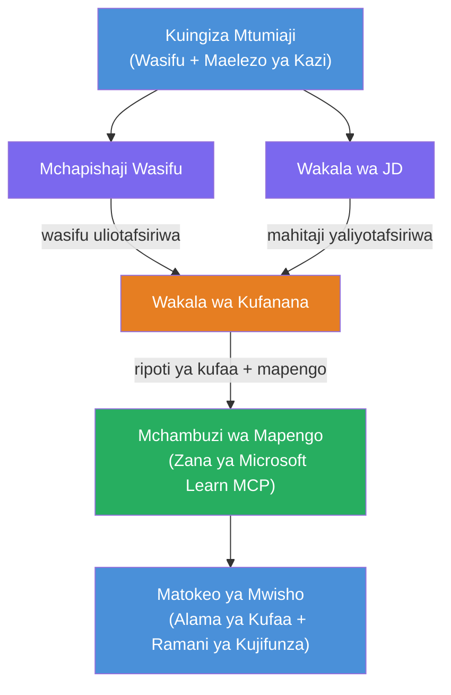

# Kiwango cha 02 - Mtiririko wa Wakala Wengi: Mchakato wa Kuangalia Kiwango cha Kazi Kutokana na Wasifu

---

## Utajenga Nini

**Mchakato wa Kuangalia Kiwango cha Kazi Kutokana na Wasifu** - mtiririko wa wakala wengi ambapo wakala wanne maalum wanafanya kazi pamoja kutathmini jinsi wasifu wa mgombea unavyolingana na maelezo ya kazi, kisha kuunda ramani ya kujifunza ya kibinafsi kufunika mapungufu.

### Wakala

| Wakala | Nafasi |
|-------|------|
| **Mchambua Wasifu** | Hutolea ujuzi ulioainishwa, uzoefu, vyeti kutoka kwenye maandishi ya wasifu |
| **Wakala wa Maelezo ya Kazi** | Hutolea ujuzi unaohitajika/unaopendelewa, uzoefu, vyeti kutoka kwenye maelezo ya kazi |
| **Wakala wa Ulinganishaji** | Hulinganisha wasifu dhidi ya mahitaji → alama ya kufaa (0-100) + ujuzi ulioambatanishwa/ukosefu |
| **Mchambuzi wa Mapungufu** | Huunda ramani ya kibinafsi ya kujifunza yenye rasilimali, ratiba, na miradi ya ushindi wa haraka |

### Mtiririko wa Onyesho

Pakiza **wasifu + maelezo ya kazi** → pata **alama ya kufaa + ujuzi unaokosekana** → pokea **ramani ya kibinafsi ya kujifunza**.

### Mimarisha ya Mtiririko

> Rangi ya Zambarau = wakala kwa wakati mmoja | Rangi ya Machungwa = sehemu ya mkusanyiko | Kijani = wakala wa mwisho akiwa na zana. Angalia [Moduli 1 - Elewa Miundombinu](docs/01-understand-multi-agent.md) na [Moduli 4 - Mifumo ya Usanidi](docs/04-orchestration-patterns.md) kwa michoro ya kina na mtiririko wa data.

### Mada Zilizojadiliwa

- Kutengeneza mtiririko wa wakala wengi kwa kutumia **WorkflowBuilder**
- Kufafanua nafasi za wakala na mtiririko wa usanidi (kazi sambamba + mfululizo)
- Mifumo ya mawasiliano kati ya wakala
- Upimaji wa ndani kwa kutumia Mchunguzi wa Wakala
- Kuweka mitiririko ya wakala wengi kwenye Huduma ya Wakala Foundry

---

## Mambo Yanayohitajika

Kamilisha Kiwango cha 01 kwanza:

- [Kiwango cha 01 - Wakala Mmoja](../lab01-single-agent/README.md)

---

## Anza Sasa

Tazama maagizo kamili ya usanidi, maelezo ya msimbo, na amri za mtihani katika:

- [Nyaraka za Kiwango cha 2 - Mambo Yanayohitajika](docs/00-prerequisites.md)
- [Nyaraka za Kiwango cha 2 - Njia Kamili ya Kujifunza](docs/README.md)
- [Mwongozo wa kuendesha PersonalCareerCopilot](PersonalCareerCopilot/README.md)

## Mifumo ya Usanidi (Mbadala za Kitaalamu)

Kiwango cha 2 kina mtiririko wa kawaida wa **kazi sambamba → mkusanyiko → mpango**, na nyaraka pia zinaelezea mifumo mbadala kuonyesha tabia thabiti zaidi za wakala:

- **Fan-out/Fan-in kwa makubaliano yenye uzito**
- **Mapitio/mkosoaji kabla ya ramani ya mwisho**
- **Katazi yenye masharti** (uchaguaji wa njia kulingana na alama ya kufaa na ujuzi unaokosekana)

Tazama [docs/04-orchestration-patterns.md](docs/04-orchestration-patterns.md).

---

**Iliyopita:** [Kiwango cha 01 - Wakala Mmoja](../lab01-single-agent/README.md) · **Rudi kwa:** [Nyumbani kwa Warsha](../../README.md)

---

<!-- CO-OP TRANSLATOR DISCLAIMER START -->
**HATUA YA KUKATAA**:  
Hati hii imetafsiriwa kwa kutumia huduma ya tafsiri ya AI [Co-op Translator](https://github.com/Azure/co-op-translator). Wakati tunajitahidi kwa usahihi, tafadhali fahamu kwamba tafsiri za moja kwa moja zinaweza kuwa na makosa au upungufu wa taarifa. Hati halisi katika lugha yake ya asili inapaswa kuchukuliwa kama chanzo cha mamlaka. Kwa taarifa muhimu, tafsiri ya mtaalamu wa binadamu inashauriwa. Hatuna wajibu kwa maelewano au tafsiri potofu zinazotokana na matumizi ya tafsiri hii.
<!-- CO-OP TRANSLATOR DISCLAIMER END -->