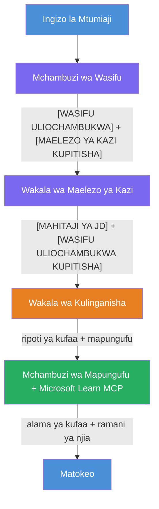

# Maabara 02 - Mtiririko wa Kazi wa Mawakala Wengi: Mchambuzi wa Ulinganifu wa Wasifu → Kazi

## Muhtasari

Katika maabara hii ya vitendo, utaunda **programu ya mawakala wengi inayozingatia mtiririko wa kazi** ukitumia Foundry Toolkit katika VS Code na kuipeleka kwa Huduma ya Mawakala wa Microsoft Foundry.

**Utakachojenga:** Mchambuzi wa Wasifu → Ulinganifu wa Kazi anayesoma wasifu na maelezo ya kazi, kutoa alama ya ulinganifu, na kuunda ramani ya kujifunza binafsi kwa kutumia rasilimali za Microsoft Learn.

---

## Mimarisho

```mermaid
flowchart TD
    A["Ingizo la Mtumiaji"] --> B["Mchambuzi wa Wasifu"]
    B -->|"[WASIFU ULIOCHAMBUKWA] + [MAELEZO YA KAZI KUPITISHA]"| C["Wakala wa Maelezo ya Kazi"]
    C -->|"[MAHITAJI YA JD] + [WASIFU ULIOCHAMBUKWA KUPITISHA]"| D["Wakala wa Kulinganisha"]
    D -->|ripoti ya kufaa + mapungufu| E["Mchambuzi wa Mapungufu + Microsoft Learn MCP"]
    E -->|alama ya kufaa + ramani ya njia| F["Matokeo"]

    style A fill:#4A90D9,color:#fff
    style B fill:#7B68EE,color:#fff
    style C fill:#7B68EE,color:#fff
    style D fill:#E67E22,color:#fff
    style E fill:#27AE60,color:#fff
    style F fill:#4A90D9,color:#fff
```

**Jinsi inavyofanya kazi:**
1. Mtumiaji anaweka wasifu na maelezo ya kazi.
2. **ResumeParser** husoma wasifu na kunakili maelezo ya kazi (JD) kama yalivyo katika sehemu ya `[JOB DESCRIPTION PASS-THROUGH]`.
3. **JD Agent** hutenganisha mahitaji yaliyopangwa kutoka sehemu ya pass-through, kisha hutuma mbele `[PARSED RESUME]` kama `[PARSED RESUME PASS-THROUGH]`.
4. **MatchingAgent** hunakili `[PARSED RESUME PASS-THROUGH]` dhidi ya `[JD REQUIREMENTS]` na kutoa alama ya ulinganifu.
5. **GapAnalyzer** hubadilisha mapungufu kuwa ramani halisi na huleta viungo halisi vya Microsoft Learn kupitia MCP.

---

## Masharti ya Awali

Kamilisha Maabara 01 kwanza:

- [Maabara 01 - Mwakala Mmoja](../lab01-single-agent/README.md)

---

## Sehemu ya 1: Soma moduli kwa mpangilio

Tazama njia kamili ya kujifunza katika:

- [Nyaraka za Maabara 2 - Masharti ya Awali](docs/00-prerequisites.md)
- [Nyaraka za Maabara 2 - Njia Kamili ya Kujifunza](docs/README.md)
- [Mwongozo wa kutumia PersonalCareerCopilot](PersonalCareerCopilot/README.md)

---

## Sehemu ya 2: Tengeneza na jaribu mtiririko wa kazi

1. Tumia kishirikishi cha Foundry Toolkit kuunda mradi unaozingatia mtiririko wa kazi.
2. Nakili sehemu za maelekezo na mchoro wa mtiririko wa kazi kutoka `PersonalCareerCopilot/main.py` kwenda eneo lako la kazi.
3. Endesha kwa ndani na Inspekta wa Mwakala na hakiki mawakala wote wanne pamoja na chombo cha MCP.
4. Tuma wakala mwenyeji kwenye Foundry wakati majaribio wa ndani yanapofaulu.

---

## Mifumo ya Usimamizi

Maabara 02 inajumuisha mtiririko wa kawaida wa **kusambaza → kukusanya → mfululizo**, na nyaraka pia zinaelezea mifumo mingine ya usimamizi kwa majaribio.

- **Kusambaza/Kukusanya na makubaliano ya uzito**
- **Mapitio ya mtaalam kabla ya ramani ya mwisho**
- **Kipokezi cha masharti** kinachotegemea alama ya ulinganifu na ujuzi unaokosekana

Tazama [docs/04-orchestration-patterns.md](docs/04-orchestration-patterns.md).

---

**Iliyotangulia:** [Maabara 01 - Mwakala Mmoja](../lab01-single-agent/README.md) · **Rudi kwa:** [Nyumba ya Warsha](../../README.md)

---

<!-- CO-OP TRANSLATOR DISCLAIMER START -->
**Kionyozo**:
Hati hii imetafsiriwa kwa kutumia huduma ya tafsiri ya AI [Co-op Translator](https://github.com/Azure/co-op-translator). Ingawa tunajitahidi kupata usahihi, tafadhali fahamu kwamba tafsiri za kiotomatiki zinaweza kuwa na makosa au upungufu wa usahihi. Hati ya asili katika lugha yake halisi inapaswa kuchukuliwa kama chanzo cha mamlaka. Kwa taarifa muhimu, tafsiri ya kitaalamu inayofanywa na binadamu inapendekezwa. Hatutojibu kwa kuelewa vibaya au tafsiri potofu zinazotokea kutokana na matumizi ya tafsiri hii.
<!-- CO-OP TRANSLATOR DISCLAIMER END -->