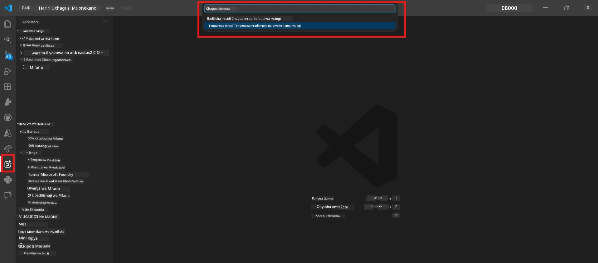

# Module 0 - Masharti ya Awali

Kabla ya kuanza Lab 02, hakikisha umefanya yafuatayo. mafunzo haya yanajengwa moja kwa moja kwenye Lab 01 - usiyapite.

---

## 1. Kamilisha Lab 01

Lab 02 inadhani tayari umefanya:

- [x] Kumaliza moduli 8 zote za [Lab 01 - Wakala Mmoja](../../lab01-single-agent/README.md)
- [x] Kufanikisha kupeleka wakala mmoja kwenye Huduma ya Wakala wa Foundry
- [x] Thibitisha wakala anafanya kazi katika Inspekta wa Wakala wa ndani na Playground ya Foundry

Kama hujakamilisha Lab 01, rudi nyuma na uumalize sasa: [Lab 01 Docs](../../lab01-single-agent/docs/00-prerequisites.md)

---

## 2. Thibitisha usanidi uliopo

Vyombo vyote kutoka Lab 01 vinapaswa bado vikiwa vimewekwa na vinafanya kazi. Endesha ukaguzi huu wa haraka:

### 2.1 Azure CLI

```powershell
az account show --query "{name:name, id:id}" --output table
```

Inatarajiwa: Inaonyesha jina lako la usajili na ID. Ikiwa haifanyi kazi, endesha [`az login`](https://learn.microsoft.com/cli/azure/authenticate-azure-cli-interactively).

### 2.2 Extensions za VS Code

1. Bonyeza `Ctrl+Shift+P` → andika **"Microsoft Foundry"** → thibitisha unaona amri (mfano, `Microsoft Foundry: Create a New Hosted Agent`).
2. Bonyeza `Ctrl+Shift+P` → andika **"Foundry Toolkit"** → thibitisha unaona amri (mfano, `Foundry Toolkit: Open Agent Inspector`).

### 2.3 Mradi wa Foundry & mfano

1. Bonyeza ikoni ya **Microsoft Foundry** katika Ubao wa Shughuli wa VS Code.
2. Thibitisha mradi wako uko kwenye orodha (mfano, `workshop-agents`).
3. Panua mradi → thibitisha mfano ulipelekwa unapatikana (mfano, `gpt-4.1-mini`) na hali ni **Imefanikiwa**.

> **Kama usambazaji wa mfano wako umekwisha muda wake:** Baadhi ya usambazaji wa kiwango cha bure huisha kiotomatiki. Sambaza tena kutoka [Katalogi ya Mfano](https://learn.microsoft.com/azure/foundry/foundry-models/concepts/models-sold-directly-by-azure) (`Ctrl+Shift+P` → **Microsoft Foundry: Open Model Catalog**).



### 2.4 Majukumu ya RBAC

Thibitisha una **Azure AI User** kwenye mradi wako wa Foundry:

1. [Azure Portal](https://portal.azure.com) → rasilimali ya mradi wako wa Foundry → **Access control (IAM)** → tabo ya **[Role assignments](https://learn.microsoft.com/azure/foundry/concepts/rbac-foundry)**.
2. Tafuta jina lako → thibitisha **[Azure AI User](https://aka.ms/foundry-ext-project-role)** iko kwenye orodha.

---

## 3. Elewa dhana za wakala wengi (mpya kwa Lab 02)

Lab 02 inazindua dhana ambazo hazikuhusishwa katika Lab 01. Soma hizi kabla ya kuendelea:

### 3.1 Nini ni mtiririko wa kazi wa wakala wengi?

Badala ya wakala mmoja kushughulikia kila kitu, **mtiririko wa kazi wa wakala wengi** hugawanya kazi kwa wakala wengi maalum. Kila wakala ana:

- Maelekezo yake mwenyewe (prompt ya mfumo)
- Nafasi yake mwenyewe (anachohusika nacho)
- Zana zinazoweza kuwepo (funsi anazoweza kuita)

Wakala hao huwahamishiana kupitia **mchoro wa uratibu** unaoeleza jinsi data inavyotiririka kati yao.

### 3.2 WorkflowBuilder

Darasa la [`WorkflowBuilder`](https://learn.microsoft.com/agent-framework/workflows/agents-in-workflows) kutoka `agent_framework` ni sehemu ya SDK inayounganisha wakala pamoja:

```python
from agent_framework import WorkflowBuilder

workflow = (
    WorkflowBuilder(
        name="MyWorkflow",
        start_executor=agent_a,
        output_executors=[agent_d],
    )
    .add_edge(agent_a, agent_b)
    .add_edge(agent_a, agent_c)
    .add_edge(agent_b, agent_d)
    .add_edge(agent_c, agent_d)
    .build()
)
```

- **`start_executor`** - Wakala wa kwanza anayepokea maingizo ya mtumiaji
- **`output_executors`** - Wakala/wakala ambao matokeo yao huunda jibu la mwisho
- **`add_edge(source, target)`** - Inaeleza kwamba `target` anapokea matokeo ya `source`

### 3.3 Zana za MCP (Model Context Protocol)

Lab 02 inatumia **zana ya MCP** inayoitwa Microsoft Learn API kupata rasilimali za kujifunza. [MCP (Model Context Protocol)](https://modelcontextprotocol.io/introduction) ni itifaki iliyosanifiwa kwa kuunganisha mifano ya AI na vyanzo vya data na zana za nje.

| Neno | Ufafanuzi |
|------|-----------|
| **Seva ya MCP** | Huduma inayotoa zana/rasilimali kupitia itifaki ya [MCP](https://learn.microsoft.com/azure/foundry/agents/how-to/tools/model-context-protocol) |
| **Mteja wa MCP** | Msimbo wako wa wakala unaounganisha na seva ya MCP na kuita zana zake |
| **[Streamable HTTP](https://learn.microsoft.com/agent-framework/agents/tools/hosted-mcp-tools)** | Njia ya usafirishaji inayotumika kuwasiliana na seva ya MCP |

### 3.4 Jinsi Lab 02 inavyotofautiana na Lab 01

| Kipengele | Lab 01 (Wakala Mmoja) | Lab 02 (Wakala Wengi) |
|--------|----------------------|---------------------|
| Wakala | 1 | 4 (nafasi maalum) |
| Uratibu | Hakuna | WorkflowBuilder (sawa na mfuatano) |
| Zana | Zana ya hiari `@tool` | Zana ya MCP (ita API ya nje) |
| Ugumu | Prompt rahisi → jibu | Riwaya + JD → alama ya kufaa → ramani ya njia |
| Mtiririko wa muktadha | Moja kwa moja | Kukabidhi kati ya wakala |

---

## 4. Muundo wa hazina ya warsha kwa Lab 02

Hakikisha unajua mahali faili za Lab 02 ziko:

```
workshop/
└── lab02-multi-agent/
    ├── README.md                       ← Lab overview
    ├── docs/                           ← You are here
    │   ├── README.md                   ← Learning path index
    │   ├── 00-prerequisites.md         ← This file
    │   ├── 01-understand-multi-agent.md
    │   ├── ...
    │   └── 08-troubleshooting.md
    └── PersonalCareerCopilot/          ← The agent project
        ├── agent.yaml                  ← Agent definition
        ├── main.py                     ← 4-agent workflow code
        ├── Dockerfile                  ← Container configuration
        └── requirements.txt            ← Python dependencies
```

---

### Sehemu ya kuchunguza

- [ ] Lab 01 imemalizika kikamilifu (moduli zote 8, wakala amepakiwa na kuthibitishwa)
- [ ] `az account show` inaanza usajili wako
- [ ] Panua za Microsoft Foundry na Foundry Toolkit zimewekwa na zinajibu
- [ ] Mradi wa Foundry una mfano ulipelekwa (mfano, `gpt-4.1-mini`)
- [ ] Una jukumu la **Azure AI User** kwenye mradi
- [ ] Umesoma sehemu ya dhana za wakala wengi hapo juu na unaelewa WorkflowBuilder, MCP, na uratibu wa wakala

---

**Ifuatayo:** [01 - Elewa Miundo ya Wakala Wengi →](01-understand-multi-agent.md)

---

<!-- CO-OP TRANSLATOR DISCLAIMER START -->
**Kimweko cha Maelezo**:  
Hati hii imetafsiriwa kwa kutumia huduma ya kutafsiri kwa AI [Co-op Translator](https://github.com/Azure/co-op-translator). Ingawa tunajitahidi kwa usahihi, tafadhali fahamu kuwa tafsiri za kiotomatiki zinaweza kuwa na makosa au upotovu wa taarifa. Hati ya asili katika lugha yake asilia inapaswa kuzingatiwa kama chanzo cha mamlaka. Kwa taarifa muhimu, tafsiri ya kitaalamu kutoka kwa mtafsiri wa binadamu inashauriwa. Hatuwajibiki kwa kutoelewana au tafsiri potofu zinazotokana na matumizi ya tafsiri hii.
<!-- CO-OP TRANSLATOR DISCLAIMER END -->