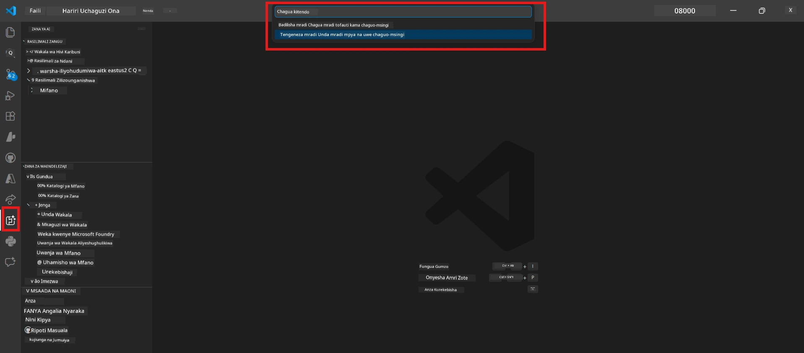

# Sehemu ya 0 - Utangulizi

⏱️ ~10 min

> [!WARNING]
> **Matangazo & Vikwazo:** [Waalikishaji Waliohifadhiwa](https://learn.microsoft.com/azure/foundry/agents/concepts/hosted-agents) kwa sasa wako katika **utangulizi wa umma** - hawapendekezwi kwa mizigo ya kazi ya uzalishaji. Baadhi ya vipengele vilivyoonyeshwa katika warsha hii vinaweza kubadilika wakati huduma inapoelekea GA.

## Kile utakachojenga

Katika maabara hii, utaongeza ujuzi wa mawakala mmoja kutoka Maabara 01 kujenga **mtiririko wa kazi wa mawakala wengi** - Mhadharia wa Resume → Kazi Inayofaa.

Unaweka **resume** na **maelezo ya kazi**. Wamalikishaji wanne maalum husindika ingizo hili mfululizo, kisha hurudisha:
- Alama ya kufaa (0–100 pamoja na uchambuzi wa alama)
- Orodha ya mapungufu ya ujuzi na vyeti
- Ramani ya kujifunza ya kibinafsi yenye viungo halisi vya Microsoft Learn kwa kila pengo

**Mtiririko wa kazi unatumia:**
- **Microsoft Agent Framework** - `WorkflowBuilder` kwa upangaji wa mfululizo wa mchakato
- **Foundry Toolkit kwa VS Code** - tengeneza, jaribu ndani ya mashine, weka watumie
- **Mfano wa AI** (mfano, `gpt-4.1-mini`) - hutumiwa na mawakala wote wanne
- **Seva ya MCP ya Microsoft Learn** - hutoa viungo halisi vya rasilimali za kujifunza kwa kila pengo la ujuzi

---

## Chagua njia yako

> ⚠️ **Endelea kwa njia ile ile uliyotumia katika Maabara 01.**

<details open>
<summary><strong>🅰️ Njia A - Wingu la Azure (inahitaji usajili wa Azure)</strong></summary>

| | Maelezo |
|---|---|
| **Kwa nani hii ni?** | Ulikamilisha Maabara 01 ukitumia usajili wa Azure |
| **Mfano** | Azure OpenAI kupitia Foundry (mfano, `gpt-4.1-mini`) |
| **Sehemu zilizoshughulikiwa** | Sehemu zote (00–09) |
| **Je, utaweka kwenye wingu?** | ✅ Ndiyo - usanifu kamili wa mwisho hadi mwisho |

</details>

<details open>
<summary><strong>🅱️ Njia B - Foundry Local (hakuna usajili wa Azure unahitajika)</strong></summary>

| | Maelezo |
|---|---|
| **Kwa nani hii ni?** | Ulikamilisha Maabara 01 ukitumia Foundry Local |
| **Mfano** | Foundry Local (bure, inafanya kazi kwenye mashine yako) |
| **Sehemu zilizoshughulikiwa** | Sehemu 00–05 (ruka 06–07 - usanifu na uthibitisho wa wingu) |
| **Je, utaweka kwenye wingu?** | ❌ Hapana - upimaji wa ndani tu kwa kutumia Agent Inspector |

</details>

---

## Thibitisha Maabara 01

Maabara 02 inajengwa moja kwa moja juu ya Maabara 01. Kamilisha Maabara 01 kwanza kabla ya kuanza hapa.

Hukufanya Maabara 01 bado? Anza hapa: [Lab 01 - Utangulizi](../../lab01-single-agent/docs/00-prerequisites.md)

<details open>
<summary><strong>🅰️ Njia A - Wingu la Azure</strong></summary>

```powershell
az account show --query "{name:name, id:id}" --output table
```

Ikiwa hili lishindikana, endesha `az login`. Kisha thibitisha ndani ya VS Code:

1. `Ctrl+Shift+P` → andika **Foundry Toolkit** → thibitisha amri zinaonekana.
2. Bofya ikoni ya **Foundry Toolkit** → mradi wako na mfano uliowekwa unaonyesha **Imefaulu**.



> **RBAC:** Umepewa jukumu la **Foundry User** katika Maabara 01. Ikiwa unahitaji kurudisha tena, tazama [Lab 01, Sehemu 1](../../lab01-single-agent/docs/01-setup.md#deploy-a-model--assign-rbac). Jukumu lilitambulika awali kama **Azure AI User** - ruhusa sawa.

</details>

<details open>
<summary><strong>🅱️ Njia B - Foundry Local</strong></summary>

```powershell
Invoke-WebRequest -Uri "http://localhost:5273/v1/health" -UseBasicParsing | Select-Object StatusCode
```

Kinachotarajiwa: `StatusCode: 200`. Ikiwa sivyo, anzisha upya Foundry Local kutoka upande wa Foundry Toolkit.

> Kazi zote za uchambuzi zinafanyika kwenye mashine yako. Wito pekee wa kutoka ni zana ya MCP kwenda `https://learn.microsoft.com/api/mcp`.

</details>

---

## Kipya katika Maabara 02

| | Maabara 01 | Maabara 02 |
|--|--------|--------|
| Waalikishaji | 1 | 4 (mlinganisho kwa WorkflowBuilder) |
| Kiolezo cha kuanzisha | Msingi - Agent Framework | Mtiririko wa kazi - Agent Framework |
| Kifurushi kipya | - | `mcp` |
| Utoaji wa huduma | Mwakala wa mazungumzo mmoja | Mchakato mfululizo (WorkflowBuilder) |
| Zana mpya | - | `search_microsoft_learn_for_plan` (MCP) |

---

**Ifuatayo:** [01 - Elewa Mimarisho →](01-understand-multi-agent.md)

---

<!-- CO-OP TRANSLATOR DISCLAIMER START -->
**Kionyozo**:
Hati hii imetafsiriwa kwa kutumia huduma ya tafsiri ya AI [Co-op Translator](https://github.com/Azure/co-op-translator). Ingawa tunajitahidi kupata usahihi, tafadhali fahamu kwamba tafsiri za kiotomatiki zinaweza kuwa na makosa au upungufu wa usahihi. Hati ya asili katika lugha yake halisi inapaswa kuchukuliwa kama chanzo cha mamlaka. Kwa taarifa muhimu, tafsiri ya kitaalamu inayofanywa na binadamu inapendekezwa. Hatutojibu kwa kuelewa vibaya au tafsiri potofu zinazotokea kutokana na matumizi ya tafsiri hii.
<!-- CO-OP TRANSLATOR DISCLAIMER END -->