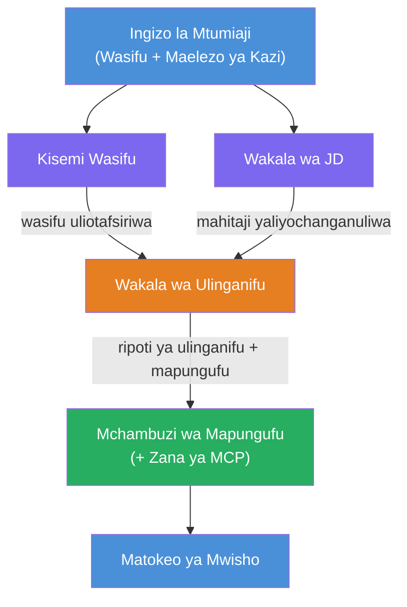
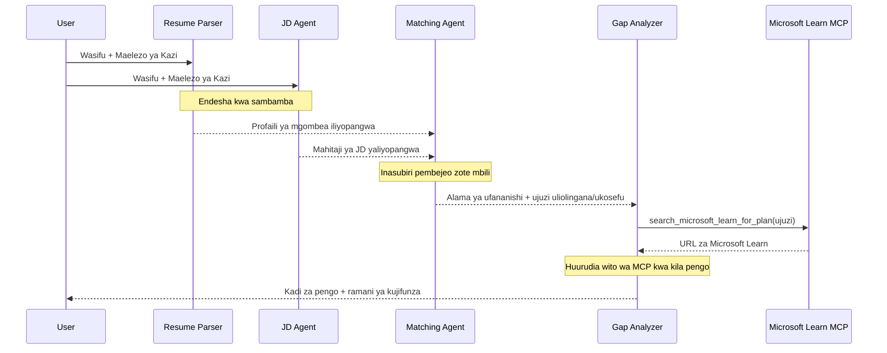
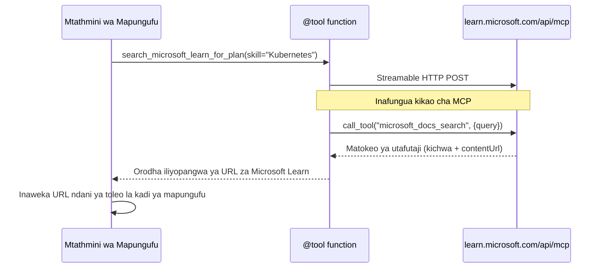

# Moduli 1 - Elewa Msingi wa Wakala Wengi

Katika moduli hii, unajifunza usanifu wa Mchambuzi wa Resume → Ulinganifu wa Kazi kabla ya kuandika nambari yoyote. Kuelewa mchoro wa utekelezaji, majukumu ya wakala, na mtiririko wa data ni muhimu kwa ajili ya kutatua matatizo na kupanua [miradi ya kazi ya wakala wengi](https://learn.microsoft.com/azure/architecture/ai-ml/idea/multiple-agent-workflow-automation).

---

## Tatizo hili linatatua nini

Kufananisha wasifu na maelezo ya kazi kunahusisha ujuzi tofauti kadhaa:

1. **Kuchanganua** - Kutoa data iliyopangwa kutoka kwa maandishi yasiyo na mpangilio (wasifu)
2. **Uchambuzi** - Kutoa mahitaji kutoka kwenye maelezo ya kazi
3. **Ulinganifu** - Kupima muafaka kati ya vyote viwili
4. **Mpangilio** - Kujenga ramani ya kujifunza ili kufadhaisha mapungufu

Wakala mmoja anayefanya kazi zote nne katika ombi moja mara nyingi hutoa:
- Utoaji hafifu (hutuma kwa haraka kupitia uchanganuzi ili kufikia alama)
- Kupima kwa kiwango kidogo (hakuna mgawanyo wa ushahidi)
- Ramani za kujifunza za kawaida (zisizobinafsishwa kwa mapungufu maalum)

Kwa kugawanya kuwa **wakala wanne maalum**, kila mmoja anazingatia kazi yake kwa maagizo ya pekee, na kufanya matokeo bora katika kila hatua.

---

## Wakala wanne

Kila wakala ni wakala kamili wa [Microsoft Foundry](https://learn.microsoft.com/azure/foundry/agents/concepts/hosted-agents) uliotengenezwa kupitia `AzureAIAgentClient.as_agent()`. Wanashiriki utawala mmoja wa modeli lakini wana maagizo tofauti na (hiari) zana tofauti.

| # | Jina la Wakala | Jukumu | Kuingiza | Matokeo |
|---|----------------|--------|----------|---------|
| 1 | **ResumeParser** | Hutoa wasifu uliopangwa kutoka kwa maandishi ya wasifu | Maandishi ya wasifu duni (kutoka kwa mtumiaji) | Wasifu wa Mgombea, Ujuzi wa Kiufundi, Ujuzi Mpole, Vyeti, Uzoefu wa Sekta, Mafanikio |
| 2 | **JobDescriptionAgent** | Hutoa mahitaji yaliyopangwa kutoka kwenye maelezo ya kazi | Maandishi ya maelezo ya kazi duni (kutoka kwa mtumiaji, kutumwa kupitia ResumeParser) | Muhtasari wa Jukumu, Ujuzi Unaohitajika, Ujuzi Unaopendelea, Uzoefu, Vyeti, Elimu, Majukumu |
| 3 | **MatchingAgent** | Hupima alama ya muafaka kwa kutumia ushahidi | Matokeo kutoka ResumeParser + JobDescriptionAgent | Alama ya Muafaka (0-100 na mgawanyo), Ujuzi Uliolingana, Ujuzi Uliopotea, Mapungufu |
| 4 | **GapAnalyzer** | Huunda ramani ya kujifunza iliyobinafsishwa | Matokeo kutoka MatchingAgent | Kadi za Mapungufu (kwa ujuzi), Orodha ya Kujifunza, Ratiba, Rasilimali kutoka Microsoft Learn |

---

## Mchoro wa utekelezaji

Mwendo wa kazi unatumia **mtoaji wa sambamba** ikifuatiwa na **mchanganyiko kwa mpangilio**:


> **Hati:** Zambarau = wakala wa sambamba, Machungwa = sehemu ya mchanganyiko, Kijani = wakala wa mwisho mwenye zana

### Jinsi data inavyotiririka


1. **Mtumiaji hutuma** ujumbe unaojumuisha wasifu na maelezo ya kazi.
2. **ResumeParser** hupokea maingizo yote ya mtumiaji na kutoa wasifu uliopangwa.
3. **JobDescriptionAgent** hupokea maingizo ya mtumiaji sambamba na kutoa mahitaji yaliyo pangwa.
4. **MatchingAgent** hupokea matokeo kutoka kwa **ResumeParser na JobDescriptionAgent mbili** (mfumo unasubiri zote mbili kumalizika kabla ya kuendesha MatchingAgent).
5. **GapAnalyzer** hupokea matokeo ya MatchingAgent na kuitisha **zana ya Microsoft Learn MCP** kupata rasilimali halisi za kujifunza kwa kila pengo.
6. **Matokeo ya mwisho** ni majibu ya GapAnalyzer, yanayojumuisha alama ya muafaka, kadi za mapungufu, na ramani kamili ya kujifunza.

### Kwa nini mtoaji wa sambamba ni muhimu

ResumeParser na JobDescriptionAgent hufanya kazi **sambamba** kwa sababu hakuna mmoja anayehitaji mwingine. Hii:
- Hupunguza ucheleweshaji wa jumla (kupiga wakati mmoja badala ya kwa mfululizo)
- Ni mgawanyo wa asili (uchanganizi wa wasifu dhidi ya uchanganizi wa maelezo ya kazi ni kazi huru)
- Inaonyesha mtindo wa kawaida wa wakala wengi: **toa → tumbua → fanya**

---

## WorkflowBuilder katika nambari

Hapa jinsi mchoro hapo juu unavyolingana na miito ya API ya [`WorkflowBuilder`](https://learn.microsoft.com/agent-framework/workflows/agents-in-workflows) katika `main.py`:

```python
from agent_framework import WorkflowBuilder

workflow = (
    WorkflowBuilder(
        name="ResumeJobFitEvaluator",
        start_executor=resume_parser,       # Wakala wa kwanza kupokea ingizo la mtumiaji
        output_executors=[gap_analyzer],     # Wakala wa mwisho ambaye matokeo yake yanarudiwa
    )
    .add_edge(resume_parser, jd_agent)      # ResumeParser → Wakala wa Maelezo ya Kazi
    .add_edge(resume_parser, matching_agent) # ResumeParser → Wakala wa Upatanishaji
    .add_edge(jd_agent, matching_agent)      # Wakala wa Maelezo ya Kazi → Wakala wa Upatanishaji
    .add_edge(matching_agent, gap_analyzer)  # Wakala wa Upatanishaji → Mchambuzi wa Mapungufu
    .build()
)
```

**Kuelewa mlingano:**

| Mlingano | Inamaanisha Nini |
|----------|------------------|
| `resume_parser → jd_agent` | JD Agent hupokea matokeo ya ResumeParser |
| `resume_parser → matching_agent` | MatchingAgent hupokea matokeo ya ResumeParser |
| `jd_agent → matching_agent` | MatchingAgent pia hupokea matokeo ya JD Agent (unasubiri zote mbili) |
| `matching_agent → gap_analyzer` | GapAnalyzer hupokea matokeo ya MatchingAgent |

Kwa sababu `matching_agent` ina **mingo miwili inayoingia** (`resume_parser` na `jd_agent`), mfumo unasubiri kiotomatiki zote mbili kumalizika kabla ya kuendesha MatchingAgent.

---

## Zana ya MCP

Wakala wa GapAnalyzer ana zana moja: `search_microsoft_learn_for_plan`. Hii ni **[zana ya MCP](https://learn.microsoft.com/agent-framework/agents/tools/hosted-mcp-tools)** inayoiita API ya Microsoft Learn kupata rasilimali za kujifunza zilizochaguliwa.

### Jinsi inavyofanya kazi

```python
@tool
async def search_microsoft_learn_for_plan(
    skill: str, role: str = "", max_results: int = 5
) -> str:
    """Search Microsoft Learn MCP and return curated official links."""
    # Inajiunga na https://learn.microsoft.com/api/mcp kupitia HTTP Inayoweza Kutiririka
    # Inaita chombo cha 'microsoft_docs_search' kwenye seva ya MCP
    # Inarudisha orodha iliyopangwa ya URL za Microsoft Learn
```

### Mtiririko wa mwito wa MCP


1. GapAnalyzer huamua anahitaji rasilimali za kujifunza kwa ujuzi fulani (mfano, "Kubernetes")
2. Mfumo huuita `search_microsoft_learn_for_plan(skill="Kubernetes")`
3. Kazi hufungua muunganisho wa [Streamable HTTP](https://learn.microsoft.com/agent-framework/agents/tools/hosted-mcp-tools) kwenda `https://learn.microsoft.com/api/mcp`
4. Huitisha zana ya `microsoft_docs_search` kwenye [server ya MCP](https://learn.microsoft.com/azure/foundry/agents/how-to/tools/model-context-protocol)
5. Server ya MCP hurudisha matokeo ya utafutaji (kichwa + URL)
6. Kazi huunda matokeo na kuyarudisha kama mfuatano wa maandishi
7. GapAnalyzer hutumia URL zilizorejeshwa katika matokeo ya kadi za mapungufu

### Magogo ya MCP yanayotarajiwa

Wakati zana inafanya kazi, utaona maingizo ya magogo kama:

```
GET https://learn.microsoft.com/api/mcp → 405 (Method Not Allowed)
POST https://learn.microsoft.com/api/mcp → 200
DELETE https://learn.microsoft.com/api/mcp → 405 (Method Not Allowed)
```

**Hizi ni za kawaida.** Mteja wa MCP huchunguza kwa kutumia GET na DELETE wakati wa kuanzisha - kurudisha 405 ni tabia inayotarajiwa. Kito cha zana kinatumia POST na hurudisha 200. Tatizo linalotokea ni kama maombi ya POST yanashindwa.

---

## Mchoro wa uundaji wa wakala

Kila wakala huundwa kwa kutumia **msimamizi wa muktadha wa async [`AzureAIAgentClient.as_agent()`](https://learn.microsoft.com/python/api/overview/azure/ai-agents-readme)**. Huu ni mtindo wa SDK wa Foundry wa kuunda wakala ambao huondolewa kiotomatiki:

```python
async with (
    get_credential() as credential,
    AzureAIAgentClient(
        project_endpoint=PROJECT_ENDPOINT,
        model_deployment_name=MODEL_DEPLOYMENT_NAME,
        credential=credential,
    ).as_agent(
        name="ResumeParser",
        instructions=RESUME_PARSER_INSTRUCTIONS,
    ) as resume_parser,
    # ... rudia kwa kila wakala ...
):
    # Wakala wote 4 wapo hapa
    workflow = create_workflow(resume_parser, jd_agent, matching_agent, gap_analyzer)
```

**Mambo muhimu:**
- Kila wakala anapata mfano wake wa `AzureAIAgentClient` (SDK inahitaji jina la wakala liwe la kipekee kwa mteja)
- Wakala wote wanashiriki `credential`, `PROJECT_ENDPOINT`, na `MODEL_DEPLOYMENT_NAME` sawa
- Kifungu cha `async with` kinahakikisha wakala wote wanatakaswa wakati server inapofunguka
- GapAnalyzer hupokea pia `tools=[search_microsoft_learn_for_plan]`

---

## Kuanzisha server

Baada ya kuunda wakala na kujenga mwendo wa kazi, server inaanza:

```python
from azure.ai.agentserver.agentframework import from_agent_framework

agent = create_workflow(resume_parser, jd_agent, matching_agent, gap_analyzer)
await from_agent_framework(agent).run_async()
```

`from_agent_framework()` inazunguka mwendo wa kazi kama server ya HTTP inayofungua kiungo cha `/responses` kwenye bandari 8088. Huu ni mtindo uleule wa Lab 01, lakini "wakala" sasa ni mzizi wa [mwendo wa kazi](https://learn.microsoft.com/agent-framework/workflows/as-agents).

---

### Kidokezo

- [ ] Unaelewa usanifu wa wakala 4 na jukumu la kila wakala
- [ ] Unaweza kufuatilia mtiririko wa data: Mtumiaji → ResumeParser → (sambamba) JD Agent + MatchingAgent → GapAnalyzer → Matokeo
- [ ] Unaelewa kwa nini MatchingAgent husubiri ResumeParser na JD Agent (mingo miwili inayoingia)
- [ ] Unaelewa zana ya MCP: inafanya nini, inaitwaje, na kwamba magogo ya GET 405 ni ya kawaida
- [ ] Unaelewa mtindo wa `AzureAIAgentClient.as_agent()` na kwa nini kila wakala ana mfano wake wa mteja
- [ ] Unaweza kusoma nambari ya `WorkflowBuilder` na kuipanga kwa mchoro wa kuona

---

**Kabla:** [00 - Mahitaji ya awali](00-prerequisites.md) · **Ifuatayo:** [02 - Tengeneza Mradi wa Wakala Wengi →](02-scaffold-multi-agent.md)

---

<!-- CO-OP TRANSLATOR DISCLAIMER START -->
**Kiarifu cha Hali**:  
Hati hii imetafsiriwa kwa kutumia huduma ya tafsiri ya AI [Co-op Translator](https://github.com/Azure/co-op-translator). Ingawa tunajitahidi kwa usahihi, tafadhali fahamu kwamba tafsiri za kiotomatiki zinaweza kuwa na makosa au upotovu wa maana. Hati ya asili katika lugha yake ya asili inapaswa kuchukuliwa kama chanzo cha mamlaka. Kwa taarifa muhimu, tafsiri za kitaalamu za kibinadamu zinapendekezwa. Hatujawajibika kwa kutoelewana au tafsiri potofu zinazotokana na matumizi ya tafsiri hii.
<!-- CO-OP TRANSLATOR DISCLAIMER END -->