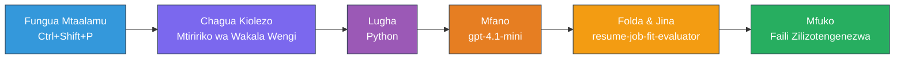
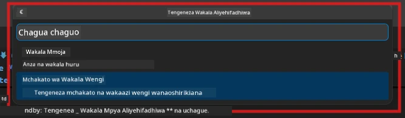

# Module 2 - Tengeneza Mradi wa Wakala Wengi

Katika moduli hii, unatumia [kiongezi cha Microsoft Foundry](https://marketplace.visualstudio.com/items?itemName=TeamsDevApp.vscode-ai-foundry) ili **kutengeneza mradi wa mchakato wa wakala wengi**. Kiongezi huita muundo mzima wa mradi - `agent.yaml`, `main.py`, `Dockerfile`, `requirements.txt`, `.env`, na usanidi wa ufuatiliaji wa makosa. Kisha unabinafsisha faili hizi katika Moduli 3 na 4.

> **Kumbuka:** Folda ya `PersonalCareerCopilot/` katika maabara hii ni mfano kamili, unaofanya kazi wa mradi wa wakala wengi uliobinafsishwa. Unaweza kutengeneza mradi mpya (inapendekezwa kwa kujifunza) au kusoma moja kwa moja msimbo uliopo.

---

## Hatua ya 1: Fungua mchawi wa Kuunda Wakala Aliyepangiwa


1. Bonyeza `Ctrl+Shift+P` kufungua **Command Palette**.
2. Andika: **Microsoft Foundry: Create a New Hosted Agent** na ichague.
3. Mchawi wa uundaji wakala aliyepangiwa utafunguka.

> **Mbadala:** Bonyeza ikoni ya **Microsoft Foundry** kwenye Ukanda wa Shughuli → bonyeza ikoni ya **+** karibu na **Agents** → **Create New Hosted Agent**.

---

## Hatua ya 2: Chagua templeti ya Mchakato wa Wakala Wengi

Mchawi anakuliza uchague templeti:

| Templeti | Maelezo | Wakati wa kutumia |
|----------|-------------|-------------|
| Wakala Mmoja | Wakala mmoja na maelekezo na zana za hiari | Maabara 01 |
| **Mchakato wa Wakala Wengi** | Wakala wengi wanaoshirikiana kupitia WorkflowBuilder | **Maabara hii (Maabara 02)** |

1. Chagua **Mchakato wa Wakala Wengi**.
2. Bonyeza **Next**.



---

## Hatua ya 3: Chagua lugha ya programu

1. Chagua **Python**.
2. Bonyeza **Next**.

---

## Hatua ya 4: Chagua mfano wako

1. Mchawi unaonyesha mifano iliyowekwa kwenye mradi wako wa Foundry.
2. Chagua mfano uleule ulio tumia katika Maabara 01 (mfano, **gpt-4.1-mini**).
3. Bonyeza **Next**.

> **Ushauri:** [`gpt-4.1-mini`](https://learn.microsoft.com/azure/foundry/foundry-models/concepts/models-sold-directly-by-azure#gpt-41-series) inapendekezwa kwa maendeleo - ni haraka, ya bei nafuu, na inaendana vizuri na michakato ya wakala wengi. Badilisha kwenda `gpt-4.1` kwa ajili ya uzalishaji wa mwisho ikiwa unataka matokeo bora zaidi.

---

## Hatua ya 5: Chagua eneo la folda na jina la wakala

1. Dirisha la faili lita funguka. Chagua folda lengwa:
   - Ikiwa unafuata mazoezi ya warsha: kwenda `workshop/lab02-multi-agent/` na tengeneza folda ndogo mpya
   - Ikiwa unaanza kutoka mwanzo: chagua folda yoyote
2. Andika **jina** la wakala aliyepangiwa (mfano, `resume-job-fit-evaluator`).
3. Bonyeza **Create**.

---

## Hatua ya 6: Subiri scaffolding kumalizika

1. VS Code itafungua dirisha jipya (au dirisha la sasa litaboreshwa) na mradi uliotengenezwa.
2. Unapaswa kuona muundo huu wa faili:

```
resume-job-fit-evaluator/
├── .env                ← Environment variables (placeholders)
├── .vscode/
│   └── launch.json     ← Debug configuration
├── agent.yaml          ← Agent definition (kind: hosted)
├── Dockerfile          ← Container configuration
├── main.py             ← Multi-agent workflow code (scaffold)
└── requirements.txt    ← Python dependencies
```

> **Kumbuka la warsha:** Katika hazina ya warsha, folda ya `.vscode/` iko katika **mizizi ya eneo la kazi** na `launch.json` na `tasks.json` za kushirikiana. Usanidi wa ufuatiliaji wa makosa wa Maabara 01 na Maabara 02 umejumuishwa. Unapobonyeza F5, chagua **"Lab02 - Multi-Agent"** kutoka kwenye menyu ya kunjuzi.

---

## Hatua ya 7: Elewa faili zilizotengenezwa (sifa za wakala wengi)

Scaffold ya wakala wengi hutofautiana na ile ya wakala mmoja kwa njia kadhaa muhimu:

### 7.1 `agent.yaml` - Ufafanuzi wa wakala

```yaml
kind: hosted
name: resume-job-fit-evaluator
description: >
  A multi-agent workflow that evaluates resume-to-job fit.
metadata:
  authors:
    - Microsoft
  tags:
    - Multi-Agent Workflow
    - Resume Evaluator
protocols:
  - protocol: responses
    version: v1
environment_variables:
  - name: PROJECT_ENDPOINT
    value: ${PROJECT_ENDPOINT}
  - name: MODEL_DEPLOYMENT_NAME
    value: ${MODEL_DEPLOYMENT_NAME}
```

**Tofauti kuu na Maabara 01:** Sehemu ya `environment_variables` inaweza kujumuisha vigezo vya ziada kwa muelekeo wa MCP au usanidi mwingine wa zana. `jina` na `maelezo` vinaonyesha matumizi ya wakala wengi.

### 7.2 `main.py` - Msimbo wa mchakato wa wakala wengi

Scaffold inajumuisha:
- **Mistari ya maelekezo kwa wakala wengi** (const moja kwa kila wakala)
- **Msimamizi wa muktadha [`AzureAIAgentClient.as_agent()`](https://learn.microsoft.com/python/api/overview/azure/ai-agents-readme)** (moja kwa kila wakala)
- **[`WorkflowBuilder`](https://learn.microsoft.com/agent-framework/workflows/agents-in-workflows)** kuunganisha wakala pamoja
- **`from_agent_framework()`** kutumikia mchakato kama kiungo cha HTTP

```python
from agent_framework import WorkflowBuilder, tool
from agent_framework.azure import AzureAIAgentClient
from azure.ai.agentserver.agentframework import from_agent_framework
```

Uingiliaji wa ziada wa [`WorkflowBuilder`](https://learn.microsoft.com/agent-framework/workflows/agents-in-workflows) ni mpya ikilinganishwa na Maabara 01.

### 7.3 `requirements.txt` - Vitengo vya ziada

Mradi wa wakala wengi unatumia vifurushi vya msingi kama Maabara 01, pamoja na vifurushi vyovyote vinavyohusiana na MCP:

```
agent-framework-azure-ai==1.0.0rc3
agent-framework-core==1.0.0rc3
azure-ai-agentserver-agentframework==1.0.0b16
azure-ai-agentserver-core==1.0.0b16
debugpy
agent-dev-cli --pre
```

> **Kumbuka muhimu la toleo:** Kifurushi `agent-dev-cli` kinahitaji bendera ya `--pre` kwenye `requirements.txt` kusakinisha toleo la awali la hivi karibuni. Hii ni muhimu kwa ulinganifu wa Agent Inspector na `agent-framework-core==1.0.0rc3`. Angalia [Moduli 8 - Kutatua matatizo](08-troubleshooting.md) kwa maelezo ya toleo.

| Kifurushi | Toleo | Madhumuni |
|---------|---------|---------|
| [`agent-framework-azure-ai`](https://learn.microsoft.com/agent-framework/overview/) | `1.0.0rc3` | Muunganisho wa Azure AI kwa [Microsoft Agent Framework](https://github.com/microsoft/agent-framework) |
| [`agent-framework-core`](https://learn.microsoft.com/agent-framework/overview/) | `1.0.0rc3` | Msingi wa runtime (inajumuisha WorkflowBuilder) |
| `azure-ai-agentserver-agentframework` | `1.0.0b16` | Runtime ya seva ya wakala aliye hifadhiwa |
| `azure-ai-agentserver-core` | `1.0.0b16` | Kielelezo cha msingi cha seva ya wakala |
| `debugpy` | toleo la hivi punde | Ufuatiliaji wa makosa wa Python (F5 kwenye VS Code) |
| `agent-dev-cli` | `--pre` | CLI ya maendeleo ya eneo pamoja na backend ya Agent Inspector |

### 7.4 `Dockerfile` - Same kama Maabara 01

Dockerfile ni sawa na ile ya Maabara 01 - inakopa faili, inasakinisha utegemezi kutoka `requirements.txt`, inaonyesha bandari 8088, na inaendesha `python main.py`.

```dockerfile
FROM python:3.14-slim
WORKDIR /app
COPY ./ .
RUN pip install --upgrade pip && \
    if [ -f requirements.txt ]; then \
        pip install -r requirements.txt; \
    else \
      echo "No requirements.txt found" >&2; exit 1; \
    fi
EXPOSE 8088
CMD ["python", "main.py"]
```

---

### Kipaumbele

- [ ] Mchawi wa scaffolding umekamilika → muundo mpya wa mradi unaonekana
- [ ] Unaweza kuona faili zote: `agent.yaml`, `main.py`, `Dockerfile`, `requirements.txt`, `.env`
- [ ] `main.py` inajumuisha uingizaji wa `WorkflowBuilder` (inakubali templeti ya wakala wengi kuchaguliwa)
- [ ] `requirements.txt` inajumuisha `agent-framework-core` na `agent-framework-azure-ai`
- [ ] Unaelewa jinsi scaffold ya wakala wengi inavyotofautiana na scaffold ya wakala mmoja (wakala wengi, WorkflowBuilder, zana za MCP)

---

**Iliyotangulia:** [01 - Elewa Miundombinu ya Wakala Wengi](01-understand-multi-agent.md) · **Ifuatayo:** [03 - Sanidi Wakala & Mazingira →](03-configure-agents.md)

---

<!-- CO-OP TRANSLATOR DISCLAIMER START -->
**Kiamko cha Majukumu**:  
Hati hii imetafsiriwa kwa kutumia huduma ya tafsiri ya AI [Co-op Translator](https://github.com/Azure/co-op-translator). Wakati tunajitahidi kwa usahihi, tafadhali fahamu kwamba tafsiri za kiotomatiki zinaweza kuwa na makosa au upotoshaji. Hati asili katika lugha yake ya asili inapaswa kuchukuliwa kama chanzo cha mamlaka. Kwa taarifa muhimu, tafsiri ya kitaalamu inayofanywa na binadamu inashauriwa. Hatuna dhima kwa uelewa au tafsiri potofu zinazotokana na matumizi ya tafsiri hii.
<!-- CO-OP TRANSLATOR DISCLAIMER END -->