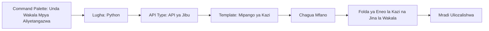
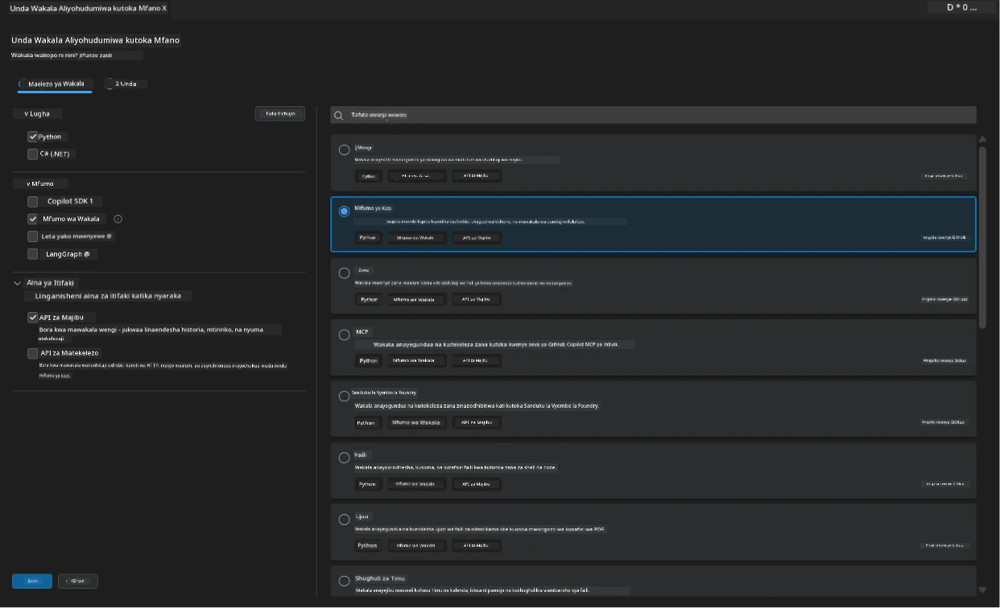
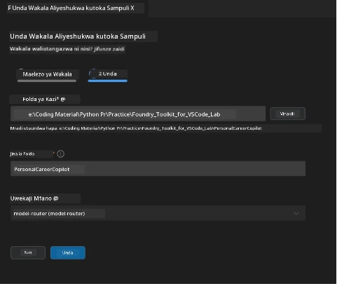

# Moduli 2 - Tengeneza Mradi wa Wakala Wengi

⏱️ ~5 dakika

Katika moduli hii, unatumia [Foundry Toolkit for VS Code](https://aka.ms/foundrytk) ili **kutengeneza mradi wa wakala wengi**. Msaidizi huunda `agent.yaml`, `main.py`, `Dockerfile`, `requirements.txt`, `.env`, na usanidi wa ugunduzi wa VS Code - ili uweze kuzingatia kuunganisha mtiririko wa wakala 4 katika Moduli 3.

> **Dhana kuu:** Scaffold ni mfano wa kazi wenye wakala mmoja. Unabadilisha mantiki ya sehemu ya nafasi na mchoro wa `WorkflowBuilder` katika Moduli 3. Haufanyi maandishi ya awali kutoka mwanzo.

> **Mfano wa rejea:** [`PersonalCareerCopilot/`](../../../../../workshop/lab02-multi-agent/PersonalCareerCopilot) ni mfano kamili unaofanya kazi. Utumie kulinganisha kazi yako unavyosonga mbele.

### Mtiririko wa msaidizi wa Scaffold


```mermaid
flowchart LR
    A[Command Palette: Unda Wakala Mpya Aliyetangazwa] --> B[Lugha: Python]
    B --> C[API Type: API ya Jibu]
    C --> D[Template: Mipango ya Kazi]
    D --> E[Chagua Mfano]
    E --> F[Folda ya Eneo la Kazi na Jina la Wakala]
    F --> G[Mradi Uliozalishwa]
```

---

## Hatua 1: Fungua msaidizi wa Unda Wakala Aliyekaribishwa

1. Bonyeza `Ctrl+Shift+P` kufungua **Command Palette**.
2. Andika: **Foundry Toolkit: Create a New Hosted Agent** na uchague.
3. Msaidizi hufunguka kwenye kichupo cha **Agent Details**.

> **Njia mbadala:** Bonyeza ikoni ya **Foundry Toolkit** kwenye Bar ya Shughuli → bonyeza ikoni ya **+** kando ya **Hosted Agents** → **Create New Hosted Agent**.

---

## Hatua 2: Chagua vipimo



1. Katika sehemu ya urambazaji/vipengele vya kushoto chagua yafuatayo:

| Menyu | Chaguo | Maelezo |
|--------|-----------|-------|
| **Lugha** | Python | Pia inaungwa mkono C# (.NET) |
| **Mfumo** | Agent Framework | Hutoa `Agent`, `AgentExecutor`, `WorkflowBuilder` |
| **Aina ya API** | Response API | `POST /responses` - historia inasimamiwa na jukwaa, ina usaidizi wa uenezaji |
| **Kiolezo** | **Workflows** | Husindika maombi kupitia mawakala mbalimbali mfululizo |

2. Ukimaliza kuchagua, bonyeza **Next**



3. Kwenye dirisha linalofuata, chagua yafuatayo:

| Menyu | Chaguo | Maelezo |
|--------|-----------|-------|
| **Folda ya Kazi** | Kagua folda lengwa | mfano, `workshop/lab02-multi-agent/` katika repo hii |
| **Jina la Wakala** | `PersonalCareerCopilot` | Hii inakuwa jina la saraka la mradi |
| **Uwekaji Mfano** | Chagua mfano wako uliowekwa | mfano, `gpt-4.1-mini` kutoka Lab 01 |

4. Bonyeza **Create** kuunda mradi. VS Code hutoa faili na kufungua folda.

> **Tip:** [`gpt-4.1-mini`](https://learn.microsoft.com/azure/foundry/foundry-models/concepts/models-sold-directly-by-azure#gpt-41-series) huoanisha kwa kiasi kinachofaa kasi na ubora kwa maendeleo ya wakala wengi.

---

## Hatua 3: Kagua mradi ulioundwa

Baada ya scaffold kumalizika, hakikisha unaona faili hizi katika Mchunguzi (`Ctrl+Shift+E`):

```
📂 <your-agent-name>/
├── .azdignore          ← Files excluded from Azure Developer CLI deployments
├── .dockerignore       ← Files excluded from Docker builds
├── .env                ← Environment variables (placeholders - fill in Module 3)
├── .vscode/
│   ├── launch.json     ← Debug config (F5 → run + Agent Inspector)
│   └── tasks.json      ← VS Code task definitions
├── agent.yaml          ← Agent definition (kind: hosted, protocol: responses)
├── Dockerfile          ← Container config for deployment
├── main.py             ← Stub agent entry point (replace with WorkflowBuilder in Module 3)
└── requirements.txt    ← Python dependencies
```

> **Muhimu:** Fungua folda hii ya scaffold moja kwa moja katika VS Code ili `.vscode/launch.json` na `tasks.json` zitumike ipasavyo kwa ugunduzi wa F5.

### Faili kuu zilizobainishwa

| Faili | Kusudi |
|------|---------|
| `agent.yaml` | Inatangaza `kind: hosted`, inaonyesha env vars, inaeleza itifaki ya `/responses` |
| `main.py` | Mfano: `FoundryChatClient` mmoja → `Agent` → `ResponsesHostServer`. Unabadilisha hii na mawakala 4 + `WorkflowBuilder` katika Moduli 3 |
| `Dockerfile` | `python:3.12-slim`, unasakinisha `requirements.txt`, unaonyesha bandari 8088, unaendesha `python main.py` |
| `requirements.txt` | `agent-framework-foundry`, `agent-framework-foundry-hosting`, `mcp<2,>=1.24.0`, `debugpy` |

> **Rejea:** Tazama [`PersonalCareerCopilot/agent.yaml`](../../../../../workshop/lab02-multi-agent/PersonalCareerCopilot/agent.yaml) na [`PersonalCareerCopilot/requirements.txt`](../../../../../workshop/lab02-multi-agent/PersonalCareerCopilot/requirements.txt) kwa maudhui kamili yaliyotengenezwa.

---

### ✅ Kituo cha Kukagua

- [ ] Msaidizi wa scaffold umekamilika - folda mpya ya mradi inaonekana katika Mchunguzi
- [ ] Faili zote unazotarajia zipo: `agent.yaml`, `main.py`, `Dockerfile`, `requirements.txt`, `.env`
- [ ] `agent.yaml` inaonyesha `kind: hosted` na `protocol: responses`
- [ ] `main.py` inaleta `Agent`, `FoundryChatClient`, `ResponsesHostServer`
- [ ] Folda ya scaffold imefunguliwa kama mizizi ya eneo la kazi la VS Code
- [ ] Unaelewa `main.py` ni mfuko - `WorkflowBuilder` itaongezwa katika Moduli 3

---

**Iliyotangulia:** [01 - Elewa Miundo ya Wakala Wengi](01-understand-multi-agent.md) · **Inayofuata:** [03 - Sanidi Mawakala & Mazingira →](03-configure-agents.md)

---

<!-- CO-OP TRANSLATOR DISCLAIMER START -->
**Kionyozo**:
Hati hii imetafsiriwa kwa kutumia huduma ya tafsiri ya AI [Co-op Translator](https://github.com/Azure/co-op-translator). Ingawa tunajitahidi kupata usahihi, tafadhali fahamu kwamba tafsiri za kiotomatiki zinaweza kuwa na makosa au upungufu wa usahihi. Hati ya asili katika lugha yake halisi inapaswa kuchukuliwa kama chanzo cha mamlaka. Kwa taarifa muhimu, tafsiri ya kitaalamu inayofanywa na binadamu inapendekezwa. Hatutojibu kwa kuelewa vibaya au tafsiri potofu zinazotokea kutokana na matumizi ya tafsiri hii.
<!-- CO-OP TRANSLATOR DISCLAIMER END -->