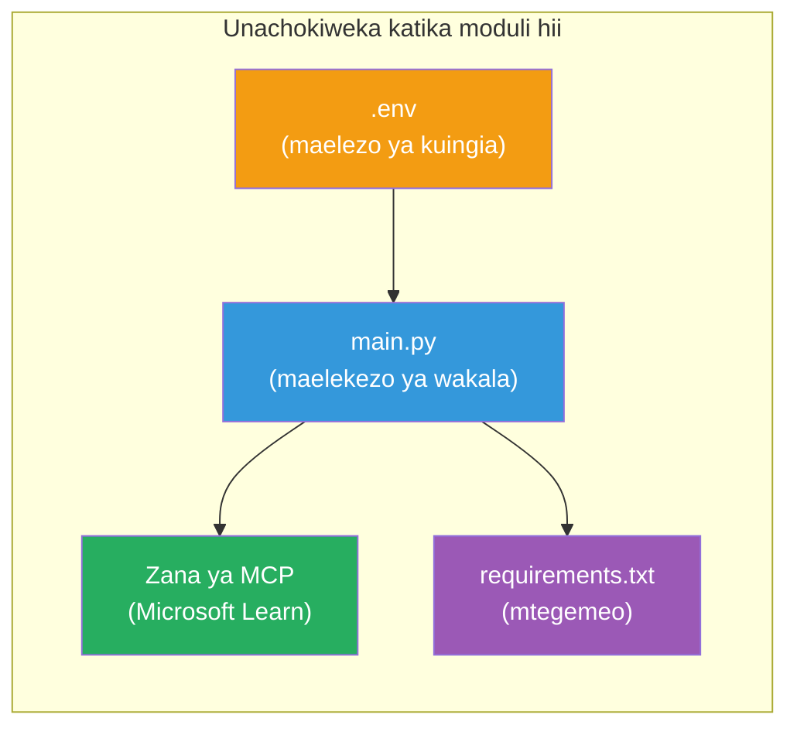

# Moduli 3 - Sanidi Wakala, Chombo cha MCP & Mazingira

Katika moduli hii, unabinafsisha mradi wa wakala wengi ulioundwa. Utaandika maelekezo kwa wakala wote wanne, usanidi chombo cha MCP kwa Microsoft Learn, sanidi vigezo vya mazingira, na sakinisha utegemezi.


> **Marejeleo:** Msimbo mzima unaofanya kazi upo katika [`PersonalCareerCopilot/main.py`](../../../../../workshop/lab02-multi-agent/PersonalCareerCopilot/main.py). Utumie kama marejeleo wakati unajenga yako mwenyewe.

---

## Hatua 1: Sanidi vigezo vya mazingira

1. Fungua faili ya **`.env`** katika mzizi wa mradi wako.
2. Jaza maelezo ya mradi wako wa Foundry:

   ```env
   PROJECT_ENDPOINT=https://<your-account>.services.ai.azure.com/api/projects/<your-project>
   MODEL_DEPLOYMENT_NAME=gpt-4.1-mini
   ```

3. Hifadhi faili.

### Wapi pa kupata haya maadili

| Thamani | Jinsi ya kupatikana |
|---------|---------------------|
| **Kifungo cha mradi (Project endpoint)** | Upanga wa Foundry wa Microsoft → bonyeza mradi wako → URL ya kifungo katika mtazamo wa maelezo |
| **Jina la uenezaji wa modeli** | Upanga wa Foundry → ziba mradi → **Models + endpoints** → jina kando na modeli iliyoenezwa |

> **Usalama:** Usiweka `.env` kwenye udhibiti wa toleo (version control). Ongeza katika `.gitignore` ikiwa bado haipo.

### Ramani ya vigezo vya mazingira

`main.py` ya wakala wengi husoma majina ya vigezo vya mazingira vinavyoendana na muktadha wa warsha pamoja na majina ya kawaida:

```python
PROJECT_ENDPOINT = os.getenv("AZURE_AI_PROJECT_ENDPOINT") or os.getenv("PROJECT_ENDPOINT")
MODEL_DEPLOYMENT_NAME = os.getenv(
    "AZURE_AI_MODEL_DEPLOYMENT_NAME",
    os.getenv("MODEL_DEPLOYMENT_NAME", "gpt-4.1-mini"),
)
MICROSOFT_LEARN_MCP_ENDPOINT = os.getenv(
    "MICROSOFT_LEARN_MCP_ENDPOINT", "https://learn.microsoft.com/api/mcp"
)
```

Kifungo cha MCP kina default nzuri - huna haja ya kukisanidi katika `.env` isipokuwa unataka kubadilisha.

---

## Hatua 2: Andika maelekezo ya wakala

Hii ni hatua muhimu zaidi. Kila wakala anahitaji maelekezo makini yanayoelezea jukumu lake, muundo wa matokeo, na sheria. Fungua `main.py` na unda (au badilisha) visemanyo vya maelekezo.

### 2.1 Wakala wa Kuchambua Wasifu (Resume Parser Agent)

```python
RESUME_PARSER_INSTRUCTIONS = """\
You are the Resume Parser.
Extract resume text into a compact, structured profile for downstream matching.

Output exactly these sections:
1) Candidate Profile
2) Technical Skills (grouped categories)
3) Soft Skills
4) Certifications & Awards
5) Domain Experience
6) Notable Achievements

Rules:
- Use only explicit or strongly implied evidence.
- Do not invent skills, titles, or experience.
- Keep concise bullets; no long paragraphs.
- If input is not a resume, return a short warning and request resume text.
"""
```

**Kwa nini sehemu hizi?** MatchingAgent inahitaji data iliyopangwa ili kuipima. Sehemu za aina ile ile hufanya uuzaji kati ya wakala kuwa wa uhakika.

### 2.2 Wakala wa Maelezo ya Kazi (Job Description Agent)

```python
JOB_DESCRIPTION_INSTRUCTIONS = """\
You are the Job Description Analyst.
Extract a structured requirement profile from a JD.

Output exactly these sections:
1) Role Overview
2) Required Skills
3) Preferred Skills
4) Experience Required
5) Certifications Required
6) Education
7) Domain / Industry
8) Key Responsibilities

Rules:
- Keep required vs preferred clearly separated.
- Only use what the JD states; do not invent hidden requirements.
- Flag vague requirements briefly.
- If input is not a JD, return a short warning and request JD text.
"""
```

**Kwa nini tofauti kati ya mahitaji na mapendeleo?** MatchingAgent hutumia uzito tofauti kwa kila mojawapo (Ujuzi Unaohitajika = pointi 40, Ujuzi Unaopendelewa = pointi 10).

### 2.3 Wakala wa Ulinganifu (Matching Agent)

```python
MATCHING_AGENT_INSTRUCTIONS = """\
You are the Matching Agent.
Compare parsed resume output vs JD output and produce an evidence-based fit report.

Scoring (100 total):
- Required Skills 40
- Experience 25
- Certifications 15
- Preferred Skills 10
- Domain Alignment 10

Output exactly these sections:
1) Fit Score (with breakdown math)
2) Matched Skills
3) Missing Skills
4) Partially Matched
5) Experience Alignment
6) Certification Gaps
7) Overall Assessment

Rules:
- Be objective and evidence-only.
- Keep partial vs missing separate.
- Keep Missing Skills precise; it feeds roadmap planning.
"""
```

**Kwa nini alama za uwazi?** Alama zinazoweza kurudiwa zinaruhusu kulinganisha matokeo na kutatua matatizo. Kiwango cha pointi 100 ni rahisi kwa watumiaji wa mwisho kuelewa.

### 2.4 Wakala wa Kuchambua Mapungufu (Gap Analyzer Agent)

```python
GAP_ANALYZER_INSTRUCTIONS = """\
You are the Gap Analyzer and Roadmap Planner.
Create a practical upskilling plan from the matching report.

Microsoft Learn MCP usage (required):
- For EVERY High and Medium priority gap, call tool `search_microsoft_learn_for_plan`.
- Use returned Learn links in Suggested Resources.
- Prefer Microsoft Learn for free resources.

CRITICAL: You MUST produce a SEPARATE detailed gap card for EVERY skill listed in
the Missing Skills and Certification Gaps sections of the matching report. Do NOT
skip or combine gaps. Do NOT summarize multiple gaps into one card.

Output format:
1) Personalized Learning Roadmap for [Role Title]
2) One DETAILED card per gap (produce ALL cards, not just the first):
   - Skill
   - Priority (High/Medium/Low)
   - Current Level
   - Target Level
   - Suggested Resources (include Learn URL from tool results)
   - Estimated Time
   - Quick Win Project
3) Recommended Learning Order (numbered list)
4) Timeline Summary (week-by-week)
5) Motivational Note

Rules:
- Produce every gap card before writing the summary sections.
- Keep it specific, realistic, and actionable.
- Tailor to candidate's existing stack.
- If fit >= 80, focus on polish/interview readiness.
- If fit < 40, be honest and provide a staged path.
"""
```

**Kwa nini mkazia "CRITICAL"?** Bila maelekezo wazi ya kutoa kadi zote za mapungufu, modeli huwa na tabia ya kutengeneza kadi 1-2 tu na kufupisha zingine. Sehemu ya "CRITICAL" inazuia kukatwa hivyo.

---

## Hatua 3: Tafsiri chombo cha MCP

GapAnalyzer hutumia chombo kinachoiita [seva ya MCP ya Microsoft Learn](https://learn.microsoft.com/azure/foundry/agents/how-to/tools/model-context-protocol). Ongeza hii katika `main.py`:

```python
import json
from agent_framework import tool
from mcp.client.session import ClientSession
from mcp.client.streamable_http import streamable_http_client

@tool
async def search_microsoft_learn_for_plan(
    skill: str, role: str = "", max_results: int = 5
) -> str:
    """Search Microsoft Learn MCP and return curated official links for roadmap planning."""
    query = " ".join(part for part in [skill, role, "learning path module"] if part).strip()
    query = query or "job skills learning path"

    try:
        async with streamable_http_client(MICROSOFT_LEARN_MCP_ENDPOINT) as (
            read_stream, write_stream, _,
        ):
            async with ClientSession(read_stream, write_stream) as session:
                await session.initialize()
                result = await session.call_tool(
                    "microsoft_docs_search", {"query": query}
                )

        if not result.content:
            return (
                "No results returned from Microsoft Learn MCP. "
                "Fallback: https://learn.microsoft.com/training/support/catalog-api"
            )

        payload_text = getattr(result.content[0], "text", "")
        data = json.loads(payload_text) if payload_text else {}
        items = data.get("results", [])[:max(1, min(max_results, 10))]

        if not items:
            return f"No direct Microsoft Learn results found for '{skill}'."

        lines = [f"Microsoft Learn resources for '{skill}':"]
        for i, item in enumerate(items, start=1):
            title = item.get("title") or item.get("url") or "Microsoft Learn Resource"
            url = item.get("url") or item.get("link") or ""
            lines.append(f"{i}. {title} - {url}".rstrip(" -"))
        return "\n".join(lines)
    except Exception as ex:
        return (
            f"Microsoft Learn MCP lookup unavailable. Reason: {ex}. "
            "Fallbacks: https://learn.microsoft.com/api/mcp"
        )
```

### Jinsi chombo kinavyofanya kazi

| Hatua | Inatokea nini |
|-------|---------------|
| 1 | GapAnalyzer hufanya uamuzi kuwa inahitaji rasilimali kwa ujuzi (mfano, "Kubernetes") |
| 2 | Mfumo huitisha `search_microsoft_learn_for_plan(skill="Kubernetes")` |
| 3 | Kazi hufungua muunganisho wa [Streamable HTTP](https://learn.microsoft.com/agent-framework/agents/tools/hosted-mcp-tools) kwa `https://learn.microsoft.com/api/mcp` |
| 4 | Huomba `microsoft_docs_search` kwenye [seva ya MCP](https://learn.microsoft.com/azure/foundry/agents/how-to/tools/model-context-protocol) |
| 5 | Seva ya MCP hurudisha matokeo ya utafutaji (kichwa + URL) |
| 6 | Kazi huandaa matokeo kama orodha iliyopangwa kwa nambari |
| 7 | GapAnalyzer huingiza URL katika kadi ya mapungufu |

### Utegemezi wa MCP

Maktaba za mteja MCP zinajumuishwa kupitia [`agent-framework-core`](https://learn.microsoft.com/agent-framework/overview/). HAUHITAJI kuziweka kwenye `requirements.txt` tena. Ikiwa unapata makosa ya kuagiza, hakikisha:

```powershell
pip list | Select-String "mcp"
```

Inatarajiwa: kifurushi `mcp` kimesakinishwa (toleo 1.x au baadaye).

---

## Hatua 4: Unganisha wakala na mtiririko wa kazi

### 4.1 Unda wakala kwa matumizi ya mameneja wa muktadha

```python
from contextlib import asynccontextmanager

@asynccontextmanager
async def create_agents():
    async with (
        get_credential() as credential,
        AzureAIAgentClient(
            project_endpoint=PROJECT_ENDPOINT,
            model_deployment_name=MODEL_DEPLOYMENT_NAME,
            credential=credential,
        ).as_agent(
            name="ResumeParser",
            instructions=RESUME_PARSER_INSTRUCTIONS,
        ) as resume_parser,
        AzureAIAgentClient(
            project_endpoint=PROJECT_ENDPOINT,
            model_deployment_name=MODEL_DEPLOYMENT_NAME,
            credential=credential,
        ).as_agent(
            name="JobDescriptionAgent",
            instructions=JOB_DESCRIPTION_INSTRUCTIONS,
        ) as jd_agent,
        AzureAIAgentClient(
            project_endpoint=PROJECT_ENDPOINT,
            model_deployment_name=MODEL_DEPLOYMENT_NAME,
            credential=credential,
        ).as_agent(
            name="MatchingAgent",
            instructions=MATCHING_AGENT_INSTRUCTIONS,
        ) as matching_agent,
        AzureAIAgentClient(
            project_endpoint=PROJECT_ENDPOINT,
            model_deployment_name=MODEL_DEPLOYMENT_NAME,
            credential=credential,
        ).as_agent(
            name="GapAnalyzer",
            instructions=GAP_ANALYZER_INSTRUCTIONS,
            tools=[search_microsoft_learn_for_plan],
        ) as gap_analyzer,
    ):
        yield resume_parser, jd_agent, matching_agent, gap_analyzer
```

**Mambo muhimu:**
- Kila wakala ana mfano wake wa `AzureAIAgentClient`
- Ni GapAnalyzer pekee anayepewa `tools=[search_microsoft_learn_for_plan]`
- `get_credential()` hurudisha [`ManagedIdentityCredential`](https://learn.microsoft.com/python/api/overview/azure/identity-readme#managed-identity-support) ndani ya Azure, [`DefaultAzureCredential`](https://learn.microsoft.com/azure/developer/python/sdk/authentication/credential-chains#defaultazurecredential-overview) eneo la mtaalamu

### 4.2 Jenga mtiririko wa grafu

```python
def create_workflow(resume_parser, jd_agent, matching_agent, gap_analyzer):
    workflow = (
        WorkflowBuilder(
            name="ResumeJobFitEvaluator",
            start_executor=resume_parser,
            output_executors=[gap_analyzer],
        )
        .add_edge(resume_parser, jd_agent)
        .add_edge(resume_parser, matching_agent)
        .add_edge(jd_agent, matching_agent)
        .add_edge(matching_agent, gap_analyzer)
        .build()
    )
    return workflow.as_agent()
```

> Tazama [Mtiririko kama Wakala](https://learn.microsoft.com/agent-framework/workflows/as-agents) kuelewa mtindo wa `.as_agent()`.

### 4.3 Anzisha seva

```python
async def main() -> None:
    validate_configuration()
    async with create_agents() as (resume_parser, jd_agent, matching_agent, gap_analyzer):
        agent = create_workflow(resume_parser, jd_agent, matching_agent, gap_analyzer)
        from azure.ai.agentserver.agentframework import from_agent_framework
        await from_agent_framework(agent).run_async()

if __name__ == "__main__":
    asyncio.run(main())
```

---

## Hatua 5: Tengeneza na wezesha mazingira pepe

### 5.1 Tengeneza mazingira

```powershell
cd workshop\lab02-multi-agent\PersonalCareerCopilot
python -m venv .venv
```

### 5.2 Wezesha

**PowerShell (Windows):**
```powershell
.\.venv\Scripts\Activate.ps1
```

**macOS/Linux:**
```bash
source .venv/bin/activate
```

### 5.3 Sakinisha utegemezi

```powershell
pip install -r requirements.txt
```

> **Kumbuka:** Mstari `agent-dev-cli --pre` ndani ya `requirements.txt` unahakikisha toleo la awali la hivi karibuni linasakinishwa. Hii ni muhimu kwa ulinganifu na `agent-framework-core==1.0.0rc3`.

### 5.4 Thibitisha usakinishaji

```powershell
pip list | Select-String "agent-framework|agentserver|agent-dev"
```

Matokeo yanayotarajiwa:
```
agent-dev-cli                  0.0.1b260316
agent-framework-azure-ai       1.0.0rc3
agent-framework-core            1.0.0rc3
azure-ai-agentserver-agentframework 1.0.0b16
azure-ai-agentserver-core      1.0.0b16
```

> **Kama `agent-dev-cli` inaonyesha toleo la zamani** (mfano `0.0.1b260119`), Mpelelezi wa Wakala atashindwa na makosa 403/404. Boresha: `pip install agent-dev-cli --pre --upgrade`

---

## Hatua 6: Thibitisha uthibitisho

Endesha ukaguzi sawa wa uthibitisho kutoka Lab 01:

```powershell
az account show --query "{name:name, id:id}" --output table
```

Ikiwa hii itashindwa, endesha [`az login`](https://learn.microsoft.com/cli/azure/authenticate-azure-cli-interactively).

Kwa mitiririko ya wakala wengi, wakala wote wanne wanashiriki cheti kimoja cha uthibitisho. Ikiwa uthibitisho unafanya kazi kwa mmoja, hufanya kazi kwa wote.

---

### Sehemu ya ukaguzi

- [ ] `.env` ina maadili halali ya `PROJECT_ENDPOINT` na `MODEL_DEPLOYMENT_NAME`
- [ ] Visemanyo vyote vinne vya maelekezo ya wakala vimefafanuliwa katika `main.py` (ResumeParser, JD Agent, MatchingAgent, GapAnalyzer)
- [ ] Chombo cha MCP `search_microsoft_learn_for_plan` kimefafanuliwa na kusajiliwa na GapAnalyzer
- [ ] `create_agents()` huunda wakala wote wanne na mifano binafsi ya `AzureAIAgentClient`
- [ ] `create_workflow()` hujenga grafu sahihi kwa kutumia `WorkflowBuilder`
- [ ] Mazingira pepe yameundwa na kuwezeshwa (`(.venv)` inaonekana)
- [ ] `pip install -r requirements.txt` imemalizika bila makosa
- [ ] `pip list` inaonyesha vifurushi vyote vinavyotarajiwa kwa matoleo sahihi (rc3 / b16)
- [ ] `az account show` hurudisha usajili wako

---

**Iliyotangulia:** [02 - Unda Mradi wa Wakala Wengi](02-scaffold-multi-agent.md) · **Inayofuata:** [04 - Mifumo ya Usimamizi →](04-orchestration-patterns.md)

---

<!-- CO-OP TRANSLATOR DISCLAIMER START -->
**Angalizo**:  
Hati hii imetafsiriwa kwa kutumia huduma ya tafsiri ya AI [Co-op Translator](https://github.com/Azure/co-op-translator). Ingawa tunajitahidi kwa usahihi, tafadhali fahamu kuwa tafsiri za kiotomatiki zinaweza kuwa na makosa au usahihi mdogo. Hati ya asili katika lugha yake ya asili inapaswa kuchukuliwa kama chanzo cha mamlaka. Kwa taarifa muhimu, tafsiri ya kitaalamu ya binadamu inashauriwa. Hatuwajibiki kwa kutoelewana au tafsiri mbaya zitokanazo na matumizi ya tafsiri hii.
<!-- CO-OP TRANSLATOR DISCLAIMER END -->