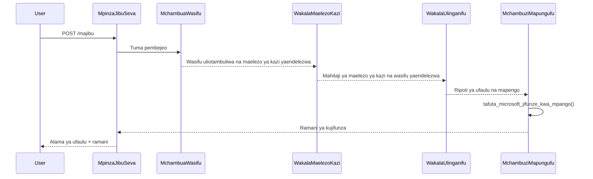

# Moduli 3 - Sanidi Maelekezo, Mazingira & Sakinisha Mategemeo

⏱️ ~15 min

Katika moduli hii, unabadilisha stub iliyotengenezwa kuwa **kazi yako** ya mawakala wengi - kwa kuweka vigezo vya mazingira, kuandika maelekezo ya wakala, kuongeza chombo cha MCP, kuunganisha grafu ya mtiririko wa kazi, na kusakinisha mategemeo.

> **Rejea:** Msimbo kamili unaofanya kazi upo katika [`PersonalCareerCopilot/main.py`](../../../../../workshop/lab02-multi-agent/PersonalCareerCopilot/main.py). Utumie kama rejea unapoandika grafu yako mwenyewe ya mtiririko wa kazi na sehemu za maelekezo.

---

## Jinsi mawakala wanne wanavyoendana


```mermaid
sequenceDiagram
    participant User
    participant Server as MpinzaJibuSeva
    participant RP as MchambuaWasifu
    participant JD as WakalaMaelezoKazi
    participant MA as WakalaUlinganifu
    participant GA as MchambuziMapungufu

    User->>Server: POST /majibu
    Server->>RP: Tuma pembejeo
    RP-->>JD: Wasifu uliotambuliwa na maelezo ya kazi yaendelezwa
    JD-->>MA: Mahitaji ya maelezo ya kazi na wasifu yaendelezwa
    MA-->>GA: Ripoti ya ufaulu na mapengo
    GA->>GA: tafuta_microsoft_jifunze_kwa_mpango()
    GA-->>Server: Ramani ya kujifunza
    Server-->>User: Alama ya ufaulu + ramani
```

---

## Hatua 1: Sanidi vigezo vya mazingira

1. Fungua faili la **`.env`** katika mizizi ya mradi wako (lilitengenezwa na mchawi wa scaffold).
2. Badilisha vibonye na thamani zako halisi kutoka Kiwango cha 01.

<details open>
<summary><strong>🅰️ Njia A - Usajili wa Foundry</strong></summary>

```env
FOUNDRY_PROJECT_ENDPOINT=https://<your-account>.services.ai.azure.com/api/projects/<your-project>
AZURE_AI_MODEL_DEPLOYMENT_NAME=gpt-4.1-mini
```

> **Mahali pa kupata thamani:** Angalia [Kiwango 01, Moduli 1](../../lab01-single-agent/docs/01-setup.md#deploy-a-model--assign-rbac).

</details>

<details open>
<summary><strong>🅱️ Njia B - Foundry Ndani ya Kifaa</strong></summary>

```env
FOUNDRY_PROJECT_ENDPOINT=http://localhost:5273/v1
AZURE_AI_MODEL_DEPLOYMENT_NAME=phi-4-mini
```

> Uchambuzi wote unafanyika kwenye mashine yako - hakuna data inayotoka kwenye kifaa chako. Endesha `foundry model list` kuthibitisha jina sahihi la mfano. Ombi pekee la kutoka ni simu ya chombo cha MCP kwenda `https://learn.microsoft.com/api/mcp`.

> **Mahali pa kupata thamani:** Angalia [Kiwango 01, Moduli 1 - njia ya ndani](../../lab01-single-agent/docs/01-setup.md#step-2-set-up-based-on-your-access).

</details>

> **Usalama:** Usihifadhi `\.env` kwenye udhibiti wa toleo. Inapaswa tayari kuwa kwenye `.gitignore`.

---

## Hatua 2: Andika maelekezo ya wakala

Maelekezo huainisha jukumu la kila wakala, muundo wa matokeo, na sheria. Fungua `main.py` na fafanua (au badilisha) constants nne za maelekezo - mistari kamili iko katika [`PersonalCareerCopilot/main.py`](../../../../../workshop/lab02-multi-agent/PersonalCareerCopilot/main.py).

### 2.1 `RESUME_PARSER_INSTRUCTIONS`
Huchambua wasifu kuwa profaili muundo ya mgombea **na** kunakili maelezo ya kazi bila kubadilika katika `[JOB DESCRIPTION PASS-THROUGH]`. Sehemu zote mbili zilizoainishwa lazima zionekane katika matokeo.

> **Kwa nini pass-through?** Kwa `context_mode="last_agent"`, ResumeParser ndiye wakala **pekee** anayeaona ujumbe wa mtumiaji wa asili. Ikiwa haitanakili JD mbele, mawakala wa baadaye hawaioni.

### 2.2 `JOB_DESCRIPTION_INSTRUCTIONS`
Hiusoma `[PARSED RESUME]` na `[JOB DESCRIPTION PASS-THROUGH]` kutoka kwa matokeo ya ResumeParser. Hutoa `[JD REQUIREMENTS]` ( mahitaji yaliyo na muundo) na `[PARSED RESUME PASS-THROUGH]` (nakala ya wasifu isiyobadilika kwa MatchingAgent).

### 2.3 `MATCHING_AGENT_INSTRUCTIONS`
Husoma `[JD REQUIREMENTS]` na `[PARSED RESUME PASS-THROUGH]`. Hutengeneza ripoti ya muafaka yenye alama (0–100) yenye hesabu za sehemu, ujuzi uliofanana, ujuzi uliokosekana, na mlinganiko wa uzoefu.

### 2.4 `GAP_ANALYZER_INSTRUCTIONS`
Husoma ripoti ya muafaka. Kwa kila ujuzi uliokosekana, huuita `search_microsoft_learn_for_plan` ili kupata rasilimali za kujifunza za Microsoft Learn. Hutengeneza kadi moja ya kina ya pengo kwa kila ujuzi pamoja na ramani ya kujifunza kwa wiki kwa wiki.

---

## Hatua 3: Ongeza chombo cha MCP

GapAnalyzer huwaita [msingi wa MCP wa Microsoft Learn](https://learn.microsoft.com/azure/foundry/agents/how-to/tools/model-context-protocol) kupata rasilimali halisi za kujifunza kwa kila pengo la ujuzi. Kazi kamili ya `search_microsoft_learn_for_plan` iko katika [`PersonalCareerCopilot/main.py`](../../../../../workshop/lab02-multi-agent/PersonalCareerCopilot/main.py).

Sajili chombo kwenye GapAnalyzer unapotengeneza wakala:

```python
gap_analyzer = Agent(
    client=client,
    instructions=GAP_ANALYZER_INSTRUCTIONS,
    name="GapAnalyzer",
    tools=[search_microsoft_learn_for_plan],
)
```

> Angalia [`PersonalCareerCopilot/main.py`](../../../../../workshop/lab02-multi-agent/PersonalCareerCopilot/main.py) kwa grafu kamili ya `WorkflowBuilder` yenye `FoundryChatClient`, `AgentExecutor`, na simu zote za `add_edge()`.

---

## Hatua 4: Tengeneza mazingira ya kibinafsi & sakinisha mategemeo

> ⚠️ **Usiruke hatua hii.** Bila kusakinisha mategemeo, utii wa F5 utashindikana.

### 4.1 Tengeneza mazingira ya kibinafsi

```powershell
python -m venv .venv
```

### 4.2 Yawezeshe

| OS | Amri |
|----|---------|
| **Windows (PowerShell)** | `.\.venv\Scripts\Activate.ps1` |
| **Windows (CMD)** | `.venv\Scripts\activate.bat` |
| **macOS / Linux** | `source .venv/bin/activate` |

Unapaswa kuona `(.venv)` katika kiashiria cha terminal yako.

### 4.3 Sakinisha mategemeo

```powershell
pip install -r requirements.txt
```

### 4.4 Thibitisha

```powershell
pip list | Select-String "agent-framework|mcp|debugpy"
```

Kinachotarajiwa: `agent-framework-foundry`, `agent-framework-foundry-hosting`, `mcp`, na `debugpy` zimedhihirika.

---

## Hatua 5: Thibitisha uthibitishaji

<details open>
<summary><strong>🅰️ Njia A - Cheti cha Azure</strong></summary>

```powershell
az account show --query "{name:name, id:id}" --output table
```

Ikiwa hii itashindikana, endesha [`az login`](https://learn.microsoft.com/cli/azure/authenticate-azure-cli-interactively).

Mawakala wote wanne wanashiriki `FoundryChatClient` moja na `DefaultAzureCredential` moja. Ikiwa uthibitishaji unafanya kazi kwa mmoja, unafanya kazi kwa wote.

</details>

<details open>
<summary><strong>🅱️ Njia B - Foundry Ndani ya Kifaa</strong></summary>

Hakuna uthibitishaji unaohitajika kwa majaribio ya ndani.

</details>

---

### ✅ Kituo cha Ukaguzi

> Usendelee kwenye Moduli 04 hadi: **(1)** `(.venv)` ionekane kwenye kiashiria chako NA **(2)** `pip install -r requirements.txt` imemaliza kwa mafanikio.

- [ ] `.env` ina mwisho halali na jina la utekelezaji wa mfano (si vibonye)
- [ ] Constants zote 4 za maelekezo ya wakala zimetengwa katika `main.py` (ResumeParser, JD Agent, MatchingAgent, GapAnalyzer)
- [ ] Chombo cha MCP `search_microsoft_learn_for_plan` kimefafanuliwa na kusajiliwa kwenye GapAnalyzer
- [ ] Vitu vya `FoundryChatClient` + 4 `Agent` + 4 `AgentExecutor` vimetengenezwa katika `main()`
- [ ] `WorkflowBuilder` jenga grafu sahihi ya mfuatano na simu zote 3 za `add_edge()`
- [ ] Mazingira ya kibinafsi yameundwa na kuwezeshwa (`(.venv)` ionekane kiashiria)
- [ ] `pip install -r requirements.txt` imemalizika bila makosa
- [ ] **Njia A:** `az account show` imetimia AU ikoni ya Akaunti za VS Code inaonyesha akaunti iliyosajiliwa

---

**Iliyopita:** [02 - Tengeneza Mradi wa Mawakala Wengi](02-scaffold-multi-agent.md) · **Ifuatayo:** [04 - Mifumo ya Usimamizi wa Mtiririko →](04-orchestration-patterns.md)

---

<!-- CO-OP TRANSLATOR DISCLAIMER START -->
**Kionyozo**:
Hati hii imetafsiriwa kwa kutumia huduma ya tafsiri ya AI [Co-op Translator](https://github.com/Azure/co-op-translator). Ingawa tunajitahidi kupata usahihi, tafadhali fahamu kwamba tafsiri za kiotomatiki zinaweza kuwa na makosa au upungufu wa usahihi. Hati ya asili katika lugha yake halisi inapaswa kuchukuliwa kama chanzo cha mamlaka. Kwa taarifa muhimu, tafsiri ya kitaalamu inayofanywa na binadamu inapendekezwa. Hatutojibu kwa kuelewa vibaya au tafsiri potofu zinazotokea kutokana na matumizi ya tafsiri hii.
<!-- CO-OP TRANSLATOR DISCLAIMER END -->