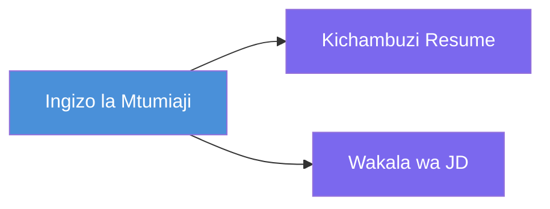
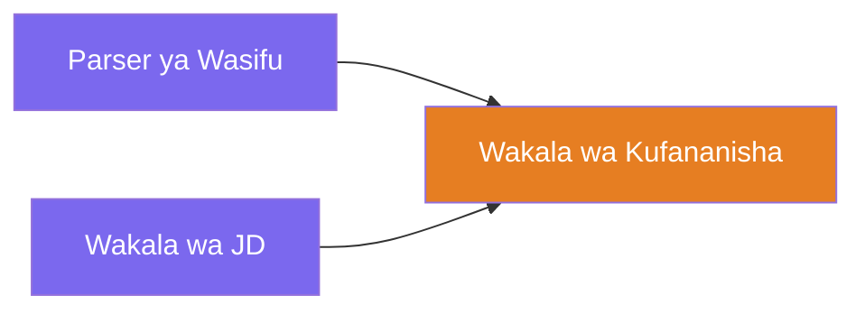
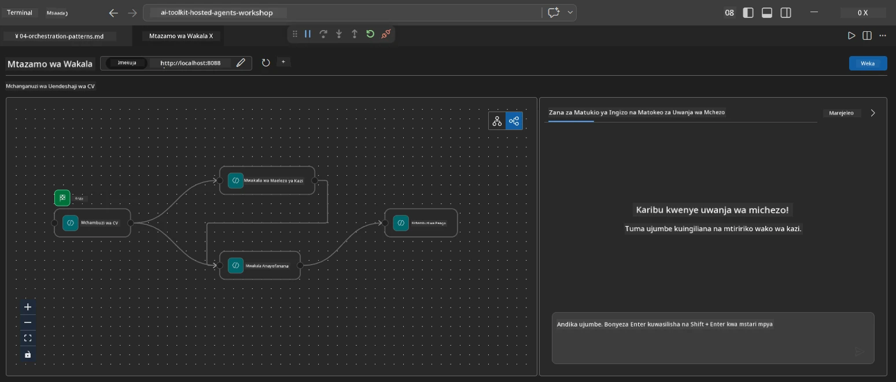
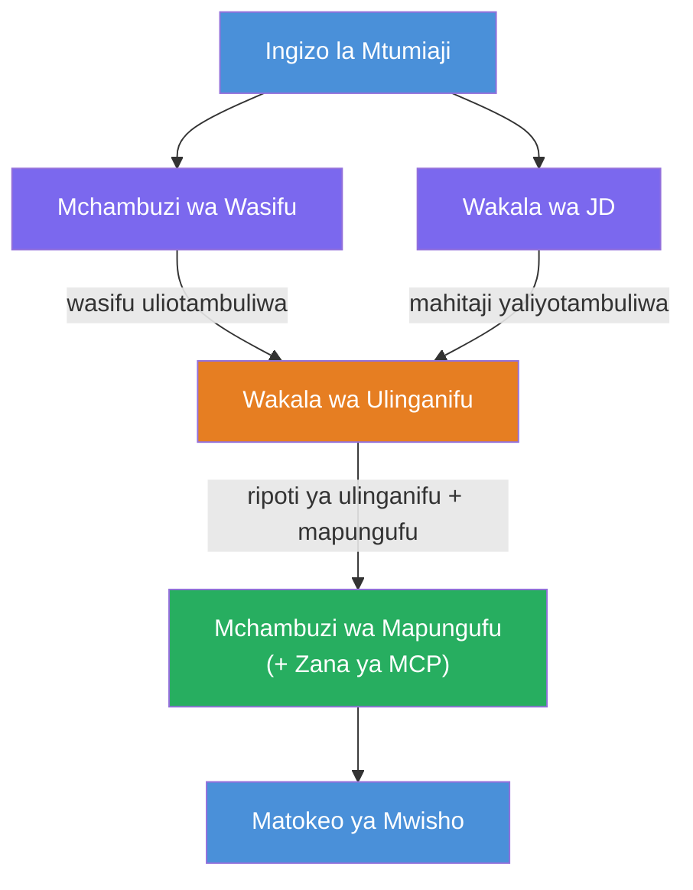
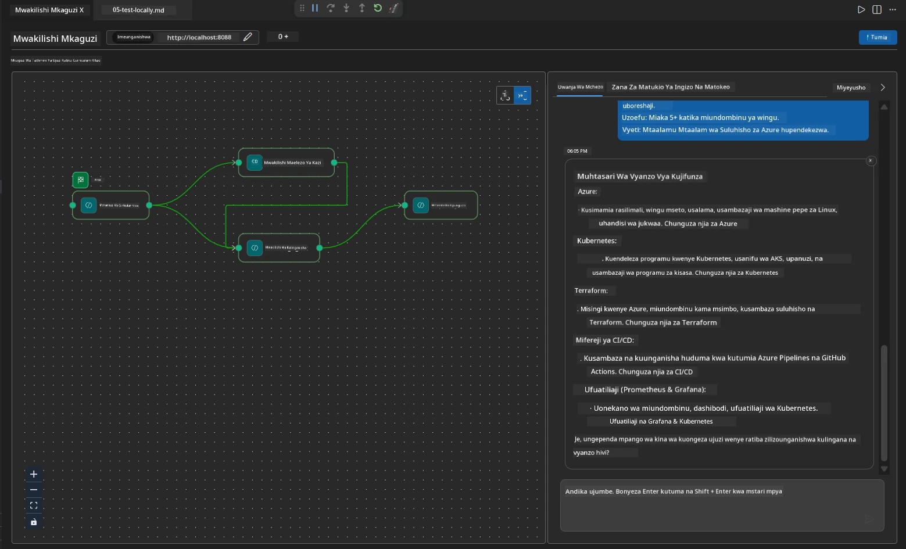

# Module 4 - Mifumo ya Kuandaa Mashughuli

Katika moduli hii, utachunguza mifumo ya kuandaa shughuli inayotumika katika Resume Job Fit Evaluator na kujifunza jinsi ya kusoma, kubadilisha, na kuongeza mchoro wa mtiririko wa kazi. Kuelewa mifumo hii ni muhimu kwa kutatua matatizo ya mtiririko wa data na kujenga [mitiririko ya kazi ya mawakala wengi](https://learn.microsoft.com/agent-framework/workflows/).

---

## Mfumo wa 1: Fan-out (mgawanyiko sambamba)

Mfumo wa kwanza katika mtiririko wa kazi ni **fan-out** - ingizo moja hutumwa kwa mawakala wengi kwa wakati mmoja.


Katika msimbo, hili hufanyika kwa sababu `resume_parser` ni `start_executor` - hupokea ujumbe wa mtumiaji kwanza. Kisha, kwa sababu `jd_agent` na `matching_agent` wote wana makali kutoka `resume_parser`, mfumo hupeleka pato la `resume_parser` kwa mawakala wote wawili:

```python
.add_edge(resume_parser, jd_agent)         # Matokeo ya ResumeParser → Wakala wa JD
.add_edge(resume_parser, matching_agent)   # Matokeo ya ResumeParser → Wakala Anayolingana
```

**Kwa nini hili linafanya kazi:** ResumeParser na JD Agent huchakata vipengele tofauti vya ingizo moja. Kuendesha kwa wakati mmoja hupunguza ucheleweshaji mzima ukilinganisha na kuendesha kwa mfululizo.

### Wakati wa kutumia fan-out

| Matumizi | Mfano |
|----------|---------|
| Kazi ndogo huru | Kuchakata wasifu dhidi ya kuchakata JD |
| Marudio / upigaji kura | Mawakala wawili huchambua data moja, wa tatu huchagua jibu bora |
| Pato lenye aina nyingi | Mwakala mmoja hutengeneza maandishi, mwingine hutengeneza JSON iliyo na muundo |

---

## Mfumo wa 2: Fan-in (kusanywa)

Mfumo wa pili ni **fan-in** - matokeo ya mawakala wengi hukusanywa na kutumwa kwa mwakilishi mmoja aliye chini.


Katika msimbo:

```python
.add_edge(resume_parser, matching_agent)   # Matokeo ya ResumeParser → MatchingAgent
.add_edge(jd_agent, matching_agent)        # Matokeo ya JD Agent → MatchingAgent
```

**Tabia kuu:** Wakati mwakilishi ana **makali mawili au zaidi yanayoingiza**, mfumo unasubiri moja kwa moja mawakala wote wa juu wakamilishe kabla ya kuendesha mwakilishi aliye chini. MatchingAgent haianzi hadi ResumeParser na JD Agent wote wamemaliza.

### Kile ambacho MatchingAgent hupokea

Mfumo huunganisha matokeo kutoka kwa mawakala wote wa juu. Ingizo la MatchingAgent linaonekana kama:

```
[ResumeParser output]
---
Candidate Profile:
  Name: Jane Doe
  Technical Skills: Python, Azure, Kubernetes, ...
  ...

[JobDescriptionAgent output]
---
Role Overview: Senior Cloud Engineer
Required Skills: Python, Azure, Terraform, ...
...
```

> **Kumbuka:** Muundo halisi wa kuunganisha hutegemea toleo la mfumo. Maelekezo ya mwakilishi yanapaswa kuandikwa kushughulikia pato la juu lenye muundo asilia au bila muundo.



---

## Mfumo wa 3: Mnyororo mfululizo

Mfumo wa tatu ni **mnyororo wa mfululizo** - pato la mwakilishi mmoja huingiza moja kwa moja kwa mwakilishi mwingine.


Katika msimbo:

```python
.add_edge(matching_agent, gap_analyzer)    # Matokeo ya MatchingAgent → GapAnalyzer
```

Huu ndio mfumo rahisi zaidi. GapAnalyzer hupokea alama ya kufaa ya MatchingAgent, ujuzi uliolingana/uliofutika, na mapengo. Kisha huwaita [zana ya MCP](https://learn.microsoft.com/azure/foundry/agents/how-to/tools/model-context-protocol) kwa kila pengo kuchukua rasilimali za Microsoft Learn.

---

## Mchoro kamili

Kuchanganya mifumo mitatu hutoa mtiririko kamili wa kazi:


### Muda wa utekelezaji

```mermaid
gantt
    title Mfululizo wa Utekelezaji wa Wakala
    dateFormat X
    axisFormat %s

    section Sambamba
    Resume Parser       :rp, 0, 3
    JD Agent            :jd, 0, 2

    section Mfuatano
    Matching Agent      :ma, 3, 5
    Gap Analyzer        :ga, 5, 9
```


> Muda wa ukuta mzima ni takriban `max(ResumeParser, JD Agent) + MatchingAgent + GapAnalyzer`. GapAnalyzer kawaida ni wa polepole zaidi kwa sababu hufanya miito mingi ya zana ya MCP (moja kwa kila pengo).

---

## Kusoma msimbo wa WorkflowBuilder

Hapa kuna kazi kamili ya `create_workflow()` kutoka `main.py`, yenye maelezo:

```python
def create_workflow(resume_parser, jd_agent, matching_agent, gap_analyzer):
    workflow = (
        WorkflowBuilder(
            name="ResumeJobFitEvaluator",

            # Wakilishi wa kwanza kupokea ingizo la mtumiaji
            start_executor=resume_parser,

            # Wakala(wakala) ambao matokeo yao yanakuwa jibu la mwisho
            output_executors=[gap_analyzer],
        )
        # Mgawanyiko: Matokeo ya ResumeParser huenda kwa JD Agent na MatchingAgent
        .add_edge(resume_parser, jd_agent)
        .add_edge(resume_parser, matching_agent)

        # Kuungana: MatchingAgent inasubiri kwa ResumeParser na JD Agent
        .add_edge(jd_agent, matching_agent)

        # Mfuatano: Matokeo ya MatchingAgent huingia GapAnalyzer
        .add_edge(matching_agent, gap_analyzer)

        .build()
    )
    return workflow.as_agent()
```

### Jedwali la muhtasari wa makali

| # | Mboni | Mfumo | Athari |
|---|------|---------|--------|
| 1 | `resume_parser → jd_agent` | Fan-out | JD Agent hupokea pato la ResumeParser (pamoja na ingizo halisi la mtumiaji) |
| 2 | `resume_parser → matching_agent` | Fan-out | MatchingAgent hupokea pato la ResumeParser |
| 3 | `jd_agent → matching_agent` | Fan-in | MatchingAgent hupokea pia pato la JD Agent (hunsubiri wote wawili) |
| 4 | `matching_agent → gap_analyzer` | Mfululizo | GapAnalyzer hupokea ripoti ya kufaa + orodha ya mapengo |

---

## Kubadilisha mchoro

### Kuongeza mwakilishi mpya

Kuongeza mwakilishi wa tano (kwa mfano, **InterviewPrepAgent** anayetengeneza maswali ya mahojiano kulingana na uchambuzi wa pengo):

```python
# 1. Elezea maelekezo
INTERVIEW_PREP_INSTRUCTIONS = """\
You are the Interview Prep Agent.
Given a gap analysis and fit report, generate 10 targeted interview questions
the candidate should prepare for.
"""

# 2. Unda wakala (ndani ya block ya async with)
AzureAIAgentClient(
    project_endpoint=PROJECT_ENDPOINT,
    model_deployment_name=MODEL_DEPLOYMENT_NAME,
    credential=credential,
).as_agent(
    name="InterviewPrepAgent",
    instructions=INTERVIEW_PREP_INSTRUCTIONS,
) as interview_prep,

# 3. Ongeza makali katika create_workflow()
.add_edge(matching_agent, interview_prep)   # anapokea ripoti ya kufaa
.add_edge(gap_analyzer, interview_prep)     # pia anapokea kadi za pengo

# 4. Sasisha output_executors
output_executors=[interview_prep],  # sasa wakala wa mwisho
```

### Kubadilisha mpangilio wa utekelezaji

Ili kufanya JD Agent kuendesha **baada ya** ResumeParser (mfululizo badala ya sambamba):

```python
# Ondoa: .add_edge(resume_parser, jd_agent)  ← tayari ipo, iendelee kuwepo
# Ondoa sambamba isiyo wazi kwa KUTOA jd_agent kupokea maingizo ya mtumiaji moja kwa moja
# start_executor hutuma kwa resume_parser kwanza, na jd_agent hupata tu
# pato la resume_parser kupitia kiungo. Hii huwafanya kuwa mfululizo.
```

> **Muhimu:** `start_executor` ni mwakilishi pekee anayepokea ingizo halisi la mtumiaji. Mawakala wengine wote hupokea pato kutoka kwa makali yao ya juu. Ikiwa unataka mwakilishi pia apokee ingizo halisi la mtumiaji, lazima awe na mboni kutoka `start_executor`.

---

## Makosa ya kawaida kwenye mchoro

| Kosa | Dalili | Suluhisho |
|---------|---------|-----|
| Mboni haipo kwa `output_executors` | Mwakilishi anaendesha lakini pato ni tupu | Hakikisha kuna njia kutoka `start_executor` hadi kwa kila mwakilishi katika `output_executors` |
| Mtegemezo mzunguko | Mzunguko usioisha au muda umemalizika | Hakikisha hakuna mwakilishi anayerejea kwa mwakilishi wa juu |
| Mwakilishi katika `output_executors` bila mboni watoke | Pato ni tupu | Ongeza angalau `add_edge(source, that_agent)` |
| Mawakala wengi wa `output_executors` bila fan-in | Pato lina majibu ya mwakilishi mmoja tu | Tumia mwakilishi mmoja wa pato anayechanganya, au kubali matokeo mengi |
| `start_executor` haipo | `ValueError` wakati wa kujenga | Daima eleza `start_executor` katika `WorkflowBuilder()` |

---

## Utatuzi wa matatizo ya mchoro

### Kutumia Agent Inspector

1. Anzisha mwakilishi kwa ndani (F5 au terminal - angalia [Module 5](05-test-locally.md)).
2. Fungua Agent Inspector (`Ctrl+Shift+P` → **Foundry Toolkit: Open Agent Inspector**).
3. Tuma ujumbe wa majaribio.
4. Katika kidirisha cha jibu cha Inspector, angalia **pato la mkondo** - linaonyesha mchango wa kila mwakilishi kwa mfuatano.



### Kutumia logging

Ongeza logi kwa `main.py` kufuatilia mtiririko wa data:

```python
import logging
logger = logging.getLogger("resume-job-fit")

# Katika create_workflow(), baada ya kujenga:
logger.info("Workflow graph built with edges: RP→JD, RP→MA, JD→MA, MA→GA")
```

Logi za seva zinaonyesha mpangilio wa utekelezaji wa mwakilishi na miito ya zana ya MCP:

```
INFO:resume-job-fit:Starting Resume -> Job Fit Evaluator HTTP server...
INFO:resume-job-fit:Server running on http://localhost:8088
INFO:agent_framework:Executing agent: ResumeParser
INFO:agent_framework:Executing agent: JobDescriptionAgent
INFO:agent_framework:Waiting for upstream agents: ResumeParser, JobDescriptionAgent
INFO:agent_framework:Executing agent: MatchingAgent
INFO:agent_framework:Executing agent: GapAnalyzer
INFO:agent_framework:Tool call: search_microsoft_learn_for_plan(skill="Kubernetes")
POST https://learn.microsoft.com/api/mcp → 200
INFO:agent_framework:Tool call: search_microsoft_learn_for_plan(skill="Terraform")
POST https://learn.microsoft.com/api/mcp → 200
```

---

### Kagua

- [ ] Unaweza kutambua mifumo mitatu ya kuandaa shughuli katika mtiririko: fan-out, fan-in, na mnyororo mfululizo
- [ ] Unaelewa kwamba mawakala wenye makali mengi yanayoingiza husubiri mawakala wote wa juu wakamilishe
- [ ] Unaweza kusoma msimbo wa `WorkflowBuilder` na kuoanisha kila simu ya `add_edge()` na mchoro wa kuona
- [ ] Unaelewa muda wa utekelezaji: mawakala sambamba huendesha kwanza, kisha kusanywa, kisha mfululizo
- [ ] Unajua jinsi ya kuongeza mwakilishi mpya kwenye mchoro (fafanua maelekezo, tengeneza mwakilishi, ongeza makali, sasisha pato)
- [ ] Unaweza kutambua makosa ya kawaida ya mchoro na dalili zake

---

**Iliyopita:** [03 - Sanidi Mawakala & Mazingira](03-configure-agents.md) · **Ifuatayo:** [05 - Jaribu Kwenye Kifaa Chako →](05-test-locally.md)

---

<!-- CO-OP TRANSLATOR DISCLAIMER START -->
**Kiarifi**:  
Hati hii imetafsiriwa kwa kutumia huduma ya tafsiri ya AI [Co-op Translator](https://github.com/Azure/co-op-translator). Ingawa tunajitahidi kuhakikisha usahihi, tafadhali fahamu kwamba tafsiri za moja kwa moja zinaweza kuwa na makosa au upungufu wa usahihi. Hati ya asili katika lugha yake ya asili inapaswa kuzingatiwa kama chanzo chenye mamlaka. Kwa taarifa muhimu, inashauriwa kutumia tafsiri ya kitaalamu inayofanywa na binadamu. Hatuwezi kuwajibika kwa kuelewana au kutokuelewana kutokea kutokana na matumizi ya tafsiri hii.
<!-- CO-OP TRANSLATOR DISCLAIMER END -->