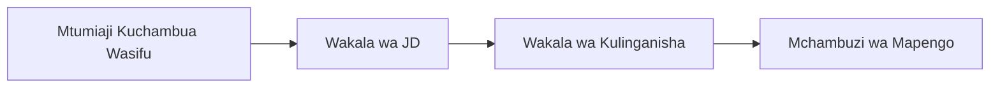
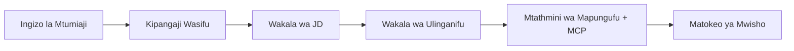

# Moduli 4 - Mifumo ya Uendeshaji

⏱️ ~10 dakika

Katika moduli hii, unachunguza mifumo ya uendeshaji inayotumika katika Mtaalamu wa Kuweka Kazi za Wasifu na kujifunza jinsi ya kusoma, kubadilisha, na kuongeza mchoro wa mtiririko wa kazi. Kuelewa mifumo hii ni muhimu kwa kutatua matatizo ya mtiririko wa data na kujenga [mchirio wa kazi wa mawakala wengi](https://learn.microsoft.com/agent-framework/workflows/).

---

## Mfano 1: Mnyororo mfuatano

Mfano msingi katika mtiririko wa kazi ni **mnyororo mfuatano** - matokeo ya kila wakala huingia moja kwa moja kwa wakala aliyefuata.


```mermaid
flowchart LR
    RP[Mtumiaji Kuchambua Wasifu] --> JD[Wakala wa JD]
    JD --> MA[Wakala wa Kulinganisha]
    MA --> GA[Mchambuzi wa Mapengo]
```

Katika msimbo, kila simu ya `add_edge()` huunda hatua moja katika mnyororo:

```python
.add_edge(resume_executor, jd_executor)       # Matokeo ya ResumeParser → Wakala wa JD
.add_edge(jd_executor, matching_executor)     # Matokeo ya Wakala wa JD → Wakala wa Ulinganifu
.add_edge(matching_executor, gap_executor)    # Matokeo ya Wakala wa Ulinganifu → Mchambuzi wa Mapungufu
```

> **Kwa nini mfuatano, si fan-out/fan-in?** `WorkflowBuilder` hutumia **meti ya OR** kwa edges zinazoingia: mtendaji wanaofuata huanzia mara mtendaji yeyote wa awali anapomaliza. Ikiwa `matching_executor` ingekuwa na edges mbili zinazoingia (kutoka `resume_executor` na `jd_executor`), ingesababisha mara mbili - mara moja wakati ResumeParser inamaliza na tena wakati JD Agent anamaliza - na kusababisha GapAnalyzer kuendeshwa mara mbili na matokeo kuonekana mara mbili. Mnyororo wa mfuatano huhakikisha hili halitokei kabisa.

## Mfano 2: Uwasilishaji wa Yaliyomo

Kwa sababu `context_mode="last_agent"` inamaanisha mtendaji mmoja mmoja anaona tu matokeo ya **mtendaji aliyemtangulia moja kwa moja**, mawakala katika mnyororo mfuatano lazima wapeleke waziwazi data yoyote ambayo mawakala wa chini wanahitaji.

Katika mtiririko huu wa kazi:
- **ResumeParser** huleta maelezo ya kazi (JD) kama yalivyo ndani ya `[JOB DESCRIPTION PASS-THROUGH]` (ili JD Agent aweze kuyapata).
- **JD Agent** huchukua `[PARSED RESUME]` kama ilivyo katika `[PARSED RESUME PASS-THROUGH]` (ili MatchingAgent aweze kulinganisha wasifu zote mbili).

```
ResumeParser output
└─ [PARSED RESUME]               ← extracted by JD Agent
└─ [JOB DESCRIPTION PASS-THROUGH] ← extracted by JD Agent

JD Agent output
└─ [JD REQUIREMENTS]             ← extracted by MatchingAgent
└─ [PARSED RESUME PASS-THROUGH]  ← extracted by MatchingAgent
```

Kila sehemu ya kuwasilisha lazima ikilishwe **kama ilivyo** - kufupisha au kuibadilisha hutaathiri wakala wa chini wanaotegemea hiyo.

---

## Mchoro kamili

Kuunganisha mifumo ya mnyororo mfuatano na uwasilishaji wa yaliyomo huleta mtiririko kamili wa kazi:


```mermaid
flowchart LR
    U[Ingizo la Mtumiaji] --> RP[Kipangaji Wasifu]
    RP --> JD[Wakala wa JD]
    JD --> MA[Wakala wa Ulinganifu]
    MA --> GA[Mtathmini wa Mapungufu + MCP]
    GA --> O[Matokeo ya Mwisho]
```

Muangalizi wa Wakala anaonyesha muundo huu wa mchoro wakati wakala anapokuwa anaendesha ndani ya eneo la kufanya kazi. Rejelea [Moduli 5 - Jaribu Ndani ya Eneo](05-test-locally.md) kwa picha za skrini.

---

## Kusoma msimbo wa WorkflowBuilder

Kazi kamili ya `create_workflow()` iko katika [`PersonalCareerCopilot/main.py`](../../../../../workshop/lab02-multi-agent/PersonalCareerCopilot/main.py). Simu tatu za `add_edge()` hutengeneza mnyororo wa mfuatano:

| # | Edge | Athari |
|---|------|--------|
| 1 | `resume_executor → jd_executor` | JD Agent anapokea `[PARSED RESUME]` + `[JOB DESCRIPTION PASS-THROUGH]` |
| 2 | `jd_executor → matching_executor` | MatchingAgent anapokea `[JD REQUIREMENTS]` + `[PARSED RESUME PASS-THROUGH]` |
| 3 | `matching_executor → gap_executor` | GapAnalyzer anapokea ripoti ya ustahiki + orodha ya pengo |

---

## Kubadilisha mchoro

### Kuongeza wakala mpya

Ili kuongeza wakala wa tano (mfano, **InterviewPrepAgent** baada ya GapAnalyzer):

1. Tafsiri thabiti ya `INTERVIEW_PREP_INSTRUCTIONS`.
2. Tengeneza vitu vya `Agent` + `AgentExecutor` (mfano ule ule wa wa nne waliopo).
3. Ongeza `.add_edge(gap_executor, interview_exec)` kwenye `WorkflowBuilder`.
4. Sasisha `output_executors=[interview_exec]`.

> **Muhimu:** `start_executor` ni wakala pekee anayeweza kupokea ingizo halisi la mtumiaji. Mawakala wengine wote wanapokea matokeo kutoka edge yao ya juu.

---

## Makosa ya kawaida ya mchoro

| Kosa | Dalili | Suluhisho |
|---------|---------|-----|
| Edge haipo kwa `output_executors` | Wakala anaendeshwa lakini matokeo ni tupu | Hakikisha kuna njia kutoka `start_executor` kwenda kwa kila wakala ndani ya `output_executors` |
| Utegemezi wa mzunguko | Mzunguko usioisha au kuishiisha muda | Angalia kwamba hakuna wakala anayerejelea nyuma kwa wakala wa juu |
| Wakala katika `output_executors` mkuu bila edge inayokuja | Matokeo ni tupu | Ongeza angalau edge moja `add_edge(chanzo, wakala_huyo)` |
| Mawakala wengi kwenye `output_executors` bila fan-in | Matokeo yanajumuisha jibu la wakala mmoja tu | Tumia wakala mmoja wa matokeo anayekuza, au kubali matokeo mengi |
| `start_executor` haipo | `ValueError` wakati wa kujenga | Daima bainisha `start_executor` katika `WorkflowBuilder()` |

---

## Kutatua matatizo ya mchoro

### Kutumia Muangalizi wa Wakala

1. Anzisha wakala ndani kwa kutumia F5.
2. Fungua Muangalizi wa Wakala (`Ctrl+Shift+P` → **Foundry Toolkit: Fungua Muangalizi wa Wakala**).
3. Tuma ujumbe wa jaribio.
4. Katika kidirisha cha majibu cha Muangalizi, tafuta **matokeo yanayotiririka** - yanaonyesha mchango wa kila wakala kwa mfuatano.


### Kutumia kufuatilia shughuli (logging)

Ongeza kufuatilia katika `main.py` ili kufuatilia mtiririko wa data:

```python
import logging
logger = logging.getLogger("resume-job-fit")

# Katika main(), baada ya kujenga mchakato wa kazi:
logger.info("Workflow graph built with edges: RP→JD, JD→MA, MA→GA")
```

Rekodi za seva zinaonyesha mtiririko wa utekelezaji wa wakala na simu za zana za MCP:

```
INFO:agent_framework:Executing agent: ResumeParser
INFO:agent_framework:Executing agent: JobDescriptionAgent
INFO:agent_framework:Executing agent: MatchingAgent
INFO:agent_framework:Executing agent: GapAnalyzer
INFO:agent_framework:Tool call: search_microsoft_learn_for_plan(skill="Kubernetes")
POST https://learn.microsoft.com/api/mcp → 200
INFO:agent_framework:Tool call: search_microsoft_learn_for_plan(skill="Terraform")
POST https://learn.microsoft.com/api/mcp → 200
```

---

### Sehemu ya ukaguzi

- [ ] Unaweza kutambua mifumo miwili ya uendeshaji katika mtiririko wa kazi: mnyororo mfuatano na uwasilishaji wa yaliyomo
- [ ] Unaelewa kwa nini `context_mode="last_agent"` inahitaji uwasilishaji wazi wa data kati ya mawakala
- [ ] Unaweza kusoma msimbo wa `WorkflowBuilder` na kuoanisha kila simu ya `add_edge()` na mchoro wa kuona
- [ ] Unajua jinsi ya kuongeza wakala mpya mwishoni mwa mnyororo
- [ ] Unaweza kutambua makosa ya kawaida ya mchoro na dalili zake

---

**Iliyotangulia:** [03 - Sanidi Wakala & Mazingira](03-configure-agents.md) · **Inayofuata:** [05 - Jaribu Ndani ya Eneo →](05-test-locally.md)

---

<!-- CO-OP TRANSLATOR DISCLAIMER START -->
**Kionyozo**:
Hati hii imetafsiriwa kwa kutumia huduma ya tafsiri ya AI [Co-op Translator](https://github.com/Azure/co-op-translator). Ingawa tunajitahidi kupata usahihi, tafadhali fahamu kwamba tafsiri za kiotomatiki zinaweza kuwa na makosa au upungufu wa usahihi. Hati ya asili katika lugha yake halisi inapaswa kuchukuliwa kama chanzo cha mamlaka. Kwa taarifa muhimu, tafsiri ya kitaalamu inayofanywa na binadamu inapendekezwa. Hatutojibu kwa kuelewa vibaya au tafsiri potofu zinazotokea kutokana na matumizi ya tafsiri hii.
<!-- CO-OP TRANSLATOR DISCLAIMER END -->