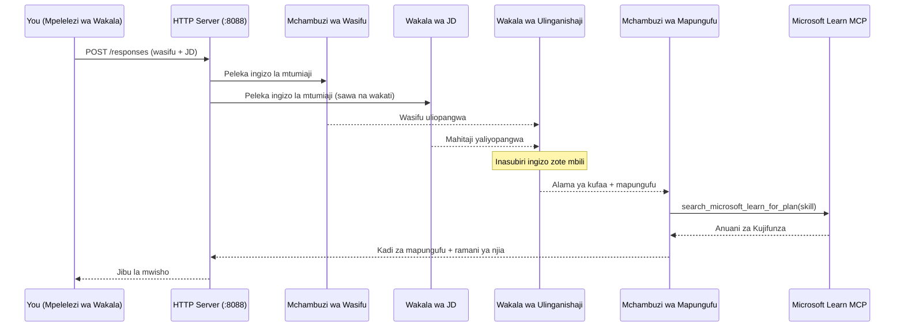
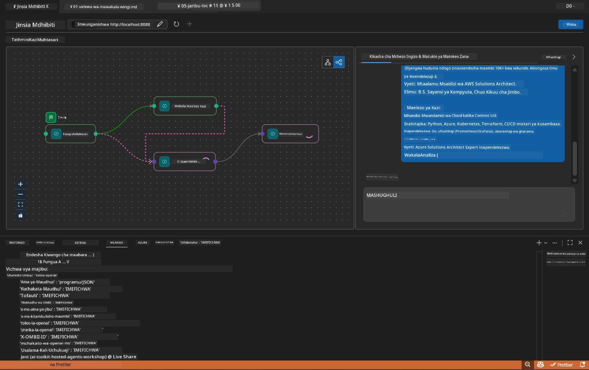

# Module 5 - Jaribu Kwenye Mitaa (Multi-Agent)

Katika moduli hii, unaendesha mtiririko wa kazi wa mawakala wengi mahali pako, kuujaribu na Agent Inspector, na kuthibitisha kuwa mawakala wote wanne na chombo cha MCP vinafanya kazi ipasavyo kabla ya kuyaweka kwenye Foundry.

### Nini hufanyika wakati wa kujaribu mahali pako


---

## Hatua ya 1: Anzisha seva ya mawakala

### Chaguo A: Kutumia kazi ya VS Code (inapendekezwa)

1. Bonyeza `Ctrl+Shift+P` → andika **Tasks: Run Task** → chagua **Run Lab02 HTTP Server**.
2. Kazi inaanzisha seva na debugpy imeambatishwa kwenye bandari ya `5679` na wakala kwenye bandari `8088`.
3. Subiri matokeo yaonyesha:

```
INFO:resume-job-fit:Starting Resume -> Job Fit Evaluator HTTP server...
INFO:resume-job-fit:Server running on http://localhost:8088
```

### Chaguo B: Kutumia terminal moja kwa moja

```powershell
cd workshop\lab02-multi-agent\PersonalCareerCopilot
```

Washa mazingira pepe:

**PowerShell (Windows):**
```powershell
.\.venv\Scripts\Activate.ps1
```

**macOS/Linux:**
```bash
source .venv/bin/activate
```

Anzisha seva:

```powershell
python -m debugpy --listen 127.0.0.1:5679 -m agentdev run main.py --verbose --port 8088
```

### Chaguo C: Kutumia F5 (hali ya debug)

1. Bonyeza `F5` au nenda kwa **Run and Debug** (`Ctrl+Shift+D`).
2. Chagua usanidi wa kuanzisha **Lab02 - Multi-Agent** kutoka kwenye menyu ya kunjuzi.
3. Seva inaanzishwa na msaada kamili wa vizingiti vya kuvunja.

> **Kidokezo:** Hali ya debug hukuruhusu kuweka vizingiti ndani ya `search_microsoft_learn_for_plan()` kuchunguza majibu ya MCP, au ndani ya mafungu ya maagizo ya wakala kuona anachopokea kila wakala.

---

## Hatua ya 2: Fungua Agent Inspector

1. Bonyeza `Ctrl+Shift+P` → andika **Foundry Toolkit: Open Agent Inspector**.
2. Agent Inspector hujifungua katika kichupo cha kivinjari kwa `http://localhost:5679`.
3. Unapaswa kuona kiolesura cha wakala kikiwa tayari kupokea ujumbe.

> **Ikiwa Agent Inspector haifunguki:** Hakikisha seva imeanzishwa kikamilifu (unaona kumbukumbu "Server running"). Ikiwa bandari 5679 inatumika, ona [Module 8 - Troubleshooting](08-troubleshooting.md).

---

## Hatua ya 3: Endesha majaribio ya msingi

Endesha majaribio haya matatu kwa utaratibu. Kila moja hujaribu hatua zaidi ya mtiririko.

### Jaribio 1: Wasifu wa kimsingi + maelezo ya kazi

Bandika yafuatayo kwenye Agent Inspector:

```
Resume:
Jane Doe
Senior Software Engineer with 5 years of experience in Python, Django, and AWS.
Built microservices handling 10K+ requests/second. Led a team of 4 developers.
Certifications: AWS Solutions Architect Associate.
Education: B.S. Computer Science, State University.

Job Description:
Senior Cloud Engineer at Contoso Ltd.
Required: Python, Azure, Kubernetes, Terraform, CI/CD pipelines.
Preferred: Go, monitoring (Prometheus/Grafana), cost optimization.
Experience: 5+ years in cloud infrastructure.
Certifications: Azure Solutions Architect Expert preferred.
```

**Muundo wa matokeo yanayotarajiwa:**

Jibu linapaswa kuwa na matokeo kutoka kwa mawakala wote wanne kwa mfuatano:

1. **Matokeo ya Resume Parser** - Wasifu wa mgombea uliopangwa kwa vipaji vilivyogawanywa kwa kundi
2. **Matokeo ya JD Agent** - Mahitaji yaliyojazwa kwa vipaji vinavyotakiwa dhidi ya vipaji vinavyopendekezwa vimesambazwa
3. **Matokeo ya Matching Agent** - Alama ya kufaa (0-100) na mgawanyo, vipaji vilivyolingana, vipaji vinavyokosekana, mapungufu
4. **Matokeo ya Gap Analyzer** - Kadi binafsi za mapungufu kwa kila kipaji kinachokosekana, kila moja na URLs za Microsoft Learn



### Kuthibitisha nini katika Jaribio 1

| Angalia | Kinachotarajiwa | Kufanikisha? |
|---------|-----------------|--------------|
| Jibu lina alama ya kufaa | Nambari kati ya 0-100 na mgawanyo | |
| Vipaji vilivyolingana vimeorodheshwa | Python, CI/CD (sehemu), n.k. | |
| Vipaji vinavyokosekana vimeorodheshwa | Azure, Kubernetes, Terraform, n.k. | |
| Kadi za mapungufu zipo kwa kila kipaji kinachokosekana | Kadi moja kwa kila kipaji | |
| URLs za Microsoft Learn zipo | Viungo halisi vya `learn.microsoft.com` | |
| Hakuna ujumbe wa makosa katika jibu | Matokeo safi yaliyo na muundo | |

### Jaribio 2: Hakiki utekelezaji wa chombo cha MCP

Wakati Jaribio 1 linaendelea, angalia **terminal ya seva** kwa kumbukumbu za logi za MCP:

```
GET https://learn.microsoft.com/api/mcp → 405 (Method Not Allowed)
POST https://learn.microsoft.com/api/mcp → 200
DELETE https://learn.microsoft.com/api/mcp → 405 (Method Not Allowed)
```

| Kumbukumbu za logi | Maana | Kinachotarajiwa? |
|------------------|--------|------------------|
| `GET ... → 405` | Mteja wa MCP huchunguza kwa GET wakati wa kuanzisha | Ndiyo - kawaida |
| `POST ... → 200` | Simu halisi ya chombo kwa seva ya Microsoft Learn MCP | Ndiyo - hii ni simu halisi |
| `DELETE ... → 405` | Mteja wa MCP huchunguza kwa DELETE wakati wa kusafisha | Ndiyo - kawaida |
| `POST ... → 4xx/5xx` | Simu ya chombo imeshindwa | Hapana - ona [Troubleshooting](08-troubleshooting.md) |

> **Kitendo muhimu:** Mistari ya `GET 405` na `DELETE 405` ni **tabia inayotarajiwa**. Tafadhali wasiwasi ni ikiwa simu za `POST` zinarudisha nambari ya hali isiyo ya 200.

### Jaribio 3: Kesi ya pembeni - mgombea mwenye alama kubwa

Bandika wasifu unaolingana karibu na JD ili kuthibitisha GapAnalyzer inashughulikia hali za alama kubwa:

```
Resume:
Alex Chen
Senior Cloud Engineer with 7 years of experience.
Skills: Python, Azure (AKS, Functions, DevOps), Kubernetes, Terraform, CI/CD (GitHub Actions, Azure Pipelines), Go, Prometheus, Grafana, cost optimization.
Certifications: Azure Solutions Architect Expert, Azure DevOps Engineer Expert.
Led infrastructure migration to Azure for 3 enterprise clients.
Education: M.S. Computer Science, Tech University.

Job Description:
Senior Cloud Engineer at Contoso Ltd.
Required: Python, Azure, Kubernetes, Terraform, CI/CD pipelines.
Preferred: Go, monitoring (Prometheus/Grafana), cost optimization.
Experience: 5+ years in cloud infrastructure.
Certifications: Azure Solutions Architect Expert preferred.
```

**Tabia inayotarajiwa:**
- Alama ya kufaa inapaswa kuwa **80+** (vipaji vingi vinalingana)
- Kadi za mapungufu zinapaswa kuelekeza kwenye usafi/utayari wa mahojiano badala ya kujifunza misingi
- Maagizo ya GapAnalyzer yanasema: "Ikiwa fit >= 80, zingatia usafi/utayari wa mahojiano"

---

## Hatua ya 4: Thibitisha ukamilifu wa matokeo

Baada ya kuendesha majaribio, hakikisha matokeo yanakidhi vigezo hivi:

### Orodha ya ukaguzi wa muundo wa matokeo

| Sehemu | Wakala | Zipo? |
|--------|--------|-------|
| Wasifu wa mgombea | Resume Parser | |
| Vipaji vya kiufundi (vimegawanyika) | Resume Parser | |
| Muhtasari wa kazi | JD Agent | |
| Vipaji vinavyotakiwa vs. vinavyopendekezwa | JD Agent | |
| Alama ya kufaa na mgawanyo | Matching Agent | |
| Vipaji vilivyolingana / vinavyokosekana / sehemu | Matching Agent | |
| Kadi za mapungufu kwa kila kipaji kinachokosekana | Gap Analyzer | |
| URLs za Microsoft Learn kwenye kadi za mapungufu | Gap Analyzer (MCP) | |
| Mpangilio wa kujifunza (nambari) | Gap Analyzer | |
| Muhtasari wa ratiba | Gap Analyzer | |

### Masuala ya kawaida katika hatua hii

| Tatizo | Sababu | Suluhisho |
|--------|---------|----------|
| Kadi moja tu ya mapungufu (zingine zimefikishwa) | Maagizo ya GapAnalyzer yanakosa kipengele cha CRITICAL | Ongeza aya ya `CRITICAL:` kwenye `GAP_ANALYZER_INSTRUCTIONS` - ona [Module 3](03-configure-agents.md) |
| Hakuna URLs za Microsoft Learn | Sehemu ya MCP haiwezi kufikiwa | Angalia muunganisho wa intaneti. Hakikisha `MICROSOFT_LEARN_MCP_ENDPOINT` katika `.env` ni `https://learn.microsoft.com/api/mcp` |
| Jibu ni tupu | `PROJECT_ENDPOINT` au `MODEL_DEPLOYMENT_NAME` hazijawekwa | Angalia maadili ya faili `.env`. Endesha `echo $env:PROJECT_ENDPOINT` kwenye terminal |
| Alama ya kufaa ni 0 au haipo | MatchingAgent hakupokea data ya juu | Hakikisha `add_edge(resume_parser, matching_agent)` na `add_edge(jd_agent, matching_agent)` zipo katika `create_workflow()` |
| Wakala anaanza lakini mara moja anatoa exit | Hitilafu ya kuagiza au utegemezi umekosa | Endesha `pip install -r requirements.txt` tena. Angalia terminal kwa vidokezo vya hitilafu |
| Hitilafu ya `validate_configuration` | Mazingira ya env hayajakamilika | Tengeneza `.env` na `PROJECT_ENDPOINT=<your-endpoint>` na `MODEL_DEPLOYMENT_NAME=<your-model>` |

---

## Hatua ya 5: Jaribu kwa data yako mwenyewe (hiari)

Jaribu kubandika wasifu wako mwenyewe na maelezo halisi ya kazi. Hii husaidia kuthibitisha:

- Mawakala hushughulikia aina mbalimbali za wasifu (za wakati kwa utaratibu, kazi, mchanganyiko)
- Wakala wa JD hushughulikia mitindo tofauti ya JD (vidokezo, aya, muundo)
- Chombo cha MCP hurudisha rasilimali zinazofaa kwa vipaji halisi
- Kadi za mapungufu zimebinafsishwa kwa historia yako maalum

> **Kumbuka faragha:** Unapojaribu mahali pako, data yako hubaki kwenye kompyuta yako na hutumwa tu kwenye utoaji wako wa Azure OpenAI. Hairekodiwi wala kuhifadhiwa na miundombinu ya warsha. Tumia majina ya msemaji ikiwa unapendelea (mfano, "Jane Doe" badala ya jina lako halisi).

---

### Alama ya ukaguzi

- [ ] Seva ilianzishwa kwa mafanikio kwenye bandari `8088` (kumbukumbu inaonyesha "Server running")
- [ ] Agent Inspector ilifunguka na kuunganishwa na wakala
- [ ] Jaribio 1: Jibu kamili na alama ya kufaa, vipaji vilivyolingana/vinavyokosekana, kadi za mapungufu, na URLs za Microsoft Learn
- [ ] Jaribio 2: Logi za MCP zinaonyesha `POST ... → 200` (simu za chombo zimefanikiwa)
- [ ] Jaribio 3: Mgombea mwenye alama kubwa anapokea alama 80+ na mapendekezo yanayojikita kwenye usafi
- [ ] Kadi zote za mapungufu zipo (kadi moja kwa kila kipaji kinachokosekana, hakuna kufupishwa)
- [ ] Hakuna makosa au vidokezo vya hitilafu kwenye terminal ya seva

---

**Iliyopita:** [04 - Mifumo ya Usanidi](04-orchestration-patterns.md) · **Ifuatayo:** [06 - Weka Kwenye Foundry →](06-deploy-to-foundry.md)

---

<!-- CO-OP TRANSLATOR DISCLAIMER START -->
**Kumbusho**:  
Hati hii imetafsiriwa kwa kutumia huduma ya tafsiri ya AI [Co-op Translator](https://github.com/Azure/co-op-translator). Ingawa tunajitahidi kwa usahihi, tafadhali fahamu kwamba tafsiri za kiotomatiki zinaweza kuwa na makosa au kasoro. Hati asili katika lugha yake ya mama inapaswa kuzingatiwa kama chanzo cha uhakika. Kwa taarifa muhimu, tafsiri ya kitaalamu ya binadamu inapendekezwa. Sisi hatuwezi kuwajibika kwa kuitafsiri vibaya au kutoeleweka ipasavyo kutokana na matumizi ya tafsiri hii.
<!-- CO-OP TRANSLATOR DISCLAIMER END -->