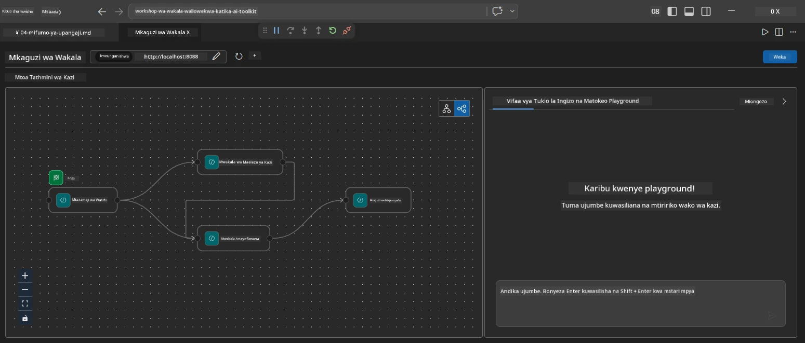
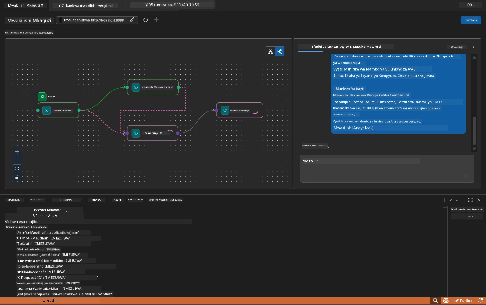
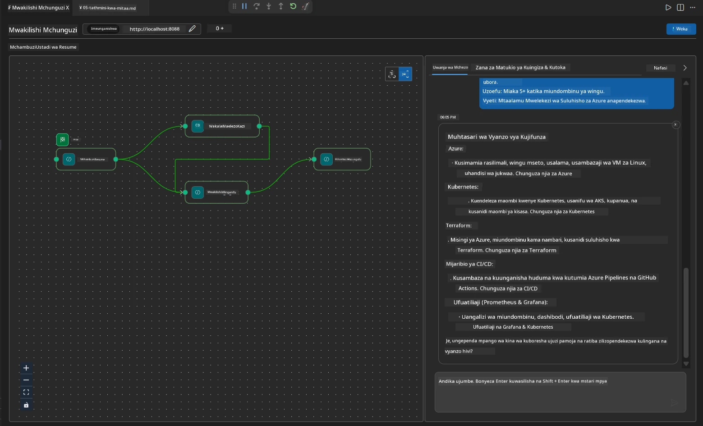

# Moduli 5 - Jaribu Kwenye Mashine Yako

⏱️ ~dakika 15

Katika moduli hii, utaendesha mtiririko wa kazi wa mawakala wengi mahali pako pa kazi, uaufanye majaribio kwa kutumia Agent Inspector, na kuthibitisha kuwa mawakala wote wanne na chombo cha MCP vinafanya kazi vizuri kabla ya kueneza.

---

## Hatua 1: Anzisha seva ya wakala

### Chaguo A: Kutumia kazi ya VS Code (inayoelekezwa)

1. Fungua `workshop/lab02-multi-agent/PersonalCareerCopilot/` kama folda yako ya VS Code.
2. Bonyeza `Ctrl+Shift+P` → andika **Tasks: Run Task** → chagua **Run Agent HTTP Server**.
3. Kazi inaanzisha seva na debugpy imeunganishwa kwenye bandari `5679` na wakala kwenye bandari `8088`.
4. Subiri hadi matokeo yaonyeshe:

```
INFO:resume-job-fit:Starting Resume -> Job Fit Evaluator HTTP server...
INFO:resume-job-fit:Server running on http://localhost:8088
```

### Chaguo B: Kutumia F5 (hali ya ufuatiliaji)

1. Bonyeza `F5` → chagua **Debug Local Agent HTTP Server**.
2. Seva inaanza na msaada kamili wa breakpoint - muhimu kwa kuchunguza majibu ya MCP au matokeo ya wakala.

---

## Hatua 2: Fungua Agent Inspector

1. Bonyeza `Ctrl+Shift+P` → andika **Foundry Toolkit: Open Agent Inspector**.
2. Agent Inspector inafunguka kama paneli ya VS Code iliyounganishwa na `http://localhost:8088`.
3. Unapaswa kuona kiolesura cha wakala kikiwa tayari kupokea ujumbe.



> **Kama Agent Inspector haifunguki:** Hakikisha seva imeanza kabisa (unaona kumbukumbu "Server running"). Ikiwa bandari 5679 imechukuliwa, angalia [Moduli 8 - Kusuluhisha Matatizo](08-troubleshooting.md).

---

## Hatua 2b: (Hiari) Fungua Workflow Visualizer

Foundry Toolkit inajumuisha **Workflow Visualizer** ya wakati halisi inayoonyesha jinsi mawakala wanavyoshirikiana wakati grafu inatekelezwa. Hii ni muhimu hasa kwa kufuatilia matatizo ya wakala wengi.

1. Bonyeza `Ctrl+Shift+P` → andika **Foundry Toolkit: Open Visualizer for Hosted Agents**.
2. Kichupo kipya cha VS Code kinafunguka kinachoonyesha grafu ya utekelezaji wa moja kwa moja.
3. Unapotuma ujumbe katika Agent Inspector, visualizer inasasishwa moja kwa moja - nodi za kijani zinaonyesha mawakala waliofanya kazi, na mistari yenye michoro inaonyesha mchakato wa data kati yao.

> **Mkutano wa bandari:** Ikiwa bandari ya visualizer tayari inatumika, badilisha katika Mipangilio ya VS Code → **Extensions** → **Microsoft Foundry Configuration** → **Hosted Agents: Visualizer Port**.

---

## Hatua 3: Endesha majaribio ya haraka

Endesha majaribio haya matatu kwa mpangilio. Kila moja hujaribu sehemu zaidi ya mtiririko wa kazi.

### Jaribio 1: Hati ya msingi ya CV + maelezo ya kazi

Bandika yafuatayo katika Agent Inspector:

```
Resume:
Jane Doe
Senior Software Engineer with 5 years of experience in Python, Django, and AWS.
Built microservices handling 10K+ requests/second. Led a team of 4 developers.
Certifications: AWS Solutions Architect Associate.
Education: B.S. Computer Science, State University.

Job Description:
Senior Cloud Engineer at Contoso Ltd.
Required: Python, Azure, Kubernetes, Terraform, CI/CD pipelines.
Preferred: Go, monitoring (Prometheus/Grafana), cost optimization.
Experience: 5+ years in cloud infrastructure.
Certifications: Azure Solutions Architect Expert preferred.
```

**Muundo unaotarajiwa wa matokeo:**

Jibu linapaswa kuwa na matokeo kutoka kwa mawakala wote wanne kwa mfululizo:

1. **Matokeo ya Resume Parser** - Sehemu mbili zilizoainishwa: `[PARSED RESUME]` (wasifu wa mgombea na ujuzi uliounganishwa) na `[JOB DESCRIPTION PASS-THROUGH]` (maandishi ya JD kama yalivyo ambayo hupelekwa kwa Wakala wa JD)
2. **Matokeo ya Wakala wa JD** - Mahitaji yaliyoandaliwa yenye ujuzi uliohitajika dhidi ya ule uliopendelea
3. **Matokeo ya Wakala wa Matching** - Alama ya kufaa (0-100) na muundo, ujuzi uliolingana, ujuzi unaokosekana, mapengo
4. **Matokeo ya Gap Analyzer** - Kadi za mapengo za mtu binafsi kwa kila ujuzi unaokosekana, kila moja ikiwa na viungo vya Microsoft Learn





### Kitu cha kuthibitisha katika Jaribio 1

| Angalia | Kinatarajiwa | Imepitishwa? |
|-------|----------|-------|
| Jibu lina alama ya kufaa | Nambari kati ya 0-100 na muundo | |
| Ujuzi uliolingana umeorodheshwa | Python, CI/CD (sehemu), nk. | |
| Ujuzi unaokosekana umeorodheshwa | Azure, Kubernetes, Terraform, nk. | |
| Kadi za mapengo zipo kwa kila ujuzi unaokosekana | Kadi moja kwa ujuzi | |
| Viungo vya Microsoft Learn vipo | Viungo halisi vya `learn.microsoft.com` | |
| Hakuna ujumbe wa makosa katika jibu | Matokeo safi yaliyoainishwa | |

### Jaribio 2: Hali ya kipekee - mgombea mwenye alama ya juu

Bandika CV inayolingana karibu na JD ili kuthibitisha GapAnalyzer inashughulikia hali za alama ya juu:

```
Resume:
Alex Chen
Senior Cloud Engineer with 7 years of experience.
Skills: Python, Azure (AKS, Functions, DevOps), Kubernetes, Terraform, CI/CD (GitHub Actions, Azure Pipelines), Go, Prometheus, Grafana, cost optimization.
Certifications: Azure Solutions Architect Expert, Azure DevOps Engineer Expert.
Led infrastructure migration to Azure for 3 enterprise clients.
Education: M.S. Computer Science, Tech University.

Job Description:
Senior Cloud Engineer at Contoso Ltd.
Required: Python, Azure, Kubernetes, Terraform, CI/CD pipelines.
Preferred: Go, monitoring (Prometheus/Grafana), cost optimization.
Experience: 5+ years in cloud infrastructure.
Certifications: Azure Solutions Architect Expert preferred.
```

**Tabia inayotarajiwa:**
- Alama ya kufaa inapaswa kuwa **80+** (ujuzi mwingi unalingana)
- Kadi za mapengo zinapaswa kuzingatia ukamilifu/utaratibu wa mahojiano badala ya kujifunza msingi
- Maelekezo ya GapAnalyzer yanasema: "Kama alama ni >= 80, zingatia ukamilifu/utaratibu wa mahojiano"

---

## Hatua 4: Jaribu na data yako mwenyewe (hiari)

Jaribu kubandika CV yako na maelezo halisi ya kazi. Hii husaidia kuthibitisha:

- Mawakala hushughulikia aina tofauti za hati za CV (za kipindi, kazi, mseto)
- Wakala wa JD hushughulikia mitindo tofauti ya JD (vidokezo, aya, muundo)
- Chombo cha MCP hurudisha rasilimali zinazofaa kwa ujuzi halisi
- Kadi za mapengo zimebinafsishwa kulingana na asili yako binafsi

> **Faragha - Njia A (wingu la Foundry):** Hati ya CV na maelezo ya JD hutumwa kwenye sehemu yako ya Azure OpenAI kwa uchambuzi. Hairekodiwi wala huhifadhiwa na miundombinu ya warsha. Tumia majina ya kibadilishaji (mfano, "Jane Doe") kama unapendelea.
>
> **Faragha - Njia B (Foundry Local):** Uchambuzi wote wa mawakala wanne hufanyika moja kwa moja kwenye kifaa chako. Hati yako ya CV na maelezo ya kazi **haziendi popote nje ya mashine yako**. Simu pekee ya kutoka ni chombo cha MCP kinachochukua rasilimali kutoka `https://learn.microsoft.com/api/mcp`; ombi hilo lina jina la ujuzi tu, si data yako binafsi.

---

### Kagua

- [ ] Seva ilianza kwa mafanikio kwenye bandari `8088` (kumbukumbu inaonyesha "Server running")
- [ ] Agent Inspector ilifunguka na kuunganishwa na wakala
- [ ] Jaribio 1: Jibu kamili na alama ya kufaa, ujuzi uliolingana/unaokosekana, kadi za mapengo, na viungo vya Microsoft Learn
- [ ] Jaribio 2: Mgombea mwenye alama ya juu anapata alama 80+ na mapendekezo yanayolenga ukamilifu
- [ ] Kadi zote za mapengo zipo (kadi moja kwa kila ujuzi unaokosekana, hakujakatwaji)
- [ ] Hakuna makosa wala mistari ya makosa kwenye terminal ya seva

---

**Ilipita:** [04 - Mifumo ya Orchestration](04-orchestration-patterns.md) · **Inayofuata:** [06 - Tengeneza kwenye Foundry →](06-deploy-to-foundry.md)

---

<!-- CO-OP TRANSLATOR DISCLAIMER START -->
**Kionyozo**:
Hati hii imetafsiriwa kwa kutumia huduma ya tafsiri ya AI [Co-op Translator](https://github.com/Azure/co-op-translator). Ingawa tunajitahidi kupata usahihi, tafadhali fahamu kwamba tafsiri za kiotomatiki zinaweza kuwa na makosa au upungufu wa usahihi. Hati ya asili katika lugha yake halisi inapaswa kuchukuliwa kama chanzo cha mamlaka. Kwa taarifa muhimu, tafsiri ya kitaalamu inayofanywa na binadamu inapendekezwa. Hatutojibu kwa kuelewa vibaya au tafsiri potofu zinazotokea kutokana na matumizi ya tafsiri hii.
<!-- CO-OP TRANSLATOR DISCLAIMER END -->