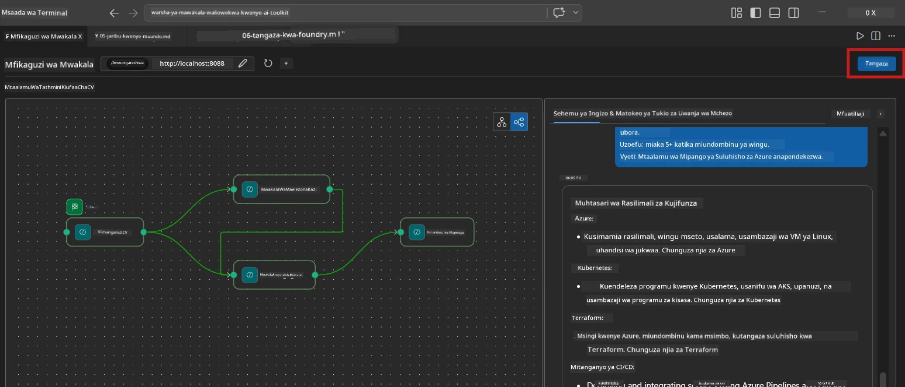
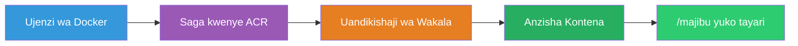
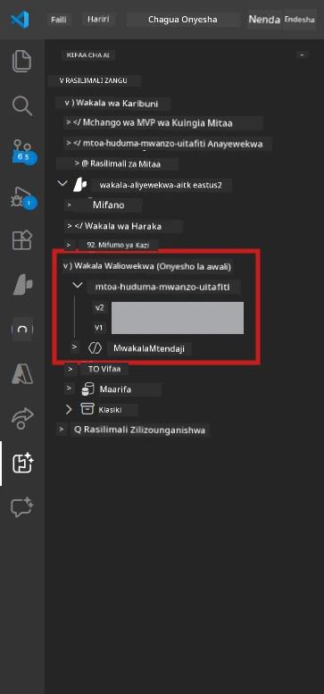

# Module 6 - Tuma kwa Huduma ya Mwakala wa Foundry

Katika moduli hii, unasambaza mchakato wako wa wakala wengi uliotestwa kienyeji kwa [Microsoft Foundry](https://learn.microsoft.com/azure/foundry/agents/concepts/hosted-agents) kama **Mwakala Aliyetangazwa**. Mchakato wa usambazaji unafanya picha ya kontena ya Docker, kuipeleka kwenye [Azure Container Registry (ACR)](https://learn.microsoft.com/azure/container-registry/container-registry-intro), na kuunda toleo la wakala aliyeandikishwa katika [Foundry Agent Service](https://learn.microsoft.com/azure/foundry/agents/how-to/publish-agent).

> **Tofauti kuu na Maabara 01:** Mchakato wa usambazaji ni sawa. Foundry hutumia mchakato wako wa wakala wengi kama wakala mmoja aliyepangishwa - ugumu uko ndani ya kontena, lakini eneo la usambazaji ni sawa `/responses` endpoint.

---

## Ukaguzi wa Mahitaji Kabla ya Usambazaji

Kabla ya kusambaza, hakikisha kila kipengele kilicho hapa chini:

1. **Wakala anapita vipimo vya mtihani wa kuanzisha kienyeji:**
   - Umehitimu vipimo vyote 3 katika [Moduli 5](05-test-locally.md) na mchakato ulizalisha matokeo kamili yenye kadi za nyufa na URL za Microsoft Learn.

2. **Una jukumu la [Azure AI User](https://learn.microsoft.com/azure/foundry/concepts/rbac-foundry):**
   - Limepeanwa katika [Maabara 01, Moduli 2](../../lab01-single-agent/docs/02-create-foundry-project.md). Thibitisha:
   - [Azure Portal](https://portal.azure.com) → rasilimali yako ya mradi wa Foundry → **Udhibiti wa ufikiaji (IAM)** → **Utekelezaji wa majukumu** → hakikisha **[Azure AI User](https://aka.ms/foundry-ext-project-role)** iko kwenye orodha ya akaunti yako.

3. **Umeingia kwenye Azure kupitia VS Code:**
   - Angalia ikoni ya Akaunti chini kushoto ya VS Code. Jina la akaunti yako linapaswa kuonekana.

4. **`agent.yaml` ina thamani sahihi:**
   - Fungua `PersonalCareerCopilot/agent.yaml` na hakikisha:
     ```yaml
     environment_variables:
       - name: PROJECT_ENDPOINT
         value: ${PROJECT_ENDPOINT}
       - name: MODEL_DEPLOYMENT_NAME
         value: ${MODEL_DEPLOYMENT_NAME}
     ```
   - Hizi lazima ziendane na tofauti za mabadiliko ya mazingira anayozisoma `main.py` yako.

5. **`requirements.txt` ina toleo sahihi:**
   ```
   agent-framework-azure-ai==1.0.0rc3
   agent-framework-core==1.0.0rc3
   azure-ai-agentserver-agentframework==1.0.0b16
   azure-ai-agentserver-core==1.0.0b16
   debugpy
   agent-dev-cli --pre
   ```

---

## Hatua ya 1: Anzisha usambazaji

### Chaguo A: Sambaza kutoka kwa Mchakati wa Wakala (inapendekezwa)

Ikiwa wakala anafanya kazi kupitia F5 na Mchakati wa Wakala umefunguliwa:

1. Angalia **kona ya juu kulia** ya paneli ya Mchakati wa Wakala.
2. Bonyeza kitufe cha **Deploy** (ikoni ya wingu yenye mshale unaoelea juu ↑).
3. Maelekezo ya usambazaji yatafunguka.



### Chaguo B: Sambaza kutoka kwa Paleti ya Amri

1. Bonyeza `Ctrl+Shift+P` kufungua **Paleti ya Amri**.
2. Andika: **Microsoft Foundry: Deploy Hosted Agent** na uchague.
3. Maelekezo ya usambazaji yatafunguka.

---

## Hatua ya 2: Sanidi usambazaji

### 2.1 Chagua mradi lengwa

1. Menyu ya kunjuzi inaonyesha miradi yako ya Foundry.
2. Chagua mradi uliotumia katika warsha yote (mfano, `workshop-agents`).

### 2.2 Chagua faili la kontena la wakala

1. Utaombwa kuchagua sehemu ya kuingia ya wakala.
2. Nenda kwenye `workshop/lab02-multi-agent/PersonalCareerCopilot/` na chagua **`main.py`**.

### 2.3 Sanidi rasilimali

| Mfumo | Thamani Inayopendekezwa | Maelezo |
|---------|------------------|-------|
| **CPU** | `0.25` | Chaguo-msingi. Mchakato wa wakala wengi hauhitaji CPU zaidi kwa sababu simu za modeli zinatumia I/O |
| **Kumbukumbu** | `0.5Gi` | Chaguo-msingi. Ongeza hadi `1Gi` ikiwa utaongeza zana kubwa za usindikaji data |

---

## Hatua ya 3: Thibitisha na sambaza

1. Msaada wa usambazaji unaonyesha muhtasari wa usambazaji.
2. Pitia na bonyeza **Confirm and Deploy**.
3. Tazama maendeleo katika VS Code.

### Kinachotokea wakati wa usambazaji

Tazama paneli ya **Output** ya VS Code (chagua menyu ya "Microsoft Foundry"):


1. **Ujenzi wa Docker** - Huunda kontena kutoka `Dockerfile` yako:
   ```
   Step 1/6 : FROM python:3.14-slim
   Step 2/6 : WORKDIR /app
   ...
   Successfully built abc123def456
   ```

2. **Kusukuma Docker** - Husukuma picha kwenye ACR (dakika 1-3 kwa usambazaji wa kwanza).

3. **Usajili wa wakala** - Foundry huunda wakala aliyepangishwa ukitumia metadata ya `agent.yaml`. Jina la wakala ni `resume-job-fit-evaluator`.

4. **Kuanzisha kontena** - Kontena huanza kwenye miundombinu inayosimamiwa na Foundry na utambulisho unaosimamiwa na mfumo.

> **Usambazaji wa kwanza huwa polepole** (Docker husukuma safu zote). Usambazaji unaofuata hutumia tena safu zilizo kwenye kaunta na ni wa kasi zaidi.

### Vidokezo maalum vya wakala wengi

- **Wakala wote wanne wako ndani ya kontena moja.** Foundry inaona wakala mmoja tu aliyepangishwa. Mchoro wa WorkflowBuilder unaendeshwa ndani.
- **Simu za MCP hufanya kutoka nje.** Kontena inahitaji upatikanaji wa intaneti kufikia `https://learn.microsoft.com/api/mcp`. Miundombinu ya Foundry huwa nayo hii kwa mtindo wa chaguo-msingi.
- **[Utambulisho Uliosimamiwa](https://learn.microsoft.com/python/api/overview/azure/identity-readme#managed-identity-support).** Katika mazingira yaliyopangwa, `get_credential()` katika `main.py` hurudisha `ManagedIdentityCredential()` (kwa sababu `MSI_ENDPOINT` imewekwa). Hii ni moja kwa moja.

---

## Hatua ya 4: Thibitisha hali ya usambazaji

1. Fungua upau wa pembeni wa **Microsoft Foundry** (bonyeza ikoni ya Foundry katika Upau wa Shughuli).
2. Panua **Hosted Agents (Preview)** chini ya mradi wako.
3. Tafuta **resume-job-fit-evaluator** (au jina la wakala wako).
4. Bonyeza jina la wakala → panua matoleo (mfano, `v1`).
5. Bonyeza toleo → angalia **Maelezo ya Kontena** → **Hali**:



| Hali | Maana |
|--------|---------|
| **Imeanzishwa** / **Inaendelea** | Kontena inaendeshwa, wakala yuko tayari |
| **Inasubiri** | Kontena inaanza (subiri sekunde 30-60) |
| **Imeshindwa** | Kontena haikuanza (angalia kumbukumbu - angalia hapa chini) |

> **Kuanzisha wakala wengi huchukua muda mrefu** kuliko wakala mmoja kwa sababu kontena huunda matoleo 4 ya wakala wakati wa kuanzisha. "Inasubiri" kwa hadi dakika 2 ni kawaida.

---

## Makosa ya kawaida ya usambazaji na marekebisho

### Hitilafu 1: Uruhusu umekataliwa - `agents/write`

```
Error: lacks the required data action 
Microsoft.CognitiveServices/accounts/AIServices/agents/write
```

**Rekebisha:** Peana jukumu la **[Azure AI User](https://learn.microsoft.com/azure/foundry/concepts/rbac-foundry)** kwenye ngazi ya **mradi**. Angalia [Moduli 8 - Utatuzi wa matatizo](08-troubleshooting.md) kwa maelekezo ya hatua kwa hatua.

### Hitilafu 2: Docker haijaendeshwa

```
Error: Docker build failed / Cannot connect to Docker daemon
```

**Rekebisha:**
1. Anzisha Docker Desktop.
2. Subiri "Docker Desktop inafanya kazi".
3. Thibitisha: `docker info`
4. **Windows:** Hakikisha WSL 2 backend imewezeshwa katika mipangilio ya Docker Desktop.
5. Jaribu tena.

### Hitilafu 3: pip install inashindwa wakati wa ujenzi wa Docker

```
Error: Could not find a version that satisfies the requirement agent-dev-cli
```

**Rekebisha:** Bendera ya `--pre` katika `requirements.txt` inashughulikiwa tofauti katika Docker. Hakikisha `requirements.txt` yako ina:
```
agent-dev-cli --pre
```

Ikiwa Docker bado inashindwa, tengeneza `pip.conf` au pitia `--pre` kupitia hoja ya ujenzi. Angalia [Moduli 8](08-troubleshooting.md).

### Hitilafu 4: Zana ya MCP inashindwa kwenye wakala aliyeandikishwa

Kama Gap Analyzer imesitisha kutoa URL za Microsoft Learn baada ya usambazaji:

**Sababu:** Sera ya mtandao inaweza kuziba HTTPS inayotoka kutoka kontena.

**Rekebisha:**
1. Hii kawaida si tatizo na usanidi wa msingi wa Foundry.
2. Ikiwa inatokea, hakikisha mtandao wa mradi wa Foundry hauzuii HTTPS inayoelekea nje kwa NSG.
3. Zana ya MCP ina URL mbadala katika safu yake, hivyo wakala bado atazalisha matokeo (bila URL za moja kwa moja).

---

### Angalizo

- [ ] Amri ya usambazaji imetekelezwa bila makosa ndani ya VS Code
- [ ] Wakala anaonekana chini ya **Hosted Agents (Preview)** katika upau wa pembeni wa Foundry
- [ ] Jina la wakala ni `resume-job-fit-evaluator` (au jina ulichochagua)
- [ ] Hali ya kontena inaonyesha **Imeanzishwa** au **Inaendelea**
- [ ] (Kama makosa) Umetambua hitilafu, umeweka marekebisho, na kusambaza tena kwa mafanikio

---

**Iliyopita:** [05 - Test Locally](05-test-locally.md) · **Inayofuata:** [07 - Verify in Playground →](07-verify-in-playground.md)

---

<!-- CO-OP TRANSLATOR DISCLAIMER START -->
**Kaa ya Mwisho**:
Hati hii imetafsiriwa kwa kutumia huduma ya tafsiri ya AI [Co-op Translator](https://github.com/Azure/co-op-translator). Ingawa tunajitahidi kupata usahihi, tafadhali fahamu kwamba tafsiri za kiotomatiki zinaweza kuwa na makosa au upotoshaji. Hati ya asili katika lugha yake ya mama inapaswa kuzingatiwa kama chanzo cha mamlaka. Kwa taarifa muhimu, tafsiri ya mtaalamu wa binadamu inapendekezwa. Hatuwezi kuwajibika kwa uelewa usio sahihi au tafsiri mbaya zinazotokana na matumizi ya tafsiri hii.
<!-- CO-OP TRANSLATOR DISCLAIMER END -->