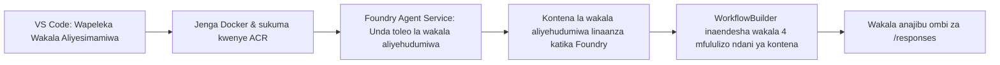
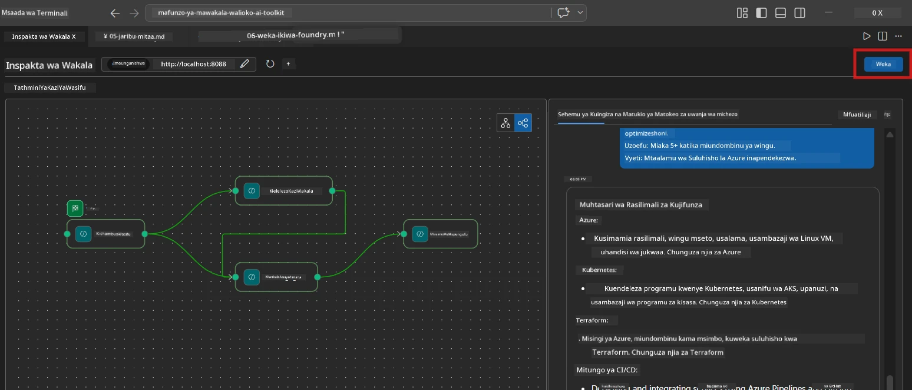
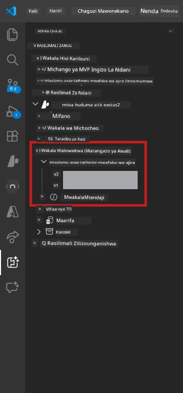

# Moduli 6 - Weka Huduma ya Wakala ya Foundry

⏱️ ~10 min

Katika moduli hii, unaweka kazi yako ya wakala wengi uliyojaribu ndani kwa ndani kwenye [Microsoft Foundry](https://learn.microsoft.com/azure/foundry/agents/concepts/hosted-agents) kama **Wakala Aliyehudhuriwa**. Mchakato wa kuweka unajenga picha ya kontena la Docker, inaichukua na kuipeleka kwenye [Azure Container Registry (ACR)](https://learn.microsoft.com/azure/container-registry/container-registry-intro), na kuunda toleo la wakala uliopokelewa katika [Foundry Agent Service](https://learn.microsoft.com/azure/foundry/agents/how-to/publish-agent).

> **Tofauti kuu na Kifundo 01:** Mchakato wa kuweka ni sawa. Foundry inaona kazi yako ya wakala wengi kama wakala mmoja aliyehudhuriwa - ugumu uko ndani ya kontena, lakini uso wa kuweka ni sawa kwenye njia `/responses`.

### Mfuatano wa kuweka


```mermaid
flowchart LR
    A[VS Code: Wapeleka Wakala Aliyesimamiwa] --> B[Jenga Docker & sukuma kwenye ACR]
    B --> C[Foundry Agent Service: Unda toleo la wakala aliyehudumiwa]
    C --> D[Kontena la wakala aliyehudumiwa linaanza katika Foundry]
    D --> E[WorkflowBuilder inaendesha wakala 4 mfululizo ndani ya kontena]
    E --> F[Wakala anajibu ombi za /responses]
```

---

## Kukagua mahitaji kabla ya kuweka

Kabla ya kuweka, hakiki kila kipengele kilicho chini:

1. **Wakala anapita vipimo vya ndani:**
   - Umefanya vipimo vitatu katika [Moduli 5](05-test-locally.md) na mchakato ulizalisha matokeo kamili na kadi za pengo na URL za Microsoft Learn.

2. **Una jukumu la [Mtumiaji wa Foundry](https://learn.microsoft.com/azure/foundry/concepts/rbac-foundry)** (kwa kuweka, unahitaji angalau **Msimamizi wa Mradi wa Foundry** kwa wigo wa mradi):

   > **Kumbuka:** Majukumu ya RBAC ya Foundry yamebadilishwa hivi karibuni - **Mtumiaji wa Foundry**, **Mmiliki wa Foundry**, na **Msimamizi wa Mradi wa Foundry** awali walijulikana kama Mtumiaji wa Azure AI, Mmiliki wa Azure AI, na Msimamizi wa Mradi wa Azure AI. Vitambulisho vya jukumu na ruhusa hazijabadilika.

   - Hakiki katika [Azure Portal](https://portal.azure.com) → rasilimali ya **mradi** wa Foundry → **Kudhibiti upatikanaji (IAM)** → **Uteuzi wa majukumu** → thibitisha **Mtumiaji wa Foundry** (au juu zaidi) yamo kwenye akaunti yako.

3. **Umeingia Azure kwenye VS Code:**
   - Angalia ikoni ya Akaunti chini kushoto ya VS Code. Jina la akaunti yako linapaswa kuonekana.

4. **`agent.yaml` ina maadili sahihi:**
   - Fungua `PersonalCareerCopilot/agent.yaml` na hakiki:
     ```yaml
     environment_variables:
       - name: AZURE_AI_MODEL_DEPLOYMENT_NAME
         value: ${AZURE_AI_MODEL_DEPLOYMENT_NAME}
     ```
   - `FOUNDRY_PROJECT_ENDPOINT` haipo hapa - Foundry inaingiza wakati wa utekelezaji. Ni `AZURE_AI_MODEL_DEPLOYMENT_NAME` tu inahitajika kutangazwa.

5. **`requirements.txt` ina toleo sahihi:**
   ```
   agent-framework-foundry
   agent-framework-foundry-hosting
   mcp<2,>=1.24.0
   debugpy
   ```

---

## Hatua 1: Anza kuweka

### Chaguo A: Weka kutoka kwa Mpangilio Wakala (inapendekezwa)

Ikiwa wakala anaendesha kwa F5 na Mpangilio Wakala umefunguliwa:

1. Angalia **kona ya juu kulia** ya paneli ya Mpangilio Wakala.
2. Bonyeza kitufe cha **Weka** (ikoni ya wingu na mshale wa juu ↑).
3. Mtaalam wa kuweka utafunguka.



### Chaguo B: Weka kutoka kwa Orodha ya Amri

1. Bonyeza `Ctrl+Shift+P` kufungua **Orodha ya Amri**.
2. Andika: **Foundry Toolkit: Deploy Hosted Agent** na ichague.
3. Mtaalam wa kuweka utafunguka.

---

## Hatua 2: Sanidi kuweka

### 2.1 Chagua mradi lengwa

1. Dropdown inaonyesha miradi yako ya Foundry.
2. Chagua mradi uliotumia katika warsha yote (mfano, `workshop-agents`).

### 2.2 Chagua faili la agenti la kontena

1. Utaombwa kuchagua sehemu ya kuanzia ya wakala.
2. Nenda kwenda `workshop/lab02-multi-agent/PersonalCareerCopilot/` na chagua **`main.py`**.

### 2.3 Sanidi rasilimali

| Kusanidi | Thamani inayopendekezwa | Maelezo |
|---------|------------------|-------|
| **Njia ya Kuweka** | **Kontena** (inapendekezwa) au **Msimbo** | Kontena hujenga picha ya Docker; Msimbo hupeleka chanzo kama ZIP (mtangulizi) |
| **Kumbukumbu ya Kontena** | **Kumbukumbu ya ACR ya Chaguo** | Foundry huunda na kusimamia moja kwa niaba yako |
| **CPU** | `0.25` | Chaguo-msingi. Kazi nyingi za wakala hazihitaji CPU zaidi kwa sababu simu za modeli zinaweza kufanywa kwa I/O|
| **Kumbukumbu** | `0.5Gi` | Chaguo-msingi. Ongeza hadi `1Gi` ikiwa utaongeza zana kubwa za usindikaji data |

---

## Hatua 3: Thibitisha na weka

1. Mtaalam anaonyesha muhtasari wa kuweka.
2. Pitia na bonyeza **Thibitisha na Weka**.
3. Tazama maendeleo katika VS Code.

### Kinachotokea wakati wa kuweka

Tazama paneli ya **Output** ya VS Code (chagua dropdown "Microsoft Foundry"):

1. **Jengo la Docker** - Huunda kontena kutoka kwa `Dockerfile` yako
   ```
   Step 1/6 : FROM python:3.12-slim
   Step 2/6 : WORKDIR /app
   ...
   Successfully built abc123def456
   ```

2. **Push ya Docker** - Huchukua picha na kuipeleka kwenye ACR (dakika 1-3 mara ya kwanza kuweka).

3. **Usajili wa Wakala** - Foundry huunda wakala aliyehudhuriwa kwa kutumia metadata ya `agent.yaml`. Jina la wakala ni `resume-job-fit-evaluator`.

4. **Anza kontena** - Kontena huanza katika miundombinu inayoendeshwa na Foundry na kitambulisho kinachosimamiwa na mfumo.

> **Kuweka kwa mara ya kwanza ni polepole** (Docker hupeleka tabaka zote). Kuweka kwa mara nyingine hutumia tabaka zilizohifadhiwa na ni haraka zaidi.

### Vidokezo maalum kwa wakala wengi

- **Wakala wote wanne wako ndani ya kontena moja.** Foundry inaona wakala mmoja tu aliyehudhuriwa. Grafu ya WorkflowBuilder inaendeshwa ndani.
- **MCP hufanya simu za kwenda nje.** Kontena inahitaji ufikiaji wa intaneti kufikia `https://learn.microsoft.com/api/mcp`. Miundombinu inayosimamiwa ya Foundry hutoa hivi kama kawaida.
- **[Kitambulisho Kinachosimamiwa](https://learn.microsoft.com/azure/foundry/agents/concepts/agent-identity).** Foundry huunda kiotomatiki **kitambulisho cha Entra kwa kila wakala aliyehudhuriwa** wakati wa kuweka. Katika mazingira ya kuandikika, `DefaultAzureCredential` hutatua kwa kiotomatiki kitambulisho hiki cha wakala - hakuna usanidi wa mkono wa kitambulisho kinachosimamiwa unahitajika.

---

## Hatua 4: Thibitisha hali ya kuweka

1. Fungua kando ya **Microsoft Foundry** (bonyeza ikoni ya Foundry katika Mbao ya Shughuli).
2. Panua **Wakala Aliyehudhuriwa (Preview)** chini ya mradi wako.
3. Tafuta **resume-job-fit-evaluator** (au jina la wakala wako).
4. Bonyeza jina la wakala → panua matoleo (mfano, `v1`).
5. Bonyeza toleo → angalia **Maelezo ya Kontena** → **Hali**:



| Hali | Maana |
|--------|---------|
| **active** | Wakala anaendesha na yuko tayari kupokea maombi |
| **creating** | Kontena inaanza (subiri sekunde 30–60) |
| **failed** | Kontena haikuweza kuanza (angalia logi - angalia chini) |

> **Kumbuka:** Kando ya VS Code inaweza kuonyesha lebo kama "Running" au "Started" wakati hali halisi ya API ni `active`/`creating`. Zaidi ya hayo zina maana ile ile.

> **Kuanza kwa wakala wengi kunachukua muda mrefu** kuliko wakala mmoja kwa sababu kontena huunda mfano 4 za wakala wakati wa kuanzisha. `creating` kwa hadi dakika 2 ni kawaida.

---

## Makosa ya kawaida ya kuweka na marekebisho

### Hitilafu 1: Ruhusa imekataa - `agents/write`

```
Error: lacks the required data action 
Microsoft.CognitiveServices/accounts/AIServices/agents/write
```

**Rekebisha:** Mpe jukumu la **[Mtumiaji wa Foundry](https://learn.microsoft.com/azure/foundry/concepts/rbac-foundry)** (awali **Mtumiaji wa Azure AI**) katika kiwango cha **mradi**. Angalia [Moduli 8 - Kutatua Matatizo](08-troubleshooting.md) kwa maelekezo ya hatua kwa hatua.

### Hitilafu 2: Docker haianzi

```
Error: Docker build failed / Cannot connect to Docker daemon
```

**Rekebisha:**
1. Anzisha Docker Desktop.
2. Subiri "Docker Desktop inaendesha".
3. Hakiki: `docker info`
4. **Windows:** Hakikisha WSL 2 backend imewezeshwa katika mipangilio ya Docker Desktop.
5. Jaribu tena.

### Hitilafu 3: pip install inashindwa wakati wa ujenzi wa Docker

```
Error: Could not find a version that satisfies the requirement agent-framework-foundry
```

**Rekebisha:** Hakiki `requirements.txt` inalingana:
```
agent-framework-foundry
agent-framework-foundry-hosting
mcp<2,>=1.24.0
debugpy
```

Ikiwa ujenzi bado unashindwa, mtandao wa Docker unaweza kuzuia PyPI. Angalia mipangilio ya wakala (proxy) kwa `docker info`.

### Hitilafu 4: Zana ya MCP inashindwa katika wakala aliyehudhuriwa

Ikiwa Gap Analyzer inaacha kutoa URL za Microsoft Learn baada ya kuweka:

**Sababu kuu:** Sera ya mtandao inaweza kuziba HTTPS inayotoka kutoka kontena.

**Rekebisha:**
1. Hii kwa kawaida si tatizo katika usanidi wa kawaida wa Foundry.
2. Ikiwa itatokea, hakiki ikiwa mtandao wa foundry wa mradi una NSG inayozuia HTTPS inayotoka.
3. Zana ya MCP ina URL za akiba zilizojengwa, hivyo wakala bado atazalisha matokeo (bila URL za moja kwa moja).

---

### Kiwovu cha ukaguzi

- [ ] Amri ya kuweka imetekelezwa bila makosa katika VS Code
- [ ] Wakala anaonekana chini ya **Wakala Aliyehudhuliwa (Preview)** katika kidirisha cha Foundry
- [ ] Jina la wakala ni `resume-job-fit-evaluator` (au jina lako ulilochagua)
- [ ] Hali ya kontena inaonyesha **Imeanza** au **Inaendesha**
- [ ] (Kama kuna makosa) Umetambua hitilafu, umefanya marekebisho, na umeweka tena kwa mafanikio

---

**Iliyopita:** [05 - Jaribu Ndani](05-test-locally.md) · **Ifuatayo:** [07 - Thibitisha katika Uwanja wa Michezo →](07-verify-in-playground.md)

---

<!-- CO-OP TRANSLATOR DISCLAIMER START -->
**Kionyozo**:
Hati hii imetafsiriwa kwa kutumia huduma ya tafsiri ya AI [Co-op Translator](https://github.com/Azure/co-op-translator). Ingawa tunajitahidi kupata usahihi, tafadhali fahamu kwamba tafsiri za kiotomatiki zinaweza kuwa na makosa au upungufu wa usahihi. Hati ya asili katika lugha yake halisi inapaswa kuchukuliwa kama chanzo cha mamlaka. Kwa taarifa muhimu, tafsiri ya kitaalamu inayofanywa na binadamu inapendekezwa. Hatutojibu kwa kuelewa vibaya au tafsiri potofu zinazotokea kutokana na matumizi ya tafsiri hii.
<!-- CO-OP TRANSLATOR DISCLAIMER END -->