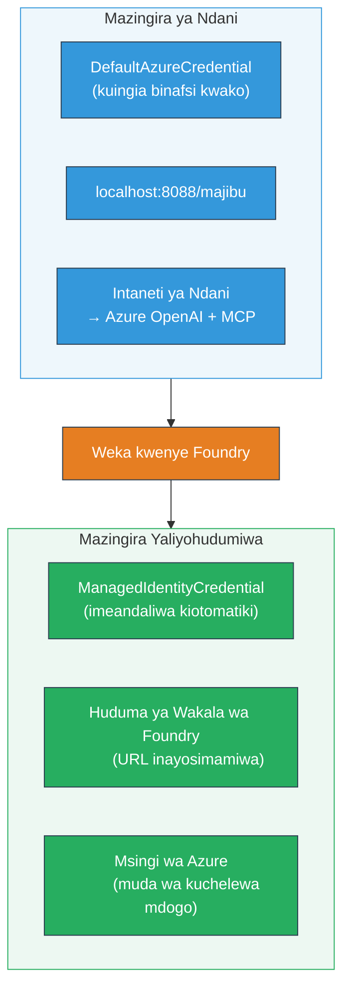

# Moduli 7 - Thibitisha kwenye Playground

Katika moduli hii, unajaribu mtiririko wako wa kazi wa wakala wengi uliowekwa katika **VS Code** na **[Foundry Portal](https://ai.azure.com)**, ukithibitisha wakala anavyotenda sawa na majaribio ya ndani.

---

## Kwa nini kuthibitisha baada ya kuweka?

Mtiririko wako wa wakala wengi ulikimbia kikamilifu kwa ndani, kwa hiyo kwa nini ujaribu tena? Mazingira yaliyohifadhiwa yanatofautiana kwa njia kadhaa:


| Tofauti | Kwenye injini ya mteja | Iliyohifadhiwa |
|-----------|-------|--------|
| **Utambulisho** | [`DefaultAzureCredential`](https://learn.microsoft.com/azure/developer/python/sdk/authentication/credential-chains#defaultazurecredential-overview) (kuingia kwa binafsi) | [`ManagedIdentityCredential`](https://learn.microsoft.com/python/api/overview/azure/identity-readme#managed-identity-support) (inafungwa kiotomatiki) |
| **Mwisho wa huduma** | `http://localhost:8088/responses` | [Foundry Agent Service](https://learn.microsoft.com/azure/foundry/agents/concepts/hosted-agents) mwishio (URL inayosimamiwa) |
| **Mtandao** | Kompyuta ya mteja → Azure OpenAI + MCP kutoka nje | Sambamba ya Azure (kupungua kwa kuchelewa kati ya huduma) |
| **Muunganisho wa MCP** | Mtandao wa ndani → `learn.microsoft.com/api/mcp` | Kontena kutoka nje → `learn.microsoft.com/api/mcp` |

Ikiwa mabadiliko yoyote ya mazingira yamesetwa vibaya, RBAC inatofautiana, au MCP kutoka nje inazuiwa, utaipata hapa.

---

## Chaguo A: Jaribu katika VS Code Playground (inapendekezwa kwanza)

**[Upanuzi wa Foundry](https://marketplace.visualstudio.com/items?itemName=TeamsDevApp.vscode-ai-foundry)** una kikoa cha Mchezo kilichojumuishwa kinachokuruhusu kuzungumza na wakala wako aliyewekwa bila kuacha VS Code.

### Hatua 1: Nenda kwa wakala wako aliyehifadhiwa

1. Bonyeza ikoni ya **Microsoft Foundry** kwenye **Activity Bar** ya VS Code (sidebar ya kushoto) kufungua paneli ya Foundry.
2. Panua mradi uliounganishwa (mfano, `workshop-agents`).
3. Panua **Hosted Agents (Preview)**.
4. Unapaswa kuona jina la wakala wako (mfano, `resume-job-fit-evaluator`).

### Hatua 2: Chagua toleo

1. Bonyeza jina la wakala kupanua matoleo yake.
2. Bonyeza toleo uliloweka (mfano, `v1`).
3. Paneli ya maelezo itaonekana ikionyesha Maelezo ya Kontena.
4. Thibitisha hali ni **Started** au **Running**.

### Hatua 3: Fungua Playground

1. Katika paneli ya maelezo, bonyeza kitufe cha **Playground** (au bonyeza kulia toleo → **Open in Playground**).
2. Kiolesura cha mazungumzo gafa katika kichupo cha VS Code.

### Hatua 4: Endesha majaribio yako ya awali

Tumia majaribio yale yale 3 kutoka [Moduli 5](05-test-locally.md). Andika kila ujumbe kwenye kisanduku cha ingizo cha Playground na bonyeza **Send** (au **Enter**).

#### Jaribio 1 - Wasifu kamili + JD (mzunguko wa kawaida)

Bandika mwito wa wasifu kamili na JD kutoka Moduli 5, Jaribio 1 (Jane Doe + Mhandisi Mkubwa wa Wingu kwenye Contoso Ltd).

**Kinachotarajiwa:**
- Alama ya kufaa na hesabu ya mgawanyo (kwa kipimo cha pointi 100)
- Sehemu ya Ujuzi Uliolingana
- Sehemu ya Ujuzi Unaokosekana
- **Kadi moja ya pengo kwa ujuzi mmoja unaokosekana** yenye URL za Microsoft Learn
- Ramani ya kujifunza na ratiba

#### Jaribio 2 - Jaribio fupi la haraka (kiingilio kidogo)

```
RESUME: 3 years Python developer, knows Django and PostgreSQL, no cloud experience.

JOB: Cloud DevOps Engineer requiring AWS, Kubernetes, Terraform, CI/CD. 5 years needed.
```

**Kinachotarajiwa:**
- Alama ya kufaa chini (< 40)
- Tathmini ya uaminifu na njia ya kujifunza kwa hatua
- Kadi za pengo nyingi (AWS, Kubernetes, Terraform, CI/CD, pengo la uzoefu)

#### Jaribio 3 - Mwanafunzi anayeendana vizuri

```
RESUME:
10 years Azure Cloud Architect. AZ-305 certified. Expert in AKS, Terraform, Azure DevOps, 
Azure Functions, Helm, Prometheus, Grafana, Python, Go. Led platform team of 8.

JOB:
Senior Cloud Engineer. Required: AKS, Terraform, Azure DevOps, Python. Preferred: Helm, Go.
5+ years experience. AZ-305 preferred.
```

**Kinachotarajiwa:**
- Alama ya kufaa juu (≥ 80)
- Kuzingatia utayari wa mahojiano na kukamilisha maandalizi
- Kadi chache au hakuna za pengo
- Ratiba fupi inayolenga maandalizi

### Hatua 5: Linganisha na matokeo ya ndani

Fungua maelezo yako au kichupo cha kivinjari kutoka Moduli 5 ambako ulihifadhi majibu ya ndani. Kwa kila jaribio:

- Je, jibu lina **muundo uleule** (alama ya kufaa, kadi za pengo, ramani)?
- Je, linazingatia **kanuni za alama sawa** (mgawanyo wa pointi 100)?
- Je, **URL za Microsoft Learn** bado zipo kwenye kadi za pengo?
- Je, kuna **kadi moja ya pengo kwa kila ujuzi unaokosekana** (haijakatwa)?

> **Tofauti ndogo za maneno ni kawaida** - mfano ni sio mpangilio uhakika. Lenga muundo, uthabiti wa alama, na matumizi ya zana za MCP.

---

## Chaguo B: Jaribu katika Foundry Portal

**[Foundry Portal](https://ai.azure.com)** hutoa eneo la michezo msingi wa wavuti linalofaa kushirikiana na wenzako au washikadau.

### Hatua 1: Fungua Foundry Portal

1. Fungua kivinjari chako na nenda [https://ai.azure.com](https://ai.azure.com).
2. Ingia kwa akaunti ile ile ya Azure uliyokuwa ukitumia katika warsha nzima.

### Hatua 2: Nenda kwenye mradi wako

1. Ukianzia ukurasa wa nyumbani, angalia **Miradi ya Hivi Karibuni** upande wa kushoto.
2. Bonyeza jina la mradi wako (mfano, `workshop-agents`).
3. Ikiwa haionekani, bonyeza **Miradi Yote** na tafuta.

### Hatua 3: Tafuta wakala wako aliyeweka

1. Katika urambazaji wa mradi upande wa kushoto, bonyeza **Build** → **Agents** (au tafuta sehemu ya **Agents**).
2. Unapaswa kuona orodha ya mawakala. Tafuta wakala wako aliyeweka (mfano, `resume-job-fit-evaluator`).
3. Bonyeza jina la wakala kufungua ukurasa wa maelezo.

### Hatua 4: Fungua Playground

1. Kwenye ukurasa wa maelezo ya wakala, angalia zana ya juu kabisa.
2. Bonyeza **Open in playground** (au **Try in playground**).
3. Kiolesura cha mazungumzo kinafunguka.

### Hatua 5: Endesha majaribio yale yale ya awali

Rudia majaribio yote 3 kutoka sehemu ya VS Code Playground hapo juu. Linganisha kila jibu na matokeo ya ndani (Moduli 5) na matokeo ya VS Code Playground (Chaguo A hapo juu).

---

## Uthibitishaji mahususi wa wakala wengi

Zaidi ya usahihi wa msingi, thibitisha tabia hizi za wakala wengi:

### Uendeshaji wa zana ya MCP

| Angalia | Jinsi ya kuthibitisha | Hali ya kufaulu |
|-------|---------------|----------------|
| Mito ya MCP zinafanikiwa | Kadi za pengo zina URLs `learn.microsoft.com` | URL halisi, si ujumbe wa kubadilisha |
| Miito mingi ya MCP | Kila pengo la Kipaumbele Juu/Wa kati lina rasilimali | Sio tu kadi ya pengo la kwanza |
| Kizigeu cha MCP kinafanya kazi | Ikiwa URL hazipo, angalia maandishi ya kuchukua nafasi | Wakala bado anatengeneza kadi za pengo (na au bila URLs) |

### Uratibu wa wakala

| Angalia | Jinsi ya kuthibitisha | Hali ya kufaulu |
|-------|---------------|----------------|
| Wakala wote 4 walikimbia | Matokeo yana alama ya kufaa NA kadi za pengo | Alama hutokana na MatchingAgent, kadi kutoka GapAnalyzer |
| Upanuzi sambamba | Muda wa majibu ni wa maana (< 2 min) | Ikiwa > 3 min, utekelezaji sambamba hauendi vizuri |
| Uadilifu wa mtiririko wa data | Kadi za pengo zinarejelea ujuzi kutoka ripoti ya kulinganisha | Hakuna ujuzi uliobuniwa usio katika JD |

---

## Kigezo cha uthibitisho

Tumia kigezo hiki kutathmini mwenendo wa mtiririko wako wa wakala wengi ulihifadhiwa:

| # | Vigezo | Hali ya kufaulu | Imefaulu? |
|---|----------|---------------|-------|
| 1 | **Usahihi wa utendaji** | Wakala anajibu wasifu + JD na alama ya kufaa na uchambuzi wa pengo | |
| 2 | **Uthabiti wa alama** | Alama ya kufaa inatumia kipimo cha pointi 100 na hesabu ya mgawanyo | |
| 3 | **Ukamilifu wa kadi za pengo** | Kadi moja kwa kila ujuzi uliokosekana (hali ya ukataji au mchanganyiko) | |
| 4 | **Ushirikiano wa zana ya MCP** | Kadi za pengo zina URL halisi za Microsoft Learn | |
| 5 | **Uthabiti wa muundo** | Muundo wa matokeo unalingana kati ya ndani na utekelezaji ulihifadhiwa | |
| 6 | **Muda wa majibu** | Wakala aliyehifadhiwa anajibu ndani ya dakika 2 kwa tathmini kamili | |
| 7 | **Hakuna makosa** | Hakuna makosa ya HTTP 500, muda wa kusubiri au majibu tupu | |

> "Faulu" inamaanisha vigezo vyote 7 vinatimizwa kwa majaribio yote 3 kwa angalau playground moja (VS Code au Portal).

---

## Matatizo ya playground

| Dalili | Sababu inayoonekana | Suluhisho |
|---------|-------------|-----|
| Playground haiwezi kupakia | Hali ya kontena sio "Started" | Rudi kwenye [Moduli 6](06-deploy-to-foundry.md), thibitisha hali ya uwekaji. Subiri ikiwa "Pending" |
| Wakala anarejesha jibu tupu | Jina la kuweka mfano halilingani | Angalia `agent.yaml` → `environment_variables` → `MODEL_DEPLOYMENT_NAME` inalingana na mfano uliowekwa |
| Wakala anarejesha ujumbe wa kosa | [RBAC](https://learn.microsoft.com/azure/foundry/concepts/rbac-foundry) ruhusa haipo | Peana **[Azure AI User](https://aka.ms/foundry-ext-project-role)** kwa muktadha wa mradi |
| Hakuna URL za Microsoft Learn kwenye kadi za pengo | MCP kutoka nje imezuiwa au seva ya MCP haipatikani | Angalia kama kontena linaweza kufikia `learn.microsoft.com`. Tazama [Moduli 8](08-troubleshooting.md) |
| Kadi moja tu ya pengo (imekatwa) | Maelekezo ya GapAnalyzer hayajumuishi kipengele cha "CRITICAL" | Angalia [Moduli 3, Hatua 2.4](03-configure-agents.md) |
| Alama ya kufaa ni tofauti sana na ya ndani | Mfano tofauti au maelekezo yaliyowekwa | Linganisha env vars za `agent.yaml` na `.env` ya ndani. Weka upya ikiwa inahitajika |
| "Agent not found" kwenye Portal | Uwekaji bado haujakamilika au umefaulu | Subiri dakika 2, rudia ukurasa. Ikiwa bado hapo, weka upya kutoka [Moduli 6](06-deploy-to-foundry.md) |

---

### Alama ya ukaguzi

- [ ] Nimejaribu wakala katika VS Code Playground - majaribio yote 3 ya awali yamefaulu
- [ ] Nimejaribu wakala katika [Foundry Portal](https://ai.azure.com) Playground - majaribio yote 3 ya awali yamefaulu
- [ ] Majibu yana muundo unaolingana na majaribio ya ndani (alama ya kufaa, kadi za pengo, ramani)
- [ ] URL za Microsoft Learn zipo kwenye kadi za pengo (zanaa ya MCP inafanya kazi katika mazingira yaliyohifadhiwa)
- [ ] Kadi moja ya pengo kwa kila ujuzi unaokosekana (hakuna ukataji)
- [ ] Hakuna makosa au muda wa kusubiri wakati wa majaribio
- [ ] Nimekamilisha kigezo cha uthibitisho (vigezo vyote 7 vimefaulu)

---

**Ya awali:** [06 - Weka kwenye Foundry](06-deploy-to-foundry.md) · **Ifuatayo:** [08 - Matatizo →](08-troubleshooting.md)

---

<!-- CO-OP TRANSLATOR DISCLAIMER START -->
**Kielelezo cha Majibu**:
Hati hii imetafsiriwa kwa kutumia huduma ya tafsiri ya AI [Co-op Translator](https://github.com/Azure/co-op-translator). Ingawa tunajitahidi kwa usahihi, tafadhali fahamu kuwa tafsiri za kiotomatiki zinaweza kuwa na makosa au upungufu wa usahihi. Hati ya asili katika lugha yake ya asili inapaswa kuchukuliwa kama chanzo cha mamlaka. Kwa habari muhimu, tafsiri ya kitaalamu ya binadamu inashauriwa. Hatutawajibika kwa kutoelewana au tafsiri mbaya zinazotokana na matumizi ya tafsiri hii.
<!-- CO-OP TRANSLATOR DISCLAIMER END -->