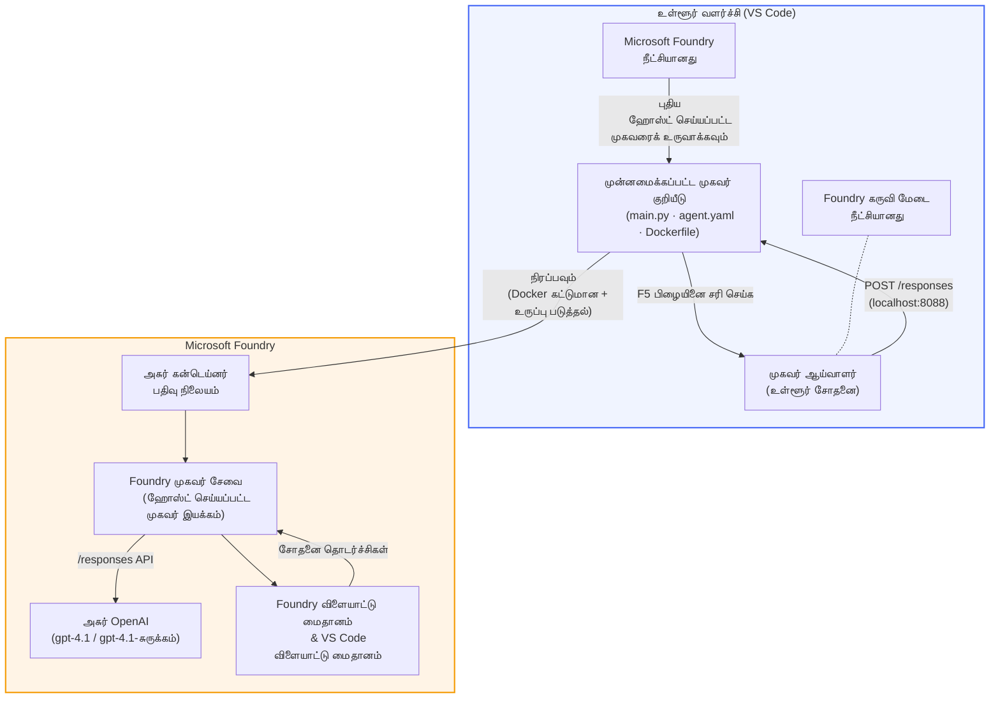

# Foundry Toolkit + Foundry Hosted Agents வேலைப்பாடகம்

[](https://www.python.org/)
[](https://github.com/microsoft/agents)
[](https://learn.microsoft.com/azure/ai-foundry/agents/concepts/hosted-agents/)
[](https://ai.azure.com/)
[](https://learn.microsoft.com/azure/ai-services/openai/)
[](https://learn.microsoft.com/cli/azure/install-azure-cli)
[](https://learn.microsoft.com/azure/developer/azure-developer-cli/install-azd)
[](https://www.docker.com/)
[](https://marketplace.visualstudio.com/items?itemName=ms-windows-ai-studio.windows-ai-studio)
[](LICENSE)

**Microsoft Foundry Agent Service**க்கு **Hosted Agents** ஆக AI முகவர்கள் உருவாக்கி, சோதித்து, பராமரியுங்கள் - முழுவதும் VS Code ஐப் பயன்படுத்தி **Microsoft Foundry நீட்சியும்** மற்றும் **Foundry Toolkit**இலும்.

> **Hosted Agents இல் தற்போது முன்னோட்டமாக உள்ளது.** ஆதரவு பெறும் பிராந்தியங்கள் குறைந்தவை - [பிராந்திய கிடைக்கும் நிலை](https://learn.microsoft.com/azure/foundry/agents/concepts/hosted-agents#region-availability) பார்க்கவும்.

> ஒவ்வொரு தொழிற்சாலையிலும் உள்ள `agent/` கோப்புறை Foundry நீட்சியால் **தானாக உருவாக்கப்படுகிறது** - பின்னர் நீங்கள் குறியீட்டை தனிப்பயனாக்கி, உள்ளகத்தில் சோதித்து, பராமரிக்கலாம்.

### 🌐 பல மொழிச் சாதனைகள்

#### GitHub Action மூலம் ஆதரவு (தானியங்கி மற்றும் எப்போதும் புதுப்பிக்கப்பட்டது)

<!-- CO-OP TRANSLATOR LANGUAGES TABLE START -->
[Arabic](../ar/README.md) | [Bengali](../bn/README.md) | [Bulgarian](../bg/README.md) | [Burmese (Myanmar)](../my/README.md) | [Chinese (Simplified)](../zh-CN/README.md) | [Chinese (Traditional, Hong Kong)](../zh-HK/README.md) | [Chinese (Traditional, Macau)](../zh-MO/README.md) | [Chinese (Traditional, Taiwan)](../zh-TW/README.md) | [Croatian](../hr/README.md) | [Czech](../cs/README.md) | [Danish](../da/README.md) | [Dutch](../nl/README.md) | [Estonian](../et/README.md) | [Finnish](../fi/README.md) | [French](../fr/README.md) | [German](../de/README.md) | [Greek](../el/README.md) | [Hebrew](../he/README.md) | [Hindi](../hi/README.md) | [Hungarian](../hu/README.md) | [Indonesian](../id/README.md) | [Italian](../it/README.md) | [Japanese](../ja/README.md) | [Kannada](../kn/README.md) | [Khmer](../km/README.md) | [Korean](../ko/README.md) | [Lithuanian](../lt/README.md) | [Malay](../ms/README.md) | [Malayalam](../ml/README.md) | [Marathi](../mr/README.md) | [Nepali](../ne/README.md) | [Nigerian Pidgin](../pcm/README.md) | [Norwegian](../no/README.md) | [Persian (Farsi)](../fa/README.md) | [Polish](../pl/README.md) | [Portuguese (Brazil)](../pt-BR/README.md) | [Portuguese (Portugal)](../pt-PT/README.md) | [Punjabi (Gurmukhi)](../pa/README.md) | [Romanian](../ro/README.md) | [Russian](../ru/README.md) | [Serbian (Cyrillic)](../sr/README.md) | [Slovak](../sk/README.md) | [Slovenian](../sl/README.md) | [Spanish](../es/README.md) | [Swahili](../sw/README.md) | [Swedish](../sv/README.md) | [Tagalog (Filipino)](../tl/README.md) | [Tamil](./README.md) | [Telugu](../te/README.md) | [Thai](../th/README.md) | [Turkish](../tr/README.md) | [Ukrainian](../uk/README.md) | [Urdu](../ur/README.md) | [Vietnamese](../vi/README.md)

> **உள்ளகத்தில் கிளோன் செய்வதை விரும்புகிறீர்களா?**
>
> இந்த களஞ்சியம் 50+ மொழி மொழிபெயர்ப்புகளை கொண்டுள்ளது, இது பதிவிறக்க அளவை பெரிதாக்குகிறது. மொழிபெயர்ப்புகள் இல்லாமல் கிளோன் செய்ய sparse checkout ஐப் பயன்படுத்தவும்:
>
> **Bash / macOS / Linux:**
> ```bash
> git clone --filter=blob:none --sparse https://github.com/microsoft-foundry/Foundry_Toolkit_for_VSCode_Lab.git
> cd Foundry_Toolkit_for_VSCode_Lab
> git sparse-checkout set --no-cone '/*' '!translations' '!translated_images'
> ```
>
> **CMD (Windows):**
> ```cmd
> git clone --filter=blob:none --sparse https://github.com/microsoft-foundry/Foundry_Toolkit_for_VSCode_Lab.git
> cd Foundry_Toolkit_for_VSCode_Lab
> git sparse-checkout set --no-cone "/*" "!translations" "!translated_images"
> ```
>
> இது பாடத்துக்கு தேவையான அனைத்தையும் வேகமாக உங்களுக்கு தரும்.
<!-- CO-OP TRANSLATOR LANGUAGES TABLE END -->

---

## கட்டமைப்பு


**வினைகளை:** Foundry நீட்சியால் முகவர் உருவாக்கப்படுகிறது → நீங்கள் குறியீடு மற்றும் வழிமுறைகளை தனிப்பயனாக்குகிறீர்கள் → Agent Inspector உடன் உள்ளகத்தில் சோதிக்கிறீர்கள் → Foundryக்கு (Docker படம் ACRக்கு அனுப்பப்படுகிறது) பராமரிக்கிறீர்கள் → கலைத்தளத்தில் உறுதி செய்கிறீர்கள்.

---

## நீங்கள் என்ன கட்டுவீர்கள்

| தொழிற்சாலை | விளக்கம் | நிலை |
|-----|-------------|--------|
| **தொழிற்சாலை 01 - தனி முகவர்** | **"Explain Like I'm an Executive" Agent**ஐ கட்டி, உள்ளகத்தில் சோதித்து, Foundryக்கு பராமரிக்கவும் | ✅ கிடைக்கிறது |
| **தொழிற்சாலை 02 - பல முகவர் வேலைபாடு** | **"Resume → Job Fit Evaluator"** - 4 முகவர்கள் இணைந்து ரெஜ்யூமி பொருந்துதலை மதிப்பீடு செய்து கற்றல் வழிமுறையை உருவாக்குகிறார்கள் | ✅ கிடைக்கிறது |

---

## செயலாளரை சந்திக்கவும்

இந்த வேலைப்பாடகத்தில் நீங்கள் **"Explain Like I'm an Executive" Agent** ஐ கட்டுவீர்கள் - ஒரு AI முகவர், அது சிக்கலான தொழில்நுட்ப சொற்களை எடுத்து அமைதியான, வேலைமனை அறிக்கை சுருக்கங்களாக மாற்றும். ஏனெனில் நேர்மையாக பேசும்போது, C-suite யில் யாரும் "v3.2 இல் அறிமுகப்படுத்திய சமய அழைப்புகளால் thread pool exhausted ஆனது" போன்ற விஷயங்களை கேட்க விரும்பாது.

நான் இந்த முகவரையை பலமுறை என் சிறந்த மாதிரித்திருத்தங்களைப் பெற்ற பதில் *"எனவே… இணையதளம் செயலிழந்ததா இல்லையா?"* என்ற பதிலைப்பார்த்து உருவாக்கினேன்.

### அது எவ்வாறு வேலை செய்கிறது

நீங்கள் அதற்கு தொழில்நுட்ப புதுப்பிப்பை வழங்குகிறீர்கள். அது மூன்று புள்ளி விளக்கமாக, தொழில்நுட்ப சொற்கள் இல்லாமல், ஸ்டாக் டிரேஸ்கள் இல்லாமல், அசௌகரியங்கள் இல்லாமல் - **என்ன நடந்தது**, **வணிக பாதிப்பு**, மற்றும் **அடுத்த படி** ஆகியவற்றை வழங்கும்.

### செயல்பாட்டை காண்க

**நீங்கள் சொல்லுங்கள்:**
> "The API latency increased due to thread pool exhaustion caused by synchronous calls introduced in v3.2."

**முகவர் பதில்:**

> **நிர்வாக சுருக்கம்:**
> - **என்ன நடந்தது:** சமீபத்திய வெளியீட்டுக்குப் பிறகு, அமைப்பு மெதுவுபட்டது.
> - **வணிக பாதிப்பு:** சில பயனர்கள் சேவையைப் பயன்படுத்தும்போது தாமதம் கண்டனர்.
> - **அடுத்த படி:** மாற்றம் மீள்பெற்றுவிடப்பட்டது மற்றும் மறுபராமரிப்புக்கு முன்பு சரி செய்யப்பட்டுள்ளது.

### ஏன் இந்த முகவர்?

இது மிகவும் எளிமையான, ஒரு நோக்குடன் செயல்படும் முகவர் - hosted agent வேலைபாட்டை முழுமையாக கற்றுக் கொள்ள சிறந்தது, சிக்கலான கருவிகள் இல்லாமல். உண்மையாக பேசினால்? ஒவ்வொரு பொறியியல் குழுவும் இதுபோன்ற ஒன்றை பயன்படுத்திக் கொள்ளலாம்.

---

## வேலைப்பாடக கட்டமைப்பு

```
📂 Foundry_Toolkit_for_VSCode_Lab/
├── 📄 README.md                      ← You are here
├── 📂 ExecutiveAgent/                ← Standalone hosted agent project
│   ├── agent.yaml
│   ├── Dockerfile
│   ├── main.py
│   └── requirements.txt
└── 📂 workshop/
    ├── 📂 lab01-single-agent/        ← Full lab: docs + agent code
    │   ├── README.md                 ← Hands-on lab instructions
    │   ├── 📂 docs/                  ← Step-by-step tutorial modules
    │   │   ├── 00-prerequisites.md
    │   │   ├── 01-install-foundry-toolkit.md
    │   │   ├── 02-create-foundry-project.md
    │   │   ├── 03-create-hosted-agent.md
    │   │   ├── 04-configure-and-code.md
    │   │   ├── 05-test-locally.md
    │   │   ├── 06-deploy-to-foundry.md
    │   │   ├── 07-verify-in-playground.md
    │   │   └── 08-troubleshooting.md
    │   └── 📂 agent/                 ← Reference solution (auto-scaffolded by Foundry extension)
    │       ├── agent.yaml
    │       ├── Dockerfile
    │       ├── main.py
    │       └── requirements.txt
    └── 📂 lab02-multi-agent/         ← Resume → Job Fit Evaluator
        ├── README.md                 ← Hands-on lab instructions (end-to-end)
        ├── 📂 docs/                  ← Step-by-step tutorial modules
        │   ├── 00-prerequisites.md
        │   ├── 01-understand-multi-agent.md
        │   ├── 02-scaffold-multi-agent.md
        │   ├── 03-configure-agents.md
        │   ├── 04-orchestration-patterns.md
        │   ├── 05-test-locally.md
        │   ├── 06-deploy-to-foundry.md
        │   ├── 07-verify-in-playground.md
        │   └── 08-troubleshooting.md
        └── 📂 PersonalCareerCopilot/ ← Reference solution (multi-agent workflow)
            ├── agent.yaml
            ├── Dockerfile
            ├── main.py
            └── requirements.txt
```

> **குறிப்பு:** `agent/` கோப்புறை ஒவ்வொரு தொழிற்சாலை உள்ளே **Microsoft Foundry நீட்சியால்** உருவாக்கப்படுகிறது, நீங்கள் `Microsoft Foundry: Create a New Hosted Agent` கமாண்ட் பேலட்டிலிருந்து இயக்கும் போது. கோப்புகள் பின்னர் உங்கள் முகவரின் வழிமுறைகள், கருவிகள் மற்றும் கட்டமைப்பில் தனிப்பயனாக்கப்படுகின்றன. தொழிற்சாலை 01 இந்த செயல்முறையை ஆரம்பத்திலிருந்தே எடுத்துச் செல்கிறது.

---

## தொடக்கம்

### 1. களஞ்சியத்தை கிளோன் செய்யவும்

```bash
git clone https://github.com/microsoft-foundry/Foundry_Toolkit_for_VSCode_Lab.git
cd Foundry_Toolkit_for_VSCode_Lab
```

### 2. Python மெய்நிகர் சூழலை அமைக்கவும்

```bash
python -m venv venv
```

செயலில் கொண்டு வாருங்கள்:

- **Windows (PowerShell):**
  ```powershell
  .\venv\Scripts\Activate.ps1
  ```
- **macOS / Linux:**
  ```bash
  source venv/bin/activate
  ```

### 3. சார்புகளை நிறுவவும்

```bash
pip install -r workshop/lab01-single-agent/agent/requirements.txt
```

### 4. சூழல் மாறிகளை அமைக்கவும்

Agent கோப்புறைக்கு உள்ளே உள்ள எடுத்துக்காட்டு `.env` கோப்பை நகலெடுத்து, உங்கள் மதிப்பை நிரப்பவும்:

```bash
cp workshop/lab01-single-agent/agent/.env.example workshop/lab01-single-agent/agent/.env
```

`workshop/lab01-single-agent/agent/.env` ஐத் திருத்தவும்:

```env
AZURE_AI_PROJECT_ENDPOINT=https://<your-account>.services.ai.azure.com/api/projects/<your-project>
MODEL_DEPLOYMENT_NAME=<your-model-deployment-name>
```

### 5. வேலைப்பாடக தொழிற்சாலைகளை பின்பற்றவும்

ஒவ்வொரு தொழிற்சாலையும் தனித்த Modules கொண்டுள்ளது. அடிப்படைகளை கற்க **தொழிற்சாலை 01** ஆரம்பித்து, பின் பல முகவர் வேலைபாடுகளுக்காக **தொழிற்சாலை 02**க்கு செல்க.

#### தொழிற்சாலை 01 - தனி முகவர் ([முழு வழிமுறைகள்](workshop/lab01-single-agent/README.md))

| # | Module | Link |
|---|--------|------|
| 1 | தேவைகள் படிக்கவும் | [00-prerequisites.md](workshop/lab01-single-agent/docs/00-prerequisites.md) |
| 2 | Foundry Toolkit & Foundry நீட்சியை நிறுவவும் | [01-install-foundry-toolkit.md](workshop/lab01-single-agent/docs/01-install-foundry-toolkit.md) |
| 3 | Foundry திட்டத்தை உருவாக்கவும் | [02-create-foundry-project.md](workshop/lab01-single-agent/docs/02-create-foundry-project.md) |
| 4 | Hosted முகவர்களை உருவாக்கவும் | [03-create-hosted-agent.md](workshop/lab01-single-agent/docs/03-create-hosted-agent.md) |
| 5 | வழிமுறைகள் மற்றும் சூழல் அமைக்கவும் | [04-configure-and-code.md](workshop/lab01-single-agent/docs/04-configure-and-code.md) |
| 6 | உள்ளகத்தில் சோதனை செய்யவும் | [05-test-locally.md](workshop/lab01-single-agent/docs/05-test-locally.md) |
| 7 | Foundryக்கு பராமரிக்கவும் | [06-deploy-to-foundry.md](workshop/lab01-single-agent/docs/06-deploy-to-foundry.md) |
| 8 | கலைத்தளத்தில் உறுதிசெய்யவும் | [07-verify-in-playground.md](workshop/lab01-single-agent/docs/07-verify-in-playground.md) |
| 9 | சிக்கல் தீர்வு | [08-troubleshooting.md](workshop/lab01-single-agent/docs/08-troubleshooting.md) |

#### தொழிற்சாலை 02 - பல முகவர் வேலைபாடு ([முழு வழிமுறைகள்](workshop/lab02-multi-agent/README.md))

| # | Module | Link |
|---|--------|------|
| 1 | தேவைகள் (தொழிற்சாலை 02) | [00-prerequisites.md](workshop/lab02-multi-agent/docs/00-prerequisites.md) |
| 2 | பல முகவர் கட்டமைப்பை புரிந்துகொள்ளவும் | [01-understand-multi-agent.md](workshop/lab02-multi-agent/docs/01-understand-multi-agent.md) |
| 3 | பல முகவர் திட்டம் உருவாக்கவும் | [02-scaffold-multi-agent.md](workshop/lab02-multi-agent/docs/02-scaffold-multi-agent.md) |
| 4 | முகவர்களை & சூழலை அமைக்கவும் | [03-configure-agents.md](workshop/lab02-multi-agent/docs/03-configure-agents.md) |
| 5 | ஒத்திசைவு மாதிரிகள் | [04-orchestration-patterns.md](workshop/lab02-multi-agent/docs/04-orchestration-patterns.md) |
| 6 | உள்ளகத்தில் சோதனை (பல முகவர்) | [05-test-locally.md](workshop/lab02-multi-agent/docs/05-test-locally.md) |
| 7 | Foundry-க்கு வெற்றி அளி | [06-deploy-to-foundry.md](workshop/lab02-multi-agent/docs/06-deploy-to-foundry.md) |
| 8 | விளையாட்டு நிலத்தில் உறுதிப்படுத்து | [07-verify-in-playground.md](workshop/lab02-multi-agent/docs/07-verify-in-playground.md) |
| 9 | பிழை சரிசெய்தல் (பல முகவர்) | [08-troubleshooting.md](workshop/lab02-multi-agent/docs/08-troubleshooting.md) |

---

## பராமரிப்பாளர்

<table>
<tr>
    <td align="center"><a href="https://github.com/ShivamGoyal03">
        <br />
        <sub><b>ஷிவாம் கோயல்</b></sub>
    </a><br />
    </td>
</tr>
</table>

---

## தேவையான அனுமதிகள் (துரித குறிப்பு)

| நிலை | தேவையான பங்குகள் |
|----------|---------------|
| புதிய Foundry திட்டத்தை உருவாக்கவும் | Foundry வளத்தில் **Azure AI உரிமையாளர்** |
| உள்ளே உள்ள திட்டத்தில் (புதிய வளங்கள்) வெற்றி அளி | சந்தாவில் **Azure AI உரிமையாளர்** + **கொடுத்து உள்ளவர்** |
| முழுமையாக அமைக்கப்பட்ட திட்டத்தில் வெற்றி அளி | கணக்கில் **பார்வையாளர்** + திட்டத்தில் **Azure AI பயனர்** |

> **महत्वपूर्ण:** Azure `உரிமையாளர்` மற்றும் `கொடுத்து உள்ளவர்` பங்குகள் *மேலாண்மை* அனுமதிகளை மட்டும் உள்ளடக்கியவை, *ஆரம்ப* (தரவு நடவடிக்கை) அனுமதிகள் அல்ல. முகவர்கள் கட்டமைப்பதற்கும் வெற்றியளிப்பதற்கும் **Azure AI பயனர்** அல்லது **Azure AI உரிமையாளர்** தேவை.

---

## குறிப்பு

- [டவுன்லோடு: உங்கள் முதல் பொருத்தப்பட்ட முகவரை (VS கோட்) வெற்றி அளி](https://learn.microsoft.com/azure/foundry/agents/quickstarts/quickstart-hosted-agent)
- [பொருத்தப்பட்ட முகவர்கள் என்றால் என்ன?](https://learn.microsoft.com/azure/foundry/agents/concepts/hosted-agents)
- [VS கோட்-ல் பொருத்தப்பட்ட முகவர் வேலைப்பாடுகளை உருவாக்கவும்](https://learn.microsoft.com/azure/foundry/agents/how-to/vs-code-agents-workflow-pro-code)
- [ஒரு பொருத்தப்பட்ட முகவரை வெற்றி அளி](https://learn.microsoft.com/azure/foundry/agents/how-to/deploy-hosted-agent)
- [மைக்ரோசாஃப்ட் Foundry-க்கான RBAC](https://learn.microsoft.com/azure/foundry/concepts/rbac-foundry)
- [முகவர் வடிவமைப்பு மதிப்பாய்வு மாதிரி](https://github.com/Azure-Samples/agent-architecture-review-sample) - MCP கருவிகள், Excalidraw வரைபடங்கள் மற்றும் இரட்டை வெற்றி அளிப்புடன் உண்மையான உலக பொருத்தப்பட்ட முகவர்

---

## உரிமம்

[MIT](../../LICENSE)

---

<!-- CO-OP TRANSLATOR DISCLAIMER START -->
**விலக்குமொழி**:  
இந்த ஆவணம் AI மொழி மாற்று சேவை [Co-op Translator](https://github.com/Azure/co-op-translator) பயன்படுத்தி மொழிமாற்றம் செய்யப்பட்டுள்ளதாகும். நாங்கள் துல்லியத்திற்காக முயலுகிறோம் என்றாலும், தானியங்கி மொழிபெயர்ப்புகளில் பிழைகள் அல்லது தவறுகள் இருக்கக்கூடும் என்பதை கவனத்தில் கொள்ளவும். முதன்மை ஆவணம் அதன் இயல்புநிலையில் உள்ள மொழியடிப்படையில் அங்கீகாரம் பெற்ற ஆதாரமாக கருதப்பட வேண்டும். முக்கியமான தகவலுக்கு, தொழில்முறை மனித மொழிபெயர்ப்பு பரிந்துரைக்கப்படுகிறது. இந்த மொழிமாற்றம் பயன்படுத்துவதாக ஏற்படும் எந்த தவறான புரிதல்களுக்கும் அல்லது ভুল விளக்கங்களுக்கும் நாங்கள் பொறுப்பு ஏற்கவில்லை.
<!-- CO-OP TRANSLATOR DISCLAIMER END -->