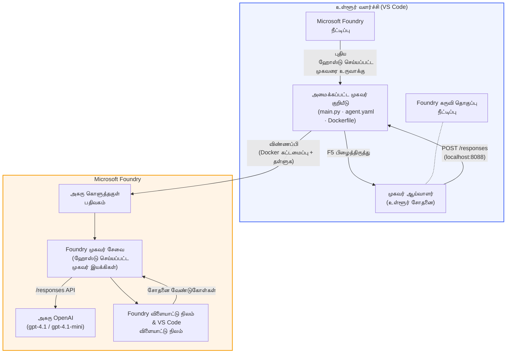

# Foundry Toolkit + Foundry Hosted Agents காரியகூடம்

[](https://www.python.org/)
[](https://github.com/microsoft/agents)
[](https://learn.microsoft.com/azure/ai-foundry/agents/concepts/hosted-agents/)
[](https://ai.azure.com/)
[](https://learn.microsoft.com/azure/ai-services/openai/)
[](https://learn.microsoft.com/cli/azure/install-azure-cli)
[](https://learn.microsoft.com/azure/developer/azure-developer-cli/install-azd)
[](https://www.docker.com/)
[](https://marketplace.visualstudio.com/items?itemName=ms-windows-ai-studio.windows-ai-studio)
[](LICENSE)

**Microsoft Foundry Agent Service**க்கு AI முகவர்களை உருவாக்கவும், பரிசோதிக்கவும் மற்றும் **Hosted Agents** ஆக VS Code பயன்படுத்தி **Microsoft Foundry விரிவாக்கம்** மற்றும் **Foundry Toolkit** மூலம் முழுமையாக கையடக்கமாக பிரதி தொடரவும்.

> **Hosted Agents தற்போது முன்-பார்வையில் உள்ளது.** ஆதரவு பெறும் பகுதிகள் வரையறுக்கப்பட்டவை - [பிரதேச கிடைக்கும் நிலை](https://learn.microsoft.com/azure/foundry/agents/concepts/hosted-agents#region-availability) பார்க்கவும்.

> ஒவ்வொரு ஆய்வகத்திலும் உள்ள `agent/` கோப்புறை **Foundry விரிவாக்கத்தால் தானாக உருவாக்கப்படுகிறது** - பின்னர் நீங்கள் குறியீட்டை தனிப்பயனாக்கி, உள்ளூர் பரிசோதனை செய்து, பிரதி தொடர்கிறீர்கள்.

<!-- CO-OP TRANSLATOR LANGUAGES TABLE START -->
[Arabic](../ar/README.md) | [Bengali](../bn/README.md) | [Bulgarian](../bg/README.md) | [Burmese (Myanmar)](../my/README.md) | [Chinese (Simplified)](../zh-CN/README.md) | [Chinese (Traditional, Hong Kong)](../zh-HK/README.md) | [Chinese (Traditional, Macau)](../zh-MO/README.md) | [Chinese (Traditional, Taiwan)](../zh-TW/README.md) | [Croatian](../hr/README.md) | [Czech](../cs/README.md) | [Danish](../da/README.md) | [Dutch](../nl/README.md) | [Estonian](../et/README.md) | [Finnish](../fi/README.md) | [French](../fr/README.md) | [German](../de/README.md) | [Greek](../el/README.md) | [Hebrew](../he/README.md) | [Hindi](../hi/README.md) | [Hungarian](../hu/README.md) | [Indonesian](../id/README.md) | [Italian](../it/README.md) | [Japanese](../ja/README.md) | [Kannada](../kn/README.md) | [Khmer](../km/README.md) | [Korean](../ko/README.md) | [Lithuanian](../lt/README.md) | [Malay](../ms/README.md) | [Malayalam](../ml/README.md) | [Marathi](../mr/README.md) | [Nepali](../ne/README.md) | [Nigerian Pidgin](../pcm/README.md) | [Norwegian](../no/README.md) | [Persian (Farsi)](../fa/README.md) | [Polish](../pl/README.md) | [Portuguese (Brazil)](../pt-BR/README.md) | [Portuguese (Portugal)](../pt-PT/README.md) | [Punjabi (Gurmukhi)](../pa/README.md) | [Romanian](../ro/README.md) | [Russian](../ru/README.md) | [Serbian (Cyrillic)](../sr/README.md) | [Slovak](../sk/README.md) | [Slovenian](../sl/README.md) | [Spanish](../es/README.md) | [Swahili](../sw/README.md) | [Swedish](../sv/README.md) | [Tagalog (Filipino)](../tl/README.md) | [Tamil](./README.md) | [Telugu](../te/README.md) | [Thai](../th/README.md) | [Turkish](../tr/README.md) | [Ukrainian](../uk/README.md) | [Urdu](../ur/README.md) | [Vietnamese](../vi/README.md)

> **உள்ளூரில் கிளோன் செய்ய விரும்புகிறீர்களா?**
>
> இந்த களஞ்சியம் 50+ மொழி மொழிமாற்றங்களை கொண்டுள்ளது, இது பதிவிறக்கும் அளவை அதிகரிக்கும். மொழிமாற்றங்கள் இல்லாமல் கிளோன் செய்ய sparse checkout பயன்படுத்தவும்:
>
> **Bash / macOS / Linux:**
> ```bash
> git clone --filter=blob:none --sparse https://github.com/microsoft-foundry/Foundry_Toolkit_for_VSCode_Lab.git
> cd Foundry_Toolkit_for_VSCode_Lab
> git sparse-checkout set --no-cone '/*' '!translations' '!translated_images'
> ```
>
> **CMD (Windows):**
> ```cmd
> git clone --filter=blob:none --sparse https://github.com/microsoft-foundry/Foundry_Toolkit_for_VSCode_Lab.git
> cd Foundry_Toolkit_for_VSCode_Lab
> git sparse-checkout set --no-cone "/*" "!translations" "!translated_images"
> ```
>
> இது நீங்கள் விரைவாகப் பதிவிறக்கி இந்த பாடத்திட்டத்தை முடிக்க தேவையான அனைத்தையும் தருகின்றது.
<!-- CO-OP TRANSLATOR LANGUAGES TABLE END -->

---

## கட்டமைப்பு


**செயல்முறை:** Foundry விரிவாக்கம் முகவரியை உருவாக்குகிறது → நீங்கள் குறியீடு மற்றும் அறிவுறுத்தல்களை தனிப்பயனாக்குகிறீர்கள் → Agent Inspector மூலம் உள்ளூரில் பரிசோதனை → Foundryக்கு (Docker படத்தை ACRக்கு ஊதியம்) பிரதி தொடரல் → Playground இல் சரிபார்த்தல்.

---

## நீங்கள் உருவாக்கவுள்ளதை

| ஆய்வகம் | விளக்கம் | நிலை |
|-----|-------------|--------|
| **ஆய்வகம் 01 - தனி முகவர்** | **"Explain Like I'm an Executive" Agent** ஐ உருவாக்கி, உள்ளூரில் பரிசோதனை செய்து, Foundryக்கு பிரதி தொடரவும் | ✅ கிடைக்கிறது |
| **ஆய்வகம் 02 - பல முகவர் பணிவழி** | **"Resume → Job Fit Evaluator"** - 4 முகவர்கள் சேர்ந்து ரெஸ்யூமை மதிப்பெடு செய்து கற்கை திட்டத்தை உருவாக்குதல் | ✅ கிடைக்கிறது |

---

## Executive Agent ஐச் சந்தியுங்கள்

இந்த பயிற்சி பள்ளியில் நீங்கள் **"Explain Like I'm an Executive" Agent** ஐ உருவாக்குவீர்கள் - இது கடுமையான தொழில்நுட்ப சொற்றொடர்களை அமைதியான, வாரிய அரங்கிற்கான சுருக்கங்களாக மாற்றும் AI முகவர். ஏனெனில் உண்மையில் யாருமும் C-suite இல் "v3.2 இல் அறிமுகப்படுத்தப்பட்ட ஒத்திசைவு அழைப்புகள் காரணமாக thread pool Exhaustion" பற்றி கேட்க விரும்பவில்லை.

நான் இந்த முகவரியை அதே நேரத்தில் நிறைய post-mortem சம்பவங்களில் *"அதாவது... இணையதளம் இறங்கியதா இல்லையா?"* என்ற பதிலைப் பெற்ற பிறகு உருவாக்கினேன்.

### இது எப்படி செயல்படுகிறது

நீங்கள் ஒரு தொழில்நுட்ப புதுப்பிப்பை கொடுக்கிறீர்கள். அது மூன்று புள்ளிகள் கொண்ட நிர்வாக சுருக்கத்தைத் தருகிறது - சொற்கள், ஸ்டாக் டிரேஸ்கள், மற்றும் பேரிடர் உணர்வுகள் இல்லாமல். வெறும் **என்ன நடந்தது**, **வணிக தாக்கம்**, மற்றும் **அடுத்து என்ன செய்ய வேண்டும்**.

### செயல்பாட்டைப் பாருங்கள்

**நீங்கள் சொல்கிறீர்கள்:**
> "The API latency increased due to thread pool exhaustion caused by synchronous calls introduced in v3.2."

**முகவர் பதிலளிக்கிறார்:**

> **நிர்வாக சுருக்கம்:**
> - **என்ன நடந்தது:** சமீபத்திய வெளியீட்டுக்கு பிறகு, முறை மெதுவாகி விட்டது.
> - **வணிக தாக்கம்:** சில பயனர்கள் சேவையை பயன்படுத்தும் போது தாமதங்களை அனுபவித்தனர்.
> - **அடுத்து செய்யவேண்டியது:** மாற்றம் திரும்பப்பெறப்பட்டு, மீண்டும் பிரதி தொடர முன் சரிசெய்தல் தயாராகிறது.

### இந்த முகவர் ஏன்?

இது எளிய, ஒரே நோக்குள்ள முகவர் - ஹோஸ்டட் முகவர் பணிவழியை முழுமையாக கற்றுக்கொள்ள இது மிகவும் பொருத்தமானது. உண்மையில், ஒவ்வொரு பொறியியல் குழுவுக்கும் இதுபோன்ற ஒன்று தேவை.

---

## பயிற்சி கோட்டமைப்பு

```
📂 Foundry_Toolkit_for_VSCode_Lab/
├── 📄 README.md                      ← You are here
├── 📂 ExecutiveAgent/                ← Standalone hosted agent project
│   ├── agent.yaml
│   ├── Dockerfile
│   ├── main.py
│   └── requirements.txt
└── 📂 workshop/
    ├── 📂 lab01-single-agent/        ← Full lab: docs + agent code
    │   ├── README.md                 ← Hands-on lab instructions
    │   ├── 📂 docs/                  ← Step-by-step tutorial modules
    │   │   ├── 00-prerequisites.md
    │   │   ├── 01-install-foundry-toolkit.md
    │   │   ├── 02-create-foundry-project.md
    │   │   ├── 03-create-hosted-agent.md
    │   │   ├── 04-configure-and-code.md
    │   │   ├── 05-test-locally.md
    │   │   ├── 06-deploy-to-foundry.md
    │   │   ├── 07-verify-in-playground.md
    │   │   └── 08-troubleshooting.md
    │   └── 📂 agent/                 ← Reference solution (auto-scaffolded by Foundry extension)
    │       ├── agent.yaml
    │       ├── Dockerfile
    │       ├── main.py
    │       └── requirements.txt
    └── 📂 lab02-multi-agent/         ← Resume → Job Fit Evaluator
        ├── README.md                 ← Hands-on lab instructions (end-to-end)
        ├── 📂 docs/                  ← Step-by-step tutorial modules
        │   ├── 00-prerequisites.md
        │   ├── 01-understand-multi-agent.md
        │   ├── 02-scaffold-multi-agent.md
        │   ├── 03-configure-agents.md
        │   ├── 04-orchestration-patterns.md
        │   ├── 05-test-locally.md
        │   ├── 06-deploy-to-foundry.md
        │   ├── 07-verify-in-playground.md
        │   └── 08-troubleshooting.md
        └── 📂 PersonalCareerCopilot/ ← Reference solution (multi-agent workflow)
            ├── agent.yaml
            ├── Dockerfile
            ├── main.py
            └── requirements.txt
```

> **குறிப்பு:** ஒவ்வொரு ஆய்வகத்திலும் உள்ள `agent/` கோப்புறை **Microsoft Foundry விரிவாக்கம்** மூலம் `Microsoft Foundry: Create a New Hosted Agent` என்ற கட்டளை பாலைட்டில் இயக்கும்போது உருவாக்கப்படுகிறது. பின்னர் உங்கள் முகவரின் அறிவுறுத்தல்கள், கருவிகள் மற்றும் அமைப்புகளுடன் இந்த கோப்புகள் தனிப்பயனாக்கப்படுகின்றன. ஆய்வகம் 01 இல் இதைத் திரும்ப உருவாக்கி பார்ப்பீர்கள்.

---

## துவக்கம்

### 1. களஞ்சியத்தை கிளோன் செய்யவும்

```bash
git clone https://github.com/microsoft-foundry/Foundry_Toolkit_for_VSCode_Lab.git
cd Foundry_Toolkit_for_VSCode_Lab
```

### 2. Python க்கான மெய்நிகர் சூழலை அமைக்கவும்

```bash
python -m venv venv
```

இயக்கவும்:

- **Windows (PowerShell):**
  ```powershell
  .\venv\Scripts\Activate.ps1
  ```
- **macOS / Linux:**
  ```bash
  source venv/bin/activate
  ```

### 3. சார்புகளை நிறுவவும்

```bash
pip install -r workshop/lab01-single-agent/agent/requirements.txt
```

### 4. சுற்றுச் சூழல் மாறிலிகளை அமைக்கவும்

agent கோப்புறை உள்ளே உள்ள உதாரண `.env` கோப்பை நகல் செய்து உங்கள் தகவலுடன் நிரப்பவும்:

```bash
cp workshop/lab01-single-agent/agent/.env.example workshop/lab01-single-agent/agent/.env
```

`workshop/lab01-single-agent/agent/.env` திருத்தவும்:

```env
AZURE_AI_PROJECT_ENDPOINT=https://<your-account>.services.ai.azure.com/api/projects/<your-project>
MODEL_DEPLOYMENT_NAME=<your-model-deployment-name>
```

### 5. பயிற்சி ஆய்வகங்களை பின்பற்றவும்

ஒவ்வொரு ஆய்வகம் தனித்துறைக் கோப்புகளுடன் உள்ளது. அடிப்படைகளை கற்றுக்கொள்ள **ஆய்வகம் 01** கொண்டு தொடங்கு, பிறகு பல முகவர் பணிவழிகளுக்காக **ஆய்வகம் 02**க்கு செல்லுங்கள்.

#### ஆய்வகம் 01 - தனி முகவர் ([முழு அறிவுறுத்தல்கள்](workshop/lab01-single-agent/README.md))

| # | தொகுதி | இணைப்பு |
|---|--------|------|
| 1 | முன்னகற்பனைகளை படிக்கவும் | [00-prerequisites.md](workshop/lab01-single-agent/docs/00-prerequisites.md) |
| 2 | Foundry Toolkit & Foundry விரிவாக்கத்தை நிறுவவும் | [01-install-foundry-toolkit.md](workshop/lab01-single-agent/docs/01-install-foundry-toolkit.md) |
| 3 | Foundry திட்டம் உருவாக்கவும் | [02-create-foundry-project.md](workshop/lab01-single-agent/docs/02-create-foundry-project.md) |
| 4 | Hosted Agent உருவாக்கவும் | [03-create-hosted-agent.md](workshop/lab01-single-agent/docs/03-create-hosted-agent.md) |
| 5 | அறிவுறுத்தல்கள் மற்றும் சுற்றுச் சூழலை நிறுவவும் | [04-configure-and-code.md](workshop/lab01-single-agent/docs/04-configure-and-code.md) |
| 6 | உள்ளூரில் பரிசோதனை செய்யவும் | [05-test-locally.md](workshop/lab01-single-agent/docs/05-test-locally.md) |
| 7 | Foundryக்கு பிரதி தொடரவும் | [06-deploy-to-foundry.md](workshop/lab01-single-agent/docs/06-deploy-to-foundry.md) |
| 8 | Playground இல் சரிபார்த்தல் | [07-verify-in-playground.md](workshop/lab01-single-agent/docs/07-verify-in-playground.md) |
| 9 | பிரச்சனைகள் மற்றும் தீர்வுகள் | [08-troubleshooting.md](workshop/lab01-single-agent/docs/08-troubleshooting.md) |

#### ஆய்வகம் 02 - பல முகவர் பணிவழி ([முழு அறிவுறுத்தல்கள்](workshop/lab02-multi-agent/README.md))

| # | தொகுதி | இணைப்பு |
|---|--------|------|
| 1 | முன்னகற்பனைகள் (ஆய்வகம் 02) | [00-prerequisites.md](workshop/lab02-multi-agent/docs/00-prerequisites.md) |
| 2 | பல முகவர் கட்டமைப்பை புரிந்து கொள்ளுங்கள் | [01-understand-multi-agent.md](workshop/lab02-multi-agent/docs/01-understand-multi-agent.md) |
| 3 | பல முகவர் திட்டத்தை உருவாக்கவும் | [02-scaffold-multi-agent.md](workshop/lab02-multi-agent/docs/02-scaffold-multi-agent.md) |
| 4 | முகவர்களும் சுற்றுச் சூழலும் அமைக்கவும் | [03-configure-agents.md](workshop/lab02-multi-agent/docs/03-configure-agents.md) |
| 5 | ஒழுங்கமைப்பு மாதிரிகள் | [04-orchestration-patterns.md](workshop/lab02-multi-agent/docs/04-orchestration-patterns.md) |
| 6 | உள்ளூரில் பரிசோதனை செய்யவும் (பல முகவர்) | [05-test-locally.md](workshop/lab02-multi-agent/docs/05-test-locally.md) |
| 7 | Foundryக்காக 배포 செய்யவும் | [06-deploy-to-foundry.md](workshop/lab02-multi-agent/docs/06-deploy-to-foundry.md) |
| 8 | விளையாட்டு மைதானத்தில் சரிபார்க்கவும் | [07-verify-in-playground.md](workshop/lab02-multi-agent/docs/07-verify-in-playground.md) |
| 9 | பிழை நீக்கம் (பன்முகம் முகவர்) | [08-troubleshooting.md](workshop/lab02-multi-agent/docs/08-troubleshooting.md) |

---

## பராமரிப்பாளர்

<table>
<tr>
    <td align="center"><a href="https://github.com/ShivamGoyal03">
        <br />
        <sub><b>ஷிவம் கோயல்</b></sub>
    </a><br />
    </td>
</tr>
</table>

---

## தேவைப்படும் அனுமதிகள் (விரைவு குறிப்புரை)

| சூழல் | தேவைப்படும் வேடங்கள் |
|----------|---------------|
| புதிய Foundry திட்டத்தை உருவாக்கவும் | Foundry வளத்தில் **Azure AI உரிமையாளா்** |
| உள்ளமைவு திட்டத்திற்கு 배포 (புதிய வளங்கள்) | சந்தாவில் **Azure AI உரிமையாளா்** + **கருத்தாளா்** |
| முழுமையாக அமைக்கப்பட்ட திட்டத்திற்கு 배포 | கணக்கில் **வாசிப்பவர்** + திட்டத்தில் **Azure AI பயனர்** |

> **முக்கியம்:** Azure `உரிமையாளா்` மற்றும் `கருத்தாளா்` வேடங்கள் *மேற்பார்வை* அனுமதிகளையே கொண்டுள்ளன, *வளர்ச்சி* (தரவு நடவடிக்கை) அனுமதிகள் இல்லை. முகவர்களை கட்டமைக்கவும் 배포 செய்கவும் **Azure AI பயனர்** அல்லது **Azure AI உரிமையாளா்** வேண்டும்.

---

## மேற்கோற்கள்

- [தொடக்க வழிகாட்டு: உங்கள் முதல் விருந்தினர் முகவர்களை 배포 செய்வது (VS கோடை)](https://learn.microsoft.com/azure/foundry/agents/quickstarts/quickstart-hosted-agent)
- [விருந்தினர் முகவர்கள் என்றால் என்ன?](https://learn.microsoft.com/azure/foundry/agents/concepts/hosted-agents)
- [VS கோடில் விருந்தினர் முகவர் வேலைப்பாடுகளை உருவாக்கவும்](https://learn.microsoft.com/azure/foundry/agents/how-to/vs-code-agents-workflow-pro-code)
- [விருந்தினர் முகவர்களை 배포 செய்யவும்](https://learn.microsoft.com/azure/foundry/agents/how-to/deploy-hosted-agent)
- [Microsoft Foundry க்கான RBAC](https://learn.microsoft.com/azure/foundry/concepts/rbac-foundry)
- [கட்டமைப்பு மதிப்பாய்வு முகவர் எடுத்துக்காட்டு](https://github.com/Azure-Samples/agent-architecture-review-sample) - MCP கருவிகள், Excalidraw வரைபடங்கள் மற்றும் இரட்டை 배포 உடன் உண்மையான விருந்தினர் முகவர்

---

## உரிமம்

[MIT](../../LICENSE)

---

<!-- CO-OP TRANSLATOR DISCLAIMER START -->
**எச்சரிக்கை**:  
இந்த ஆவணம் AI மொழிபெயர்ப்பு சேவை [Co-op Translator](https://github.com/Azure/co-op-translator) ஐ பயன்படுத்தி மொழிபெயர்க்கப்பட்டது. நாங்கள் துல்லியத்திற்கு முயற்சி செய்கிறோம் என்றாலும், தானாக செய்யப்பட்ட மொழிபெயர்ப்பில் தவறுகள் அல்லது துல்லியமின்மைகள் இருக்கக்கூடும் என்பதை தயவுசெய்து கவனிக்கவும். அசல் ஆவணம் அதன் சொந்த மொழியில் அதிகாரப்பூர்வமான ஆதாரமாகக் கருதப்பட வேண்டும். முக்கியமான தகவல்களுக்கு, நிபுணரான மனித மொழிபெயர்ப்பாளர் மூலம் மொழிபெயர்ப்பு செய்யப்படுவது பரிந்துரைக்கப்படுகிறது. இந்த மொழிபெயர்ப்பை பயன்படுத்துவதால் ஏற்படும் எந்த தவறான புரிதல்களுக்கும் அல்லது தவறான விளக்கங்களுக்கும் நாங்கள் பொறுப்பளிக்கமாட்டோம்.
<!-- CO-OP TRANSLATOR DISCLAIMER END -->