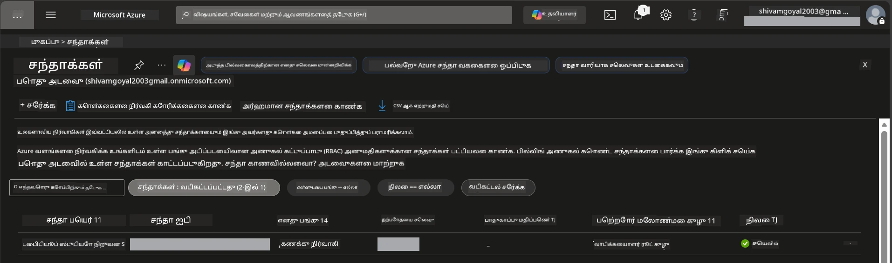

# Module 0 - முன் தேவைங்கள்

வேற்குழுவைத் தொடங்குவதற்கு முன்பு, கீழ்காணும் கருவிகள், அணுகல் மற்றும் சூழல் தயாராக உள்ளதா என்பதை உறுதிப்படுத்திக் கொள்ளவும். கீழ்க்காணும் ஒவ்வொரு படியையும் பின்பற்றவும் - முன்னேறாமல் தவற விடாதீர்கள்.

---

## 1. Azure கணக்கு மற்றும் சந்தா

### 1.1 உங்கள் Azure சந்தா உருவாக்கவும் அல்லது சரிபார்க்கவும்

1. உலாவியை திறந்து [https://azure.microsoft.com/free/](https://azure.microsoft.com/free/) என்ற முகவரிக்கு செல்லவும்.
2. உங்கள் Azure கணக்கு இல்லையெனில், **Start free** என்பதனை கிளிக் செய்து பதிவு செயல்முறையை தொடர்ந்து செய்யவும். Microsoft கணக்கு (அல்லது ஒன்று உருவாக்கவும்) மற்றும் அடையாள உறுதிப்படுத்தக்காக ஒரு கிரெடிட் கார்டு தேவையாகும்.
3. உங்கள் கணக்கு ஏற்கனவே இருந்தால், [https://portal.azure.com](https://portal.azure.com) இல் உள்நுழையவும்.
4. போர்டல் இல், இடது வழிசெலுத்தலில் உள்ள **Subscriptions** பட்டியை கிளிக் செய்யவும் (அல்லது மேல் தேடல் பட்டியில் "Subscriptions" என்று தேடவும்).
5. குறைந்தபட்சம் ஒரு **செயற்பாட்டில்** உள்ள சந்தா காணப்படுவதை உறுதி செய்யவும். உங்கள் **Subscription ID** ஐ குறித்துகொள்ளவும் - பின்னர் உங்களுக்கு தேவைப்படும்.



### 1.2 தேவைப்படும் RBAC பண்புகளைக் கற்றுக் கொள்ளவும்

[Hosted Agent](https://learn.microsoft.com/azure/foundry/agents/concepts/hosted-agents) களவழக்கு **தகவல் செயல்பாட்டு** அனுமதிகளை வேண்டும்செய்கிறது. இது பொது Azure `Owner` மற்றும் `Contributor` பண்புகளில் இல்லை. நீங்கள் கீழ்க்காணும் [பணி சேர்க்கைகள்](https://learn.microsoft.com/azure/foundry/concepts/rbac-foundry#built-in-roles) ஒன்றை தேவையாக்குங்கள்:

| சூழல் | தேவையான பணிகள் | அவற்றை ஒதுக்க வேண்டிய இடம் |
|----------|---------------|----------------------|
| புதிய Foundry திட்டம் உருவாக்கல் | Foundry வளத்தில் **Azure AI Owner** | Azure போர்டலில் Foundry வளம் |
| பழைய திட்டத்திற்கு புதிய வளங்களை நிறுவுதல் | சந்தாவில் **Azure AI Owner** + **Contributor** | சந்தா + Foundry வளம் |
| முற்றிலும் உள்ளமைக்கப்பட்ட திட்டத்திற்கு நிறுவுதல் | கணக்கில் **Reader** + திட்டத்தில் **Azure AI User** | Azure போர்டல் கணக்கு + திட்டம் |

> **முக்கிய குறிப்பு:** Azure `Owner` மற்றும் `Contributor` பணிகள் சிறந்த நிர்வாக அனுமதிகளை மட்டுமே (ARM செயல்பாடுகள்) உள்ளடக்கியவை. `agents/write` போன்ற *தரவு செயல்பாடுகளுக்கான* அனுமதிகள் தேவையாகும், இதற்கு நீங்கள் [**Azure AI User**](https://learn.microsoft.com/azure/foundry/concepts/rbac-foundry#built-in-roles) (அல்லது உயர்ந்த பதவி) தேவை. இந்த பணிகளை நீங்கள் [Module 2](02-create-foundry-project.md) இல் ஒதுக்கவிருப்பீர்கள்.

---

## 2. உள்ளூர் கருவிகளை நிறுவவும்

கீழே உள்ள ஒவ்வொரு கருவியையும் நிறுவவும். நிறுவிய பிறகு, சரிபார்க்க கட்டளை இயக்கி அது வேலை செய்கிறதா என உறுதி செய்யவும்.

### 2.1 Visual Studio Code

1. [https://code.visualstudio.com/](https://code.visualstudio.com/) செல்லவும்.
2. உங்கள் இயங்கு முறைமைக்கான (Windows/macOS/Linux) நிறுவுநரை பதிவிறக்கம் செய்யவும்.
3. இயல்புநிலை அமைப்புகளுடன் நிறுவுநரை இயக்கவும்.
4. VS Code துவங்கி இயங்குகிறது என்பதை உறுதி செய்யவும்.

### 2.2 Python 3.10+

1. [https://www.python.org/downloads/](https://www.python.org/downloads/) செல்லவும்.
2. Python 3.10 அல்லது அதற்கு மேற்பட்ட (3.12+ பரிந்துரைக்கப்பட்டது) பதிப்பை பதிவிறக்கவும்.
3. **Windows:** நிறுவும் போது முதல் திரையில் **"Add Python to PATH"** என்பதை சுட்டிக்காட்டவும்.
4. ஒரு டெர்மினலை திறந்து சரிபார்க்கவும்:

   ```powershell
   python --version
   ```

   எதிர்பார்க்கப்படும் வெளியீடு: `Python 3.10.x` அல்லது அதற்கு மேற்பட்ட பதிப்பு.

### 2.3 Azure CLI

1. [https://learn.microsoft.com/cli/azure/install-azure-cli](https://learn.microsoft.com/cli/azure/install-azure-cli) செல்லவும்.
2. உங்கள் இயங்கு முறையின்படி நிறுவல் வழிமுறைகளை பின்பற்றவும்.
3. சரிபார்க்கவும்:

   ```powershell
   az --version
   ```

   எதிர்பார்ப்பு: `azure-cli 2.80.0` அல்லது மேலே.

4. உள்நுழையவும்:

   ```powershell
   az login
   ```

### 2.4 Azure Developer CLI (azd)

1. [https://learn.microsoft.com/azure/developer/azure-developer-cli/install-azd](https://learn.microsoft.com/azure/developer/azure-developer-cli/install-azd) செல்லவும்.
2. உங்கள் இயங்கு முறைக்கு ஏற்ப நிறுவலை பின்பற்றவும். விண்டோஸில்:

   ```powershell
   winget install microsoft.azd
   ```

3. சரிபார்க்கவும்:

   ```powershell
   azd version
   ```

   எதிர்பார்ப்பு: `azd version 1.x.x` அல்லது மேலே.

4. உள்நுழையவும்:

   ```powershell
   azd auth login
   ```

### 2.5 Docker Desktop (விருப்பத்தேர்வு)

Docker தேவையானது, நீங்கள் உள்ளூர் கணினியில் மாதிரிகளை கட்டி சோதனை செய்ய விரும்பினால் மட்டுமே. Foundry விரிவாக்கம் நிறுவும்போது தொடரிணைகளைக் கட்டுவதைக் கையாளும்.

1. [https://docs.docker.com/get-docker/](https://docs.docker.com/get-docker/) செல்லவும்.
2. உங்கள் OS க்கான Docker Desktop ஐ பதிவிறக்கம் செய்து நிறுவவும்.
3. **Windows:** நிறுவல் போது WSL 2 பின்கூறு தேர்ந்தெடுக்கப்பட்டிருப்பதை உறுதி செய்யவும்.
4. Docker Desktop ஐ துவக்கி, சிஸ்டம் டிரேயில் **"Docker Desktop is running"** என்ற சின்னம் தோன்றும் வரை காத்திருங்கள்.
5. ஒரு டெர்மினலை திறந்து சரிபார்க்கவும்:

   ```powershell
   docker info
   ```

   தவறுகள் இல்லாமல் Docker கணினி தகவல் பிரிண்ட் செய்ய வேண்டும். `Cannot connect to the Docker daemon` என வந்தால், Docker முழுமையாக துவங்க சில வினாடிகள் காத்திருங்கள்.

---

## 3. VS Code விரிவாக்கங்களை நிறுவவும்

நீங்கள் மூன்று விரிவாக்கங்களை நிறுவ வேண்டும். வேலைமுழுதியாக ஆரம்பிக்கும்முன் அவற்றை நிறுவிக்கொள்ளவும்.

### 3.1 Microsoft Foundry for VS Code

1. VS Code ஐ திறக்கவும்.
2. விரிவாக்கங்கள் பலகையை திறக்க `Ctrl+Shift+X` அழுத்தவும்.
3. தேடல் பெட்டியில் **"Microsoft Foundry"** எனதட்டவும்.
4. **Microsoft Foundry for Visual Studio Code** (பதிப்பாளர்: Microsoft, ID: `TeamsDevApp.vscode-ai-foundry`) கண்டறியவும்.
5. **Install** கிளிக் செய்யவும்.
6. நிறுவப்பட்ட பிறகு, இடது பட்டையில் உள்ள Activity Bar இல் **Microsoft Foundry** ஐகான் தோன்றும்.

### 3.2 Foundry Toolkit

1. விரிவாக்கங்களில் (`Ctrl+Shift+X`) **"Foundry Toolkit"** எனத் தேடவும்.
2. **Foundry Toolkit** (பதிப்பாளர்: Microsoft, ID: `ms-windows-ai-studio.windows-ai-studio`) கண்டறியவும்.
3. **Install** செய்யவும்.
4. Activity Bar இல் **Foundry Toolkit** ஐகான் தோன்றும்.

### 3.3 Python

1. விரிவாக்கங்களில், **"Python"** எனத் தேடவும்.
2. **Python** (பதிப்பாளர்: Microsoft, ID: `ms-python.python`) கண்டறியவும்.
3. **Install** செய்யவும்.

---

## 4. VS Code இலிருந்து Azure இல் உள்நுழையவும்

[Microsoft Agent Framework](https://learn.microsoft.com/agent-framework/overview/) அங்கீகாரத்திற்காக [`DefaultAzureCredential`](https://learn.microsoft.com/azure/developer/python/sdk/authentication/credential-chains#defaultazurecredential-overview) ஐப் பயன்படுத்துகிறது. நீங்கள் VS Code இல் Azure இல் உள்நுழைந்திருக்க வேண்டும்.

### 4.1 VS Code மூலம் உள்நுழையவும்

1. VS Code இன் அடியந்த இடது மூலைகையை நேர்த்திக் கவனித்துப் பார்க்கவும், **Accounts** ஐகானை (நபர் உருவம்) கிளிக் செய்யவும்.
2. **Sign in to use Microsoft Foundry** (அல்லது **Sign in with Azure**) என்பதனை கிளிக் செய்யவும்.
3. உலாவி சாளரம் திறந்து Azure கணக்கில் உள்நுழையவும்.
4. VS Code க்கு திரும்பும்போது, உங்கள் கணக்கு பெயர் அடியந்த இடது மூலையில் காணப்படும்.

### 4.2 (விருப்பத்தேர்வு) Azure CLI மூலம் உள்நுழையவும்

Azure CLI ஐ நிறுவி CLI அடிப்படையிலான அங்கீகாரத்தை விரும்பினால்:

```powershell
az login
```

இது உலாவியில் உள்நுழைவு திறக்கும். உள்நுழைந்ததும் சரியான சந்தா அமைக்கவும்:

```powershell
az account set --subscription "<your-subscription-id>"
```

சரிபார்க்கவும்:

```powershell
az account show --query "{name:name, id:id, state:state}" --output table
```

உங்கள் சந்தா பெயர், ID மற்றும் நிலை `Enabled` எனக் காணலாம்.

### 4.3 (மாற்று) சேவை பிரதிநிதி அங்கீகாரம்

CI/CD அல்லது பகிர்கூடிய சூழல்களுக்கு, இங்கு அமைவை மாற்று சூழல் மாறிலிகளாக அமைக்கவும்:

```powershell
$env:AZURE_TENANT_ID = "<your-tenant-id>"
$env:AZURE_CLIENT_ID = "<your-client-id>"
$env:AZURE_CLIENT_SECRET = "<your-client-secret>"
```

---

## 5. முன்னோட்டக் குறைபாடுகள்

முன்னோக்கி செல்லும் முன் தற்போதைய குறைபாடுகளை கவனத்திற்கு எடுக்கவும்:

- [**Hosted Agents**](https://learn.microsoft.com/azure/foundry/agents/concepts/hosted-agents) இப்போது **பொது முன்னோட்டம்** நிலை - உற்பத்தி பணி பயன்பாடுகளுக்கு பரிந்துரைக்கப்படாது.
- **ஆதரிக்கப்படும் பிரதேசங்கள் குறைவாக உள்ளன** - வளங்களை உருவாக்குவதற்கு முன் இவற்றை [பிரதேச கிடைக்கும்](https://learn.microsoft.com/azure/foundry/agents/concepts/hosted-agents#region-availability) காணவும். ஆதரிக்காத பிரதேசத்தைத் தேர்ந்தெடுத்தால் நிறுவல் தோல்வியடையும்.
- `azure-ai-agentserver-agentframework` நூலகம் முன்பதிவாக உள்ளது (`1.0.0b16`) - APIs மாறவும் இருக்கலாம்.
- அளவு வரம்புகள்: hosted agents 0-5 பிரதிகளை ஆதரிக்கின்றன (scale-to-zero உட்பட).

---

## 6. முன் சோதனை பட்டியல்

கீழ்க்காணும் ஒவ்வொரு உருப்படியையும் நடைமுறைப்படுத்தவும். ஒரே ஒரு படியும் தோல்வி கண்டால், திரும்பிச் சென்று சரிசெய்யவும்.

- [ ] VS Code பிழைகள் இல்லாமல் திறக்கப்படுகிறது
- [ ] Python 3.10+ PATH இல் உள்ளது (`python --version` வெளியீடு `3.10.x` அல்லது மேலே)
- [ ] Azure CLI நிறுவப்பட்டுள்ளது (`az --version` வெளியீடு `2.80.0` அல்லது மேலே)
- [ ] Azure Developer CLI நிறுவப்பட்டுள்ளது (`azd version` வெளியீடு பதிப்பு விவரம்)
- [ ] Microsoft Foundry விரிவாக்கம் நிறுவப்பட்டுள்ளது (Activity Bar இல் ஐகான் தெரிகிறது)
- [ ] Foundry Toolkit விரிவாக்கம் நிறுவப்பட்டுள்ளது (Activity Bar இல் ஐகான் தெரிகிறது)
- [ ] Python விரிவாக்கம் நிறுவப்பட்டுள்ளது
- [ ] நீங்கள் VS Code ல் Azure இல் உள்நுழைந்துள்ளீர்கள் (Accounts ஐகான், அடியந்த இடது மூலை)
- [ ] `az account show` உங்கள் சந்தாவை காட்டுகிறது
- [ ] (விருப்பபடுத்தல்) Docker Desktop இயங்குகிறது (`docker info` பிழைகள் இல்லாமல் கணினி விவரங்களை காட்டுகிறது)

### சோதனை புள்ளி

VS Code இன் Activity Bar திறந்து **Foundry Toolkit** மற்றும் **Microsoft Foundry** இரண்டும் பக்கத்தொடுத்துக் காட்சியளிக்கின்றனவா என்று உறுதிப்படுத்திக் கொள்ளவும். ஒவ்வொன்றையும் கிளிக் செய்து பிழைகள் இல்லாமல் திறக்கின்றனவா என்றும் சோதிக்கவும்.

---

**அடுத்து:** [01 - Install Foundry Toolkit & Foundry Extension →](01-install-foundry-toolkit.md)

---

<!-- CO-OP TRANSLATOR DISCLAIMER START -->
**பிரதிபுரிதல்**:  
இந்த ஆவணம் AI অনুবাদ சேவை [Co-op Translator](https://github.com/Azure/co-op-translator) பயன்படுத்தி மொழி பெயர்க்கப்பட்டுள்ளது. நாங்கள் துல்லியம் பெற முயலுகின்றபோதிலும், தானாக செய்யப்பட்ட மொழிபெயர்ப்புகளில் பிழைகள் அல்லது தவறுகள் இருக்க வாய்ப்பு உள்ளது. அசல் ஆவணம் அதன் சொந்த மொழியில் அதிகாரபூர்வ மூலமாக கருதப்பட வேண்டும். முக்கியத் தகவலுக்கு, தொழில்நுட்ப மனித மொழிபெயர்ப்பு பரிந்துரைக்கப்படுகிறது. இந்த மொழிபெயர்ப்பினால் ஏற்படும் எந்த தவறான புரிதல்களுக்கான பொறுப்பும் நாங்கள் ஏற்கமாட்டோம்.
<!-- CO-OP TRANSLATOR DISCLAIMER END -->