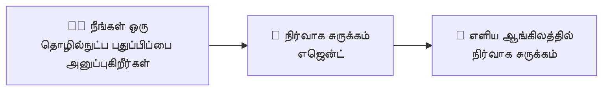

# Module 0 - அறிமுகம்

⏱️ ~10 நிமிடங்கள்

> [!WARNING]
> **முன்னோட்டம் மற்றும் கட்டுப்பாடுகள்:** [Hosted Agents](https://learn.microsoft.com/azure/foundry/agents/concepts/hosted-agents) தற்போது **பொது முன்னோட்டத்தில்** உள்ளது - உற்பத்தி பணி வேலைகளுக்கு பரிந்துரைக்கப்படவில்லை. பின்வரும் விஷயங்களை கவனத்தில் கொள்ளவும்:
> - **பயன்பாட்டுக்கு ஆதரவு அளிக்கப்படும் பகுதிகள் குறைந்தவை** - வளங்களை உருவாக்குவதற்கு முன் [பகுதி கிடைக்குமிடம்](https://learn.microsoft.com/azure/foundry/agents/concepts/hosted-agents#region-availability) பார்க்கவும். ஆதரவு இல்லாத பகுதியை தேர்வு செய்தால், நியமனம் தோல்வியடையும்.
> - `azure-ai-agentserver-agentframework` பேக்கேஜ் முன்பதிவில் உள்ளது - பதிப்புகளுக்கு இடையில் APIகள் மாறலாம்.
> - அளவீடு வரம்புகள்: ஹோஸ்டட் ஏஜென்டுகள் 0–5 பிரதிகளுக்கு (scale-to-zero உட்பட) ஆதரவு அளிக்கின்றன.
> - இந்த பணிமனையில் காணப்படும் சில அம்சங்கள் சேவை GA நோக்கி முன்னெடுக்கும் போது மாற்றப்படலாம்.

## நீங்கள் உருவாக்கப்போகும் எண்ணம்

இந்த பணிமனையில், நீங்கள் **"நான் ஒரு நிர்வாகி போல விளக்குங்கள்"** என்ற ஏஜென்டை உருவாக்கப்போகிறீர்கள் - கடினமான தொழில்நுட்ப மேம்பாடுகளை எளிய ஆங்கில நிர்வாக சிறப்புரைகளாக திருத்தும் ஹோஸ்டட் AI ஏஜென்ட்.

```mermaid
flowchart LR
    A["🧑‍💻 நீங்கள் ஒரு\nதொழில்நுட்ப புதுப்பிப்பை அனுப்புகிறீர்கள்"] --> B["🤖 நிர்வாக சுருக்கம்\nஎஜென்ட்"]
    B --> C["📝 எளிய ஆங்கிலத்தில்\nநிர்வாக சுருக்கம்"]
```

**ஏஜென்ட் பயன்படுத்துகிறது:**
- **Microsoft Agent Framework** - ஏஜென்ட் தாராளம் மற்றும் கட்டமைப்புக்காக
- **Foundry Toolkit for VS Code** - உருவாக்க, உள்ளூர் சோதனை மற்றும் விநியோகம் செய்ய
- **ஒரு AI மாதிரி** (எ.கா., `gpt-4.1-mini/gpt-5-mini`) - சிறப்புரைகளை உருவாக்க

இந்த பயிற்சி முடிவில், நீங்கள் உள்ளூராக Agent Inspector மூலம் சோதனை செய்யக்கூடிய மற்றும் விருப்பமுள்ளதாக மேகத்தில் நிலையான ஏஜென்டை பெற்றிருக்க வேண்டும்.

---

## ஹோஸ்டட் ஏஜென்டுகள் என்ன?

ஒரு **ஹோஸ்டட் ஏஜென்ட்** என்பது Microsoft Foundry இல் நிர்வகிக்கப்படும் சேவையாக இயங்கும் AI ஏஜென்ட் ஆகும். உங்கள் சொந்த உள்கட்டமைப்பை நிர்வகிப்பதற்கு பதிலாக, நீங்கள் உங்கள் ஏஜென்ட் குறியீட்டை ஒரு கொண்டெய்னரில் தொகுத்து வைக்கிறீர்கள் மற்றும் Foundry அது அளவை மாற்றுதல், ஹோஸ்டிங் மற்றும் ஒரு தரமான HTTP இடைமுகத்தின்பேரில் வெளிச்சம் செய்யுதல் போன்ற பணிகளை கவனிக்கிறது.

| கருத்து | அதில் என்ன பொருள்? |
|---------|--------------|
| **ஏஜென்ட்** | பயனரின் மெசேஜை பெறும், AI மாதிரியை அழைக்கும், மற்றும் கட்டமைக்கப்பட்ட பதிலை திருப்பி வழங்கும் Python குறியீடு |
| **ஹோஸ்டட்** | Foundry உங்கள் கொண்டெய்னரை இயக்குகிறது - எந்த VMகளும், Kubernetesலும், அல்லது உள்கட்டமைப்பு பராமரிப்பும் தேவையில்லை |
| **பதில்கள் நடைமுறை** | எதாவது கிளையன்ட் அழைக்கக்கூடிய தரமான HTTP API (`POST /responses`) மூலம் உங்கள் ஏஜென்டுடன் தொடர்பு கொள்ளலாம் |
| **ஏஜென்ட் இன்ஸ்பெக்டர்** | உள்ளூர் சோதனை UI (Foundry Toolkit இல் அடக்கம் உள்ளது) உங்கள் ஏஜென்டுடன் உரையாடுவதற்க்கு மற்றும் Deploy செய்வதற்கு முன் பரிசோதனை செய்ய உதவும் |

இந்த பணிமனையில், நீங்கள் பூஜ்ஜிய நிலை முதல் முழு ஹோஸ்டட் ஏஜென்ட் வரை செல்வீர்கள் - அல்லது விரும்பினால் உள்ளூர் சோதனையில் நிறுத்தலாம்.

---

## உங்கள் பாதையை தேர்ந்தெடுக்கவும்

> ⚠️ **தொடர்வதற்கு முன் ஒரு பாதையைத் தேர்ந்தெடுக்கவும்.** உங்கள் தேர்வு எந்த கருவிகளை நிறுவ வேண்டும் மற்றும் எந்த மாடியூல்கள் பொருந்தும் என்பதை தீர்மானிக்கும். சந்தா பெற்றுப்பின் நீங்கள் பாதை B → பாதை Aக்கு மாறலாம்.

<strong>🅰️ பாதை A - Azure மேகம் (Azure சந்தா தேவை)</strong>

| | விவரங்கள் |
|---|---|
| **இது யாருக்கு?** | உங்களிடம் செயலில் உள்ள Azure சந்தா உள்ளது மற்றும் Foundry வளங்களை உருவாக்க முடியும் |
| **மாதிரி** | Foundry மூலமாக Azure OpenAI (எ.கா., `gpt-4.1-mini/gpt-5-mini`) |
| **மாஃட்யூல்கள் கையடக்கம்** | அனைத்து மாடியூல்கள் (00–07) |
| **மேகத்திற்கு deploy செய்யவா?** | ✅ ஆம் - முழுமையான தொடர் deploy |

<strong>🅱️ பாதை B - உள்ளூர் / இலவச தரம் (Azure சந்தா தேவையில்லை)</strong>

| | விவரங்கள் |
|---|---|
| **இது யாருக்கு?** | MVPகள், மாணவர்கள், அல்லது Azure அணுகல் இல்லாதவர்கள் |
| **மாதிரி** | **Foundry உள்ளூர்** (இலவசம், உங்கள் இயந்திரத்தில் இயங்கும்) |
| **மாடியூல்கள் கையடக்கம்** | மாடியூல்கள் 00–04 (deploy & மேக சரிபார்ப்பு தவிர்க்கவும்) |
| **மேகத்திற்கு deploy செய்யவா?** | ❌ இல்லை - உள்ளூர் சோதனை மட்டுமே Agent Inspector மூலமாக |

---

## அனைத்து பாதைகளும்: தேவையான கருவிகள்

கீழே உள்ள ஒவ்வொரு கருவியையும் நிறுவுங்கள். நிறுவியதற்கு பிறகு, சரிபார்க்க கட்டளை இயக்கி வேலை செய்கிறதை உறுதி செய்யுங்கள்.

| # | கருவி | பதிப்பு | நிறுவ | சரிபார்க்க (எதிர்பார்க்கப்படும் விளைவு) |
|---|------|---------|---------|---------------------------|
| 1 | **Visual Studio Code** | சமீபத்தியது | [code.visualstudio.com](https://code.visualstudio.com/) | பிழை இல்லாமல் திறக்கும் |
| 2 | **Python** | 3.12 அல்லது அதற்கு மேல் | [python.org/downloads](https://www.python.org/downloads/) | `python --version` $\rightarrow$ `Python 3.12.x` |
| 3 | **Foundry Toolkit for VS Code** | சமீபத்தியது |\Extension ID: `ms-windows-ai-studio.windows-ai-studio` | Foundry ஐகான் செயல்பாட்டு பட்டியில் காணப்படும் |
| 4 | **Python கைமுறை VS Code** | சமீபத்தியது |\Extension ID: `ms-python.python` | நீட்டிப்புகள் பகுதியில் நிறுவப்பட்டு உள்ளது |

> [!TIP]
> **நிறுவலில் நிபுணர் குறிப்புகள்:**
> - **Python PATH (விண்டோஸ்):** Python நிறுவுநின் முதல் திரையில் எப்போதும் **"Add Python to PATH"** என்பதைக் கொடுக்கவும். இல்லையெனில் `python` உங்கள் டெர்மினலில் அறியப்படாது.
> - **பல Python பதிப்புகள்:** Python 3.10 மற்றும் 3.12 இரண்டும் நிறுவப்பட்டிருந்தால், உங்கள் virtual environmentக்கு சரியான பதிப்பை பயன்படுத்த `python3.12 -m venv .venv` என்று பயன்படுத்தவும்.
> - **Docker WSL 2 (Windows):** Docker Desktop நிறுவுகையில், **WSL 2 backend** தேர்ந்தெடுக்கப்பட்டுள்ளதா என உறுதி செய்யவும். Hyper-V உடன் Docker மெதுவாக இயங்கும் மற்றும் Foundry கொண்டெய்னர் கட்டற்றல் சிக்கலை ஏற்படுத்தலாம்.
> - **Docker துவங்கவில்லையா?** Docker Desktop துவங்கிய பிறகு 30–60 விநாடிகள் காத்திருங்கள். `docker info` இயக்குக - "Cannot connect to the Docker daemon" எனில் Docker இன்னும் துவங்குவதில் உள்ளது.
> - **VS Code நீட்டிப்புகள் ஏற்றப்படவில்லையா?** நீட்டிப்புகள் நிறுவிய பிறகு சாளரம் மறுதொடக்கம் செய்யவும்: `Ctrl+Shift+P` → `Developer: Reload Window`.

> **Windows பயனர்கள்:** Python நிறுவுகையில் **"Add Python to PATH"** என்பதை சரிபார்க்கவும்.

**அடுத்து:** [01 - அமைப்பு →](01-setup.md)

---

<!-- CO-OP TRANSLATOR DISCLAIMER START -->
**மறுப்பு**:
இந்த ஆவணம் AI மொழிபெயர்ப்பு சேவை [Co-op Translator](https://github.com/Azure/co-op-translator) பயன்படுத்தி மொழிபெயர்க்கப்பட்டுள்ளது. நாங்கள் துல்லியத்திற்காக முயற்சி செய்துள்ளோம், ஆனால் தானாக செய்யப்படும் மொழிபெயர்ப்புகளில் பிழைகள் அல்லது தவறுகள் இருக்கலாம் என்பதை கவனத்தில் கொள்ளவும். அசல் ஆவணம் அதன் தாய்மொழியில் அதிகாரப்பூர்வ ஆதாரமாக கருதப்பட வேண்டும். முக்கியமான தகவல்களுக்கு, தொழில்நுட்பமான மனித மொழிபெயர்ப்பு பரிந்துரைக்கப்படுகிறது. இந்த மொழிபெயர்ப்பைப் பயன்படுத்துவதால் ஏற்படும் எந்த தவறான புரிதல்கள் அல்லது தவறான விளக்கத்திற்கும் நாங்கள் பொறுப்பில்வில்லை.
<!-- CO-OP TRANSLATOR DISCLAIMER END -->