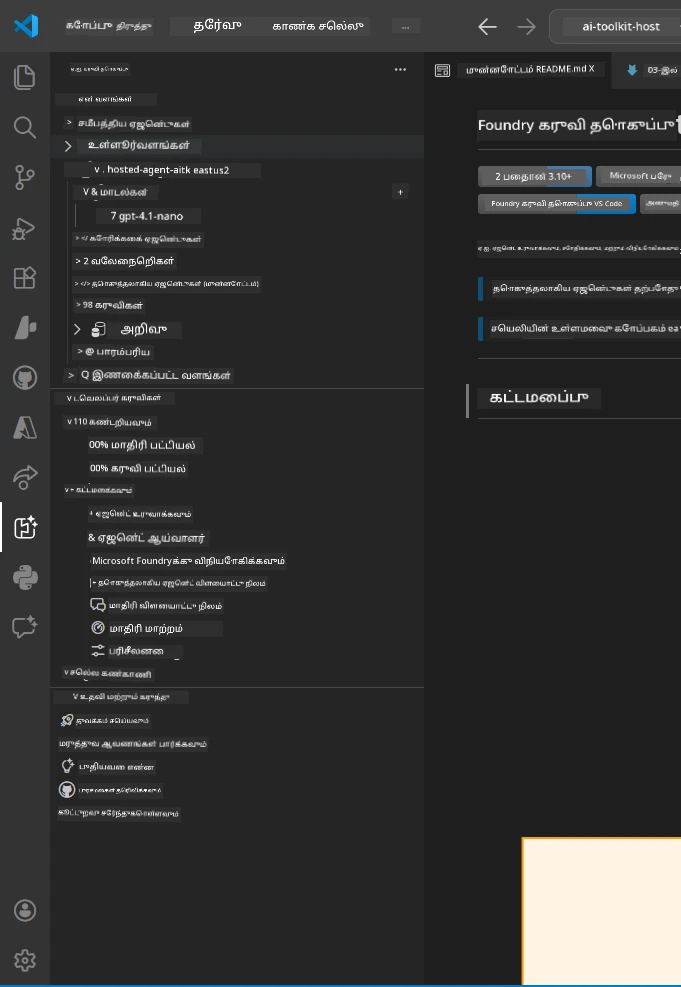
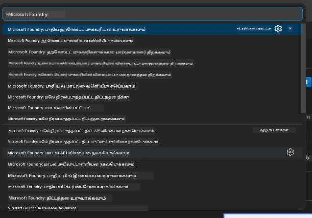

# Module 1 - Foundry Toolkit & Foundry Extension ஐ நிறுவுதல்

இந்த module-ல், இந்த workshop-க்கான இரண்டு முக்கியமான VS Code விரிவாக்கங்களை நிறுவுதல் மற்றும் சரிபார்ப்பது குறித்து 안내 செய்வோம். நீங்கள் ஏற்கனவே [Module 0](00-prerequisites.md) இல் அவைகளை நிறுவியிருந்தால், அவை சரியாக வேலை செய்கிறதா என சரிபார்க்க இந்த module-ஐ பயன்படுத்தவும்.

---

## படி 1: Microsoft Foundry Extension ஐ நிறுவுதல்

**Microsoft Foundry for VS Code** விரிவாக்கம் Foundry projects உருவாக்குதல், மாதிரிகள் (models) பணி நேரிடையாக VS Code-இல் இருந்து deploy செய்தல், hosted agents கட்டமைப்பை உருவாக்குதல் போன்ற முக்கிய கருவியாக செயல்படுகிறது.

1. VS Code-ஐ திறக்கவும்.
2. `Ctrl+Shift+X` அழுத்தி **Extensions** பேனலை திறக்கவும்.
3. மேல் உள்ள தேடல் பெட்டியில்: **Microsoft Foundry** என்று تایப் செய்யவும்.
4. முடிவுகளில் **Microsoft Foundry for Visual Studio Code** என்பதைக் காணவும்.
   - வெளியீட்டாளர்: **Microsoft**
   - Extension ID: `TeamsDevApp.vscode-ai-foundry`
5. **Install** பொத்தானை சொடுக்கவும்.
6. நிறுவல் முற்றிலுமாக முடிய பாதிக்கப்படும் (சிறிய முன்னேற்ற குறியீடு காணப்படும்).
7. நிறுவல் முடிந்த பின், VS Code-இன் இடது பக்கத்தில் உள்ள **Activity Bar** (செங்குத்து ஐகான் பட்டை) பார்க்கவும். புதிய **Microsoft Foundry** ஐகான் (வெள்ளி வைரக் குறியீட்டுக்கு மாதிரி/AI ஐகான் போன்றது) தோன்றும்.
8. அந்த **Microsoft Foundry** ஐகானை கிளிக் செய்து அதன் பக்கவொருட்களை (sidebar view) திறக்கவும். பின்வரும் பகுதிகள் காணப்படும்:
   - **Resources** (அல்லது Projects)
   - **Agents**
   - **Models**

> **ஐகான் தோன்றவில்லையெனில்:** VS Code-ஐ மறுபடியும் ஏற்றவும் (`Ctrl+Shift+P` → `Developer: Reload Window`).

---

## படி 2: Foundry Toolkit Extension ஐ நிறுவுதல்

**Foundry Toolkit** விரிவாக்கம் [**Agent Inspector**](https://learn.microsoft.com/azure/foundry/agents/how-to/vs-code-agents-workflow-pro-code) - ஏஜென்ட்களைக் கைவசம் பரிசோதனை செய்வதற்கும் பிழைகள் திருத்துவதற்குமான காட்சி இடைமுகம் - கூடுதலாக playground, மாதிரி மேலாண்மை மற்றும் மதிப்பீட்டு கருவிகள் வழங்குகிறது.

1. Extensions பேனலில் (`Ctrl+Shift+X`) தேடலில் இருந்து செட் தூக்கி: **Foundry Toolkit** என்று தேடவும்.
2. முடிவுகளில் **Foundry Toolkit** காணவும்.
   - வெளியீட்டாளர்: **Microsoft**
   - Extension ID: `ms-windows-ai-studio.windows-ai-studio`
3. **Install** கிளிக் செய்யவும்.
4. நிறுவிய பின், Activity Bar-ல் **Foundry Toolkit** ஐகான் தோன்றும் (ரோபோட் அல்லது துடிப்பான ஐகான் போன்றது).
5. அந்த Foundry Toolkit ஐகானை கிளிக் செய்து அதன் பக்கவொருட்களை திறக்கவும். Foundry Toolkit வரவேற்பு திரை தெரியும், இதில் பின்வரும் விருப்பங்கள் இருக்கின்றன:
   - **Models**
   - **Playground**
   - **Agents**

---

## படி 3: இரு விரிவாக்கங்களும் சரியாக இயங்குகிறதா என சரிபார்க்கவும்

### 3.1 Microsoft Foundry Extension-ஐ சரிபார்க்கவும்

1. Activity Bar-இல் உள்ள **Microsoft Foundry** ஐகானை கிளிக் செய்யவும்.
2. Azure-க்கு (Module 0-இல்) நீங்கள் உள்நுழைந்திருந்தால், உங்கள் projects **Resources** கீழ் பட்டியலாக காணப்படும்.
3. உள்நுழைவு கேட்கப்பட்டால், **Sign in** என்பதை கிளிக் செய்து அங்கீகாரத்தை பின்பற்றவும்.
4. பக்கவொருட்கள் பிழையில்லாமல் திறக்கப்படுகிறதா என உறுதிப்படுத்தவும்.

### 3.2 Foundry Toolkit Extension-ஐ சரிபார்க்கவும்

1. Activity Bar-இல் உள்ள **Foundry Toolkit** ஐகானை கிளிக் செய்யவும்.
2. வரவேற்பு திரை அல்லது முக்கிய பேனல் பிழையில்லாமல் திறக்கப்படுகிறது என்பதை உறுதிப்படுத்தவும்.
3. இதன் உள்ளமைவுகளை இப்போது அமைக்க தேவையில்லை - [Module 5](05-test-locally.md)ல் Agent Inspector-ஐப் பயன்படுத்துவோம்.

### 3.3 கட்டளை மெனுவின் மூலம் சரிபார்க்கவும்

1. `Ctrl+Shift+P` அழுத்தி Command Palette-ஐ திறக்கவும்.
2. **"Microsoft Foundry"** என்று تایப் செய்யவும். பின்வரும் கட்டளைகள் தோன்றும்:
   - `Microsoft Foundry: Create a New Hosted Agent`
   - `Microsoft Foundry: Deploy Hosted Agent`
   - `Microsoft Foundry: Open Model Catalog`
3. Command Palette மூட `Escape` அழுத்தவும்.
4. மீண்டும் Command Palette திறக்கவும் மற்றும் **"Foundry Toolkit"** என்று تایப் செய்யவும். பின்வருவன தோன்றும்:
   - `Foundry Toolkit: Open Agent Inspector`

> இந்த கட்டளைகள் தோன்றவில்லையெனில், விரிவாக்கங்கள் சரியாக நிறுவப்படவில்லையோ என நினைத்து, அவற்றை அகற்றி மீண்டும் நிறுவி காணவும்.

---

## இந்த workshop-ல் இந்த விரிவாக்கங்கள் செய்யும் பணிகள்

| விரிவாக்கம் | அது செய்கிறது | நீங்கள் பயன்படுத்தும் Modules |
|-----------|-------------|-------------------|
| **Microsoft Foundry for VS Code** | Foundry projects உருவாக்குதல், மாதிரிகள் deploy செய்தல், **[hosted agents](https://learn.microsoft.com/azure/foundry/agents/concepts/hosted-agents)** கட்டமைக்குதல் (தானாக `agent.yaml`, `main.py`, `Dockerfile`, `requirements.txt` உருவாக்குகிறது), [Foundry Agent Service](https://learn.microsoft.com/azure/foundry/agents/overview) க்கு deploy செய்தல் | Modules 2, 3, 6, 7 |
| **Foundry Toolkit** | ஏஜென்ட்களை உள்ளகமாக சோதனை செய்வதற்கும் பிழைகள் தீர்க்கவும் வைத்திருக்கும் Agent Inspector, playground UI, மாதிரி மேலாண்மை | Modules 5, 7 |

> **Foundry extension தான் இந்த workshop-ல் மிக முக்கியமான கருவி.** இது முழுமையான செயல்முறை: scaffold → configure → deploy → verify ஆகியவற்றை கையாள்கிறது. Foundry Toolkit இடதிவசுல் பரிசோதனைக்கான காட்சி Agent Inspector-ஐ வழங்கி இதனுடன் இணைக்கிறது.

---

### சரிபார்ப்பு பட்டியல்

- [ ] Activity Bar-இல் Microsoft Foundry ஐகானை தெரிய வேண்டும்
- [ ] அதை கிளிக் செய்தால் பக்கவொருட்கள் பிழையில்லாமல் திறக்க வேண்டும்
- [ ] Activity Bar-இல் Foundry Toolkit ஐகானை தெரிய வேண்டும்
- [ ] அதை கிளிக் செய்தால் பக்கவொருட்கள் பிழையில்லாமல் திறக்க வேண்டும்
- [ ] `Ctrl+Shift+P` → "Microsoft Foundry" என்று تایப் செய்தால் கட்டளைகள் தோன்ற வேண்டும்
- [ ] `Ctrl+Shift+P` → "Foundry Toolkit" என்று تایப் செய்தால் கட்டளைகள் தோன்ற வேண்டும்

---

**முந்தையது:** [00 - Prerequisites](00-prerequisites.md) · **அடுத்தது:** [02 - Create Foundry Project →](02-create-foundry-project.md)

---

<!-- CO-OP TRANSLATOR DISCLAIMER START -->
**கடைசிக் குறிப்பு**:  
இந்த ஆவணம் [Co-op Translator](https://github.com/Azure/co-op-translator) எனும் AI மொழிபெயர்ப்பு சேவையை பயன்படுத்தி மொழிபெயர்க்கப்பட்டுள்ளது. நாங்கள் துல்லியத்திற்காக முயற்சிக்கின்றாலும், தானியங்கி மொழிபெயர்ப்புகளில் பிழைகள் அல்லது தவறுகள் இருக்க வாய்ப்பு உண்டு. அசல் ஆவணம் அதன் பிறந்த மொழியில் அங்கீகாரமான ஆதாரமாகக் கருதப்பட வேண்டும். முக்கியமான தகவல்களுக்கு, தொழில்முறை மனித மொழிபெயர்ப்பை பரிந்துரைக்கின்றோம். இந்த மொழிபெயர்பைப் பயன்படுத்தியதன் காரணமாக ஏற்படும் எந்த தவறான புரிதலும் அல்லது தவறாக விளக்கப்படுவதற்கான பொறுப்பு நமக்கில்லை.
<!-- CO-OP TRANSLATOR DISCLAIMER END -->