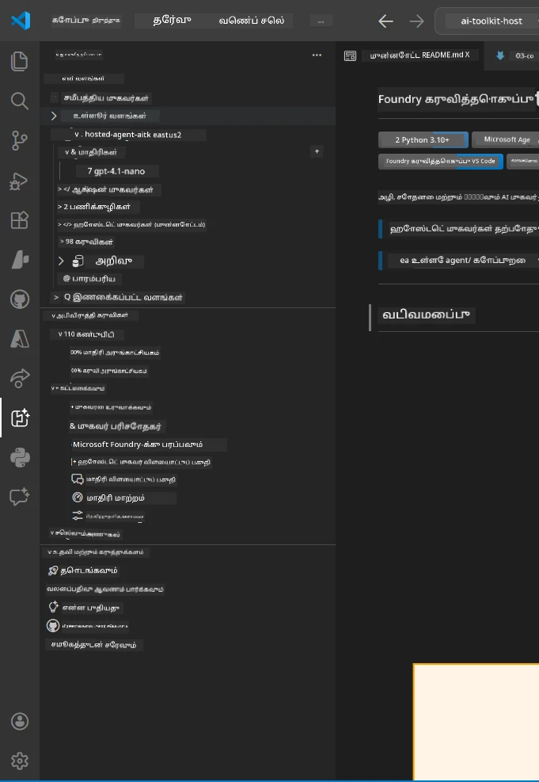
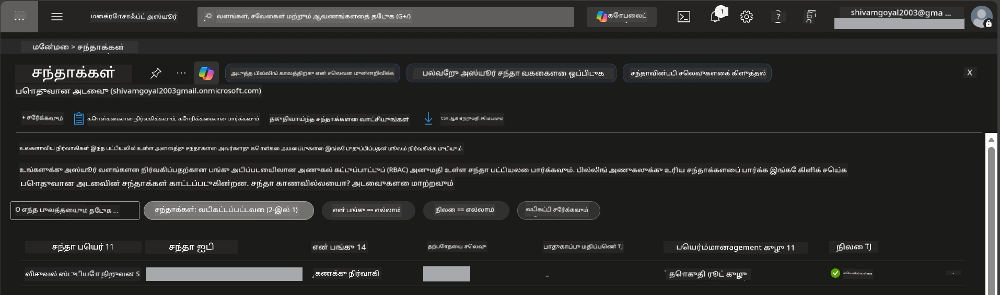
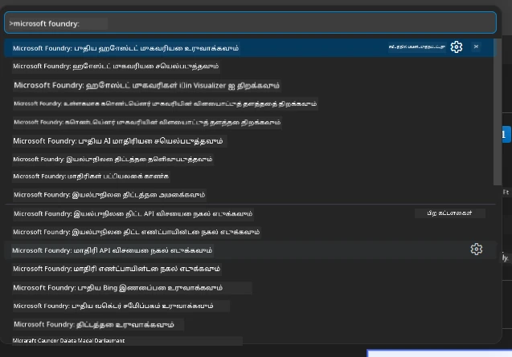
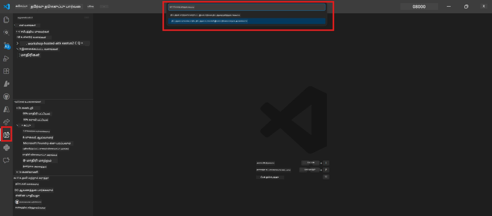
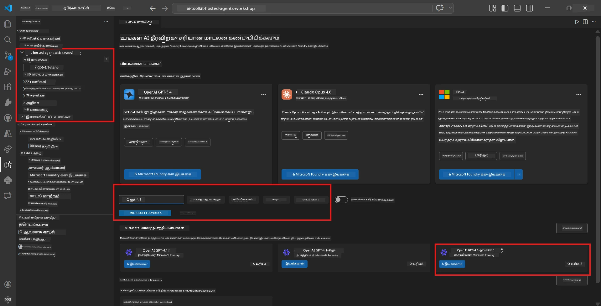
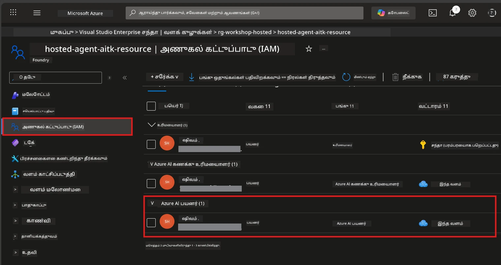

# அமைப்பு: விரிவாக்கம், திட்டம் மற்றும் மாதிரி

⏱️ ~15 நிமிடம்

இந்த தொகுதியில், நீங்கள் Foundry Toolkit விரிவாக்கத்தை நிறுவி சரிபார்க்கிறீர்கள், Foundry திட்டத்தை உருவாக்குகிறீர்கள் (அல்லது இணைக்கிறீர்கள்), மற்றும் உங்கள் முகவரி பயன்படுத்தும் ஒரு மாதிரியை பணி செய்தல் செய்கிறீர்கள்.

## படி 1: Foundry Toolkit ஐ நிறுவுக

**Foundry Toolkit for VS Code** இந்த வேலைப்பாட்டிற்கான முதன்மை விரிவாக்கம் ஆகும். இது திட்ட உருவாக்கம், மாதிரி பணி செய்தல், முகவரி அமைப்பு, உள்ளூர் சோதனை (Agent Inspector), மற்றும் மேக பணி செய்தல் ஆகியவற்றை அனைத்தும் VS Code இல் இருந்து வழங்குகிறது.

1. VS Code ஐ திறந்து `Ctrl+Shift+X` அழுத்தி **Extensions** பலகையைத் திறக்கவும்.
2. **Foundry Toolkit** ஐ தேடவும்.
3. **Foundry Toolkit for VS Code** (பதிப்பாளர்: Microsoft, ID: `ms-windows-ai-studio.windows-ai-studio`) ஐ நிறுவவும்.
4. நிறுவிய பிறகு, **Foundry Toolkit** ஐகான் Activity Barல் (இடது பக்கத் பட்டியில்) தோன்றும்.

> *குறிப்பு: பழைய விரிவாக்க வெர்ஷன்களில் Activity Bar "AI TOOLKIT" என காட்டலாம். செயற்பாடுகள் ஒரே மாதிரியே இருக்கும்.*



## படி 2: உங்கள் அணுகலுக்கு ஏற்ப அமைக்கவும்

> **உங்கள் பாதையை தேர்வு செய்யவும்:** உங்கள் அமைப்பை பொருந்தும் பகுதியில் கீழே உள்ள பகுதியை விரிவாக்குக. நீங்கள் **ஒரே ஒரு** பாதையை மட்டுமே முடிக்க வேண்டும்.

<details>
<summary><strong>🅰️ பாதை A - Azure மேகம் (Azure சந்தா தேவை)</strong></summary>

### Azure CLI

1. [learn.microsoft.com/cli/azure/install-azure-cli](https://learn.microsoft.com/cli/azure/install-azure-cli) இலிருந்து நிறுவவும்.
2. சரிபார்க்க: `az --version` (2.80.0+ எதிர்பார்க்கவும்).
3. உள்நுழையவும்: `az login`

### அங்கீகார விருப்புகள்

[Microsoft Agent Framework](https://learn.microsoft.com/agent-framework/overview/)  [`DefaultAzureCredential`](https://learn.microsoft.com/azure/developer/python/sdk/authentication/credential-chains#defaultazurecredential-overview) ஐ பயன்படுத்துகிறது, இது பல அங்கீகார முறைகளை வரிசைப்படுத்தி முயல்கிறது. உங்கள் சூழலுக்கு பொருந்தும் ஒன்றை தேர்ந்தெடுக்கவும்:

#### விருப்பம் 1: VS Code கணக்குகள் (வேலைப்பாடுகளுக்கு பரிந்துரைக்கப்பட்டுள்ளது)
1. VS Code இன் கீழே இடதுபுறத்தில் உள்ள **Accounts** ஐகானை (பயனர் நிழல்) கிளிக் செய்யவும்.
2. **Microsoft Foundry பயன்படுத்த உள்நுழையவும்** (அல்லது **Azure மூலம் உள்நுழையவும்**) ஐ தேர்ந்தெடுக்கவும்.
3. ஒரு உலாவி திறக்கும் — உங்கள் சந்தா அணுகல் கொண்ட Azure கணக்கில் உள்நுழையவும்.
4. VS Code க்கு திரும்புங்கள். உங்கள் கணக்கு பெயர் கீழே இடதுபுறத்தில் காணப்படும்.

#### விருப்பம் 2: Azure CLI
```bash
az login
az account set --subscription "<your-subscription-id>"
```

#### விருப்பம் 3: சேவை பிரதிநிதி (எண்டர்ப்ரைஸ்/CI)
பூட்டு செய்யப்பட்ட சூழல்களுக்கு அல்லது CI/CD குழாய்களுக்காக, உங்கள் `.env` கோப்பில் இந்த சூழல் மாறிகளை அமைக்கவும்:
```env
AZURE_TENANT_ID=<your-tenant-id>
AZURE_CLIENT_ID=<your-client-id>
AZURE_CLIENT_SECRET=<your-client-secret>
```

> **`DefaultAzureCredential` எப்படி வேலை செய்கிறது:** முதலில் சூழல் மாறிகள், பிறகு நிர்வகிக்கப்பட்ட அடையாளம், பிறகு VS Code உள்நுழைவு, பின்னர் Azure CLI — வெற்றியடையும் முதல் முறையை பயன்படுத்துகிறது. [அங்கீகார சங்கிலி ஆவணங்கள்](https://learn.microsoft.com/azure/developer/python/sdk/authentication/credential-chains#defaultazurecredential-overview) பார்க்கவும்.

### Azure Developer CLI (azd)

1. நிறுவவும்: `winget install microsoft.azd` (விண்டோசு) அல்லது [நிறுவல் ஆவணங்கள்](https://learn.microsoft.com/azure/developer/azure-developer-cli/install-azd) பார்க்கவும்.
2. சரிபார்க்க: `azd version`
3. உள்நுழையவும்: `azd auth login`

### Docker Desktop (விருப்பப்படி)

உள்ளகமாக கன்டெயினர்கள் கட்ட அமைப்பதற்காக மட்டுமே Docker தேவையானது. Foundry விரிவாக்கம் பணி செய்தல் போது கட்டமைப்பை தானாக கவனிக்கும்.

1. [docs.docker.com/get-docker](https://docs.docker.com/get-docker/) இலிருந்து நிறுவவும்.
2. சரிபார்க்க: `docker info`

### Azure சந்தா மற்றும் RBAC

1. [portal.azure.com](https://portal.azure.com) இல் உள்நுழையவும்.
2. **Subscriptions** இல் செல்லவும் மற்றும் குறைந்தது ஒன்று **செயலில்** இருப்பதை உறுதிப்படுத்தவும்.
3. உங்கள் **Subscription ID** ஐ கவனிக்கவும் — Module 01 இல் தேவைப்படும்.



#### RBAC நோக்கு அட்டவணை

[Hosted Agent](https://learn.microsoft.com/azure/foundry/agents/concepts/hosted-agents) பணி செய்தல் **தரவு செயல்கள்** அனுமதிகளை தேவைப் படுத்துகிறது, இது சாதாரண Azure `Owner` மற்றும் `Contributor` பதவிகளால் வழங்கப்படவில்லை. தேவையான பதவிகளை கீழே உள்ள அட்டவணையில் காணலாம்:

| சூழ்நிலை | தேவையான பதவிகள் | எங்கே ஒதுக்க வேண்டும் |
|----------|------------------|---------------------|
| புதிய Foundry திட்டம் உருவாக்கல் | Foundry வளத்தில் **Azure AI Owner** | Azure போர்டலில் Foundry வளம் |
| வெளிப்படையான திட்டத்திற்கு (புதிய வளங்கள்) பணி செய்தல் | சந்தாவிலும் Foundry வளத்திலும் **Azure AI Owner** + **Contributor** | சந்தா + Foundry வளம் |
| முழுமையாக அமைக்கப்பட்ட திட்டத்திற்கு பணி செய்தல் | கணக்கில் **Reader** + திட்டத்தில் **Azure AI User** | Azure போர்டல் கணக்கு + திட்டம் |
| உள்ளூர் சோதனை மட்டுமே (பணி செய்தல் இல்லை) | திட்டத்தில் **Azure AI User** | Azure போர்டல் திட்டம் |

> **முக்கிய அம்சம்:** Azure `Owner` மற்றும் `Contributor` பதவிகள் * நிர்வாக * அனுமதிகளை மட்டுமே வழங்கும் (ARM செயல்பாடுகள்). *தரவு செயல்கள்* (எ.கா., `agents/write`) உருவாக்கவும் பணி செய்யவும் [**Azure AI User**](https://learn.microsoft.com/azure/foundry/concepts/rbac-foundry#built-in-roles) அல்லது அதற்கு மேல் பதவி தேவை.

## Foundry திட்டத்தை இணைக்க அல்லது உருவாக்கு



1. `Ctrl+Shift+P` அழுத்தி → **Foundry Toolkit: Create Project** என்று type செய்து தேர்வு செய்யவும்.
2. கீழோடியிலிருந்து உங்கள் **Azure சந்தாவை** தேர்ந்தெடுக்கவும்.
3. **வள அடுக்கில்** தேர்வு செய்யவும் அல்லது உருவாக்கவும் (எ.கா., `rg-hosted-agents-workshop`).
4. Hosted agents கேட்கும் **பிராந்தியம்** தேர்ந்தெடுக்கவும்: `East US`, `West US 2`, அல்லது `Sweden Central`. [பிராந்திய கிடைக்கை](https://learn.microsoft.com/azure/foundry/agents/concepts/hosted-agents#region-availability) பார்க்கவும்.
5. ஒரு திட்ட பெயரை உள்ளிடவும் (எ.கா., `workshop-agents`).
6. ஒதுக்கீட்டுக்காக 2–5 நிமிடங்கள் காத்திருக்கவும். VS Code இல் முன்னேற்ற அறிவிப்பு தோன்றும்.
7. முடிந்ததும், உங்கள் திட்டம் **Foundry Toolkit** பக்கத் பட்டியில் **MY RESOURCES** கீழ் தோன்றும்.



## ஒரு மாதிரியை பணி செய்தல் மற்றும் RBAC ஒதுக்கல்

உங்கள் ஹொஸ்ட் முகவருக்கு பதிலளிப்பதற்கான AI மாதிரி தேவை.

#### மாதிரி தேர்வு அட்டவணை
உங்கள் தேவைகளின் அடிப்படையில், பல மாதிரி தரகுகளைத் தேர்ந்தெடுக்கலாம்:

| மாதிரி | சிறந்தது | செலவு | குறிப்பு |
|-------|----------|-------|--------|
| `gpt-4.1` | உயர் தர, நுணுக்கமான பதில்கள் | அதிகம் | சிறந்த முடிவுகள், இறுதி சோதனைக்கு பரிந்துரைக்கப்படுகிறது |
| `gpt-4.1-mini/gpt-5-mini` | வேகமான மீள்வாய்ப்பு, குறைந்த செலவு | குறைந்தது | வேலைப்பாடு உருவாக்கம் மற்றும் வேகமான சோதனைகளுக்கானது |
| `gpt-4.1-nano` | இலகுரகப் பணிகள் | மிகக்குறைந்தது | மிகவும் செலவு பயனுள்ள, ஆனால் எளிய பதில்கள் |

1. `Ctrl+Shift+P` → **Foundry Toolkit: Open Model Catalog** (அல்லது பக்கத் பட்டியில் DEVELOPER TOOLS → Discover கீழ் **Model Catalog** கிளிக் செய்யவும்).
2. மாதிரி பட்டியலில் **gpt-4.1** ஐ தேடவும்.
3. **OpenAI GPT-4.1-mini** (அல்லது சிறந்த தரம் வேண்டுமானால் `gpt-5-mini`) காண்பித்து **Deploy** கிளிக் செய்யவும்.



4. பணி செய்தல் அமைப்பில்:
   - **பணி செய்தல் பெயர்:** இயல்பு பெயரைவிட இருக்கவும் அல்லது தனிப்பயன் பெயர் உள்ளிடவும். **இந்தப்பெயரை நினைவில் வைக்கவும்.**
   - **இலக்கு:** **Foundry Toolkit இற்கு உபயோகப்படுத்த பணி செய்தல்** தேர்ந்தெடுத்து உங்கள் திட்டத்தை அணுகவும்.
5. **Deploy** கிளிக் செய்து 1–3 நிமிடங்கள் காத்திருங்கள்.

> **பரிந்துரை:** வேகமானது, குறைந்த செலவுக்கான விருப்பம் `gpt-4.1-mini/gpt-5-mini` ஆகும் - கைவினைப் பயிற்சிக்கான சிறந்த தேர்வு.

### உங்கள் மதிப்பீடுகளை நினைவில் வைக்கவும்

பணி செய்தல் முடிந்தவுடன், இந்த இரண்டு மதிப்பீடுகளை கவனிக்கவும் (Module 03 இல் அவை தேவைப்படும்):

| மதிப்பு | எங்கே காண்பது |
|-------|-----------------|
| **திட்ட முடிவு முகவரி** | பக்கத் பட்டியில் உங்கள் திட்டத்தை கிளிக் செய்யவும் → விவரம் URL காட்டும் (எ.கா., `https://<account>.services.ai.azure.com/api/projects/<project>`) |
| **மாதிரி பணி செய்தல் பெயர்** | திட்டத்தில் **Models** ஐ விரிவாக்கி, உங்கள் பணி செய்த மாதிரி பெயர் (எ.கா., `gpt-4.1-mini/gpt-5-mini`) |

### RBAC பதவி ஒதுக்கல்

> ⚠️ **இது மிக அதிகம் தவறப்படும் படி.** சரியான பதவி இல்லாமல், Module 05 இல் பணி செய்தல் தோல்வி அடையும்.

#### என்ன பதவி தேவை?
உங்கள் சூழலின் அடிப்படையில், பின்வரும் பதவி கூட்டங்களை தேவைப்படும்:

| சூழ்நிலை | தேவையான பதவிகள் | எங்கு ஒதுக்க வேண்டியது |
|----------|------------------|---------------------|
| புதிய Foundry திட்டம் உருவாக்கல் | Foundry வளத்தில் **Azure AI Owner** | Azure போர்டல் Foundry வளம் |
| வெளிப்படையான திட்டத்திற்கு (புதிய வளங்கள்) பணி செய்தல் | சந்தாவிலும் Foundry வளத்திலும் **Azure AI Owner** + **Contributor** | சந்தா + Foundry வளம் |
| முழுமையாக அமைக்கப்பட்ட திட்டத்திற்கு பணி செய்தல் | கணக்கில் **Reader** + திட்டத்தில் **Azure AI User** | Azure போர்டல் கணக்கு + திட்டம் |

**முக்கிய அம்சம்:** Azure `Owner` மற்றும் `Contributor` பதவிகள் * நிர்வாக * அனுமதிகளை மட்டுமே வழங்கும். *தரவு செயல்கள்* (எ.கா., `agents/write`) உருவாக்கவும் பணி செய்யவும் **Azure AI User** (அல்லது மேலே) தேவை.

1. [portal.azure.com](https://portal.azure.com) ஐ திறக்கவும்.
2. உங்கள் **Foundry திட்ட** பெயரை தேடவும் → "Foundry Toolkit project" வகை முடிவை (உரையாடல் கணக்கை அல்ல) கிளிக் செய்யவும்.
3. இடது வழிசெலுத்தலில் **Access control (IAM)** கிளிக் செய்யவும்.
4. **+ Add** → **Add role assignment** கிளிக் செய்யவும்.
5. **Role tab:** **Azure AI User** ஐ தேடி தேர்வு செய்யவும், பின்னர் **Next** கிளிக் செய்யவும்.
6. **Members tab:** **User, group, or service principal** தேர்ந்தெடுத்து → **+ Select members** → உங்கள் பெயரை தேடி தேர்ந்தெடுத்து → **Select** கிளிக் செய்யவும்.
7. **Review + assign** கிளிக் செய்து, மீண்டும் **Review + assign** கிளிக் செய்யவும்.
8. பரவல் ஆக 1–2 நிமிடங்கள் காத்திருங்கள்.

> **ஏன் இந்த பதவி?** Azure `Owner`/`Contributor` கள் நிர்வாக அனுமதிகளை மட்டுமே வழங்குகின்றனர். **Azure AI User** பதவி `agents/write` தரவு செயலுக்கான அனுமதியை வழங்குகிறது, இது முகவர்களை உருவாக்கவும் பணி செய்யும் போது தேவை. [Foundry RBAC ஆவணங்கள்](https://learn.microsoft.com/azure/foundry/concepts/rbac-foundry#built-in-roles) பார்க்கவும்.



</details>

<details>
<summary><strong>🅱️ பாதை B - உள்ளூர் / இலவச நிலை (Azure சந்தா தேவையில்லை)</strong></summary>

### Foundry உள்ளூர்

Foundry உள்ளூர் உங்கள் சொந்த கணினியில் AI மாதிரிகளை இயக்க அனுமதிக்கிறது — மேக கணக்கு தேவையில்லை. நீங்கள் Foundry Toolkit மூலம் மாதிரி பட்டியலைப் பயன்படுத்து Foundry உள்ளூர் மாதிரிகளை அணுகலாம்:

1. Foundry Toolkit விரிவாக்கத்திற்கு செல்லவும்.
2. Foundry Toolkit வழிசெலுத்தலில் **Developer Tools** > **Model Catalog** தேர்ந்தெடுக்கவும்
3. புதிய ஜன்னலில், வழிசெலுத்தியில் இருந்து **local** ஐ தேர்ந்தெடுக்கவும்.
4. கீழிச் செல்லுங்கள் **Phi 4 Mini,** மற்றும் **add button** கிளிக் செய்யவும், ஒரு பாப் அப் தோன்றும் மாதிரியை பதிவிறக்கம் செய்கிறது என்று காட்டும்.
5. மாதிரி பதிவிறக்கம் ஆன பிறகு, அடுத்த படிக்கு செல்லலாம்.

</details>

### ✅ சரிபார்ப்பு புள்ளி


- [ ] `Ctrl+Shift+P` → "Foundry Toolkit" கிடைக்கும் கட்டளைகள் காட்டுகிறது
- [ ] Foundry Toolkit விரிவாக்கம் நிறுவப்பட்டு பக்கத் பட்டி பிழையின்றி ஏற்றுகிறது
- [ ] VS Code திறக்கிறது மற்றும் சரியாக இயங்குகிறது
- [ ] `python --version` 3.10+ ஐ காட்டுகிறது
- [ ] VS Code Activity Barல் Foundry Toolkit ஐகான் தெளிவாகிறது
- [ ] **பாதை A:** `az login` வெற்றி, சந்தா செயலில் உள்ளது
- [ ] **பாதை B:** Foundry Local இயக்கத்தில் உள்ளது (`foundry local status`)
- [ ] **பாதை A:** Foundry திட்டம் பக்கத் பட்டியில் தெளிவாக, மாதிரி பணி செய்தது, Azure AI User பதவி ஒதுக்கப்பட்டது
- [ ] **பாதை B:** Foundry Local மாதிரி கொண்டு இயங்குகிறது
- [ ] நீங்கள் உங்கள் **முடிவு முகவரி** மற்றும் **மாதிரி பணி செய்தல் பெயர்** எழுதிக் கொண்டுள்ளீர்கள்


**முந்தையது:** [00 - தேவையானவை](00-prerequisites.md) · **அடுத்தது:** [02 - Hosted Agent உருவாக்கவும் →](02-create-hosted-agent.md)

---

<!-- CO-OP TRANSLATOR DISCLAIMER START -->
**மறுப்பு**:
இந்த ஆவணம் AI மொழிபெயர்ப்பு சேவை [Co-op Translator](https://github.com/Azure/co-op-translator) பயன்படுத்தி மொழிபெயர்க்கப்பட்டுள்ளது. நாங்கள் துல்லியத்திற்காக முயற்சி செய்துள்ளோம், ஆனால் தானாக செய்யப்படும் மொழிபெயர்ப்புகளில் பிழைகள் அல்லது தவறுகள் இருக்கலாம் என்பதை கவனத்தில் கொள்ளவும். அசல் ஆவணம் அதன் தாய்மொழியில் அதிகாரப்பூர்வ ஆதாரமாக கருதப்பட வேண்டும். முக்கியமான தகவல்களுக்கு, தொழில்நுட்பமான மனித மொழிபெயர்ப்பு பரிந்துரைக்கப்படுகிறது. இந்த மொழிபெயர்ப்பைப் பயன்படுத்துவதால் ஏற்படும் எந்த தவறான புரிதல்கள் அல்லது தவறான விளக்கத்திற்கும் நாங்கள் பொறுப்பில்வில்லை.
<!-- CO-OP TRANSLATOR DISCLAIMER END -->