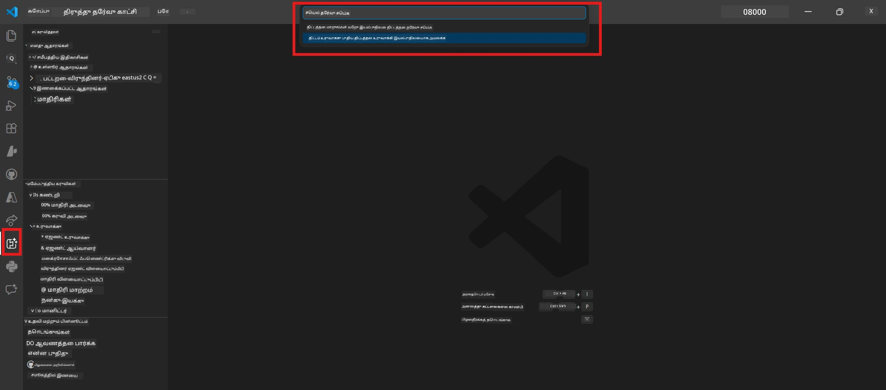
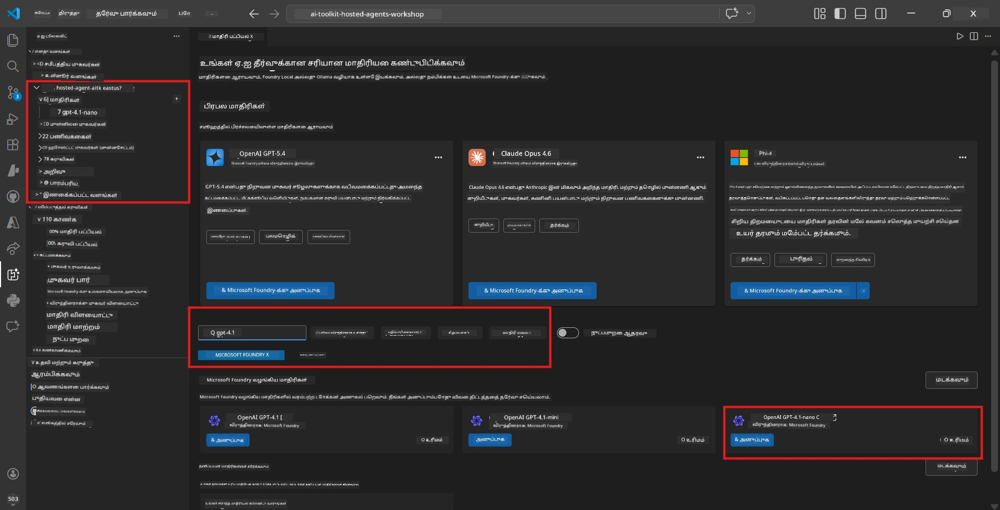
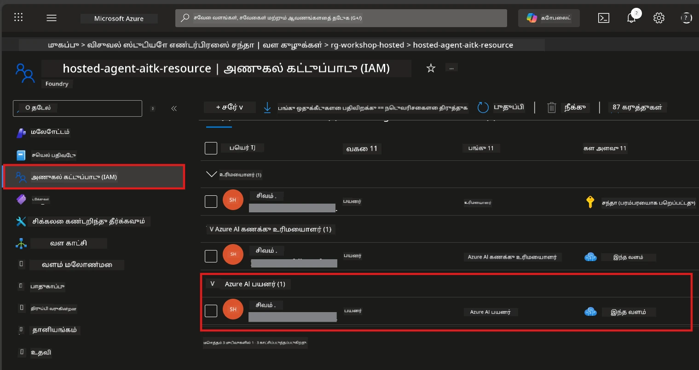

# Module 2 - ஒரு Foundry திட்டத்தை உருவாக்கவும் ஒரு மாதிரியை பிரசுரிக்கவும்

இந்த மோடியூலில், நீங்கள் Microsoft Foundry திட்டத்தை உருவாக்குகிறீர்கள் (அல்லது தேர்ந்தெடுக்கிறீர்கள்) மற்றும் உங்கள் முகவர் பயன்படுத்தும் மாதிரியை பிரசுரிக்கிறீர்கள். ஒவ்வொரு படியும் தெளிவாக எழுதியுள்ளது - அவைகளை வரிசையாக பின்பற்றவும்.

> உங்கள் கையில 이미 பிரசுரிக்கப்பட்ட மாதிரியுடன் இருக்கும் Foundry திட்டம் இருந்தால், [Module 3](03-create-hosted-agent.md) க்கு தாண்டி செல்லுங்கள்.

---

## படி 1: VS Code இலிருந்து Foundry திட்டத்தை உருவாக்கவும்

நீங்கள் Microsoft Foundry விரிவாக்கத்தை பயன்படுத்தி VS Code விட்டு வெளியே செல்லாமல் திட்டத்தை உருவாக்கலாம்.

1. **Command Palette** திறக்க `Ctrl+Shift+P` அழுத்தவும்.
2. தட்டச்சு செய்யுங்கள்: **Microsoft Foundry: Create Project** மற்றும் அதை தேர்வு செய்யவும்.
3. ஒரு Dropdown தோன்றும் - பட்டியலில் இருந்து உங்கள் **Azure சந்தா** தேர்வு செய்யவும்.
4. நீங்கள் **resource group** ஒன்றை தேர்வு செய்ய அல்லது உருவாக்க கேட்கப்படும்:
   - புதியதை உருவாக்க: ஒரு பெயரை தட்டச்சு செய்யவும் (எ.கா., `rg-hosted-agents-workshop`) மற்றும் Enter அழுத்தவும்.
   - ஏற்கனவே உள்ளதை பயன்படுத்த: Dropdown லிருந்து அதை தேர்வு செய்யவும்.
5. ஒரு **பிராந்தியம்** தேர்வு செய்யவும். **முக்கியம்:** Hosted agents ஐ ஆதரிக்கும் பிராந்தியத்தை தேர்வு செய்யவும். [பிராந்திய கிடைக்கும் இடங்கள்](https://learn.microsoft.com/azure/foundry/agents/concepts/hosted-agents#region-availability) பார்வையிடவும் - பொதுவான தேர்வுகள் `East US`, `West US 2`, அல்லது `Sweden Central`.
6. Foundry திட்டத்திற்கு ஒரு **பெயர்** வழங்கவும் (எ.கா., `workshop-agents`).
7. Enter அழுத்தி Provisioning முடிவடையும் வரை காத்திருங்கள்.

> **Provisioning 2-5 நிமிடங்கள் எடுக்கலாம்.** நீங்கள் VS Code கீழ் வலது மூலையில் ஒரு முன்னேற்ற அறிவிப்பை காண்பீர்கள். Provisioning நடைபெறும் போது VS Code மூட வேண்டாம்.

8. முடிந்தவுடன், **Microsoft Foundry** பக்கக்கோவையில் உங்கள் புதிய திட்டம் **Resources** கீழ் காணப்படும்.
9. திட்டத்தின் பெயரை கிளிக் செய்து விரிவாக்கி **Models + endpoints** மற்றும் **Agents** போன்ற பகுதிகள் காணப்படுகின்றன என்பதை உறுதிப்படுத்தவும்.



### மாற்றாக: Foundry போர்டல் மூலம் உருவாக்குதல்

உயிர்சூட்டும் உலாவியில் பயன்படுத்த விரும்பினால்:

1. [https://ai.azure.com](https://ai.azure.com) என்றதைக் খুলி உள்நுழையவும்.
2. முகப்புதளத்தில் **Create project** ஐ கிளிக் செய்யவும்.
3. திட்டத்தின் பெயர், சந்தா, resource group மற்றும் பிராந்தியத்தை தேர்வு செய்யவும்.
4. **Create** கிளிக் செய்து Provisioning முடிந்தும் காத்திருக்கவும்.
5. உருவாக்கப்பட்ட பின், VS Code-க்கு திரும்புங்கள் - புதுப்பிப்பிற்குப் பிறகு (refresh ஐ கிளிக் செய்யவும்) திட்டம் Foundry sidebar இல் தோன்றும்.

---

## படி 2: ஒரு மாதிரியை பிரசுரிக்கவும்

உங்கள் [hosted agent](https://learn.microsoft.com/azure/foundry/agents/concepts/hosted-agents) பதில்களை உருவாக்க Azure OpenAI மாதிரியை தேவைப்படுகின்றது. நீங்கள் [இப்போது ஒரு மாதிரியை பிரசுரிக்கலாம்](https://learn.microsoft.com/azure/ai-foundry/openai/how-to/create-resource#deploy-a-model).

1. **Command Palette** திறக்க `Ctrl+Shift+P` அழுத்தவும்.
2. தட்டச்சு செய்யுங்கள்: **Microsoft Foundry: Open [Model Catalog](https://learn.microsoft.com/azure/ai-foundry/openai/concepts/models)** மற்றும் அதை தேர்வு செய்யவும்.
3. Model Catalog பார்வை VS Code இல் திறக்கும். தேடல் பட்டையைப் பயன்படுத்தி அல்லது உலாவி **gpt-4.1** கண்டுபிடிக்கவும்.
4. **gpt-4.1** மாதிரி கார்டை (அல்லது குறைந்த செலவுக்கானது என்றால் `gpt-4.1-mini`) கிளிக் செய்யவும்.
5. **Deploy** கிளிக் செய்யவும்.


6. பிரசுர அமைப்பில்:
   - **Deployment name**: இயல்புநிலையை விட்டு விடவும் (எ.கா., `gpt-4.1`) அல்லது தனிப்பட்ட பெயரை தட்டச்சு செய்யவும். **இந்த பெயரை மறக்க வேண்டாம்** - Module 4 இல் தேவையானது.
   - **Target**: **Microsoft Foundryல் பிரசுரிக்கவும்** என்பதைக் தேர்வு செய்து தற்போது உருவாக்கிய திட்டத்தை தேர்ந்தெடுக்கவும்.
7. **Deploy** கிளிக் செய்து பிரசுரம் முடியும் வரை காத்திருக்கவும் (1-3 நிமிடங்கள்).

### மாதிரியை தேர்வு செய்தல்

| மாதிரி | சிறந்தது | செலவு | குறிப்பு |
|-------|----------|-------|---------|
| `gpt-4.1` | உயர்தர, நுண்ணறிவு பதில்கள் | அதிகம் | சிறந்த விளைவுகள், இறுதி சோதனைக்கு பரிந்துரைக்கப்படுகிறது |
| `gpt-4.1-mini` | விரைவு இடைவேளை, குறைந்த செலவு | குறைவு | பணிமனை மேம்பாடு மற்றும் விரைவு சோதனைகளுக்கு சிறந்தது |
| `gpt-4.1-nano` | எளிய பணி | மிகக் குறைவு | செலவு மிக குறைவு, ஆனால் பதில்கள் எளிமையானவை |

> **இந்த பணிமனை பரிந்துரை:** மேம்பாடு மற்றும் சோதனைகளுக்காக `gpt-4.1-mini` பயன்படுத்தவும். இது விரைவானது, மலிவு மற்றும் நல்ல முடிவுகளை தரும்.

### மாதிரி பிரசுரத்தை உறுதிசெய்தல்

1. **Microsoft Foundry** பக்கக்கோவையில் உங்கள் திட்டத்தை விரிவாக்கவும்.
2. **Models + endpoints** (அல்லது அதே மாதிரியான பகுதி) கீழே பாருங்கள்.
3. உங்கள் பிரசுரிக்கப்பட்ட மாதிரி (எ.கா., `gpt-4.1-mini`) **Succeeded** அல்லது **Active** நிலை என்பதை காணலாம்.
4. மாதிரி பிரசுரத்தை கிளிக் செய்து அதன் விவரங்களைப் பார்வையிடுங்கள்.
5. **இரண்டு மதிப்புகளை குறித்துக் கொள்ளுங்கள்** - Module 4 இல் தேவையானவை:

   | அமைப்பு | எங்கே காணலாம் | உதாரண மதிப்பு |
   |---------|----------------|----------------|
   | **Project endpoint** | Foundry பக்கக்கோவையில் திட்டத்தின் பெயரை கிளிக் செய்யவும். விவர பார்வையில் URL காணப்படும். | `https://<account>.services.ai.azure.com/api/projects/<project>` |
   | **Model deployment name** | பிரசுரிக்கப்பட்ட மாதிரியின் பெயர் காட்டப்படும். | `gpt-4.1-mini` |

---

## படி 3: தேவையான RBAC பொறுப்புகளை ஒதுக்கவும்

இந்த படி **மிகவும் பொதுவாக தவறுபடுகிறது**. சரியான பதவிகள் இல்லாமல் Module 6 இல் பிரசுரம் அனுமதி பிழை ஏற்படும்.

### 3.1 Azure AI User பதவியை உங்கள் வகிக்கு ஒதுக்கவும்

1. உலாவியில் [https://portal.azure.com](https://portal.azure.com) செல்லவும்.
2. மேல் தேடல் பட்டையில் உங்கள் **Foundry திட்டத்தின்** பெயரை தட்டச்சு செய்து முடிவுகளில் கிளிக் செய்யவும்.
   - **முக்கியம்:** நீங்கள் **திட்ட** வளத்தில் (Microsoft Foundry project வகை), பெற்றோர் கணக்கு/ஹப் வளத்திலல்ல.
3. திட்டத்தின் இடது பக்க வழிசெலுத்தலில் **Access control (IAM)** கிளிக் செய்யவும்.
4. மேல் பகுதியில் **+ Add** பொத்தானை கிளிக் செய்து → **Add role assignment** தேர்வு செய்யவும்.
5. **Role** தாவலில், [**Azure AI User**](https://learn.microsoft.com/azure/foundry/concepts/rbac-foundry#built-in-roles) என தேடிகொண்டு தேர்வு செய்யவும். **Next** கிளிக் செய்யவும்.
6. **Members** தாவலில்:
   - **User, group, or service principal** தேர்ந்தெடுக்கவும்.
   - **+ Select members** கிளிக் செய்யவும்.
   - உங்கள் பெயர் அல்லது மின்னஞ்சலை தேடி, தன்னை தேர்ந்தெடுத்து **Select** கிளிக் செய்யவும்.
7. **Review + assign** கிளிக் செய்து உறுதிப்படுத்தவும்.



### 3.2 (தேருமாறு) Azure AI Developer பதவியை ஒதுக்கவும்

நீங்கள் திட்டத்தில் கூடுதல் வளங்களை உருவாக்கவோ அல்லது பிரசுரங்களை நிரல்முறைமையாக நிர்வகிக்கவோ விரும்பினால்:

1. மேல் படிகளை மீண்டும் செய்யவும், ஆனால் படி 5 இல் **Azure AI Developer** தேர்வு செய்யவும்.
2. இது **Foundry resource (account)** நிலைமையில் ஒதுக்கப்பட வேண்டும், திட்ட மட்டத்தில் மட்டும் இல்லாமல்.

### 3.3 உங்கள் பதவிகள் ஒதுக்கீடுகளை சோதனை செய்யவும்

1. திட்டத்தின் **Access control (IAM)** பக்கத்தில் **Role assignments** தாவலை கிளிக் செய்யவும்.
2. உங்கள் பெயரைத் தேடி காணவும்.
3. திட்ட நாள்வகை அளவில் குறைந்தது **Azure AI User** பட்டியலிடப்பட்டிருப்பதை உறுதிப்படுத்தவும்.

> **இதன் முக்கியத்துவம்:** [`Azure AI User`](https://learn.microsoft.com/azure/foundry/concepts/rbac-foundry#built-in-roles) பதவி `Microsoft.CognitiveServices/accounts/AIServices/agents/write` தரவு செயலை வழங்குகிறது. இது இல்லாமல் பிரசுரத்தின் போது பிழை வரும்:
>
> ```
> Error: lacks the required data action 
> Microsoft.CognitiveServices/accounts/AIServices/agents/write 
> to perform POST /api/projects/{projectName}/assistants operation.
> ```
>
> கூடுதல் விவரங்களுக்கு [Module 8 - Troubleshooting](08-troubleshooting.md) பார்வையிடவும்.

---

### சரிபார்ப்பு பட்டியல்

- [ ] Foundry திட்டம் VS Code இல் Microsoft Foundry பக்கக்கோவையில் உள்ளது மற்றும் தெரியின்றது
- [ ] குறைந்தது ஒரு மாதிரி (எ.கா., `gpt-4.1-mini`) **Succeeded** நிலையில் பிரசுரித்தல்
- [ ] **திட்ட endpoint** URL மற்றும் **மாதிரி பிரசுர பெயர்** குறித்துக் கொண்டுள்ளீர்கள்
- [ ] Azure Portal → IAM → Role assignments இல் **Azure AI User** பதவி **திட்ட** அளவில் ஒதுக்கப்பட்டுள்ளதா
- [ ] Hosted agents க்கான [ஆதரிக்கப்படும் பிராந்தியம்](https://learn.microsoft.com/azure/foundry/agents/concepts/hosted-agents#region-availability) இல் திட்டம் உள்ளது

---

**முந்தைய:** [01 - Install Foundry Toolkit](01-install-foundry-toolkit.md) · **அடுத்தது:** [03 - Create a Hosted Agent →](03-create-hosted-agent.md)

---

<!-- CO-OP TRANSLATOR DISCLAIMER START -->
**எச்சரிக்கை**:  
இந்த ஆவணம் AI மொழிபெயர்ப்பு சேவை [Co-op Translator](https://github.com/Azure/co-op-translator) பயன்படுத்தி மொழிபெயர்க்கப்பட்டதாகும். நாங்கள் துல்லியத்துக்கு முயலுகிறோம் என்றாலும், தானாக மெய்ப்பித்த மொழிபெயர்ப்புகளில் பிழைகள் அல்லது தவறான தகவல்கள் இருக்கக்கூடும் என்பதை தயவுசெய்து கவனியுங்கள். அதன் அடிப்படையில், அசல் ஆவணம் native மொழியில் அதிகாரபூர்வமான மூலமாக கருதப்பட வேண்டும். முக்கியமான தகவல்களுக்கு, தொழில்முறை மனித மொழிபெயர்ப்பு பரிந்துரைக்கப்படுகிறது. இந்த மொழிபெயர்ப்பின் பயன்பாட்டினால் ஏற்படும் எந்தவொரு தவறுபாடுகளுக்கோ அல்லது தவறான விளக்கமானவைகளுக்கோ நாங்கள் பொறுப்பேற்க மாட்டோம்.
<!-- CO-OP TRANSLATOR DISCLAIMER END -->