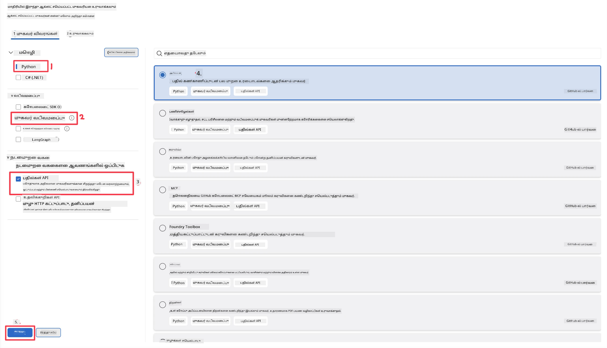
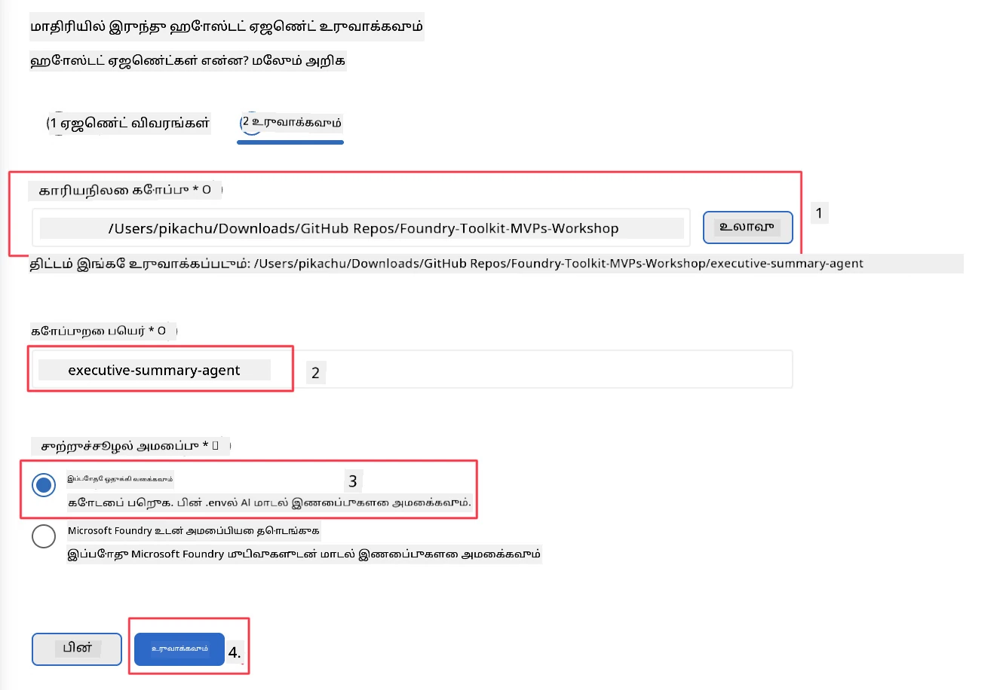

# Module 2 - ஒரு புதிய ஹோஸ்டட் ஏஜெண்ட் உருவாக்குதல்

⏱️ ~5 நிமிடங்கள்

இந்த தொகுதியில், நீங்கள் Foundry Toolkit-ஐ பயன்படுத்தி **ஒரு ஹோஸ்டட் ஏஜெண்ட் திட்டத்தை உருவாக்குவீர்கள்**. இந்த உருவாக்கி முழு திட்ட அமைப்பை - `agent.yaml`, `main.py`, `Dockerfile`, `requirements.txt`, மற்றும் VS Code டீபக் கட்டமைப்பை - உண்டாக்குகிறது, இதனால் நீங்கள் ஏஜெண்டின் நடத்தை தனிப்பயனாக்குவதில் கவனம் செலுத்த முடியும்.

> **முக்கியக் கருத்து:** இந்த ஆய்வகத்தில் உள்ள `agent/` கோப்புறை Foundry Toolkit உருவாக்கிய உதாரணமாகும். நீங்கள் இந்த கோப்புகளை துவக்கம் முதல் எழுத வேண்டியதில்லை.

### Scaffold wizard சுழற்சி

```mermaid
flowchart LR
    A["Command Palette:
    Create new Hosted Agent"] --> B["Language:
    Python"]
    B --> C["API type:
    Response API"]
    C --> D["Template:
    Basic - Agent Framework"]
    D --> E["மாதிரியை தேர்ந்தெடுக்கவும்"]
    E --> F["Workspace folder
    & agent name"]
    F --> G["உருபடியான திட்டம்"]

    style A fill:#4A90D9,color:#fff
    style B fill:#7B68EE,color:#fff
    style C fill:#7B68EE,color:#fff
    style D fill:#7B68EE,color:#fff
    style E fill:#7B68EE,color:#fff
    style F fill:#7B68EE,color:#fff
    style G fill:#27AE60,color:#fff
```



---

## படி 1: Create Hosted Agent விசாரத்தை திறக்கவும்

1. `Ctrl+Shift+P` அழுத்தி **Command Palette**-ஐ திறந்துகொள்ளவும்.
2. தட்டச்சு செய்யவும்: **Foundry Toolkit: Create new Hosted Agent** மற்றும் தேர்ந்தெடுக்கவும்.

> **மாற்று வழி: Foundry Portal மூலம் உருவாக்குதல்**
> உலாவி வழி விரும்பினால், உங்கள் திட்டத்தை [https://ai.azure.com](https://ai.azure.com) இல் உருவாக்கலாம். திட்டம் உருவாக்கப்பட்டதும், VS Code-க்கு திரும்பி **Foundry Toolkit** பக்கவாட்டு பட்டியில் இணைக்கவும்.

> **மற்றும்:** Foundry Toolkit பக்கவாட்டு பட்டியில் **Hosted Agents (Preview)** அருகே உள்ள **+** ஐ கிளிக் செய்யவும்.

## படி 2: அமைப்புகளை தேர்ந்தெடுக்கவும்



1. இடது வழிசெலவு/தேர்வுகள் பகுதியில் பின்வருமாறு தேர்ந்தெடுக்கவும்:

| மெனு | தேர்வு | குறிப்புகள் |
|--------|-----------|-------|
| **மொழி** | Python | C# கூட ஆதரவு பெற்றது |
| **உருவமைப்பு** | Agent Framework | Agent Framework SDK-ஐ பயன்படுத்தி எளிய துவக்கம் |
| **API வகை** | Response API | `POST /responses` - உரையாடல், தள மேலாண்மை செய்த வரலாறு உடன் |
| **வடிவம்** | Basic | Agent Framework SDK-ஐ பயன்படுத்திய எளிய துவக்கம் |

2. தேர்ந்தெடுத்த பின், **Next** பக்கத்தை கிளிக் செய்யவும்



3. அடுத்த சாளரத்தில் பின்வருமாறு தேர்ந்தெடுக்கவும்:

| மெனு | தேர்வு | குறிப்புகள் |
|--------|-----------|-------|
| **வேலைப்பொத்தி கோப்புறை** | இலக்கு கோப்புறையை தேர்வு செய்யவும் | உதாரணம்: `/workspace/Foundry_Toolkit_for_VSCode_Lab/` அல்லது இந்த ரெப்போவில் உள்ள ஓர் துணைக்கோப்புறை |
| **ஏஜெண்ட் பெயர்** | ஒரு பெயரை உள்ளிடவும் | உதாரணம்: `executive-summary-agent` |
| **சுற்றுச்சூழல் அமைப்பு** | தற்போது அமைப்பைத் தவிர்க்கவும் |  |

நமது ஏஜெண்டை உருவாக்க **create** ஐ கிளிக் செய்யவும். ஹோஸ்டட் ஏஜெண்ட் பெயர் கொண்ட புதிய கோப்புறை உருவாகும்.

## படி 3: உருவாக்கப்பட்ட திட்டத்தை ஆய்வு செய்தல்

Scaffold நிறைவடைந்ததும், இவற்றை எக்ஸ்புளோரரில் (`Ctrl+Shift+E`) காணும்படி உறுதிசெய்யவும்:

```
📂 my-agent/
├── .env                ← Environment variables (placeholders)
├── .vscode/
│   ├── launch.json     ← Debug config (F5 → run + Agent Inspector)
│   └── tasks.json      ← VS Code task definitions
├── agent.yaml          ← Agent definition (kind: hosted)
├── Dockerfile          ← Container config for deployment
├── main.py             ← Agent entry point (your main code)
└── requirements.txt    ← Python dependencies
```

### முக்கிய கோப்புகள் விளக்கம்

| கோப்பு | நோக்கம் |
|------|---------|
| `agent.yaml` | ஏஜெண்டை `kind: hosted` ஆக அறிவிக்கிறது, சுற்றுச்சூழல் மாறிலிகளை வரைபடம் செய்கிறது, `/responses` ஓர் புரோட்டோகால் வரையறுக்கிறது |
| `main.py` | `FoundryChatClient` உருவாக்குகிறது → அதனுடன் `Agent` உள்படுத்தப்பட்ட வழிகள் → `ResponsesHostServer` மூலம் போர்ட் 8088-ல் சேவை செய்கிறது |
| `Dockerfile` | `python:3.12-slim` பயன்படுத்துகிறது, சார்ந்த பொறியியல்களை நிறுவுகிறது, போர்ட் 8088-ஐ வெளிப்படுத்துகிறது, `main.py` ஓடுகிறது |
| `requirements.txt` | `agent-framework-foundry`, `agent-framework-foundry-hosting`, `mcp`, `debugpy` |

> **முக்கியம்:** Scaffold-ஆக உருவாக்கப்பட்ட ஏஜெண்ட் கோப்புறையை நேரடியாக VS Code-ல் (அவையே `agent/` கோப்புறை) திறக்கவும், அப்படிச் செய்தால் `.vscode/launch.json` மற்றும் `tasks.json` F5 டீபக்கிங் சரியாக வேலைசெய்யும்.

---

### ✅ சரிபார்க்கும் புள்ளிகள்

- [ ] Scaffold செய்யப்பட்ட திட்டம் எல்லா எதிர்பார்க்கப்பட்ட கோப்புகளுடன் உருவாக்கப்பட்டிருப்பதை உறுதி செய்க
- [ ] `agent.yaml` இல் `kind: hosted` மற்றும் `protocol: responses` உள்ளது
- [ ] `main.py`-ல் `Agent`, `FoundryChatClient`, `ResponsesHostServer` இறக்குமதி செய்யப்பட்டுள்ளது
- [ ] ஏஜெண்ட் கோப்புறை VS Code-ல் வேலைப்பொத்தி மூலமாக திறக்கப்பட்டுள்ளது

---

**முந்தையது:** [01 - அமைப்பு](01-setup.md) · **அடுத்தது:** [03 - கட்டமைக்கவும் & குறியிடவும் →](03-configure-and-code.md)

---

<!-- CO-OP TRANSLATOR DISCLAIMER START -->
**மறுப்பு**:
இந்த ஆவணம் AI மொழிபெயர்ப்பு சேவை [Co-op Translator](https://github.com/Azure/co-op-translator) பயன்படுத்தி மொழிபெயர்க்கப்பட்டுள்ளது. நாங்கள் துல்லியத்திற்காக முயற்சி செய்துள்ளோம், ஆனால் தானாக செய்யப்படும் மொழிபெயர்ப்புகளில் பிழைகள் அல்லது தவறுகள் இருக்கலாம் என்பதை கவனத்தில் கொள்ளவும். அசல் ஆவணம் அதன் தாய்மொழியில் அதிகாரப்பூர்வ ஆதாரமாக கருதப்பட வேண்டும். முக்கியமான தகவல்களுக்கு, தொழில்நுட்பமான மனித மொழிபெயர்ப்பு பரிந்துரைக்கப்படுகிறது. இந்த மொழிபெயர்ப்பைப் பயன்படுத்துவதால் ஏற்படும் எந்த தவறான புரிதல்கள் அல்லது தவறான விளக்கத்திற்கும் நாங்கள் பொறுப்பில்வில்லை.
<!-- CO-OP TRANSLATOR DISCLAIMER END -->