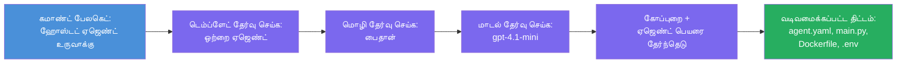

# Module 3 - புதிய ஹோஸ்ட் ஏஜெண்டை உருவாக்கவும் (Foundry நீட்சியால் தானாக உருவாக்கப்பட்டது)

இந்த முறைபாடில், Microsoft Foundry நீட்டிப்பை பயன்படுத்தி **புதிய [ஹோஸ்ட் ஏஜெண்ட்](https://learn.microsoft.com/azure/foundry/agents/concepts/hosted-agents) திட்டத்தை ஸ்காஃபோல்டு செய்ய** போகிறீர்கள். நீட்சி முழு திட்ட அமைப்பை உங்களுக்காக உருவாக்குகிறது - இதில் `agent.yaml`, `main.py`, `Dockerfile`, `requirements.txt`, ஒரு `.env` கோப்பு மற்றும் ஒரு VS Code டிபக் கட்டமைப்பு உள்ளடக்கம். ஸ்காஃபோல்டிங் முடிந்ததும், உங்கள் ஏஜெண்டின் வழிமுறைகள், கருவிகள் மற்றும் கட்டமைப்புகளுடன் இந்த கோப்புகளை தனிப்பயனாக்குகிறீர்கள்.

> **முக்கியக் கருத்து:** இந்த ஆய்வகத்தில் உள்ள `agent/` கோப்புறை Foundry நீட்சி இந்த ஸ்காஃபோல்டிங் கட்டளையை நீங்கள் இயக்கும் போது உருவாக்குகிறதற்கான உதாரணமாகும். நீங்கள் இந்த கோப்புக்களை முதலில் இருந்து எழுதவில்லை - நீட்சி அவற்றை உருவாக்குகிறது, பின்னர் நீங்கள் திருத்துகிறீர்கள்.

### ஸ்காஃபோல்ட் விசாரகர் ஓட்டம்


---

## படி 1: Create Hosted Agent விசாரகரை திறக்கவும்

1. `Ctrl+Shift+P` அழுத்தி **Command Palette** திறக்கவும்.
2. تایப் செய்யவும்: **Microsoft Foundry: Create a New Hosted Agent** மற்றும் அதை தேர்ந்தெடுக்கவும்.
3. ஹோஸ்ட் ஏஜெண்ட் உருவாக்க விசாரகர் திறக்கப்படும்.

> **மாற்று வழி:** Microsoft Foundry பக்கவாட்டு पट्टीஇல் இருந்து → **Agents** அருகில் உள்ள **+** சின்னத்தை கிளிக் செய்யவும் அல்லது வலது கிளிக் செய்து **Create New Hosted Agent** என்பதை தேர்ந்தெடுக்கவும்.

---

## படி 2: உங்கள் மாதிரியை தேர்ந்தெடுக்கவும்

விசாரகர் ஒரு மாதிரியைத் தேர்ந்தெடுக்க கேட்டுக் கொள்கிறது. நீங்கள் பின்வருமாறு விருப்பங்களை காண்பீர்கள்:

| மாதிரி | விளக்கம் | எப்போது பயன்படுத்த வேண்டும் |
|----------|-------------|-------------|
| **Single Agent** | தனிப்பட்ட மாடல், வழிமுறைகள் மற்றும் விருப்ப கருவிகள் கொண்ட ஒரு ஏஜெண்ட் | இந்த பணிக்கை (ஆய்வகம் 01) |
| **Multi-Agent Workflow** | தொடர் முறையில் ஒத்துழைக்கும் பல ஏஜெண்ட்கள் | ஆய்வகம் 02 |

1. **Single Agent** ஐ தேர்ந்தெடுக்கவும்.
2. **Next** ஐ கிளிக் செய்யவும் (அல்லது தேர்வு தானாக நகரும்).

---

## படி 3: நிரலாக்க மொழியை தேர்ந்தெடுக்கவும்

1. **Python** (இந்த பணிக்கைக்கு பரிந்துரைக்கப்பட்டது) தேர்ந்தெடுக்கவும்.
2. **Next** ஐ கிளிக் செய்யவும்.

> **C# குற்ற வடிவில் ஆதரிக்கப்படுகிறது** என்றால் நீங்கள் .NET விரும்பினால். ஸ்காஃபோல்ட் அமைப்பு ஒத்ததாகும் (`main.py` பதிலாக `Program.cs` பயன்படுத்தப்படுகிறது).

---

## படி 4: உங்கள் மாடலைத் தேர்ந்தெடுக்கவும்

1. விசாரகர் உங்கள் Foundry திட்டத்தில் (Module 2-இல் இருந்து) பதிக்கப்பட்ட மாடல்களை காட்டுகிறது.
2. நீங்கள் பதிக்கப்பட்ட மாடலை தேர்ந்தெடுக்கவும் - எடுத்துக்காட்டு: **gpt-4.1-mini**.
3. **Next** ஐ கிளிக் செய்யவும்.

> எந்த மாடல்களும் காணாமல் இருந்தால், [Module 2](02-create-foundry-project.md)-இல் திரும்ப சென்று ஒரு மாடலை முதலில் பதியவும்.

---

## படி 5: கோப்புறை இடம் மற்றும் ஏஜெண்ட் பெயரைத் தேர்ந்தெடுக்கவும்

1. ஒரு கோப்பு உரையாடல் திறக்கும் - திட்டம் உருவாக்கப்படும் ** இலக்கு கோப்புறையை** தேர்ந்தெடுக்கவும். இந்த பணிக்கைக்கு:
   - புதிதாக தொடங்கினால்: எந்த கோப்புறையையும் தேர்ந்தெடுக்கலாம் (எ.கா., `C:\Projects\my-agent`)
   - பணிக்கையின் மறைகோப்பகம் உள்ளே பணியாற்றினால்: `workshop/lab01-single-agent/agent/` கீழ் புதிய துணை கோப்புறை உருவாக்கவும்
2. ஹோஸ்ட் ஏஜெண்ட் க்கு ஒரு **பெயரை** உள்ளிடவும் (எ.கா., `executive-summary-agent` அல்லது `my-first-agent`).
3. **Create** ஐ கிளிக் செய்யவும் (அல்லது Enterஐ அழுத்தவும்).

---

## படி 6: ஸ்காஃபோல்டிங் முடியும் வரை காத்திருக்கவும்

1. VS Code ஒரு **புதிய சாளரம்** திறக்கும், ஸ்காஃபோல்டேடு திட்டத்துடன்.
2. திட்டம் முழுமையாக ஏற்றப்பட சில விநாடிகள் காத்திருக்கவும்.
3. கீழ்க்கண்ட கோப்புகளை Explorer பலகையில் (`Ctrl+Shift+E`) காணலாம்:

```
📂 my-first-agent/
├── .env                ← Environment variables (auto-generated with placeholders)
├── .vscode/
│   └── launch.json     ← Debug configuration (F5 to run + Agent Inspector)
├── agent.yaml          ← Agent definition (kind: hosted)
├── Dockerfile          ← Container configuration for deployment
├── main.py             ← Agent entry point (your main code file)
└── requirements.txt    ← Python dependencies
```

> **இந்த அமைப்பு இந்த ஆய்வகத்தில் உள்ள `agent/` கோப்புறையின் ஒத்தமைப்பாகும்**. Foundry நீட்சி தானாகவே இக்கோப்புக்களை உருவாக்குகிறது - நீங்கள் கையால் உருவாக்க தேவையில்லை.

> **ஆய்வக குறிப்புரை:** இந்த ஆய்வக மறைகோப்பகத்தில் `.vscode/` கோப்புறை **சுற்றுச்சூழல்根கோப்பில்** உள்ளது (ஒவ்வொரு திட்டத்திற்கும் உள்ளே அல்ல). இதில் பகிர்ந்த `launch.json` மற்றும் `tasks.json` இரு டிபக் கட்டமைப்புகளுடன் உள்ளது - **"Lab01 - Single Agent"** மற்றும் **"Lab02 - Multi-Agent"** - ஒவ்வொன்றும் சரியான ஆய்வக `cwd` நோக்குகளில் உள்ளன. நீங்கள் F5 அழுத்தும்போது, நீங்கள் பணியாற்றும் ஆய்வகத்துக்கான கட்டமைப்பை பட்டியலில் இருந்து தேர்ந்தெடுக்கவும்.

---

## படி 7: உருவாக்கப்பட்ட ஒவ்வொரு கோப்பையும் புரிந்துகொள்ளவும்

விசாரகர் உருவாக்கிய ஒவ்வொரு கோப்பையும் ஒரு நிமிடம் ஆய்வு செய்யவும். அவற்றை புரிந்துகொள்வது Module 4 (தனிப்பயனாக்கல்)க்கு முக்கியம்.

### 7.1 `agent.yaml` - ஏஜெண்ட் வரையறை

`agent.yaml`ஐ திறக்கவும். இது இதுபோல் காணப்படுகிறது:

```yaml
# yaml-language-server: $schema=https://raw.githubusercontent.com/microsoft/AgentSchema/refs/heads/main/schemas/v1.0/ContainerAgent.yaml

kind: hosted
name: my-first-agent
description: >
  A hosted agent deployed to Microsoft Foundry Agent Service.
metadata:
  authors:
    - Microsoft
  tags:
    - Azure AI AgentServer
    - Microsoft Agent Framework
    - Hosted Agent
protocols:
  - protocol: responses
    version: v1
environment_variables:
  - name: AZURE_AI_PROJECT_ENDPOINT
    value: ${PROJECT_ENDPOINT}
  - name: AZURE_AI_MODEL_DEPLOYMENT_NAME
    value: ${MODEL_DEPLOYMENT_NAME}
dockerfile_path: Dockerfile
resources:
  cpu: '0.25'
  memory: 0.5Gi
```

**முக்கிய புலங்கள்:**

| புலம் | நோக்கம் |
|-------|---------|
| `kind: hosted` | இது ஒரு ஹோஸ்ட் ஏஜெண்ட் (கண்டெய்னர் அடிப்படையிலான, [Foundry Agent Service](https://learn.microsoft.com/azure/foundry/agents/overview)க்கு பதிக்கப்பட்டது என்பதை அறிவிக்கிறது) |
| `protocols: responses v1` | ஏஜெண்ட் OpenAI-ஐ பிடிக்கும் `/responses` HTTP முடிவுக்கான சேவை செய்கிறது |
| `environment_variables` | `.env` மதிப்புகளை பயன்பாட்டுக்கான கட்டமைப்பின் போது கண்டெய்னர் சுற்றுச்சூழல் மாறிகளில் இணைக்கிறது |
| `dockerfile_path` | கண்டெய்னர் படிமத்தை கட்டுவதற்கான Dockerfileஐ சுட்டிக்காட்டுகிறது |
| `resources` | கண்டெய்னருக்கான CPU மற்றும் மெமரி ஒதுக்கீடு (0.25 CPU, 0.5Gi மெமரி) |

### 7.2 `main.py` - ஏஜெண்ட் நுழைவு புள்ளி

`main.py`ஐ திறக்கவும். உங்கள் ஏஜெண்ட் லாஜிக் உள்ள முக்கிய Python கோப்பு இது. ஸ்காஃபோல்ட் இடையில் உள்ளவை:

```python
from agent_framework.azure import AzureAIAgentClient
from azure.ai.agentserver.agentframework import from_agent_framework
from azure.identity.aio import DefaultAzureCredential
```

**முக்கிய இறக்குமதிகள்:**

| இறக்குமதி | நோக்கம் |
|--------|--------|
| `AzureAIAgentClient` | உங்கள் Foundry திட்டத்துடன் இணைந்து `.as_agent()` மூலம் ஏஜெண்ட்களை உருவாக்குகிறது |
| [`DefaultAzureCredential`](https://learn.microsoft.com/azure/developer/python/sdk/authentication/credential-chains#defaultazurecredential-overview) | பரிசோதனை சமர்ப்பிக்கின்றது (Azure CLI, VS Code உள்நுழைவு, மேலாண்மை அடையாளம் அல்லது சேவை பிரதிநிதி) |
| `from_agent_framework` | ஏஜெண்டை HTTP சேவையகமாக மாற்றி `/responses` முடிவைக் காட்டு |

முக்கிய ஓட்டம்:
1. அனுமதி உருவாக்கு → கிளையண்ட் உருவாக்கு → `.as_agent()` மூலம் ஏஜெண்ட் பெறு (அசின்க் கட்டுப்பாட்டாளர்) → அதனை சேவையகமாக மூடு → ஓடு

### 7.3 `Dockerfile` - கண்டெய்னர் படம்

```dockerfile
FROM python:3.14-slim

WORKDIR /app

COPY ./ .

RUN pip install --upgrade pip && \
    if [ -f requirements.txt ]; then \
        pip install -r requirements.txt; \
    else \
        echo "No requirements.txt found" >&2; exit 1; \
    fi

EXPOSE 8088

CMD ["python", "main.py"]
```

**முக்கிய விவரங்கள்:**
- அடிப்படையாய் `python:3.14-slim` யை பயன்படுத்துகிறது.
- அனைத்து திட்ட கோப்புக்களையும் `/app` இல் நகலெடுக்கிறது.
- `pip`ஐ மேம்படுத்து, `requirements.txt` இலிருந்து சார்புகளை நிறுவுகிறது, அந்த கோப்பு இல்லையெனில் உடனே தோல்வி அடைகிறது.
- **போர்ட் 8088ஐ வெளிப்படுத்துகிறது** - இது ஹோஸ்ட் ஏஜெண்ட்களுக்கான தேவையான போர்ட். இதனை மாற்ற வேண்டாம்.
- `python main.py` க்கு ஏஜெண்ட் தொடங்குகிறது.

### 7.4 `requirements.txt` - சார்புக்கள்

```
agent-framework-azure-ai==1.0.0rc3
agent-framework-core==1.0.0rc3
azure-ai-agentserver-agentframework==1.0.0b16
azure-ai-agentserver-core==1.0.0b16
debugpy
agent-dev-cli
```

| பாக்கேஜ் | நோக்கம் |
|---------|---------|
| `agent-framework-azure-ai` | Microsoft Agent Framework க்கான Azure AI ஒருங்கிணைப்பு |
| `agent-framework-core` | ஏஜெண்ட்கள் உருவாக்கற்கான கோர் ரன்டைம் (`python-dotenv` உடன்) |
| `azure-ai-agentserver-agentframework` | Foundry Agent Service க்கான ஹோஸ்ட் ஏஜெண்ட் சேவையக ரன்டைம் |
| `azure-ai-agentserver-core` | கோர் ஏஜெண்ட் சேவையக அப்ஸ்ட்ராக்ஷன்கள் |
| `debugpy` | Python டிபக் ஆதரவு (VS Code இல் F5 டிபக்கிங் அனுமதிக்கிறது) |
| `agent-dev-cli` | ஏஜெண்ட்கள் சோதனைக்கான உள்ளூர் மேம்பாட்டு CLI (டிபக்/ஓடு கட்டமைப்பால் பயன்படுத்தப்படுகிறது) |

---

## ஏஜெண்ட் நெறிமுறையை புரிந்துகொள்

ஹோஸ்ட் ஏஜெண்ட்கள் **OpenAI Responses API** நெறிமுறையைப் பயன்படுத்தி தொடர்பு கொள்கின்றன. இயக்குகையில் (உள்ளூரில் அல்லது மேகத்தில்), ஏஜெண்ட் ஒரு HTTP முடிவை வெளிப்படுத்துகிறது:

```
POST http://localhost:8088/responses
Content-Type: application/json

{
  "input": "Your prompt here",
  "stream": false
}
```

Foundry Agent Service இந்த முடிவை அழைத்து பயனர் கேள்விகளை அனுப்பி, ஏஜெண்ட் பதில்களை பெறுகிறது. இது OpenAI API பயன்படுத்தும் அதே நெறிமுறை ஆகும், ஆகவே உங்கள் ஏஜெண்ட் OpenAI Responses வடிவத்தை பேசும் எந்த கிளையண்டுக்கும் பொருந்தும்.

---

### சரிபார்ப்பு

- [ ] ஸ்காஃபோல்ட் விசாரகர் வெற்றிகரமாக முடிந்தது மற்றும் ஒரு **புதிய VS Code சாளரம்** திறந்தது
- [ ] நீங்கள் 5 கோப்புகளையும் காண்கிறீர்கள்: `agent.yaml`, `main.py`, `Dockerfile`, `requirements.txt`, `.env`
- [ ] `.vscode/launch.json` கோப்பு இருக்கிறது (F5 டிபக்கொக்கு உதவுகிறது - இந்த ஆய்வகத்தில் சுற்றுச்சூழல்根கோப்பில் உள்ளது மற்றும் ஆய்வகவியல் கட்டமைப்புகளுடன் உள்ளது)
- [ ] ஒவ்வொரு கோப்பையும் வாசித்து அதன் நோக்கத்தை புரிந்துகொண்டீர்கள்
- [ ] போர்ட் `8088` தேவையானது மற்றும் `/responses` முடிவு நெறிமுறையாக இருப்பது புரிந்துகொண்டீர்கள்

---

**முந்தைய:** [02 - Foundry திட்டத்தை உருவாக்கவும்](02-create-foundry-project.md) · **அடுத்தது:** [04 - கட்டமைக்கவும் & குறியிடவும் →](04-configure-and-code.md)

---

<!-- CO-OP TRANSLATOR DISCLAIMER START -->
**தலைப்புச் சுட்டுரை**:  
இந்த ஆவணம் AI மொழிபெயர்ப்பு சேவையான [Co-op Translator](https://github.com/Azure/co-op-translator) மூலம் மொழிபெயர்க்கப்பட்டுள்ளது. நாம் துல்லியத்துக்காக முயலினாலும், தானியக்க மொழிபெயர்ப்புகளில் பிழைகள் அல்லது தவறுகள் இருக்கலாம் என்பதை कृபயா அறிந்துகொள்ளவும். அசல் ஆவணம் அதன் சொந்த மொழியில் அதிகாரப்பூர்வ மூலமாக கருதப்பட வேண்டும். முக்கியமான தகவல்களுக்கு, தொழில்முறை மனித மொழிபெயர்ப்பு பரிந்துரைக்கப்படுகிறது. இந்த மொழிபெயர்ப்பின் பயன்பாட்டினால் உருவாகும் தவறான புரிதல்கள் அல்லது தவறான விளக்கங்களுக்கு நாங்கள் பொறுப்பல்ல.
<!-- CO-OP TRANSLATOR DISCLAIMER END -->