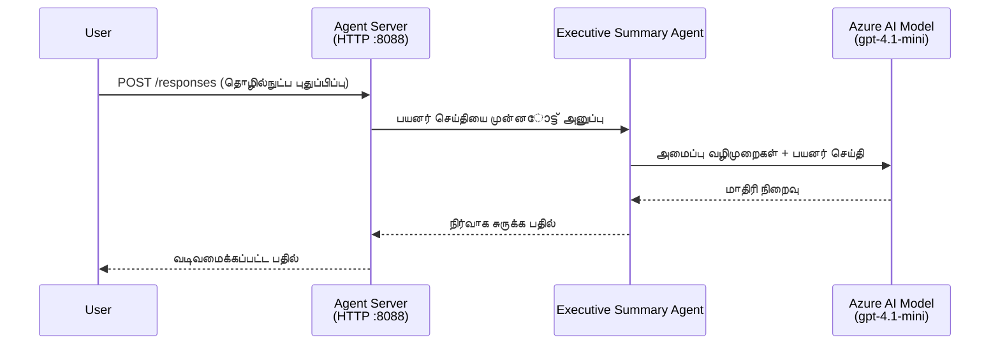
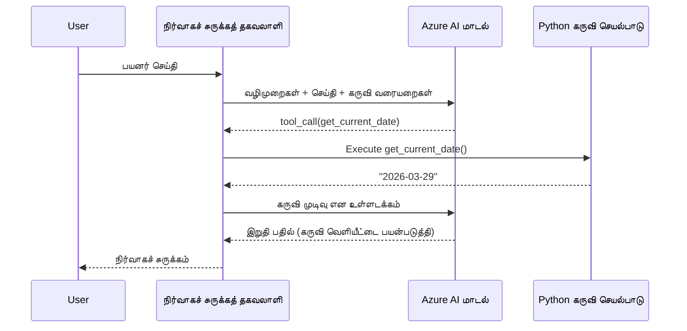

# Module 4 - கட்டளைகள், சுற்றுச்சூழல் மற்றும் சார்பு பொருட்களை நிறுவ செட்டப் செய்தல்

இந்த தொகுதியில், நீங்கள் தொகுதி 3-ல் தானாக தோன்றிய முகவரின் கோப்புகளை தனிப்பயனாக்குகிறீர்கள். இங்கு நீங்கள் பொதுவான ஸ்காஃபோல்டை **உங்கள்** முகவரியாக மாற்றுவீர்கள் - கட்டளைகளை எழுதுதல், சுற்றுச்சூழல் மாறிலிகளை அமைத்தல், விருப்பமாக கருவிகளைக் கூட்டுதல் மற்றும் சார்பு பொருட்களை நிறுவுதல்.

> **நினைவூட்டு:** Foundry விரிவகம் தானாக உங்கள் திட்டக் கோப்புகளை உருவாக்கியுள்ளது. இப்போது நீங்கள் அவற்றை மாற்றுகிறீர்கள். தனிப்பயனாக்கப்பட்ட முகவரின் முழுமையான எடுத்துக்காட்டிற்கு [`agent/`](../../../../../workshop/lab01-single-agent/agent) கோப்புறை பார்க்கவும்.

---

## கூறுகள் எப்படி இணைக்கப்படுகின்றன

### கோரிக்கை ஆயுள் சுழற்சி (ஒற்றை முகவர்)


> **கருவிகளுடன்:** முகவரிடம் பதிவு செய்யப்பட்ட கருவிகள் இருந்தால், மாடல் நேரடி முடிவின் பதிலாக கருவி அழைப்பை வழங்கக்கூடும். கட்டமைப்பு கருவியை உள்ளகமாக இயக்கி, முடிவை மாடலுக்கு வழங்கி, அதன் பின் மாடல் இறுதி பதிலை உருவாக்கும்.


---

## படி 1: சுற்றுச்சூழல் மாறிலிகளை செட்டப்புசெய்தல்

ஸ்காஃபோல் ஒரு `.env` கோப்பை வைக்கும் இடைமுக மதிப்புகளுடன் உருவாக்கியது. நீங்கள் தொகுதி 2-இல் உள்ள உண்மையான மதிப்புகளை நிரப்ப வேண்டும்.

1. உங்கள் ஸ்காஃபோல்டு திட்டத்தில் **`.env`** கோப்பினை திறக்கவும் (இது திட்டத்தின் வேர் அடைவில் உள்ளது).
2. இடைமுக மதிப்புகளை உங்கள் உண்மையான Foundry திட்ட விவரங்களுடன் மாற்றவும்:

   ```env
   PROJECT_ENDPOINT=https://<your-account>.services.ai.azure.com/api/projects/<your-project>
   MODEL_DEPLOYMENT_NAME=gpt-4.1-mini
   ```

3. கோப்பை சேமிக்கவும்.

### இந்த மதிப்புகளை எங்கு காணலாம்

| மதிப்பு | எங்கு காணலாம் |
|--------|----------------|
| **திட்ட இறுதி புள்ளி** | VS Code-இல் **Microsoft Foundry** பக்க பட்டியலை திறக்கவும் → உங்கள் திட்டத்தைக் கிளிக் செய்க → இறுதி புள்ளி URL விவரத்தில் காட்டப்படும். இது `https://<account-name>.services.ai.azure.com/api/projects/<project-name>` போல இருக்கும் |
| **மாடல் வெளியீட்டு பெயர்** | Foundry பக்க பட்டியை விரிவாக்கி உங்கள் திட்டத்தைக் காணவும் → **Models + endpoints** கீழ் பார்க்கவும் → வெளியிடப்பட்ட மாடலுக்கு அடுத்தே பெயர் காணப்படும் (எ.கா., `gpt-4.1-mini`) |

> **பாதுகாப்பு:** `.env` கோப்பை பதிப்புக் கட்டுப்பாட்டிற்கு ஒருபோதும் சமர்ப்பிக்க வேண்டாம். இது இயல்பாக `.gitignore`-இல் சேர்க்கப்பட்டுள்ளது. இல்லையெனில், சேர்க்கவும்:
> ```
> .env
> ```

### சுற்றுச்சூழல் மாறிலிகள் எப்படி ஓடுகின்றன

மேற்பார்வை: `.env` → `main.py` (`os.getenv` மூலம் வாசிக்கும்) → `agent.yaml` (விமானத்தில் சுற்றுச்சூழல் மாறிலிகளுக்கு வரைபடம்).

`main.py`ல், ஸ்காஃபோல் இந்த மதிப்புகளை இவ்வாறு வாசிக்கின்றது:

```python
PROJECT_ENDPOINT = os.getenv("AZURE_AI_PROJECT_ENDPOINT") or os.getenv("PROJECT_ENDPOINT")
MODEL_DEPLOYMENT_NAME = os.getenv("AZURE_AI_MODEL_DEPLOYMENT_NAME", os.getenv("MODEL_DEPLOYMENT_NAME", "gpt-4.1-mini"))
```

`AZURE_AI_PROJECT_ENDPOINT` மற்றும் `PROJECT_ENDPOINT` இரண்டும் ஏற்றுக்கொள்ளப்படுகின்றன (`agent.yaml` `AZURE_AI_*` முன்னொட்டைப் பயன்படுத்துகிறது).

---

## படி 2: முகவர் கட்டளைகளை எழுதியல்

இது மிக முக்கியமான தனிப்பயனாக்க படி. கட்டளைகள் உங்கள் முகவரின் தன்மையையும், நடத்தையையும், வெளியீட்டு வடிவத்தையும், மற்றும் பாதுகாப்பு வரம்புகளையும் வரையறுக்கும்.

1. உங்கள் திட்டத்தில் `main.py`-ஐ திறக்கவும்.
2. கட்டளைகள் வரிசையை (ஸ்காஃபோல் வழக்கமாக அளிக்கும் பொதுவான ஒன்றை) காணவும்.
3. அதனை விரிவான, கட்டமைக்கப்பட்ட கட்டளைகளால் மாற்றவும்.

### ஏற்கனவே நன்கு எழுதப்பட்ட கட்டளைகளில் என்ன இருக்க வேண்டும்

| கூறு | நோக்கு | எடுத்துக்காட்டு |
|-------|--------|---------------|
| **பங்கை** | முகவர் யார் என்றும் என்ன செய்கிறார் என்றும் | "நீங்கள் ஒரு நிர்வாக சுருக்கம் முகவர்" என்று |
| **கேள்வியாளர்** | பதில்கள் யாருக்கானவை | "அறிவியல் பின்னணியில்லா மூத்த தலைவர்கள்" |
| **உள்ளீடு வரையறை** | எந்த வகை கேள்விகளை கையாள்வது | "தொழில்நுட்ப சம்பவ அறிக்கைகள், செயற்பாட்டு புதுப்பிப்புகள்" |
| **வெளியீட்டு வடிவம்** | பதில்களின் சீரான அமைப்பு | "நிர்வாக சுருக்கம்: - என்ன நடந்தது: ... - வியாபார தாக்கம்: ... - அடுத்த படி: ..." |
| **விதிகள்** | கட்டுப்பாடுகள் மற்றும் மறுக்கல் நிலைகள் | "உள்ளருந்த தகவல்களைத் தவிர மேலதிகம் சேர்க்க வேண்டாம்" |
| **பாதுகாப்பு** | தவறான பயன்படுத்தல் மற்றும் தவறான தகவலைத் தடுப்பது | "உள்ளீடு தெளிவற்றால், தெளிவுபடுத்த கேளுங்கள்" |
| **மாதிரிகள்** | நடத்தை வழி நடத்த உதவும் உள்ளீடு/வெளியீடு ஜோடிகள் | வேறுபட்ட உள்ளீடுகளுடன் 2-3 மாதிரிகள் சேர்க்கவும் |

### எடுத்துக்காட்டு: நிர்வாக சுருக்க முகவர் கட்டளைகள்

பருவப்பயிற்சியின் [`agent/main.py`](../../../../../workshop/lab01-single-agent/agent/main.py)ல் பயன்படுத்திய கட்டளைகள்:

```python
AGENT_INSTRUCTIONS = """You are an "Explain Like I'm an Executive" agent.

Purpose:
Your job is to translate complex technical or operational information into
clear, concise, and outcome-focused summaries that can be easily understood
by non-technical executives.

Audience:
Senior leaders with limited technical background who care about impact,
risk, and what happens next.

What you must do:
- Rephrase the input so it is understandable to a non-technical audience
- Prioritize clarity, brevity, and outcomes over technical accuracy
- Remove technical jargon, logs, metrics, stack traces, and deep root-cause details
- Translate technical causes into simple cause-and-effect statements
- Explicitly call out business impact
- Always include a clear next step or action
- Maintain a neutral, factual, and calm executive tone
- Do NOT add new facts or speculate beyond the input

Standard Output Structure (always use this wording):

Executive Summary:
- What happened: <plain-language description>
- Business impact: <clear, non-technical impact>
- Next step: <clear action or mitigation>

Rules:
- Keep responses under 100 words
- Do NOT add facts beyond the input
- If input is unclear, ask for clarification
"""
```

4. `main.py`ல் உள்ள தற்போது உள்ள கட்டளைகள் வரிசையை உங்கள் தனிப்பயன் கட்டளைகளுடன் மாற்றவும்.
5. கோப்பை சேமிக்கவும்.

---

## படி 3: (தேர்வுக்கு) தனிப்பயனான கருவிகள் சேர்க்க

ஓரங்கூரங்களை **உள்ளக Python செயல்பாடுகளாக** [கருவிகள்](https://learn.microsoft.com/azure/foundry/agents/concepts/tool-catalog) ஆக இயக்க முடியும். இது Prompt மட்டும் கொண்ட முகவர்களைவிட நிரல் அடிப்படையிலான ஓரங்கூரங்களுக்கான முக்கிய நன்மை - உங்கள் முகவர் விருப்பப்படி சேவையக பக்க சிந்தனையை இயக்க முடியும்.

### 3.1 கருவி செயல்பாடை வரையறு

`main.py`ல் கருவி செயல்பாடைச் சேர்க்கவும்:

```python
from agent_framework import tool

@tool
def get_current_date() -> str:
    """Returns the current date in YYYY-MM-DD format."""
    from datetime import date
    return str(date.today())
```

`@tool` அலங்காரி ஒரு சாதாரண Python செயல்பாட்டை முகவர் கருவியாக மாற்றுகிறது. ஆவண சரம் அந்த கருவியின் விவரணையாக மாடல் பார்க்கும்.

### 3.2 முகவருடன் கருவியை பதிவு செய்க

`.as_agent()` வகுப்புப்பயர்வாளர் மூலம் முகவரைக் கொட்டும்போது, `tools` இடத்தைப் பயன்படுத்தி கருவியை இடுக:

```python
async with AzureAIAgentClient(
    project_endpoint=PROJECT_ENDPOINT,
    model_deployment_name=MODEL_DEPLOYMENT_NAME,
    credential=credential,
).as_agent(
    name="my-agent",
    instructions=AGENT_INSTRUCTIONS,
    tools=[get_current_date],
) as agent:
    server = from_agent_framework(agent)
    await server.run_async()
```

### 3.3 கருவி அழைப்புகள் எவ்வாறு செயற்படுகின்றன

1. பயனர் ஒரு கேள்வி அனுப்புகிறான்.
2. மாடல் கேள்வியையும் கட்டளைகளையும் கருவி விவரங்களையும் பார்த்து கருவி தேவையா என தீர்மானிக்கிறது.
3. கருவி தேவைப்பட்டால், கட்டமைப்பு உங்கள் Python செயல்பாட்டைக் உள்ளகமாக(container) அழைக்கிறது.
4. கருவி வழங்கும் மதிப்பு மாடலுக்கு சூழலாக அனுப்பப்படுகிறது.
5. மாடல் இறுதி பதிலை உருவாக்குகிறது.

> **கருவிகள் சேவையக பக்கத்தில் இயங்குகின்றன** - அவை உங்கள் வண்டையின் உள்ளே இயங்கும், பயனர் உலாவியாளர் அல்லது மாடலில் அல்ல. இது தரவுத்தளங்கள், APIகள், கோப்பு முறைகள் அல்லது Python நூலகங்களை அணுகுவதற்கு அனுமதிக்கும்.

---

## படி 4: தனித்த Python சூழலை உருவுசெய் மற்றும் இயக்கு

சார்புகளை நிறுவுவதற்கு முன் தனித்த Python சூழலை உருவாக்குங்கள்.

### 4.1 தனித்த சூழலை உருவுசெய்

VS Code இல் ஒரு கமாண்ட் வரிசை திறக்க (`` Ctrl+` ``) மற்றும் இயக்கவும்:

```powershell
python -m venv .venv
```

அது உங்கள் திட்ட அடைவில் `.venv` என்ற கோப்புறையை உருவாக்கும்.

### 4.2 தனித்த சூழலை இயக்கு

**PowerShell (Windows):**

```powershell
.\.venv\Scripts\Activate.ps1
```

**கமாண்ட் ப்ராம்ட் (Windows):**

```cmd
.venv\Scripts\activate.bat
```

**macOS/Linux (Bash):**

```bash
source .venv/bin/activate
```

உங்கள் டெர்மினலின் தொடக்கத்தில் `(.venv)` தோன்றும், இது தனித்த சூழல் இயங்கிவருகிறது என்பதைக் குறிக்கிறது.

### 4.3 சார்புகளை நிறுவு

தனித்த சூழல் இயங்குகையில் தேவையான தொகுப்புகளை நிறுவவும்:

```powershell
pip install -r requirements.txt
```

இவை நிறுவப்படும்:

| தொகுப்பு | நோக்கம் |
|----------|---------|
| `agent-framework-azure-ai==1.0.0rc3` | [Microsoft Agent Framework](https://learn.microsoft.com/agent-framework/overview/) க்கான Azure AI ஒருங்கிணைப்பு |
| `agent-framework-core==1.0.0rc3` | முகவர்களை கட்டமைக்க கோர் ஓப்ப மனை (python-dotenv உடன்) |
| `azure-ai-agentserver-agentframework==1.0.0b16` | [Foundry Agent Service](https://learn.microsoft.com/azure/foundry/agents/overview) இற்கான ஹோஸ்ட் செய்யப்பட்ட முகவர் சேவை ஓப்ப முறை |
| `azure-ai-agentserver-core==1.0.0b16` | கோர் முகவர் சேவை சுருக்கல்கள் |
| `debugpy` | Python பிழைத்திருத்தம் (VS Code இல் F5 பிழைத்திருத்தம் இயக்க) |
| `agent-dev-cli` | முகவர்கள் சோதனைக்கும் உள்ளக வளர்ச்சிக்கான CLI |

### 4.4 நிறுவலை சரிபார்

```powershell
pip list | Select-String "agent-framework|agentserver"
```

எதிர்பார்க்கப்படும் வெளியீடு:
```
agent-framework-azure-ai   1.0.0rc3
agent-framework-core       1.0.0rc3
azure-ai-agentserver-agentframework 1.0.0b16
azure-ai-agentserver-core  1.0.0b16
```

---

## படி 5: அங்கீகாரத்தை சரிபார்

முகவர் [`DefaultAzureCredential`](https://learn.microsoft.com/azure/developer/python/sdk/authentication/credential-chains#defaultazurecredential-overview) ஐப் பயன்படுத்துகிறது, இது கீழ்க்காணும் அங்கீகார முறைகளை வரிசைப்படி முயல்கிறது:

1. **சுற்றுச்சூழல் மாறிலிகள்** - `AZURE_CLIENT_ID`, `AZURE_TENANT_ID`, `AZURE_CLIENT_SECRET` (சேவை பிரதிநிதி)
2. **Azure CLI** - உங்கள் `az login` அமர்வை எடுத்துக்கொள்கிறது
3. **VS Code** - நீங்கள் உள்நுழைந்துள்ள கணக்கைப் பயன்படுத்துகிறது
4. **Managed Identity** - Azure-ல் இயக்கும் போது (விமான நேரத்தில்) பயன்படுத்தப்படும்

### 5.1 உள்ளூர்வள வளர்ச்சிக்கான சோதனை

குறைந்தது இதன் யாரோ ஒன்று வேலை செய்ய வேண்டும்:

**விருப்பம் A: Azure CLI (பிரதிபலிக்கப்படும்)**

```powershell
az account show --query "{name:name, id:id}" --output table
```

எதிர்பார்ப்பு: உங்கள் சந்தா பெயர் மற்றும் ஐடி காட்டப்படும்.

**விருப்பம் B: VS Code உள்நுழைவு**

1. VS Code வின் கீழே இடது பக்கத்தில் **Accounts** ஐகான் காணவும்.
2. உங்கள் கணக்கு பெயர் இருந்தால், நீங்கள் அங்கீகரிக்கப்பட்டுள்ளீர்கள்.
3. இல்லையெனில், ஐகானை அழுத்தி → **Microsoft Foundry உடன் உள்நுழையவும்**.

**விருப்பம் C: சேவை பிரதிநிதி (CI/CD க்கு)**

```powershell
$env:AZURE_TENANT_ID = "<your-tenant-id>"
$env:AZURE_CLIENT_ID = "<your-client-id>"
$env:AZURE_CLIENT_SECRET = "<your-client-secret>"
```

### 5.2 பொதுவான அங்கீகாரப் பிரச்சாரம்

நீங்கள் பல Azure கணக்குகளில் உள்நுழைந்திருந்தால், சரியான சந்தா தேர்ந்தெடுக்கப்பட்டதா என உறுதி செய்யவும்:

```powershell
az account set --subscription "<your-subscription-id>"
```

---

### சோதனை பட்டியல்

- [ ] `.env` கோப்பில் செல்லுபடியான `PROJECT_ENDPOINT` மற்றும் `MODEL_DEPLOYMENT_NAME` உள்ளன (இடைமுகங்கள் அல்ல)
- [ ] முகவர் கட்டளைகள் `main.py`ல் தனிப்பயனாக்கப்பட்டுள்ளன - இதில் பங்கு, கேள்வியாளர், வெளியீட்டு வடிவம், விதிகள் மற்றும் பாதுகாப்பு வரம்பு வரையறுக்கப்பட்டுள்ளன
- [ ] (தேர்வுக்கு) தனிப்பயன் கருவிகள் வரையறுக்கப்பட்டு பதிவு செய்யப்பட்டுள்ளன
- [ ] தனித்த சூழல் உருவாக்கப்பட்டு இயக்கப்பட்டுள்ளது (`(.venv)` டெர்மினல் தொடக்கம் பக்கத்தில் தெரிகிறது)
- [ ] `pip install -r requirements.txt` பிழைகள் இல்லாமல் முடிந்துள்ளது
- [ ] `pip list | Select-String "azure-ai-agentserver"` எனும் கட்டளை நிறுவப்பட்ட தொகுப்பை காட்டுகிறது
- [ ] அங்கீகாரம் செல்லுபடியானது - `az account show` உங்கள் சந்தாவை திருப்பி காட்டுகிறது அல்லது நீங்கள் VS Code-இல் உள்நுழைந்துள்ளீர்கள்

---

**முந்தைய:** [03 - Create Hosted Agent](03-create-hosted-agent.md) · **அடுத்தது:** [05 - Test Locally →](05-test-locally.md)

---

<!-- CO-OP TRANSLATOR DISCLAIMER START -->
**குறிப்புரை**:  
இந்த ஆவணம் AI மொழி மாற்ற சேவை [Co-op Translator](https://github.com/Azure/co-op-translator) பயன்படுத்தி மொழிமாற்றம் செய்யப்பட்டுள்ளது. துல்லியத்திற்காக நாம் முயற்சி செய்தாலும், தானாக செய்யப்பட்ட மொழிமாற்றங்களில் பிழைகள் அல்லது தவறுகள் இருக்கக்கூடும் என கவனிக்கவும். அசல் ஆவணம் அதன் சொந்த மொழியில் அதிகாரபூர்வ மூலமாக கருதப்பட வேண்டும். அவசியமான தகவலுக்கு, திறமையான மனித மொழிமாற்றம் பரிந்துரைக்கப்படுகிறது. இந்த மொழிமாற்றத்தைப் பயன்படுத்துவதில் இருந்து ஏற்படும் எந்த தவறான புரிதல்களுக்கோ அல்லது தவறான விளக்கங்களுக்கோ நாம் பொறுப்புடையவர்கள் அல்லோம்.
<!-- CO-OP TRANSLATOR DISCLAIMER END -->