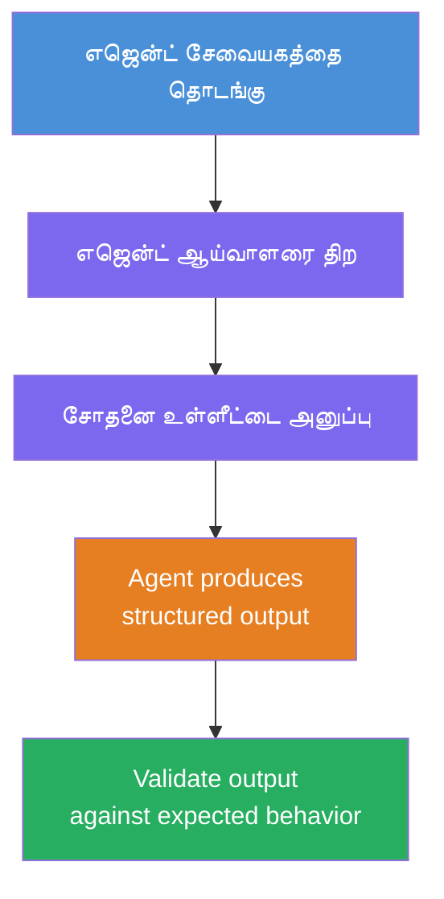
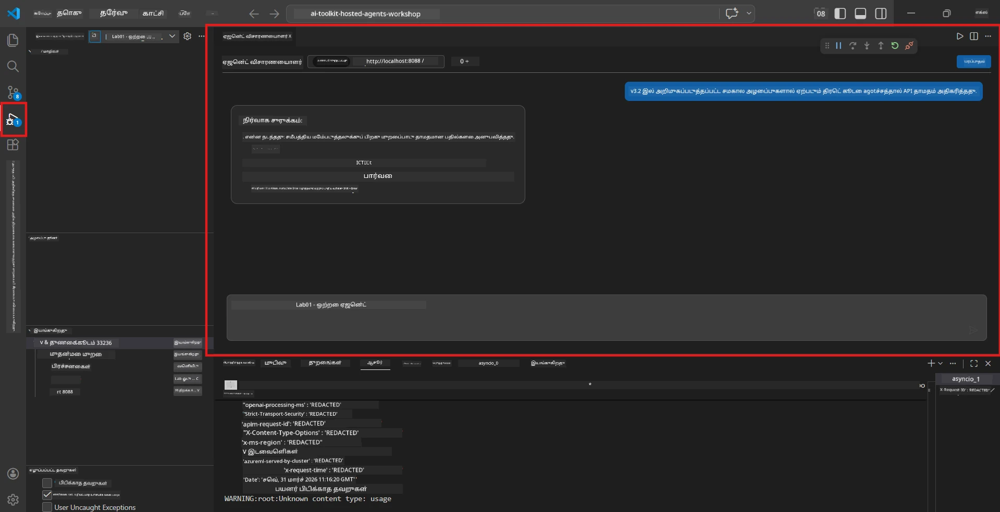
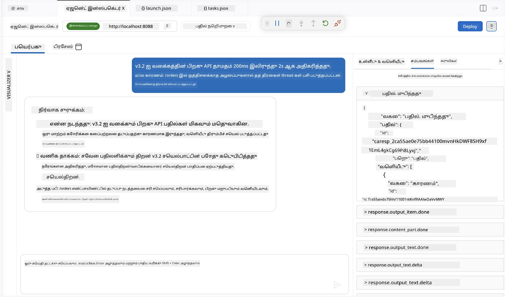

# Module 4 - உள்ளூரில் சோதனை செய்யவும்

⏱️ ~10 நிமிடங்கள்

இந்த மொடியூலில், நீங்கள் உங்கள் முகவரியை உள்ளூரில் இயக்கு மற்றும் அது சரியாக செயல்படுகிறதா என்பதை **முழுமையான பாதை செயல்பாட்டு சோதனைகள்** மூலம் சரிபார்க்கிறீர்கள். முகவரி சரியான, கட்டமைக்கப்பட்ட பதில்களை உண்டாக்குகிறதா என்பதை உறுதிசெய்ய Agent Inspector (தெளிவான UI) அல்லது நேரடி HTTP அழைப்புகளைப் பயன்படுத்துவீர்கள்.

### உள்ளூரில் சோதனை நடைமுறை



---

## விருப்பம் 1: F5 அழுத்தவும் - Agent Inspector-ஐப் பயன்படுத்தி படிப்படியான பிழைத்திருத்தம் (சிபாரிசு செய்யப்பட்டவை)

### பிழைத்திருத்தியைத் துவங்கவும்

1. **executive-summary-agent/** கோப்புறையை நேரடியாக VS கோட் இல் திறக்கவும் (`File → Open Folder`).
2. **Run and Debug** பண்பாட்டைத் திறக்கவும் (`Ctrl+Shift+D`).
3. "Debug Local Agent Server" தேர்வு செய்யவும்.
4. **F5** அழுத்தவும் (அல்லது ▶ Start Debugging கிளிக்கவும்).

> ⚠️ **முக்கியம்: உங்கள் Python Interpreter-ஐ தேர்ந்தெடுக்கவும்**
> "ModuleNotFoundError" வந்தால் அல்லது பிழைத்திருத்தி துவங்கவில்லை என்றால், VS Code மெய்நிகர் சுற்றுப்புறத்தை பயன்படுத்தும்படி சொல்ல வேண்டும்:
  > 1. `Ctrl+Shift+P` அழுத்தவும் → **Python: Select Interpreter** என தட்டச்சு செய்யவும்.
  > 2. உங்கள் திட்டத்தின் `.venv` கோப்புறையில் உள்ள interpreter-ஐத் தேர்ந்தெடுக்கவும் (உதாரணமாக, Windows இல் `.\.venv\Scripts\python.exe`).
  > 3. பிழைத்திருத்த அமர்வை மீண்டும் தொடங்கவும்.
> பிழைகள் தொடர்ந்து வந்தால், உங்கள் கோப்பு `tasks.json`-ஐ கீழ்கண்டு இனம் மாற்றவும்:
  > 1. `.vscode/tasks.json` கோப்புக்குச் செல்லவும்
  > 2. "Run Agent/Workflow HTTP Server" என குறிக்கப்பட்ட கட்டளையைத் தேடவும்
  > 3. கட்டளை மதிப்பை இவ்வாறு மாற்றவும்: `"value": "${workspaceFolder}/.venv/bin/python",`

### என்ன நடக்கிறது

1. HTTP சர்வர் `http://localhost:8088/responses` ல் துவங்கும்.
2. **Agent Inspector** பண்பாடு தானாக திறக்கும் - சோதனைக்கு காட்சி அடிப்படையிலான வாதியமைப்பு.
3. `main.py` இல் இடைநிறுத்திகள் இயக்கப்படும்.

டெர்மினலை கவனிக்கவும்:
```
Starting executive summary hosted agent
Executive agent server running on http://localhost:8088
```

> **Agent Inspector துவங்கவில்லை என்றால்:** `Ctrl+Shift+P` → **Foundry Toolkit: Open Agent Inspector** அழுத்தவும்.



> *திரைபதிவு பழைய 'AI TOOLKIT' பிராண்டை காட்டலாம், இது பழைய நீட்சிப் பதிப்பிலிருந்து வந்தது.*

---

## விருப்பம் 2: டெர்மினல் மூலம் சோதனை (மாற்று)

ஒரு டெர்மினலில் முகவரியைத் துவங்கி, மற்றொன்றில் கோரிக்கைகளை அனுப்பவும்:

```bash
# டெர்மினல் 1: முகவர் துவங்கு
cd executive-summary-agent/
source .venv/bin/activate
python main.py
```

```bash
# டெர்மினல் 2: பரிசோதனை (கரல்) அனுப்பவும்
curl -sS -X POST http://localhost:8088/responses \
  -H "Content-Type: application/json" \
  -d '{"input": "The API latency increased due to thread pool exhaustion caused by sync calls in v3.2.", "stream": false}'
```

---

## நிலைமைகளைச் சோதனை: முழுமையான பாதை செயல்பாட்டு சரிபார்ப்பு

கீழ்காணும் **மூன்று** நிலைமைகளையும் இயக்கவும். இது உங்கள் முகவரி உண்மையான உள்ளீடுகளுக்கு சரியான, கட்டமைக்கப்பட்ட வெளியீட்டை உண்டாக்குகிறதா என்பதை உறுதிப்படுத்தும்.



### நிலைமை 1: IT அவசரம் - API சீராமை உயர்வு

**உள்ளீடு:**
```
The API latency increased from 200ms to 2s after deploying v3.2.
Root cause: thread pool starvation from synchronous calls in /orders.
Rolled back at 10:14.
```

**எதிர்பார்க்கும் நடத்தை:**
- ✅ "Executive Summary" அமைப்பின்படி (என்ன நடந்தது / வணிக தாக்கம் / அடுத்த படி)
- ✅ தொழில்நுட்ப சொற்கள் இல்லை ("thread pool" இல்லை, "/orders" இல்லை, "v3.2" இல்லை)
- ✅ தெளிவாக வணிக தாக்கத்தை குறிப்பிடுகிறது (உதாரணம்: பயனர்கள் தாமதங்களை சந்தித்தனர்)
- ✅ அடுத்த படி சேர்க்கப்பட்டுள்ளது (உதாரணம்: பழுது சரி செய்யப்பட்டது, கண்காணிப்பு உள்ளது)

---

### நிலைமை 2: தரவு குழாய் - ETL தோல்வி

**உள்ளீடு:**
```
The nightly ETL job failed because the upstream schema changed. APAC dashboards show missing data.
```

**எதிர்பார்க்கும் நடத்தை:**
- ✅ தரவு புதுப்பிப்பு தோல்வியை எளிமையான மொழியில் சுருக்குகிறது
- ✅ APAC தகவல் காட்சி பாதிப்பை குறிப்பிடுகிறது
- ✅ சரிசெய்தல் அடுத்த படியை உள்ளடக்கியது
- ✅ "ETL", "schema" அல்லது மற்ற தொழில்நுட்ப சொற்கள் பயன்படுத்தப்படவில்லை

---

### நிலைமை 3: பாதுகாப்பு - முன்கூட்டியுள்ள அங்கீகாரம்

**உள்ளீடு:**
```
Static analysis flagged a hardcoded secret in the repository.
The secret may have been exposed in commit history.
```

**எதிர்பார்க்கும் நடத்தை:**
- ✅ முகவரிமுகச்செலுத்தும் மொழியில் அங்கீகாரம்/பாதுகாப்பு பிரச்சனையை வர்ணிக்கிறது
- ✅ சாத்தியமான ஆபத்தை குறிப்பிடுகிறது (அனுமதியில்லாத அணுகல்)
- ✅ சரிசெய்தல் நடவடிக்கையை கூறுகிறது (அங்கீகாரம் மாற்றம், ஆய்வு)
- ✅ "static analysis", "commit history", அல்லது "hardcoded" போன்ற சொற்கள் சேர்க்கப்படவில்லை

---

## சரிபார்ப்பு நிபந்தனைகள்

ஒவ்வொரு நிலைமைக்கும், பின்வருமாறு சரிபார்க்கவும்:

| # | நிபந்தனை | வெற்றி நிபந்தனை |
|---|----------|---------------|
| 1 | **கட்டமைப்பு** | பதில் "Executive Summary" வடிவத்தை மூன்று புள்ளிகளுடன் பயன்படுத்துகிறது |
| 2 | **எளிய மொழி** | ஒரு நிர்வாகி புரிந்துகொள்ளாத தொழில்நுட்ப சொற்கள் இல்லை |
| 3 | **துல்லியம்** | சுருக்கம் உள்ளீட்டை பிரதிபலிக்கிறது - கற்பனை செய்த விவரங்கள் இல்லை |
| 4 | **சுருக்கம்** | பதில் 100 வார்த்தைக்குள் இருக்க வேண்டும் |
| 5 | **அடுத்த படி** | தெளிவான நடவடிக்கை அல்லது குறைக்கல் கூறப்பட்டுள்ளது |

---

## பிழைத்திருத்தக் குறிப்புகள்

| பிரச்சனை | தீர்வு |
|-------|-----|
| முகவரி துவங்கவில்லை | `.env` மதிப்புகளை சரிபார், venv இயங்குமா என உறுதி செய், `pip install -r requirements.txt` ஓட்டு |
| வெற்று அல்லது பொதுவான பதில் | `main.py` இல் உள்ள வழிமுறைகளை சரிப்பார்த்திடுக - வெளியீடு வடிவம் குறிப்பிடப்பட்டுள்ளதா என்பதை உறுதி செய்க |
| பதில் தொழில்நுட்ப சொற்கள் கொண்டது | "தொழில்நுட்ப சொற்களை அகற்று" விதிகளை வழிமுறைகளில் வலுப்படுத்துக |
| Agent Inspectorத் திறக்கவில்லை | `Ctrl+Shift+P` → **Foundry Toolkit: Open Agent Inspector** அழுத்துக |
| டெர்மினலில் மாதிரி பிழைகள் | `AZURE_AI_MODEL_DEPLOYMENT_NAME` சரியாக பொருந்துகிறதா (case-sensitive) என உறுதி செய்க |

---

### ✅ நிலைமைக் கட்டுப்பாடு

- [ ] முகவரி உள்ளூரில் பிழைகள் இல்லாமelon துவங்கியது
- [ ] F5 பயன்படுத்தின் Agent Inspector திறந்து உரையாடல் இடைமுகத்தை காண்பித்தது
- [ ] **நிலைமை 1** (IT அவசரம்) - கட்டமைக்கப்பட்ட Executive Summary, jargon இல்லாமல்
- [ ] **நிலைமை 2** (தரவு குழாய்) - வணிக தாக்கத்துடன் பொருத்தமான சுருக்கம்
- [ ] **நிலைமை 3** (பாதுகாப்பு எச்சரிக்கை) - சரியான ஆபத் தகவல்
- [ ] எல்லா பதில்களும் வரையறுக்கப்பட்ட வெளியீட்டு கட்டமைப்பை பின்பற்றுகின்றன

> **உங்கள் பதில்களை சேமிக்கவும்** (நகலெடு அல்லது திரைபடம் எடு) - Module 06 இல் மேக முடிவுகளுடன் ஒப்பிடுவீர்கள்.

---

**முந்தைய:** [03 - அமைப்பு மற்றும் குறியீடு](03-configure-and-code.md) · **பின்பு:** [05 - Foundry-க்கு யோ்க் →](05-deploy-to-foundry.md)

---

<!-- CO-OP TRANSLATOR DISCLAIMER START -->
**மறுப்பு**:
இந்த ஆவணம் AI மொழிபெயர்ப்பு சேவை [Co-op Translator](https://github.com/Azure/co-op-translator) பயன்படுத்தி மொழிபெயர்க்கப்பட்டுள்ளது. நாங்கள் துல்லியத்திற்காக முயற்சி செய்துள்ளோம், ஆனால் தானாக செய்யப்படும் மொழிபெயர்ப்புகளில் பிழைகள் அல்லது தவறுகள் இருக்கலாம் என்பதை கவனத்தில் கொள்ளவும். அசல் ஆவணம் அதன் தாய்மொழியில் அதிகாரப்பூர்வ ஆதாரமாக கருதப்பட வேண்டும். முக்கியமான தகவல்களுக்கு, தொழில்நுட்பமான மனித மொழிபெயர்ப்பு பரிந்துரைக்கப்படுகிறது. இந்த மொழிபெயர்ப்பைப் பயன்படுத்துவதால் ஏற்படும் எந்த தவறான புரிதல்கள் அல்லது தவறான விளக்கத்திற்கும் நாங்கள் பொறுப்பில்வில்லை.
<!-- CO-OP TRANSLATOR DISCLAIMER END -->