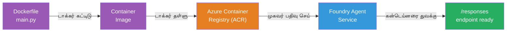
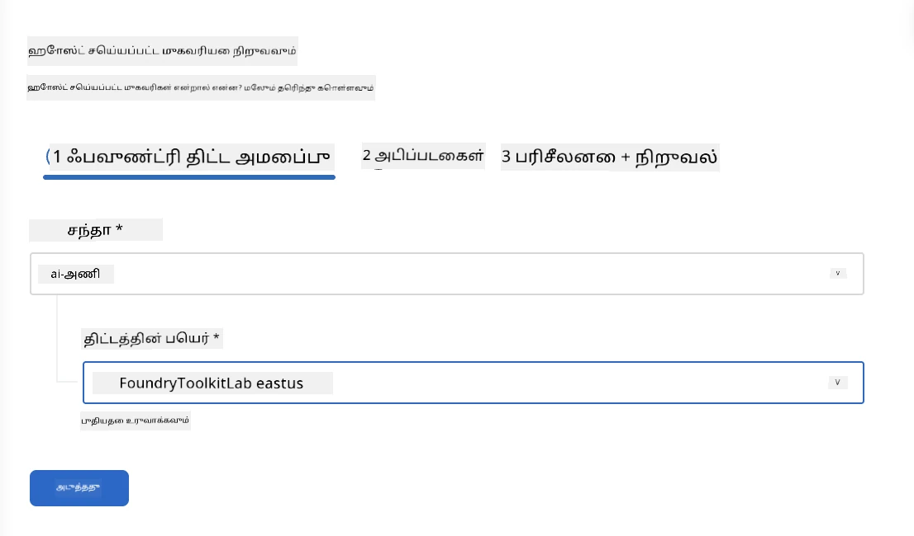
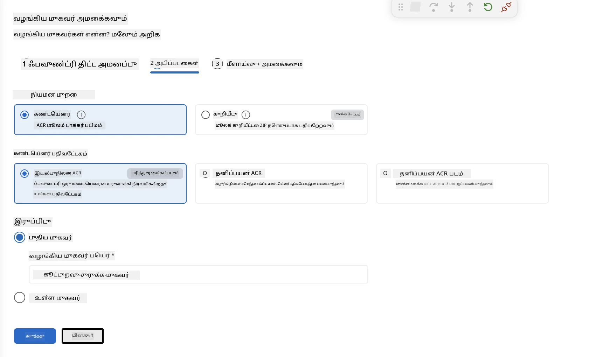
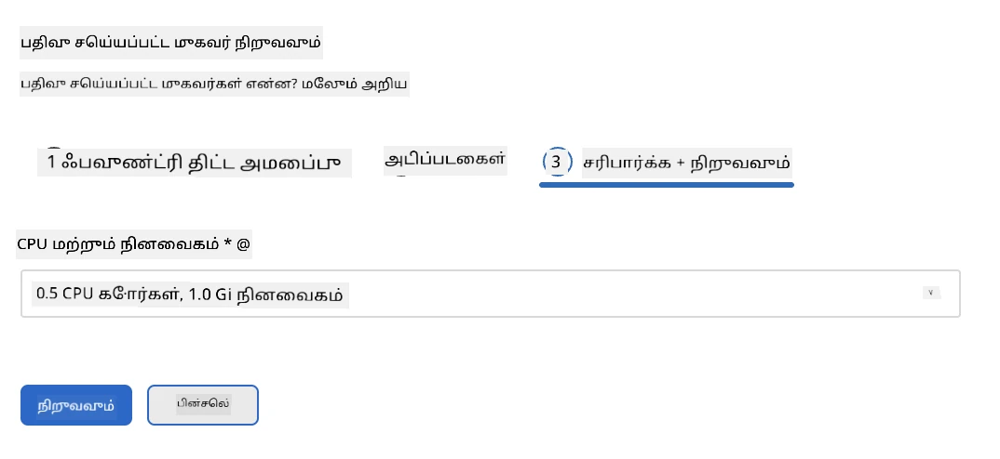
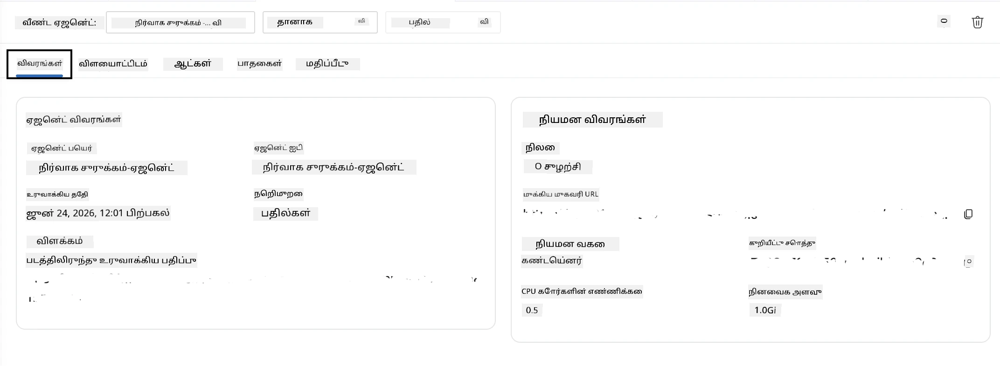

# Module 5 - Foundry முகவர் சேவைக்கு முனையல்

⏱️ ~10 நிமிடங்கள்

> ⚠️ **பாதை B பயனர்களுக்கு:** இந்த மொடியூல் Foundry சந்தாவை தேவையாக்குகிறது. நீங்கள் Foundry உள்ளூர் பயன்படுத்துகிறீர்களானால், [Module 07 - சுருக்கம்](07-summary.md)க்கு சென்று தொடரவும். நீங்கள் உள்ளூர் அபிவிருத்தி வேலைப்பாட்டை வெற்றிகரமாக முடித்துவிட்டீர்கள்!

இந்த மொடியூலில், நீங்கள் உள்ளூர் சோதிக்கப்பட்ட முகவரை Microsoft Foundry-க்கு **ஹோஸ்ட் செய்யப்பட்ட முகவராக** முனையுகின்றீர்கள். இந்த முனையல், ஒரு கன்டெய்னர் படம் உருவாக்கி, அதை Azure Container Registry-க்கு தள்ளி, Foundry-ன் நிர்வகிக்கப்பட்ட அமைப்பில் முகவரை துவக்குகிறது.

### முனையல் குழாய்முறை

---

## தேவையான முன்னிருப்புகள் சரிபார்க்கவும்

முனைய முன்னர், சரிபார்க்கவும்:

- [ ] முகவர் [Module 04](04-test-locally.md) இலிருந்து உள்ளூர் 3 நிலைகளையும் கடந்து உள்ளது
- [ ] திட்ட அளவில் **Azure AI User** வேட்பாளர் உள்ளது ([Module 01, RBAC ஒதுக்கீடு](01-setup.md#deploy-a-model--assign-rbac))
- [ ] நீங்கள் VS Code இல் Azure இல் உள்நுழைந்து உள்ளீர்கள் (Accounts ஐகானில் உங்கள் பெயர் காண்பிக்கப்படுகிறது)

---

## படி 1: முனையல் துவங்கவும்

### விருப்பம் A: Agent Inspector இலிருந்து முனையல் (பரிந்துரைக்கப்படுகிறது)

Agent Inspector திறந்திருப்பின் (சோதனை மூலம்):
1. மேலேயுள்ள வலது மூலை பகுதியில் உள்ள **Deploy** பொத்தானை கிளிக் செய்யவும் (மேகம் சின்னம் ↑).

### விருப்பம் B: கட்டளை பட்டியிலிருந்து முனையல்

1. `Ctrl+Shift+P` அழுத்தி → **Foundry Toolkit: Deploy Hosted Agent** தேர்ந்தெடுக்கவும்.

---

## படி 2: முனையலை அமைக்கவும்

மாய்சொல் உங்கள் தேர்வுகளை கேட்கிறது:

| கேள்வி | தேர்வு |
|--------|-----------|
| **சந்தா** | உங்கள் Azure சந்தா |
| **நோக்கிடப்பட்ட திட்டம்** | உங்கள் Foundry திட்டம் (உதா., `workshop-agents`) |

உங்கள் முகவரை அமைக்க **அடுத்தது** கிளிக் செய்யவும்.

| கேள்வி | தேர்வு |
|--------|-----------|
| **முனையல் முறை** | கன்டெய்னர் |
| **கன்டெய்னர் பதிவு நிலையம்** | **இயல்பு ACR** (Microsoft Foundry உங்களுக்காக ஒன்றை உருவாக்கி நிர்வகிக்கிறது) |
| **முனைய இடம்** | புதிய முகவர் (பெயர், `executive-summary-agent`) |

உங்கள் முகவரை மதிப்பாய்வு செய்து முனைய **அடுத்தது** கிளிக் செய்யவும்.

| கேள்வி | தேர்வு |
|--------|-----------|
| **CPU மற்றும் மெமரி** | **0.25 CPU கோர்கள், 0.5 Gi மெமரி** (வேலைத் தளத்துக்கு போதுமானது) |

---

## படி 3: முனையி மற்றும் கண்காணி

1. **Deploy** கிளிக் செய்யவும்.
2. **Output** பெட்டியை கவனியுங்கள் (இறக்குமுனையில் **Microsoft Foundry** தேர்ந்தெடுக்கவும்).
3. முனையல் பின்வரும் அடிகள் வழியாக இயங்கும்:
   - **Docker கட்டமைப்பு** - உங்கள் Dockerfile இலிருந்து கன்டெய்னர் உருவாக்குகிறது
   - **Docker தள்ளல்** - படம் ACRக்கு தள்ளப்படுகிறது (முதல் முறையில் 1–3 நிமிடங்கள்)
   - **முகவர் பதிவு** - Foundry இல் ஹோஸ்ட் செய்யப்பட்ட முகவரை உருவாக்குகிறது
   - **கன்டெய்னர் துவக்கம்** - அமைப்பு நிர்வகிக்கப்படும் அடையாளத்துடன் துவங்குகிறது

4. முடிந்தபோது, அறிவிப்பு தோன்றும்:
   > **my-agent வெற்றிகரமாக முனையப்பட்டது.** `View logs` `Run agent`

5. முகவர் விளையாட்டிடம் திறக்க **Run agent** கிளிக் செய்யவும்.

### முனையல் நிலை மதிப்புகள்

| நிலை | பொருள் |
|--------|---------|
| **ஓடுகிற்போதே** | கன்டெய்னர் தயார், முகவர் பதிலளிக்கிறது |
| **காத்திருக்கிறது** | கன்டெய்னர் துவங்கி வருகிறது - 30–60 வினாடிகள் காத்திருக்கவும் |
| **தோல்வி** | பதிவு கோப்புகளை பார்க்கவும் (கீழே பிழை தீர்க்கும் வழிகாட்டி பாருங்கள்) |

---

## பொதுவான முனையல் பிழைகள்

| பிழை | காரணம் | சரிசெய்தல் |
|-------|-----------|-----|
| `agents/write` அனுமதி மறுக்கப்பட்டது | திட்ட அளவில் **Azure AI User** வேட்பாளர் இல்லை | [Module 01, RBAC ஒதுக்கீடு](01-setup.md#deploy-a-model--assign-rbac) |
| Docker இயங்கவில்லை | Docker Desktop துவக்கப்படவில்லை | Docker Desktop துவக்கவும் → `docker info` சரிபார்க்கவும் |
| ACR அங்கீகாரம் | Managed identity படம் татுக்காது | [Module 08 - பிழை தீர்க்கல்](08-troubleshooting.md) பாருங்கள் |

---

### ✅ சரிபார்ப்பு

- [ ] பிழைகள் இல்லாமல் முனையல் முடிந்தது
- [ ] முகவர் Foundry பக்கவட்டியில் **Hosted Agents (Preview)** கீழ் தோன்றுகிறது
- [ ] கன்டெய்னர் நிலை **ஓடுகிறது** காட்டுகிறது
- [ ] முகவர் விளையாட்டு இடைப்பட்டை திறந்து முகவரின் விவரங்கள் மற்றும் முனைய முகவரி காட்டுகிறது

---

**முந்தைய:** [04 - உள்ளூரில் சோதனை](04-test-locally.md) · **அடுத்தது:** [06 - விளையாட்டிடம் சரிபார்க்கவும் →](06-verify-in-playground.md)

---

<!-- CO-OP TRANSLATOR DISCLAIMER START -->
**மறுப்பு**:
இந்த ஆவணம் AI மொழிபெயர்ப்பு சேவை [Co-op Translator](https://github.com/Azure/co-op-translator) பயன்படுத்தி மொழிபெயர்க்கப்பட்டுள்ளது. நாங்கள் துல்லியத்திற்காக முயற்சி செய்துள்ளோம், ஆனால் தானாக செய்யப்படும் மொழிபெயர்ப்புகளில் பிழைகள் அல்லது தவறுகள் இருக்கலாம் என்பதை கவனத்தில் கொள்ளவும். அசல் ஆவணம் அதன் தாய்மொழியில் அதிகாரப்பூர்வ ஆதாரமாக கருதப்பட வேண்டும். முக்கியமான தகவல்களுக்கு, தொழில்நுட்பமான மனித மொழிபெயர்ப்பு பரிந்துரைக்கப்படுகிறது. இந்த மொழிபெயர்ப்பைப் பயன்படுத்துவதால் ஏற்படும் எந்த தவறான புரிதல்கள் அல்லது தவறான விளக்கத்திற்கும் நாங்கள் பொறுப்பில்வில்லை.
<!-- CO-OP TRANSLATOR DISCLAIMER END -->