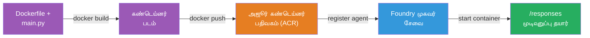
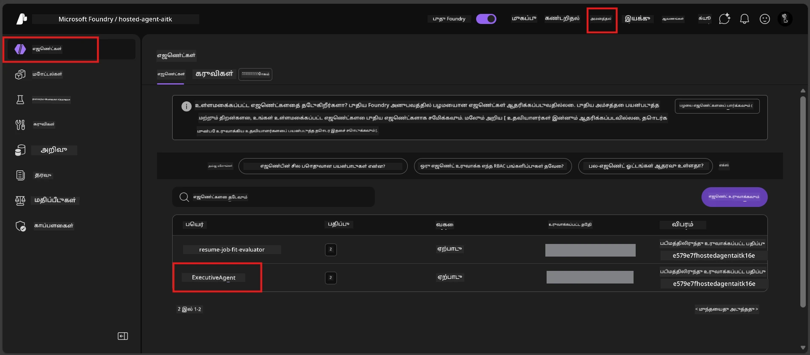

# Module 6 - Foundry ஏஜென்ட் சேவைக்கு வெளியிடுதல்

இந்த மொடியூல்லில், நீங்கள் உங்கள் உள்ளூர்-சோதிக்கப்பட்ட ஏஜென்டை Microsoft Foundry இல் [**ஓர் ஹோஸ்ட் செய்யப்பட்ட ஏஜென்ட்**](https://learn.microsoft.com/azure/foundry/agents/concepts/hosted-agents) ஆக வெளியிடுவீர்கள். வெளியீட்டு செயல்முறை உங்கள் திட்டத்திலிருந்து Docker கொண்டெய்னர் படத்தை உருவாக்கி, அதனை [Azure Container Registry (ACR)](https://learn.microsoft.com/azure/container-registry/container-registry-intro) க்கு தூக்கிய பிறகு [Foundry Agent Service](https://learn.microsoft.com/azure/foundry/agents/overview) இல் ஹோஸ்ட் செய்யப்பட்ட ஏஜென்ட் பதிப்பை உருவாக்குகிறது.

### வெளியீட்டு குழாய்க்குழு


---

## முன் தேவைகள் சரிபார்ப்பு

வெளியிடுவதற்கு முன், கீழேயுள்ள ஒவ்வொரு உருப்படியையும் சரிபார்க்கவும். இவை தவிர்ப்பது வெளியீட்டு தோல்விகளுக்கு மிக பொதுவான காரணம் ஆகும்.

1. **ஏஜென்ட் உள்ளூர் ஸ்மோக் சோதனைகளை கடந்து விட்டது:**
   - நீங்கள் [Module 5](05-test-locally.md) இல் உள்ள 4 சோதனைகளையும் முடித்துள்ளீர்கள் மற்றும் ஏஜென்ட் சரியாக பதிலளித்தது.

2. **உங்களுக்கு [Azure AI User](https://learn.microsoft.com/azure/foundry/concepts/rbac-foundry#built-in-roles) வகுப்பு உள்ளது:**
   - இது [Module 2, படி 3](02-create-foundry-project.md) இல் ஒதுக்கப்பட்டது. நிச்சயமாக இல்லையெனில் இப்போது சரிபார்க்கவும்:
   - Azure போர்டல் → உங்கள் Foundry **திட்டம்** வளம் → **Access control (IAM)** → **Role assignments** தாவல் → உங்கள் பெயரை தேடி → **Azure AI User** பட்டியலில் இருக்கின்றது என்பதை உறுதி செய்யவும்.

3. **நீங்கள் VS Code இல் Azure இல் உள்நுழைந்துள்ளீர்கள்:**
   - VS Code இன் கீழ்-இடது மூலையில் உள்ள கணக்கு ஐகானை சரிபார்க்கவும். உங்கள் கணக்கு பெயர் தெரியும்.

4. **(விருப்பமாக) Docker Desktop இயங்குகிறது:**
   - Foundry விருப்பக்கூற்றின் உள்ளூர் கட்டுமானம் கேட்கும் போது மட்டுமே Docker தேவையாகும். பெரும்பாலான பட்சங்களிலும், விருப்பக்கூறு வெளியீட்டின் போது கொண்டெய்னர் கட்டுமானங்களை தானாக நடாத்தும்.
   - Docker நிறுவியிருந்தால், அது இயங்குகிறதா என்பதை சரிபார்க்கவும்: `docker info`

---

## படி 1: வெளியீட்டை துவங்கவும்

வெளியிட இரண்டு வழிகள் உண்டு - இரண்டும் ஒரே முடிவுக்கு கொண்டு செல்கின்றன.

### விருப்பம் A: ஏஜென்ட் இன்ஸ்பெக்டரிடமிருந்து வெளியிடுதல் (பரிந்துரைக்கப்படுகிறது)

நீங்கள் ஏஜென்டை டீபக்கர் (F5) உடன் ஓட்டும்போது மற்றும் ஏஜென்ட் இன்ஸ்பெக்டர் திறந்திருப்பின்:

1. ஏஜென்ட் இன்ஸ்பெக்டர் பலகையின் **மேல்-வலது மூலையில்** பாருங்கள்.
2. **Deploy** பொத்தானை (மேல்காணும் அம்புடன் மேகம் இகானை) கிளிக் செய்யவும்.
3. வெளியீட்டு வழிகாட்டி திறக்கும்.

### விருப்பம் B: கட்டளை பட்டியலிடமிருந்து வெளியிடுதல்

1. `Ctrl+Shift+P` அழுத்தி **Command Palette** திறக்கவும்.
2. தட்டச்சு செய்யவும்: **Microsoft Foundry: Deploy Hosted Agent** மற்றும் தேர்வு செய்யவும்.
3. வெளியீட்டு வழிகாட்டி திறக்கும்.

---

## படி 2: வெளியீட்டை கட்டமைக்கவும்

வெளியீட்டு வழிகாட்டி உங்களை ஒவ்வொரு கட்டத்திலும் வழிநடத்தும். ஒவ்வொரு கேள்வியையும் பூர்த்தி செய்யவும்:

### 2.1 இலக்கு திட்டத்தைத் தேர்ந்தெடுக்கவும்

1. ஒரு கீழிறங்கும் பட்டியலில் உங்கள் Foundry திட்டங்கள் காண்பிக்கப்படும்.
2. Module 2 இல் நீங்கள் உருவாக்கிய திட்டத்தை (எ.கா., `workshop-agents`) தேர்ந்தெடுக்கவும்.

### 2.2 கொண்டெய்னர் ஏஜென்ட் கோப்பைத் தேர்ந்தெடுக்கவும்

1. நீங்கள் ஏஜென்ட் நுழைவு புள்ளியைத் தேர்ந்தெடுக்க கேட்கப்படுவீர்கள்.
2. **`main.py`** (Python) ஐத் தேர்ந்தெடுக்கவும் - இது வழிகாட்டி உங்கள் ஏஜென்ட் திட்டத்தை அடையாளம் காண பயன்படுத்தும் கோப்பு.

### 2.3 வளங்களை கட்டமைக்கவும்

| அமைப்பு | பரிந்துரைக்கப்பட்ட மதிப்பு | குறிப்புகள் |
|---------|------------------|-------|
| **CPU** | `0.25` | இயல்புநிலை, பயிற்சி வேலைக்கு போதுமானது. உற்பத்தி பணிகளுக்கு அதிகரிக்கவும் |
| **Memory** | `0.5Gi` | இயல்புநிலை, பயிற்சி வேலைக்கு போதுமானது |

இவை `agent.yaml` இல் உள்ள மதிப்புகளுடன் பொருந்தும். நீங்கள் இயல்புநிலைகளையே ஏற்றுக்கொள்ளலாம்.

---

## படி 3: உறுதிப்படுத்தி வெளியிடவும்

1. வழிகாட்டி வெளியீட்டு சுருக்கத்தைக் காட்டுகிறது:
   - இலக்கு திட்டத்தின் பெயர்
   - ஏஜென்ட் பெயர் (`agent.yaml` இலிருந்து)
   - கொண்டெய்னர் கோப்பு மற்றும் வளங்கள்
2. சுருக்கத்தைக் காணும் பிறகு **Confirm and Deploy** (அல்லது **Deploy**) கிளிக் செய்யவும்.
3. VS Code இல் முன்னேற்றத்தை கவனிக்கவும்.

### வெளியீட்டின் போது என்ன நடக்கும் (படி படியாக)

வெளியீடு பல படிகளைக் கொண்டது. VS Code இன் **Output** பலகையை (பட்டியலில் "Microsoft Foundry" தேர்வு செய்து) கவனிக்கவும்:

1. **Docker கட்டல்** - VS Code உங்கள் `Dockerfile` லிருந்து Docker கொண்டெய்னர் படத்தை உருவாக்குகிறது. Docker அடுக்குச் செய்திகள் காணப்படும்:
   ```
   Step 1/6 : FROM python:<version>-slim
   Step 2/6 : WORKDIR /app
   ...
   Successfully built abc123def456
   ```

2. **Docker தூக்கு** - படம் உங்கள் Foundry திட்டத்துடன் தொடர்புடைய **Azure Container Registry (ACR)** க்கு தூக்கப்படுகிறது. முதன்முதல் வெளியீட்டில் 1-3 நிமிடங்கள் எடுத்துக்கொள்ளலாம் (அடிப்படைக் படம் >100MB).

3. **ஏஜென்ட் பதிவு** - Foundry Agent Service ஒரு புதிய ஹோஸ்ட் செய்யப்பட்ட ஏஜென்டை உருவாக்குகிறது (அல்லது ஏஜென்ட் ஏற்கனவே இருந்தால் புதிய பதிப்பு). `agent.yaml` இலிருந்து ஏஜென்ட் மீட்டமைப்பு பயன்படுத்தப்படுகிறது.

4. **கொண்டெய்னர் துவக்கம்** - கொண்டெய்னர் Foundry இன் நிர்வகிக்கப்படும் கட்டமைப்பில் துவங்குகிறது. தளம் [கணினி நிர்வகிக்கப்பட்ட அடையாளத்தை](https://learn.microsoft.com/azure/foundry/agents/concepts/agent-identity) ஒதுக்கி `/responses` பயன்முறையை வெளிக்காட்டுகிறது.

> **முதல் வெளியீடு மெதுவாகும்** (Docker அனைத்து அடுக்குகளையும் தூக்க வேண்டியிருக்கிறது). அதன் பிறகு வெளியீடுகள் வேகமாக இருக்கும் ஏனெனில் Docker மாற்றமில்லாத அடுக்குகளை சேமித்து வைக்கிறது.

---

## படி 4: வெளியீட்டு நிலையை உறுதிப்படுத்தவும்

வெளியீட்டு கட்டளை முடிந்ததும்:

1. செயல்பாட்டு பட்டையில் Foundry ஐகான் கிளிக் செய்து **Microsoft Foundry** அருகக்கூடையை திறக்கவும்.
2. உங்கள் திட்டத்தின் கீழ் உள்ள **Hosted Agents (Preview)** பிரிவை விரிவாக்கவும்.
3. உங்கள் ஏஜென்ட் பெயர் (எ.கா., `ExecutiveAgent` அல்லது `agent.yaml` இலிருந்து பெயர்) தெரிய வேண்டும்.
4. **ஏஜென்ட் பெயரை கிளிக்** செய்து விரிவாக்கவும்.
5. ஒரு அல்லது பல **பதிப்புகள்** (எ.கா., `v1`) காட்சி காணப்படும்.
6. பதிப்பை கிளிக் செய்து **கொண்டு நெய் விவரங்கள்** பார்வையிடவும்.
7. **நிலை** புலத்தை சரிபார்க்கவும்:

   | நிலை | பொருள் |
   |--------|---------|
   | **Started** அல்லது **Running** | கொண்டெய்னர் இயங்குகிறது மற்றும் ஏஜென்ட் தயார் |
   | **Pending** | கொண்டெய்னர் துவங்குகின்றது (30-60 விநாடிகள் காத்திருங்கள்) |
   | **Failed** | கொண்டெய்னர் துவங்க தவறியது (பதிவுகளை சரிபார்க்கவும் - கீழே பிழைத்திருத்தம்) |



> **"Pending" 2 நிமிடங்கள் விட நீண்ட நேரம் இருந்தால்:** கொண்டெய்னர் அடிப்படைக் படத்தைப் பெற இருக்கலாம். மேலும் கொஞ்சநேரம் காத்திருங்கள். இன்னும் நிலைமை மாறாவிட்டால் கொண்டெய்னர் பதிவுகளை சரிபார்க்கவும்.

---

## பொதுவான வெளியீட்டு பிழைகள் மற்றும் திருத்தங்கள்

### பிழை 1: அனுமதி மறுக்கப்பட்டது - `agents/write`

```
Error: lacks the required data action 
Microsoft.CognitiveServices/accounts/AIServices/agents/write 
to perform POST /api/projects/{projectName}/assistants operation.
```

**மேல் காரணம்:** உங்களிடம் **திட்டம்** மட்டத்தில் `Azure AI User` வகுப்பு இல்லை.

**திருத்த படி படியாக:**

1. [https://portal.azure.com](https://portal.azure.com) திறக்கவும்.
2. தேடல் பட்டியில் உங்கள் Foundry **திட்டம்** பெயரை உள்ளிடி கிளிக் செய்யவும்.
   - **குறிப்பிட்டது:** நீங்கள் **திட்ட** வளத்திற்கு (Type: "Microsoft Foundry project") செல்வதை உறுதி செய்யவும், கணக்கு/ஹப் வளத்திற்கு அல்ல.
3. இடது வழிசெலுத்தலில் **Access control (IAM)** கிளிக் செய்யவும்.
4. **+ Add** → **Add role assignment** அழுத்தவும்.
5. **Role** தாவலில் [**Azure AI User**](https://learn.microsoft.com/azure/foundry/concepts/rbac-foundry#built-in-roles) ஐ தேடி தேர்ந்தெடுக்கவும். **Next** கிளிக் செய்யவும்.
6. **Members** தாவலில் **User, group, or service principal** ஐ தேர்ந்தெடுக்கவும்.
7. **+ Select members** கிளிக் செய்யவும், உங்கள் பெயர்/மின்னஞ்சலை தேடி தானாக தேர்வு செய்யவும், **Select** கிளிக் செய்யவும்.
8. **Review + assign** → மீண்டும் **Review + assign** கிளிக் செய்யவும்.
9. வகுப்பு ஒதுக்கீடு பரவி செல்ல 1-2 நிமிடங்கள் காத்திருங்கள்.
10. படி 1 இலிருந்து வெளியீட்டை மீள் முயற்சி செய்யவும்.

> வகுப்பு **திட்ட** பரப்பில் இருக்க வேண்டும், கணக்கு நிலை నుండே இல்லை. இது வெளியீட்டின் #1 பொதுவான தோல்வித் த причины.

### பிழை 2: Docker இயங்கவில்லை

```
Error: Docker build failed / Cannot connect to Docker daemon
```

**திருத்தம்:**
1. Docker Desktop துவங்கவும் (துவக்கம் மெனு அல்லது சிஸ்டம் டிரேவில் காணவும்).
2. "Docker Desktop is running" தகவல் தோன்றும் வரை காத்திருங்கள் (30-60 விநாடிகள்).
3. ஒரு முனையில `docker info` பயன்படுத்தி சரிபார்க்கவும்.
4. **Windows-க்கு மட்டும்:** Docker Desktop அமைப்புகளில் WSL 2 பின்னணி இயக்கப்பட்டுள்ளது என்பதை உறுதி செய்யவும் → **General** → **Use the WSL 2 based engine**.
5. வெளியீட்டை மீண்டும் முயற்சி செய்யவும்.

### பிழை 3: ACR அங்கீகாரம் - `AcrPullUnauthorized`

```
Error: AcrPullUnauthorized
```

**மூல காரணம்:** Foundry திட்டத்தின் நிர்வகிக்கப்படும் அடையாளத்திற்கு கொண்டெய்னர் பதிவு நிறுவனத்திற்கு புல் அணுகல் இல்லை.

**திருத்தம்:**
1. Azure போர்டலில் உங்கள் **[Container Registry](https://learn.microsoft.com/azure/container-registry/container-registry-intro)** ஐத் தேடவும் (Foundry திட்டத்தின் அதே வளக் குழுவில் உள்ளது).
2. **Access control (IAM)** → **Add** → **Add role assignment** சென்று.
3. **[AcrPull](https://learn.microsoft.com/azure/container-registry/container-registry-roles)** வகுப்பை தேர்ந்தெடுக்கவும்.
4. உறுப்பினர்களுக்கு **Managed identity** தேர்ந்தெடுத்து, Foundry திட்ட நிர்வகிக்கப்படும் அடையாளத்தை தேர்ந்தெடுக்கவும்.
5. **Review + assign**.

> இது பொதுவாக Foundry விருப்பக்கூறால் தானாக அமைக்கப்படுகிறது. இந்த பிழை வந்தால் தானாக அமைத்தல் தோல்வியடைந்தது என அர்த்தம்.

### பிழை 4: கொண்டெய்னர் தளம் பொருந்தாமை (ஆப்பிள் சிலிகான்)

ஆப்பிள் சிலிகான் (M1/M2/M3) மாக்களில் வெளியிடும்போது, கொண்டெய்னர் `linux/amd64` க்காக கட்டப்பட வேண்டும்:

```bash
docker build --platform linux/amd64 -t myagent:v1 .
```

> Foundry விருப்பக்கூறு பெரும்பாலும் இதை தானாக விவரிக்கிறது.

---

### சரிபார்ப்பு பட்டியல்

- [ ] VS Code இல் வெளியீட்டு கட்டளை பிழைகள் இல்லாமல் முடிந்தது
- [ ] Foundry அருகக்கூடையில் **Hosted Agents (Preview)** கீழ் ஏஜென்ட் தென்பட்டது
- [ ] ஏஜென்ட் தேர்ந்தெடுத்து → பதிப்பு தேர்ந்தெடுத்து → **Container Details** பார்த்தீர்கள்
- [ ] கொண்டெய்னர் நிலை **Started** அல்லது **Running** என காட்சி உள்ளது
- [ ] (பிழைகள் ஏற்பட்டால்) பிழையை கண்டறிந்து, திருத்திய நகலை வெளியிட்டு வெற்றி பெற்றீர்கள்

---

**முந்தையது:** [05 - உள்ளூர் சோதனை](05-test-locally.md) · **அடுத்தது:** [07 - விளையாட்டுத்தளத்தில் சரிபார்க்கவும் →](07-verify-in-playground.md)

---

<!-- CO-OP TRANSLATOR DISCLAIMER START -->
**விரிவுரை**:
இந்த ஆவணம் AI மொழிபெயர்ப்பு சேவை [Co-op Translator](https://github.com/Azure/co-op-translator) பயன்படுத்தி மொழிபெயர்க்கப்பட்டுள்ளது. நாம் துல்லியத்தை உறுதி செய்ய முயற்சிப்பதாக இருந்தாலும், தானாக மேற்கொள்ளப்படும் மொழிபெயர்ப்புகளில் பிழைகள் அல்லது தவறுகள் இருக்கக்கூடும் என்பதை தயவுசெய்து கவனத்தில் கொள்ளவும். அதன் மூல மொழியில் உள்ள அசல் ஆவணம் அதிகாரப்பூர்வமான சொத்து எனக் கருதப்பட வேண்டும். முக்கியமான தகவல்களுக்கு, தொழில்முறை மனித மொழிபெயர்ப்பு பரிந்துரைக்கப்படுகிறது. இந்த மொழிபெயர்ப்பின் பயன்படுத்தலில் ஏற்படும் எந்தவொரு தவறான புரிதல்கள் அல்லது தவறான விளக்கங்களுக்காக நாங்கள் பொறுப்பற்றவர்கள்.
<!-- CO-OP TRANSLATOR DISCLAIMER END -->