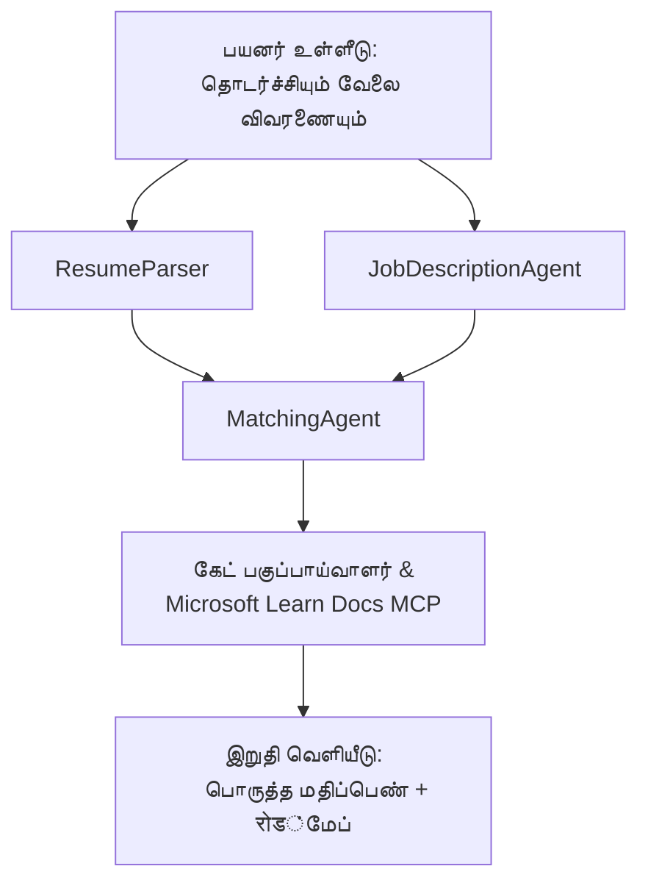

# PersonalCareerCopilot - தொழில் பொருத்தம் மதிப்பாய்வாளர்

ஒரு பன்முகவர் பணியாளர் வேலைநெறி, இது ஒரு জীবনச்சுருக்கம் ஒரு வேலை விவரத்தை எவ்வாறு பொருந்துகிறதோ என்பதை மதிப்பாய்வு செய்து, பின்னர் கைவிடப்பட்ட இடைவெளிகளை மூட தனிப்பயன் கற்றல் வழிமுறையை உருவாக்குகிறது.

---

## முகவர்கள்

| முகவர் | பங்கு | கருவிகள் |
|-------|------|-------|
| **ResumeParser** | வாழ்க்கைசுருக்க உரையிலிருந்து கட்டமைக்கப்பட்ட திறன்கள், அனுபவம், சான்றிதழ்களை எடுக்கிறது | - |
| **JobDescriptionAgent** | வேலை விவரத்திலிருந்து தேவையான/விரும்பிய திறன்கள், அனுபவம், சான்றிதழ்களை எடுக்கிறது | - |
| **MatchingAgent** | சுயவிவரத்தை தேவைகளுடன் ஒப்பிடுகிறது → பொருத்த மதிப்பெண் (0-100) + பொருந்திய/மிகவும் தேவைப்படும் திறன்கள் | - |
| **GapAnalyzer** | Microsoft Learn வளங்களுடன் தனிப்பயன் கற்றல் வழிமுறையை உருவாக்குகிறது | `search_microsoft_learn_for_plan` (MCP) |

## வேலைநெறி


---

## விரைவான தொடக்கம்

### 1. சூழல் அமைக்கவும்

```powershell
cd workshop\lab02-multi-agent\PersonalCareerCopilot
python -m venv .venv
.\.venv\Scripts\Activate.ps1          # விண்டோஸ் பவர் ஷெல்
# source .venv/bin/activate            # மேக்OS / லினக்ஸ்
pip install -r requirements.txt
```

### 2. அங்கீகாரங்களை அமைக்கவும்

உதாரண env கோப்பை நகலெடுத்து உங்கள் Foundry திட்ட விவரங்களுடன் நிரப்பவும்:

```powershell
cp .env.example .env
```

`.env` ஐ மாற்றவும்:

```env
PROJECT_ENDPOINT=https://<your-account>.services.ai.azure.com/api/projects/<your-project>
MODEL_DEPLOYMENT_NAME=gpt-4.1-mini
```

| மதிப்பு | எங்கு கண்டுபிடிப்பது |
|-------|-----------------|
| `PROJECT_ENDPOINT` | VS Code இல் Microsoft Foundry பக்கப்பிரிவு → உங்கள் திட்டத்தில் ரைட் கிளிக் → **Copy Project Endpoint** |
| `MODEL_DEPLOYMENT_NAME` | Foundry பக்கப்பிரிவு → திட்டத்தை விரிவாக்குக → **Models + endpoints** → பகிர்மான பெயர் |

### 3. உள்ளூர் இயக்கவும்

```powershell
python -m debugpy --listen 127.0.0.1:5679 -m agentdev run main.py --verbose --port 8088
```

அல்லது VS Code பணி பயன்படுத்தவும்: `Ctrl+Shift+P` → **Tasks: Run Task** → **Run Lab02 HTTP Server**.

### 4. முகவர் ஆய்வாளருடன் சோதனை செய்யவும்

முகவர் ஆய்வாளரை திறக்கவும்: `Ctrl+Shift+P` → **Foundry Toolkit: Open Agent Inspector**.

இந்த சோதனை கேள்வியை ஒட்டவும்:

```
Resume:
Jane Doe
Senior Software Engineer with 5 years of experience in Python, Django, and AWS.
Built microservices handling 10K+ requests/second. Led a team of 4 developers.
Certifications: AWS Solutions Architect Associate.
Education: B.S. Computer Science, State University.

Job Description:
Senior Cloud Engineer at Contoso Ltd.
Required: Python, Azure, Kubernetes, Terraform, CI/CD pipelines.
Preferred: Go, monitoring (Prometheus/Grafana), cost optimization.
Experience: 5+ years in cloud infrastructure.
Certifications: Azure Solutions Architect Expert preferred.
```

**எதிர்பார்ப்பு:** பொருத்த மதிப்பெண் (0-100), பொருந்திய/இறப்பான திறன்கள், மற்றும் Microsoft Learn URLகளுடன் தனிப்பயன் கற்றல் வழிமுறை.

### 5. Foundry-க்கு மேம்படுத்தவும்

`Ctrl+Shift+P` → **Microsoft Foundry: Deploy Hosted Agent** → உங்கள் திட்டத்தை தேர்வு செய்யவும் → உறுதிப்படுத்தவும்.

---

## திட்ட அமைப்பு

```
PersonalCareerCopilot/
├── .env.example        ← Template for environment variables
├── .env                ← Your credentials (git-ignored)
├── agent.yaml          ← Hosted agent definition (name, resources, env vars)
├── Dockerfile          ← Container image for Foundry deployment
├── main.py             ← 4-agent workflow (instructions, MCP tool, WorkflowBuilder)
└── requirements.txt    ← Python dependencies
```

## முக்கிய கோப்புகள்

### `agent.yaml`

Foundry Agent சேவைக்கான மேம்படுத்தப்பட்ட முகவரைக் குறிப்பிடுகிறது:
- `kind: hosted` - நிர்வகிக்கப்படும் கட்டமைப்பாக இயக்கப்படுகிறது
- `protocols: [responses v1]` - `/responses` HTTP முடிவுறுதியில் வெளிப்படுத்துகிறது
- `environment_variables` - `PROJECT_ENDPOINT` மற்றும் `MODEL_DEPLOYMENT_NAME` மேம்பாட்டுக் காலத்தில் ஊற்றப்படுகிறது

### `main.py`

இதில் உள்ளது:
- **முகவர் வழிகாட்டுதல்கள்** - நான்கு `*_INSTRUCTIONS` நிலையானவை, ஒவ்வொரு முகவருக்கும் ஒன்று
- **MCP கருவி** - `search_microsoft_learn_for_plan()` `https://learn.microsoft.com/api/mcp` ஐ Streamable HTTP மூலம் அழைக்கிறது
- **முகவர் உருவாக்கம்** - `create_agents()` எனும் சூழல் மேலாளருடன் `AzureAIAgentClient.as_agent()` பயன்படுத்துகிறது
- **வேலைநெறி வரைபடம்** - `create_workflow()` `WorkflowBuilder` ஐ பயன்படுத்தி முகவர்களை ஃபேன்-அவுட்/ஃபேன்-இன்/தொடர் வடிவங்களில் இணைக்கிறது
- **செர்வர் துவக்கம்** - `from_agent_framework(agent).run_async()` போர்ட் 8088 இல்

### `requirements.txt`

| தொகுப்பு | பதிப்பு | நோக்கம் |
|---------|---------|---------|
| `agent-framework-azure-ai` | `1.0.0rc3` | Microsoft Agent Framework க்கான Azure AI ஒருங்கிணைப்பு |
| `agent-framework-core` | `1.0.0rc3` | கோர் ரன்டைம் (WorkflowBuilder உட்பட) |
| `azure-ai-agentserver-agentframework` | `1.0.0b16` | மேம்படுத்தப்பட்ட முகவர் சர்வர் ரன்டைம் |
| `azure-ai-agentserver-core` | `1.0.0b16` | கோர் முகவர் சர்வர் இயக்கவியல் |
| `debugpy` | சமீபத்திய | Python பிழைத்திருத்தம் (VS Code இல் F5) |
| `agent-dev-cli` | `--pre` | உள்ளூர் டெவ் CLI + முகவர் ஆய்வாளர் பின்புறம் |

---

## பிரச்சனைகள் தீர்க்கும் உதவி

| பிரச்சனை | தீர்வு |
|-------|-----|
| `RuntimeError: Missing required environment variable(s)` | `.env` உருவாக்கி `PROJECT_ENDPOINT` மற்றும் `MODEL_DEPLOYMENT_NAME` சேர்க்கவும் |
| `ModuleNotFoundError: No module named 'agent_framework'` | venv இயக்கு, பின்னர் `pip install -r requirements.txt` ஓட்டவும் |
| வெளியீட்டில் Microsoft Learn URLகள் இல்லை | `https://learn.microsoft.com/api/mcp` க்கு இணைய இணைப்பை சரிபார்க்கவும் |
| ஒரே 1 இடைவெளி அட்டை (முக்கியப்பார்வை இழந்தது) | `GAP_ANALYZER_INSTRUCTIONS` க்கு `CRITICAL:` பகுதி உள்ளதா பார்க்கவும் |
| போர்ட் 8088 பயன்படுத்தப்படுகிறது | மற்ற சர்வர்களை நிறுத்துக: `netstat -ano \| findstr :8088` |

விரிவான பிரச்சனை தீர்க்கும் வழிகாட்டலுக்கு [Module 8 - Troubleshooting](../docs/08-troubleshooting.md) பார்க்கவும்.

---

**முழு நடைமுறை:** [Lab 02 Docs](../docs/README.md) · **மீண்டும்:** [Lab 02 README](../README.md) · [Workshop Home](../../../README.md)

---

<!-- CO-OP TRANSLATOR DISCLAIMER START -->
**கவனமாக்கல்**:  
இந்த நகல் ஆஐ மொழிபெயர்ப்புச் சேவை [Co-op Translator](https://github.com/Azure/co-op-translator) பயன்படுத்தி மொழிபெயர்க்கப்பட்டுள்ளது. துல்லியத்திற்காக நாங்கள் முயற்சி செய்கிறோம் என்று இருந்தாலும், தானியங்கி மொழிபெயர்ப்புகளில் பிழைகள் அல்லது தவறுகள் இருக்கக்கூடும் என்பதை கவனத்தில் கொள்ள வேண்டியிருக்கும். இயல்புநிலையில் உள்ள மொழியில் உள்ள அசல் ஆவணம் அதிகாரப்பூர்வமான மூலமாக கருதப்பட வேண்டும். முக்கியமான தகவல்களுக்கு, தொழில்நுட்ப மனித மொழிபெயர்ப்பை பரிந்துரைக்கப்படுகிறது. இந்த மொழிபெயர்ப்பைப் பயன்படுத்தும் போது ஏற்படும் எந்த தவறான புரிதல்கள் அல்லது தவறான விளக்கங்களுக்கு நாங்கள் பொறுப்புறமையில்லை.
<!-- CO-OP TRANSLATOR DISCLAIMER END -->