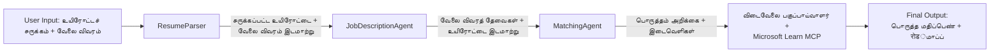

# PersonalCareerCopilot - தகுதிகாணும் வேலைக்கு வாழ்க்கை வரலாறு மதிப்பாய்வாளர்

ஒரு பணிப்புரை முதன்மை கொண்ட பன்முக முகவர்கள் செயலி, ஒரு வாழ்க்கை வரலாறு வேலை விளக்கத்திற்கு எவ்வளவு பொருந்துது என்பதை மதிப்பாய்வு செய்து, பிறகு இடைவெளிகளை நிரப்ப தனிப்பயன் கற்றல் வழிகாட்டி உருவாக்குகிறது.

---

## முகவர்கள்

| முகவர் | பங்கு | கருவிகள் |
|-------|------|-------|
| **ResumeParser** | வாழ்க்கை வரலாறு உரையிலிருந்து கட்டமைக்கப்பட்ட திறன்கள், அனுபவம், சான்றிதழ்களை எடுக்கிறது | - |
| **JobDescriptionAgent** | JD இலிருந்து தேவையான/விரும்பத்தக்க திறன்கள், அனுபவம், சான்றிதழ்களை எடுக்கிறது | - |
| **MatchingAgent** | சுயவிவரம் மற்றும் தேவைகளை ஒப்பிடுகிறது → பொருத்த மதிப்பெண் (0-100) + பொருந்திய/இல்லாத திறன்கள் | - |
| **GapAnalyzer** | Microsoft Learn வளங்களுடன் தனிப்பயன் கற்றல் வழிகாட்டி உருவாக்குகிறது | `search_microsoft_learn_for_plan` (MCP) |

## பணிச்சுற்று


```mermaid
flowchart LR
    UserInput["User Input: உயிரோட்டச் சுருக்கம் + வேலை விவரம்"] --> ResumeParser
    ResumeParser -- "சுருக்கப்பட்ட உயிரோட்டை + வேலை விவரம் இடமாற்று" --> JobDescriptionAgent
    JobDescriptionAgent -- "வேலை விவரத் தேவைகள் + உயிரோட்டை இடமாற்று" --> MatchingAgent
    MatchingAgent -- "பொருத்தம் அறிக்கை + இடைவெளிகள்" --> GapAnalyzerMCP["விடைவேலை பகுப்பாய்வாளர் +\nMicrosoft Learn MCP"]
    GapAnalyzerMCP --> FinalOutput["Final Output:\nபொருத்த மதிப்பெண் + रोड்மாப்ப்"]
```

---

## விரைவு துவக்கம்

### 1. சூழல் அமைத்தல்

இந்த கோப்புறை பணிச்சுற்று அடிப்படையிலான Laboratoires 02 கட்டமைப்பிற்கான குறிக்கோள் நடைமுறை. இதன் `main.py` தற்போதுள்ள ப்ராம்ட் பிளாக்களுடன் `WorkflowBuilder` ஐ பயன்படுத்தி நான்கு முகவர்களையும் இணைக்கிறது.

```powershell
cd workshop\lab02-multi-agent\PersonalCareerCopilot
python -m venv .venv
.\.venv\Scripts\Activate.ps1          # விண்டோஸ் பவர்‌ஷெல்
# source .venv/bin/activate            # மாகோஸ் / லினக்ஸ்
pip install -r requirements.txt
```

### 2. அங்கீகார தரவுகளை அமைத்தல்

இந்த கோப்புறையில் `.env` கோப்பை உருவாக்கவும்:

```powershell
copy .env .env.bak 2>$null; echo $null > .env
```

`.env` ஐ திருத்தவும்:

```env
FOUNDRY_PROJECT_ENDPOINT=https://<your-account>.services.ai.azure.com/api/projects/<your-project>
AZURE_AI_MODEL_DEPLOYMENT_NAME=gpt-4.1-mini
```

| மதிப்பு | எங்கு காண்பது |
|-------|------------------|
| `FOUNDRY_PROJECT_ENDPOINT` | Foundry கருவி பக்கபலத்தை வலது கிளிக் செய்து உங்கள் திட்டத்தை → **Copy Project Endpoint** |
| `AZURE_AI_MODEL_DEPLOYMENT_NAME` | Foundry பக்கபலத்தை விரிவாக்கி திட்டத்துடன் → **Models + endpoints** → வழங்கல் பெயர் |

### 3. உள்ளூரில் இயக்கவும்

```powershell
python -m debugpy --listen 127.0.0.1:5679 main.py --port 8088
```

அல்லது VS Code பணியைப் பயன்படுத்தவும்: `Ctrl+Shift+P` → **Tasks: Run Task** → **Run Agent HTTP Server**.

F5 டீபக்கு பயன்படுத்துவதற்கு, **Debug Local Agent HTTP Server** ஐ பயன்படுத்தவும்.

### 4. Agent Inspector உடன் சோதனை செய்யவும்

Agent Inspector ஐ திறக்கவும்: `Ctrl+Shift+P` → **Foundry Toolkit: Open Agent Inspector**.

இந்த சோதனை ப்ராம்ட்டை நகலெடுக்கவும்:

```
Resume:
Jane Doe
Senior Software Engineer with 5 years of experience in Python, Django, and AWS.
Built microservices handling 10K+ requests/second. Led a team of 4 developers.
Certifications: AWS Solutions Architect Associate.
Education: B.S. Computer Science, State University.

Job Description:
Senior Cloud Engineer at Contoso Ltd.
Required: Python, Azure, Kubernetes, Terraform, CI/CD pipelines.
Preferred: Go, monitoring (Prometheus/Grafana), cost optimization.
Experience: 5+ years in cloud infrastructure.
Certifications: Azure Solutions Architect Expert preferred.
```

**எதிர்பார்ப்பு:** பொருத்து மதிப்பெண் (0-100), பொருந்திய/இல்லாத திறன்கள், மற்றும் Microsoft Learn URL களுடன் தனிப்பயன் கற்றல் வழிகாட்டி.

### 5. Foundry க்கு சுரங்குப்பெறு

`Ctrl+Shift+P` → **Foundry Toolkit: Deploy Hosted Agent** → உங்கள் திட்டத்தை தேர்வு செய்யவும் → உறுதிப்படுத்தவும்.

---

## திட்ட அமைப்பு

```
PersonalCareerCopilot/
├── .env                ← Your credentials (git-ignored)
├── agent.yaml          ← Hosted agent definition (name, resources, env vars)
├── Dockerfile          ← Container image for Foundry deployment
├── main.py             ← 4-agent workflow (instructions, MCP tool, WorkflowBuilder)
└── requirements.txt    ← Python dependencies
```

## முக்கிய கோப்புகள்

### `agent.yaml`

Foundry Agent Service க்கான பணிபுரியும் முகவரை வரையறுக்கிறது:
- `kind: hosted` - மேலாண்மை செய்யப்படும் கன்டெய்னராக இயங்குகிறது
- `protocols` - `/responses` HTTP இறுதிப்புள்ளியை வெளிப்படுத்தும் `responses` நெறிமுறை `version: 1.0.0`
- `environment_variables` - இங்கே `AZURE_AI_MODEL_DEPLOYMENT_NAME` அறிவுறுத்தப்படுகிறது; `FOUNDRY_PROJECT_ENDPOINT` தானாகவே வழங்குநர் நேரத்தில் கருவில் சேர்க்கப்படுகிறது

### `main.py`

கொண்டுள்ளது:
- **Agent அறிவுறுத்தல்கள்** - நான்கு `*_INSTRUCTIONS` நிலைத்துடையங்கள், ஒரு முகவருக்கு ஒன்று
- **MCP கருவி** - `search_microsoft_learn_for_plan()` `https://learn.microsoft.com/api/mcp` ஐ Streamable HTTP மூலம் அழைக்கிறது
- **முகவர் உருவாக்கல்** - நான்கு `Agent()` + `AgentExecutor()` உருவாக்கல்கள் ஒன்று `FoundryChatClient` ஐப் பகிர்கிறது
- **பணிச்சுற்று வரைபடம்** - `WorkflowBuilder` முகவர்களை கட்டமைப்பாக இணைக்கிறது: ResumeParser → JD Agent → MatchingAgent → GapAnalyzer
- **சேவையகம் துவக்கம்** - `ResponsesHostServer` துறை 8088 இல் இயங்குகிறது

### `requirements.txt`

| தொகுப்பு | முக்கியத்துவம் |
|---------|----------|
| `agent-framework-foundry` | அடிப்படை இயக்கச் சூழல்: `Agent`, `AgentExecutor`, `WorkflowBuilder`, `@tool`, `FoundryChatClient` |
| `agent-framework-foundry-hosting` | `ResponsesHostServer` + Foundry ஹோஸ்டிங் ஒருங்கினைவு |
| `mcp<2,>=1.24.0` | GapAnalyzer க்கான MCP கிளைண்ட் (`streamable_http_client`) |
| `debugpy` | Python டீபக்கிங் (VS Code இல் F5) |

---

## பிழைத்திருத்தம்

| பிரச்சனை | சரி செய்தல் |
|-------|-----|
| `KeyError: 'FOUNDRY_PROJECT_ENDPOINT'` அல்லது `KeyError: 'AZURE_AI_MODEL_DEPLOYMENT_NAME'` | `.env` உருவாக்கி `FOUNDRY_PROJECT_ENDPOINT` மற்றும் `AZURE_AI_MODEL_DEPLOYMENT_NAME` இரண்டையும் அமைக்கவும் |
| `ModuleNotFoundError: No module named 'agent_framework'` | venv ஐ செயலிழுத்து `pip install -r requirements.txt` ஐ இயக்கவும் |
| வெளியீட்டில் Microsoft Learn URL கள் இல்லை | `https://learn.microsoft.com/api/mcp` இணைய இணைப்பை சரிபார்க்கவும் |
| ஒரே ஒரு இடைவெளி அட்டை மட்டும் (குறுக்கப்பட்ட) | `GAP_ANALYZER_INSTRUCTIONS` இல் `CRITICAL:` பகுதியை உள்ளடக்கியுள்ளதா என்பதை உறுதிசெய்யவும் |
| துறை 8088 பயன்படுத்தப்பட்டு உள்ளது | பிற சேவையகங்களை நிறுத்தவும்: `netstat -ano \| findstr :8088` |

விரிவான பிழைத்திருத்தத்திற்காக, [Module 8 - Troubleshooting](../docs/08-troubleshooting.md) ஐ பார்க்கவும்.

---

**முழு நடைபயணம்:** [Lab 02 Docs](../docs/README.md) · **திரும்ப:** [Lab 02 README](../README.md) · [Workshop Home](../../../README.md)

---

<!-- CO-OP TRANSLATOR DISCLAIMER START -->
**மறுப்பு**:
இந்த ஆவணம் AI மொழிபெயர்ப்பு சேவை [Co-op Translator](https://github.com/Azure/co-op-translator) பயன்படுத்தி மொழிபெயர்க்கப்பட்டுள்ளது. நாங்கள் துல்லியத்திற்காக முயற்சி செய்துள்ளோம், ஆனால் தானாக செய்யப்படும் மொழிபெயர்ப்புகளில் பிழைகள் அல்லது தவறுகள் இருக்கலாம் என்பதை கவனத்தில் கொள்ளவும். அசல் ஆவணம் அதன் தாய்மொழியில் அதிகாரப்பூர்வ ஆதாரமாக கருதப்பட வேண்டும். முக்கியமான தகவல்களுக்கு, தொழில்நுட்பமான மனித மொழிபெயர்ப்பு பரிந்துரைக்கப்படுகிறது. இந்த மொழிபெயர்ப்பைப் பயன்படுத்துவதால் ஏற்படும் எந்த தவறான புரிதல்கள் அல்லது தவறான விளக்கத்திற்கும் நாங்கள் பொறுப்பில்வில்லை.
<!-- CO-OP TRANSLATOR DISCLAIMER END -->