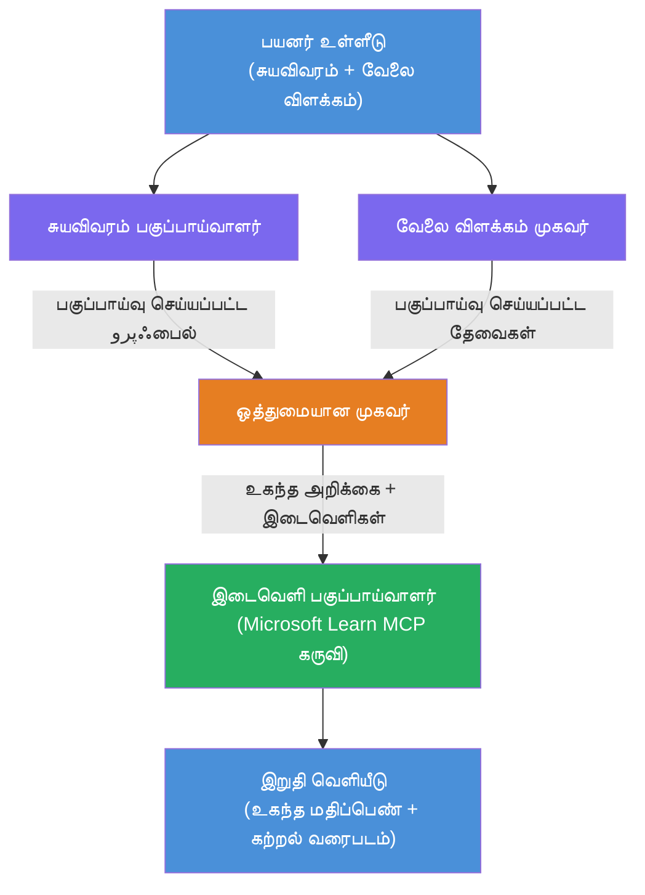

# ప్రయోగశాల 02 - బహుళ-ఏజెంట్ వర్క్ఫ్లో: రిజ్యూమ్ → ఉద్యోగ అనుగుణత మూల్యాంకకుడు

---

## మీరు ఏమి సృష్టించబోతున్నారు

ఒక **రిజ్యూమ్ → ఉద్యోగ అనుగుణత మూల్యాంకకుడు** - నాలుగు నైపుణ్య ఏజెంట్లు కలిసి అభ్యర్థి యొక్క రిజ్యూమ్ ఉద్యోగ వివరణకు ఎంత బాగా సరిపోతోందో అంచనా వేసే బహుళ-ఏజెంట్ వర్క్ఫ్లో, తరువాత గ్యాప్స్ మూసివేయడానికి వ్యక్తిగతికరించిన అభ్యాస రోడ్‌మ్యాప్‌ను రూపొందిస్తుంది.

### ఏజెంట్లు

| ఏజెంట్ | పాత్ర |
|-------|-------|
| **రిజ్యూమ్ పార్సర్** | రిజ్యూమ్ టెక్స్ట్ నుండి నిర్మాణాత్మక నైపుణ్యాలు, అనుభవం, సర్టిఫికేషన్లను తీసుకోవడం |
| **ఉద్యోగ వివరణ ఏజెంట్** | JD నుండి అవసరమైన/ప్రాధాన్యత ఉన్న నైపుణ్యాలు, అనుభవం, సర్టిఫికేషన్లను తీసుకోవడం |
| **మ్యాచింగ్ ఏజెంట్** | ప్రొఫైల్ vs అవసరాలు → సరితూగటం స్కోరు (0-100) + సరిపోయిన/లేని నైపుణ్యాలు పోలిక |
| **గ్యాప్ విశ్లేషకుడు** | వనరులు, సమయరేఖలు, త్వరిత విజయం ప్రాజెక్టులతో వ్యక్తిగత అభ్యాస రోడ్‌మ్యాప్‌ను నిర్మించడం |

### డెమో ప్రవాహం

**రిజ్యూమ్ + ఉద్యోగ వివరణ** అప్లోడ్ చేయండి → **సరితూగటం స్కోరు + లేని నైపుణ్యాలు** పొందండి → **వ్యక్తిగత అభ్యాస రోడ్‌మ్యాప్** అందుకోండి.

### వర్క్ఫ్లో నిర్మాణం

> పర్పుల్ = సమాంతర ఏజెంట్లు | ఆకుపచ్చ = సాధనాలతో తుదరి ఏజెంట్ | ఎరుపు = సమాహరణ బిందువు. వివరాల కోసం [మాడ్యూల్ 1 - ఆర్కిటెక్చర్ అర్థం చేసుకోవడం](docs/01-understand-multi-agent.md) మరియు [మాడ్యూల్ 4 - ఆర్కెస్ట్రేషన్ నమూనాలు](docs/04-orchestration-patterns.md) చూడండి.

### చర్చించిన విషయాలు

- **WorkflowBuilder** ఉపయోగించి బహుళ-ఏజెంట్ వర్క్ఫ్లో సృష్టించడం
- ఏజెంట్ పాత్రలు మరియు ఆర్కెస్ట్రేషన్ ప్రవాహాన్ని నిర్వచించడం (సమాంతర + పరంపర)
- ఏజెంట్ల మధ్య కమ్యూనికేషన్ నమూనాలు
- ఏజెంట్ ఇన్స్పెక్టర్ తో లోకల్ టెస్టింగ్
- ఫౌండ్రీ ఏజెంట్ సర్వీస్ కు బహుళ-ఏజెంట్ వర్క్ఫ్లోలను ప్రవేశపెట్టడం

---

## ముందస్తు అవసరాలు

మొదట ప్రయోగశాల 01 పూర్తిచేయండి:

- [ప్రయోగశాల 01 - ఒకే ఏజెంట్](../lab01-single-agent/README.md)

---

## ప్రారంభించండి

పూర్తి సెటప్ సూచనలు, కోడ్ నడిపే విధానం, మరియు పరీక్ష ఆదేశాలు:

- [ప్రయోగశాల 2 డాక్స్ - ముందస్తు అవసరాలు](docs/00-prerequisites.md)
- [ప్రయోగశాల 2 డాక్స్ - పూర్తి అభ్యాస పథం](docs/README.md)
- [పర్సనల్ కెరీర్ కోపైలట్ నడుపు గైడ్](PersonalCareerCopilot/README.md)

## ఆర్కెస్ట్రేషన్ నమూనాలు (ఏజెంట్ ప్రత్యామ్నాయాలు)

ప్రయోగశాల 2 డిఫాల్ట్ **సమాంతర → సమాహరణ → ప్లానర్** ప్రవాహాన్ని కలిగి ఉంది, మరియు డాక్స్ లో మరింత బలమైన ఏజెంట్ ప్రవర్తనను చూపించడానికి ప్రత్యామ్నాయ నమూనాలను కూడా వివరించింది:

- **భారీ సూచనీయ సమ్మతి తో ఫాన్- అవుట్/ఫాన్-ఇన్**
- **తుదరి రోడ్‌మ్యాప్ ముందు సమీక్షకుడు/ఆలోచనా పాసు**
- **పరిస్థితి ఆధారిత రూటర్** (అనుగుణ స్కోరు మరియు లేని నైపుణ్యాల ఆధారంగా దారి ఎంచుకోవడం)

చూడండి [docs/04-orchestration-patterns.md](docs/04-orchestration-patterns.md).

---

**మునుపటి:** [ప్రయోగశాల 01 - ఒకే ఏజెంట్](../lab01-single-agent/README.md) · **వేపార్క్ హోమ్ కు తిరిగి:** [వర్క్‌షాప్ హోమ్](../../README.md)

---

<!-- CO-OP TRANSLATOR DISCLAIMER START -->
**குறிப்பு**:  
இந்த ஆவணம் AI மொழிபெயர்ப்பு சேவை [Co-op Translator](https://github.com/Azure/co-op-translator) பயன்படுத்தி மொழிபெயர்க்கப்பட்டுள்ளது. எங்களின் முயற்சிகள் சரியாக இருப்பதாக இருந்தாலும், தானியங்கி மொழிபெயர்ப்பில் பிழைகள் அல்லது தவறுகள் இருக்கக்கூடும் என்பதை கவனத்தில் கொள்ளவும். அசல் ஆவணம் அதன் சொந்த மொழியில் அதிகாரப்பூர்வ மூலமாக கருதப்பட வேண்டும். முக்கிய தகவல்களுக்கு, தொழில்முறை மனித மொழிபெயர்ப்பை பரிந்துரைக்கிறோம். இந்த மொழிபெயர்ப்பின் பயன்பாட்டால் ஏற்படும் ஏதேனும் தவறான புரிதல்கள் அல்லது தவறான விளக்கங்களுக்கு நாங்கள் பொறுப்பெடுவதில்லை.
<!-- CO-OP TRANSLATOR DISCLAIMER END -->