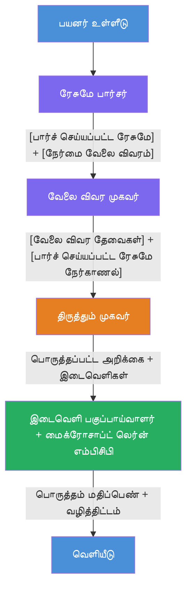

# ஆய்வு 02 - பன்முக முகவர் பணியோட்டம்: கே_resume → பணியிட பொருத்த மதிப்பீட்டாளர்

## பார்வை

இந்த செயன்முறை ஆய்வில், நீங்கள் VS Code இல் Foundry Toolkit ஐ பயன்படுத்தி **பணியோட்டம் முதன்மையான பன்முக முகவர் பயன்பாட்டை** உருவாக்கி அதை Microsoft Foundry Agent சேவைக்கு பதியப்போகிறீர்கள்.

**நீங்கள் உருவாக்கப்போகிரது:** ஒரு கே_resume → பணியிட பொருத்த மதிப்பீட்டாளர், அது கே_resume மற்றும் பணியிட விளக்கத்தை பகுப்பாய்வு செய்து, பொருந்துதலை மதிப்பிட்டு, Microsoft Learn வளங்களை பயன்படுத்தி தனிப்பயன் கல்வி திட்டத்தை உருவாக்கும்.

---

## கட்டமைப்பு

```mermaid
flowchart TD
    A["பயனர் உள்ளீடு"] --> B["ரேசுமே பார்சர்"]
    B -->|"[பார்ச் செய்யப்பட்ட ரேசுமே] + [நேர்மை வேலை விவரம்]"| C["வேலை விவர முகவர்"]
    C -->|"[வேலை விவர தேவைகள்] + [பார்ச் செய்யப்பட்ட ரேசுமே நேர்காணல்]"| D["திருத்தும் முகவர்"]
    D -->|பொருத்தப்பட்ட அறிக்கை + இடைவெளிகள்| E["இடைவெளி பகுப்பாய்வாளர் + மைக்ரோசாப்ட் லெர்ன் எம்பிசிபி"]
    E -->|பொருத்தம் மதிப்பெண் + வழித்திட்டம்| F["வெளியீடு"]

    style A fill:#4A90D9,color:#fff
    style B fill:#7B68EE,color:#fff
    style C fill:#7B68EE,color:#fff
    style D fill:#E67E22,color:#fff
    style E fill:#27AE60,color:#fff
    style F fill:#4A90D9,color:#fff
```

**இது எப்படி வேலை செய்கிறது:**
1. பயனர் ஒரு கே_resume மற்றும் பணியிட விளக்கத்தை ஒட்டுகிறார்.
2. **ResumeParser** கே_resume ஐ பகுப்பாய்வு செய்து, பணியிட விளக்கத்தை அசல் வடிவில் `[JOB DESCRIPTION PASS-THROUGH]` பகுதியில் நகலெடுக்கிறது.
3. **JD Agent** கடத்தலிலிருந்து கட்டமைக்கப்பட்ட தேவைகளை பெற்று, அடுத்து `[PARSED RESUME]` ஐ  `[PARSED RESUME PASS-THROUGH]` ஆக அனுப்புகிறது.
4. **MatchingAgent** `[PARSED RESUME PASS-THROUGH]` மற்றும் `[JD REQUIREMENTS]` ஐ ஒப்பிட்டு பொருத்த மதிப்பெண்களை உருவாக்குகிறது.
5. **GapAnalyzer** குறைகளை நடைமுறைத் திட்டமாக மாற்றி, MCP மூலம் உண்மையான Microsoft Learn இணைப்புகளை பெறுகிறது.

---

## முன்னோட்டங்கள்

முதலாவதாக ஆய்வு 01 ஐ நிறைவு செய்யவும்:

- [ஆய்வு 01 - ஒற்றை முகவர்](../lab01-single-agent/README.md)

---

## பகுதி 1: கட்டமைப்புகளை வரிசைப்படுத்தி படிக்கவும்

முழு கற்றல் பாதையை இங்கே காண்க:

- [ஆய்வு 2 ஆவணங்கள் - முன்னோட்டங்கள்](docs/00-prerequisites.md)
- [ஆய்வு 2 ஆவணங்கள் - முழு கற்றல் பாதை](docs/README.md)
- [PersonalCareerCopilot இயக்க வழிகாட்டி](PersonalCareerCopilot/README.md)

---

## பகுதி 2: பணியோட்டத்தை கட்டி சோதனை செய்யவும்

1. Foundry Toolkit விஞ்ஞானியை பயன்படுத்தி பணியோட்ட அடிப்படையிலான திட்டத்தை உருவாக்கவும்.
2. `PersonalCareerCopilot/main.py` இன் ப்ராம்ட் தொகுதிகளை மற்றும் பணியோட்ட வரைபடத்தை உங்கள் வேலைப் பகுதியில் நகலெடுக்கவும்.
3. உள்ளூர் முறையில் Agent Inspector கொண்டு இயக்கு மற்றும் நான்கு முகவர்களும் MCP கருவி சரியாக வேலை செய்கிறதா என்பதை உறுதிப்படுத்தவும்.
4. உள்ளூர்வமாக சோதித்தவுடன் Foundry இல் ஹோஸ்ட் செய்யப்பட்ட முகவரைப் பிரசாரம் செய்யவும்.

---

## ஒருங்கிணைப்பு மாதிரிகள்

ஆய்வு 02 இல் இயல்புநிலை **வெளியேறு → உள்ளேறு → முறையே** பணி நீக்கம் உள்ளது, மேலும் ஆவணங்களில் பரிசோதனைக்கு விருப்பமான மாற்று ஒருங்கிணைப்பு மாதிரிகளும் குறிக்கப்பட்டுள்ளன.

- **அளவோடுவுகை உள்ள வெளியில்/உள்ளேறு உடன் கட்டாய ஒப்புதல்**
- **இறுதி திட்டத்திற்கு முன்னர் விமர்சகர்/அறிக்கையாளர் காலப்பிரிவு**
- **பொருத்த மதிப்பெண் மற்றும் குறைவான திறன்கள் அடிப்படையில் நிபந்தனை வழிமாற்றி**

[docs/04-orchestration-patterns.md](docs/04-orchestration-patterns.md) ஐ பார்க்கவும்.

---

**முந்தைய:** [ஆய்வு 01 - ஒற்றை முகவர்](../lab01-single-agent/README.md) · **திரும்ப:** [பயிற்சி அறை முகப்பு](../../README.md)

---

<!-- CO-OP TRANSLATOR DISCLAIMER START -->
**மறுப்பு**:
இந்த ஆவணம் AI மொழிபெயர்ப்பு சேவை [Co-op Translator](https://github.com/Azure/co-op-translator) பயன்படுத்தி மொழிபெயர்க்கப்பட்டுள்ளது. நாங்கள் துல்லியத்திற்காக முயற்சி செய்துள்ளோம், ஆனால் தானாக செய்யப்படும் மொழிபெயர்ப்புகளில் பிழைகள் அல்லது தவறுகள் இருக்கலாம் என்பதை கவனத்தில் கொள்ளவும். அசல் ஆவணம் அதன் தாய்மொழியில் அதிகாரப்பூர்வ ஆதாரமாக கருதப்பட வேண்டும். முக்கியமான தகவல்களுக்கு, தொழில்நுட்பமான மனித மொழிபெயர்ப்பு பரிந்துரைக்கப்படுகிறது. இந்த மொழிபெயர்ப்பைப் பயன்படுத்துவதால் ஏற்படும் எந்த தவறான புரிதல்கள் அல்லது தவறான விளக்கத்திற்கும் நாங்கள் பொறுப்பில்வில்லை.
<!-- CO-OP TRANSLATOR DISCLAIMER END -->