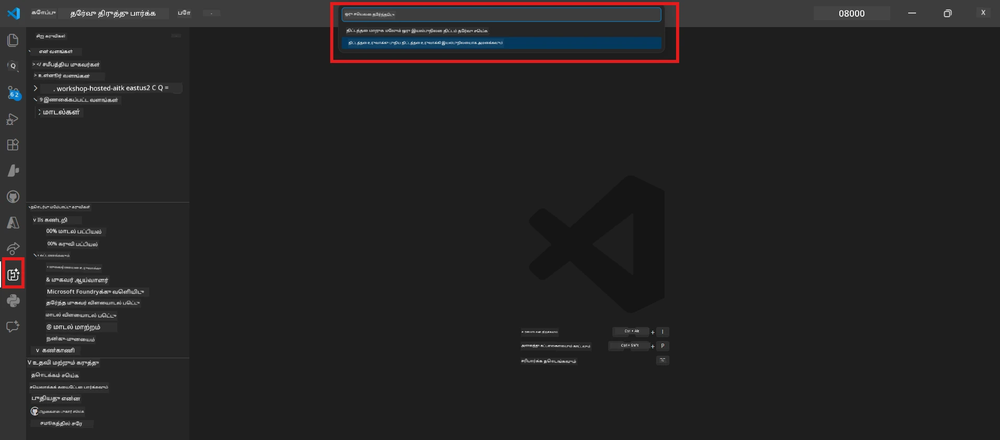

# Module 0 - தேவையான முன்னிலை

Lab 02 ஐத் தொடங்கும் முன்பு, கீழ்க்காணும் பணிகள் முடிக்கப்பட்டுள்ளதா என்பதை உறுதி செய்க. இந்த பணிக் குழு நேரடியாக Lab 01 இல் அடிப்படையாக அமைந்துள்ளது - அதை தவிர்க்க வேண்டாம்.

---

## 1. Lab 01 ஐ முடிக்கவும்

Lab 02 கீழ்காணும் பணிகளைக் கோருகிறது:

- [x] [Lab 01 - Single Agent](../../lab01-single-agent/README.md)ன் அனைத்து 8 பகுதிகளையும் முடித்துள்ளீர்கள்
- [x] ஒரு ஒற்றை முகவரியை Foundry Agent Service இல் வெற்றிகரமாக வெளியிட்டுள்ளீர்கள்
- [x] முகவர் உள்ளூர் Agent Inspector மற்றும் Foundry Playground இல் வேலை செய்கிறதா என்று உறுதிப்படுத்தியுள்ளீர்கள்

Lab 01 ஐ முடிக்கவில்லை என்றால், மீண்டும் சென்று அதை இப்போது முடிக்கவும்: [Lab 01 ஆவணங்கள்](../../lab01-single-agent/docs/00-prerequisites.md)

---

## 2. உள்ளமைவுகளை சரிபார்க்கவும்

Lab 01இல் உள்ள அனைத்து கருவிகளும் இன்னும் நிறுவப்பட்டும் செயல்படும் நிலையில் இருக்க வேண்டும். இவற்றை விரைவில் சரிபார்க்கவும்:

### 2.1 Azure CLI

```powershell
az account show --query "{name:name, id:id}" --output table
```
  
எதிர்பார்ப்பு: உங்கள் சந்தா பெயர் மற்றும் ஐடியை காட்டும். இது தோல்வியடைவதாக இருந்தால், [`az login`](https://learn.microsoft.com/cli/azure/authenticate-azure-cli-interactively) என்ற கட்டளையை இயக்கவும்.

### 2.2 VS Code விரிவாக்கங்கள்

1. `Ctrl+Shift+P` அழுத்தி → **"Microsoft Foundry"** என தட்டச்சு செய்து → கட்டளைகள் (எ.கா., `Microsoft Foundry: Create a New Hosted Agent`) தெரியும் என்பதை உறுதி செய்யவும்.  
2. `Ctrl+Shift+P` அழுத்தி → **"Foundry Toolkit"** என தட்டச்சு செய்து → கட்டளைகள் (எ.கா., `Foundry Toolkit: Open Agent Inspector`) தெரியும் என்பதை உறுதி செய்யவும்.

### 2.3 Foundry திட்டம் மற்றும் மாதிரி

1. VS Code Activity Bar இல் உள்ள **Microsoft Foundry** ஐகானைக் கிளிக் செய்யவும்.  
2. உங்கள் திட்டம் பட்டியலில் உள்ளது என்று உறுதி செய்யவும் (எ.கா., `workshop-agents`).  
3. திட்டத்தை விரிவுபடுத்தி → ஒரு வெளியிடப்பட்ட மாதிரி உள்ளது என்று உறுதிப்படுத்தவும் (எ.கா., `gpt-4.1-mini`) மற்றும் நிலை **Succeeded** ஆக இருக்க வேண்டும்.

> **உங்கள் மாதிரி வெளியீடு காலாவதியானால்:** சில இலவச பரப்பு வெளியீடுகள் தானாக காலாவதியாகும். [மாதிரி அடைவு](https://learn.microsoft.com/azure/foundry/foundry-models/concepts/models-sold-directly-by-azure) லிருந்து மீண்டும் வெளியிடவும் (`Ctrl+Shift+P` → **Microsoft Foundry: Open Model Catalog**).



### 2.4 RBAC பங்கு நிர்வாகங்கள்

உங்கள் Foundry திட்டத்தில் **Azure AI User** பங்கு உள்ளதா என உறுதி செய்யவும்:

1. [Azure போர்டல்](https://portal.azure.com) → உங்கள் Foundry **திட்டம்** வளம் → **Access control (IAM)** → **[பங்கு நியமனங்கள்](https://learn.microsoft.com/azure/foundry/concepts/rbac-foundry)** தாவலைத் திறக்கவும்.  
2. உங்கள் பெயரை தேடவும் → **[Azure AI User](https://aka.ms/foundry-ext-project-role)** பட்டியலில் உள்ளது என்று உறுதி செய்யவும்.

---

## 3. பல முகவர் கருத்துக்களை புரிந்துகொள்ளவும் (Lab 02க்கான புதியவை)

Lab 02 Lab 01 இல் உள்ளடங்காத கருத்துக்களை அறிமுகப்படுத்துகிறது. தொடர்ந்து செல்லும்முன் இவை படிக்கவும்:

### 3.1 பல முகவர் வேலைபோக்கு என்றால் என்ன?

ஒற்றை முகவர் அனைத்து பணிகளையும் கையாளும் பதிலாக, **பல முகவர் வேலைபோக்கு** பல சிறப்பு முகவர்களுக்குள் பணிகளை பிரிக்கிறது. ஒவ்வொரு முகவருக்கும்:

- சொந்த **வழிமுறைகள்** (கணினி உத்தரவாதம்)
- சொந்த **பங்கு** (அதில் பொறுப்பானவை)
- விருப்பமான **கருவிகள்** (அவை அழைக்கக்கூடிய செயல்பாடுகள்)

முகவர்கள் **ஒழுங்கமைப்பு வரைபடம்** மூலம் தகவல்களை தொடர்பு கொள்கின்றனர்.

### 3.2 WorkflowBuilder

`agent_framework` இல் உள்ள [`WorkflowBuilder`](https://learn.microsoft.com/agent-framework/workflows/agents-in-workflows) வகுப்பு, முகவர்களை இணைக்க பயன்படும் SDK கூறு:

```python
from agent_framework import WorkflowBuilder

workflow = (
    WorkflowBuilder(
        name="MyWorkflow",
        start_executor=agent_a,
        output_executors=[agent_d],
    )
    .add_edge(agent_a, agent_b)
    .add_edge(agent_a, agent_c)
    .add_edge(agent_b, agent_d)
    .add_edge(agent_c, agent_d)
    .build()
)
```

- **`start_executor`** - பயனர் உள்ளீட்டை முதலில் பெறும் முகவர்  
- **`output_executors`** - இறுதி பதிலாக வரும் கருத்தை வழங்கும் முகவர்(கள்)  
- **`add_edge(source, target)`** - `target` என்பது `source` இன் வெளியீட்டை பெறுவதாக வரையறுக்கும்  

### 3.3 MCP (Model Context Protocol) கருவிகள்

Lab 02 Microsoft Learn API ஐ அழைத்து கற்றல் வளங்களை பெறும் **MCP கருவி**-ஐப் பயன்படுத்துகிறது. [MCP (Model Context Protocol)](https://modelcontextprotocol.io/introduction) என்பது AI மாதிரிகளைக் வெளிவரும் தரவு மூலங்களை மற்றும் கருவிகளை இணைக்கும் ஒரு நிலையான நெறிமுறை.

| சொல் | வரையறை |
|------|-----------|
| **MCP சேவையகம்** | [MCP நெறிமுறை](https://learn.microsoft.com/azure/foundry/agents/how-to/tools/model-context-protocol) மூலம் கருவிகள்/வளங்களை வெளிப்படுத்தும் சேவை |
| **MCP கிளையன்ட்** | MCP சேவையகத்துடன் இணைந்து அதன் கருவிகளை அழைக்கும் உங்கள் முகவர் குறியீடு |
| **[Streamable HTTP](https://learn.microsoft.com/agent-framework/agents/tools/hosted-mcp-tools)** | MCP சேவையகத்துடன் தொடர்பு கொள்ள பயன்படுத்தப்படும் முறை |

### 3.4 Lab 02, Lab 01 திலிருந்து எப்படி வேறுபடுகிறது

| அம்சம் | Lab 01 (ஒற்றை முகவர்) | Lab 02 (பல-முகவர்) |
|--------|----------------------|---------------------|
| முகவர்கள் | 1 | 4 (சிறப்பு பங்குகள்) |
| ஒழுங்கமைப்பு | எதுவும் இல்லை | WorkflowBuilder (இணை மற்றும் தொடர்ச்சி) |
| கருவிகள் | விருப்ப `@tool` செயல்பாடு | MCP கருவி (வெளிப்புற API அழைப்பு) |
| சிக்கல் | எளிய உத்தரவு → பதில் | அறிமுகம் + JD → பொருத்த மதிப்பெண் → திட்டம் |
| சூழல் ஓட்டம் | நேரடி | முகவர்-முகவர் மாற்றம் |

---

## 4. Lab 02 நடைமுறை கோப்பு அமைப்பு

Lab 02 கோப்புகள் எங்கே என்பதைப் பார்:

```
workshop/
└── lab02-multi-agent/
    ├── README.md                       ← Lab overview
    ├── docs/                           ← You are here
    │   ├── README.md                   ← Learning path index
    │   ├── 00-prerequisites.md         ← This file
    │   ├── 01-understand-multi-agent.md
    │   ├── ...
    │   └── 08-troubleshooting.md
    └── PersonalCareerCopilot/          ← The agent project
        ├── agent.yaml                  ← Agent definition
        ├── main.py                     ← 4-agent workflow code
        ├── Dockerfile                  ← Container configuration
        └── requirements.txt            ← Python dependencies
```

---

### சரிபார்ப்பு பட்டியல்

- [ ] Lab 01 முழுமையாக முடிக்கப்பட்டுள்ளது (எல்லா 8 பகுதிகளும், முகவர் வெளியிடப்பட்டு சரிபார்க்கப்பட்டது)  
- [ ] `az account show` உங்கள் சந்தாவை காட்டுகிறது  
- [ ] Microsoft Foundry மற்றும் Foundry Toolkit விரிவாக்கங்கள் நிறுவப்பட்டு வேலை செய்கின்றன  
- [ ] Foundry திட்டத்தில் ஒரு வெளியிடப்பட்ட மாதிரி உள்ளது (எ.கா., `gpt-4.1-mini`)  
- [ ] திட்டத்தில் நீங்கள் **Azure AI User** பங்கு பெற்றுள்ளீர்கள்  
- [ ] மேலே உள்ள பல-முகவர் கருத்துக்களை படித்தும் WorkflowBuilder, MCP மற்றும் முகவர் ஒழுங்கமைப்பை புரிந்துகொண்டுள்ளீர்கள்  

---

**அடுத்து:** [01 - பல-முகவர் கட்டமைப்பைப் புரிந்து கொள் →](01-understand-multi-agent.md)

---

<!-- CO-OP TRANSLATOR DISCLAIMER START -->
**உறுதிப்பத்திரம்**:
இந்த ஆவணம் AI மொழிபெயர்ப்பு சேவை [Co-op Translator](https://github.com/Azure/co-op-translator) பயன்படுத்தி மொழிமாற்றம் செய்யப்பட்டுள்ளது. நாம் துல்லியத்திற்காக முயற்சித்தாலும், தானாக நடைபெறும் மொழிபெயர்ப்புகளில் தவறுகள் அல்லது தவறான தகவல்கள் இருப்பpossibility உள்ளது என்பதை அறிவிருக்கவும். அசல் ஆவணம் அதன் தாய்மொழியில் அங்கீகாரம் பெற்ற மூலமாக கருதப்பட வேண்டும். முக்கியமான தகவல்களுக்கு, நிபுணர் மனித மொழிபெயர்ப்பு பரிந்துரைக்கப்படுகிறது. இந்த மொழிபெயர்ப்பின் பயன்பாட்டினால் ஏற்படும் எந்தவொரு தவறான புரிதலும் அல்லது தவறான விளக்கங்களுக்கும் நாங்கள் பொறுப்பேற்கவில்லை.
<!-- CO-OP TRANSLATOR DISCLAIMER END -->