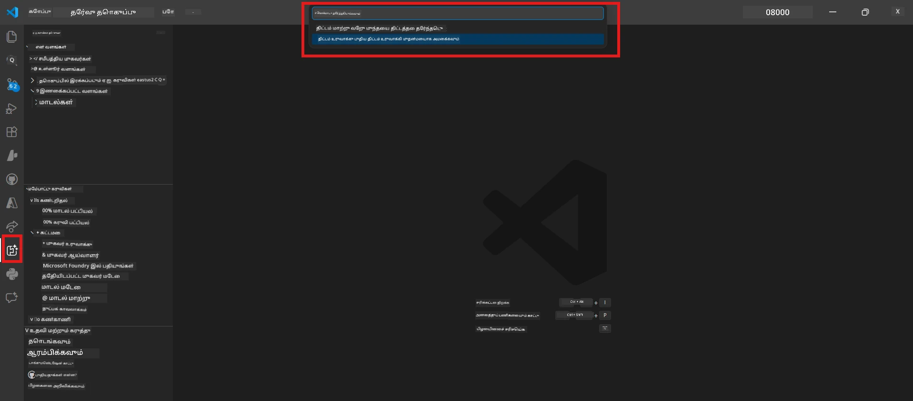

# தொகுதி 0 - அறிமுகம்

⏱️ ~10 நிமிடம்

> [!WARNING]
> **முன்னோட்டம் மற்றும் வரம்புகள்:** [Hosted Agents](https://learn.microsoft.com/azure/foundry/agents/concepts/hosted-agents) தற்போது **பொதுச்செயல்முறை முன்னோட்டத்தில்** உள்ளது - உற்பத்தி பணிகளுக்கு பரிந்துரைக்கப்படவில்லை. இந்த பணிமன்றத்தில் காணப்படும் சில அம்சங்கள் சேவை GA நோக்கி நகரும்போது மாறக்கூடும்.

## நீங்கள் உருவாக்கப்போவது

இந்த ஆய்வகம், Lab 01–இல் இருந்து ஒரு-ஏஜென்ட் திறன்களை விரிவுபடுத்தி, **பல-ஏஜென்ட் வேலைநடவடிக்கை** உருவாக்குகிறது - Resume → வேலைப் பொருத்த மதிப்பாய்வாளர்.

நீங்கள் ஒரு **சுயவிவரம்** மற்றும் ஒரு **வேலை விவரம்** ஒட்டுவீர்கள். நான்கு நிபுணத்துவமிக்க ஏஜென்ட்கள் உள்ளீட்டை தொடர் முறையில் செயல்படுத்தி, பிறகு திரும்ப அளிக்கும்:
- பொருத்த மதிப்பு (0–100 மதிப்பீட்டு பிரிவுடன்)
- திறன் மற்றும் சான்றிதழ் குறியீட்டு பட்டியல்
- ஒவ்வொரு குறைக்கான Microsoft Learn இணைப்புகளுடன் தனிப்பயன் கற்றல் பயண வரைபடம்

**வேலைநடவடிக்கை பயன்படுத்துகிறது:**
- **Microsoft Agent Framework** - தொடர் குழாய் ஒருங்கிணைப்பிற்கு `WorkflowBuilder`
- **Foundry Toolkit for VS Code** - மேடமைப்பு, உள்ளூரில் சோதனை, நிலைநிறுத்தல்
- **ஒரு AI மாதிரி** (எ.கா., `gpt-4.1-mini`) - அனைத்து நான்கு ஏஜென்ட்களும் பயன்படுத்தும்
- **Microsoft Learn MCP சேவையகம்** - ஒவ்வொரு திறன் குறைக்குமான உண்மையான கற்றல் வள இணைப்புகளை வழங்குகிறது

---

## உங்கள் பாதையை தேர்வு செய்க

> ⚠️ **Lab 01–இல் நீங்கள் பயன்படுத்திய அதே பாதியுடன் தொடரவும்.**

<details open>
<summary><strong>🅰️ பாதை A - Azure மேகம் (Azure சந்தா தேவை)</strong></summary>

| | விவரங்கள் |
|---|---|
| **யாருக்கு இது?** | நீங்கள் Azure சந்தாவை பயன்படுத்தி Lab 01 முழுமைப்படுத்தியுள்ளீர்கள் |
| **மாதிரி** | Foundry வாயிலாக Azure OpenAI (எ.கா., `gpt-4.1-mini`) |
| **மொத்த தொகுதிகள்** | அனைத்து தொகுதிகளும் (00–09) |
| **மேகத்திற்கு நிலைநிறுத்த விவரம்?** | ✅ ஆம் - முழுமையான தொடர் நிலைநிறுத்தல் |

</details>

<details open>
<summary><strong>🅱️ பாதை B - Foundry உள்ளூர் (Azure சந்தா தேவையில்லை)</strong></summary>

| | விவரங்கள் |
|---|---|
| **யாருக்கு இது?** | நீங்கள் Foundry உள்ளூரை பயன்படுத்தி Lab 01 முடித்துள்ளீர்கள் |
| **மாதிரி** | Foundry உள்ளூர் (இலவசம், உங்கள் இயந்திரத்தில் இயங்கும்) |
| **மொத்த தொகுதிகள்** | தொகுதிகள் 00–05 (06–07 தவிர்க்கவும் - நிலைநிறுத்தல் மற்றும் மேகம் சரிபார்த்தல்) |
| **மேகத்திற்கு நிலைநிறுத்த விவரம்?** | ❌ இல்லை - உள்ளூர் சோதனை தான் Agent Inspector மூலம் |

</details>

---

## Lab 01 சரிபார்ப்பு

Lab 02 நேரடியாக Lab 01–இல் கட்டப்பட்டுள்ளது. இங்கு தொடங்குவதற்கு முன் Lab 01–ஐ முதலில் முடிக்கவும்.

Lab 01 இன்னும் செயத்தியுள்ளீர்களா? இங்கிருந்து தொடங்கவும்: [Lab 01 - அறிமுகம்](../../lab01-single-agent/docs/00-prerequisites.md)

<details open>
<summary><strong>🅰️ பாதை A - Azure மேகம்</strong></summary>

```powershell
az account show --query "{name:name, id:id}" --output table
```

தோல்வியடைவின் போது, `az login` இயக்கவும். பிறகு VS Code இல் சரிபார்க்கவும்:

1. `Ctrl+Shift+P` → **Foundry Toolkit** எனத் type செய்யவும் → கட்டளைகள் தோன்றுவதை உறுதிசெய்க.
2. **Foundry Toolkit** ஐகானை கிளிக் செய்யவும் → உங்கள் திட்டம் மற்றும் நிலைநிறுத்தப்பட்ட மாதிரி **வெற்றி** எனக் காண்பிக்கப்படும்.



> **RBAC:** நீங்கள் Lab 01–இல் **Foundry பயனர்** என பணிவகுப்பு செய்துள்ளீர்கள். மீண்டும் பணிவகுப்பு செய்ய வேண்டுமானால், [Lab 01, தொகுதி 1](../../lab01-single-agent/docs/01-setup.md#deploy-a-model--assign-rbac) பார்க்கவும். உரிமை முன்பு **Azure AI பயனர்** என அழைக்கப்பட்டது - அதே அனுமதிகள்.

</details>

<details open>
<summary><strong>🅱️ பாதை B - Foundry உள்ளூர்</strong></summary>

```powershell
Invoke-WebRequest -Uri "http://localhost:5273/v1/health" -UseBasicParsing | Select-Object StatusCode
```

எதிர்பார்க்கப்படுகிறது: `StatusCode: 200`. இல்லையெனில், Foundry Toolkit sidebar–இல் இருந்து Foundry உள்ளூரை மீண்டும் தொடங்கவும்.

> அனைத்து கூற்று உங்கள் இயந்திரத்தில் இயங்கும். மட்டுமல்ல MCP கருவி மூலம் `https://learn.microsoft.com/api/mcp` க்கு வெளியே செல்வது.

</details>

---

## Lab 02 இல் என்ன புதியது

| | Lab 01 | Lab 02 |
|--|--------|--------|
| ஏஜென்ட்கள் | 1 | 4 (WorkflowBuilder உடன் சங்கிலி) |
| மேடமைப்பு மாதிரி | அடிப்படை - Agent Framework | வேலைநடவடிக்கைகள் - Agent Framework |
| புதிய தொகுப்பு | - | `mcp` |
| ஒருங்கிணைப்பு | ஒற்றை உரையாடல் ஏஜெண்ட் | தொடர் குழாய் (WorkflowBuilder) |
| புதிய கருவி | - | `search_microsoft_learn_for_plan` (MCP) |

---

**அடுத்தது:** [01 - கட்டமைப்பை புரிந்து கொள்ள →](01-understand-multi-agent.md)

---

<!-- CO-OP TRANSLATOR DISCLAIMER START -->
**மறுப்பு**:
இந்த ஆவணம் AI மொழிபெயர்ப்பு சேவை [Co-op Translator](https://github.com/Azure/co-op-translator) பயன்படுத்தி மொழிபெயர்க்கப்பட்டுள்ளது. நாங்கள் துல்லியத்திற்காக முயற்சி செய்துள்ளோம், ஆனால் தானாக செய்யப்படும் மொழிபெயர்ப்புகளில் பிழைகள் அல்லது தவறுகள் இருக்கலாம் என்பதை கவனத்தில் கொள்ளவும். அசல் ஆவணம் அதன் தாய்மொழியில் அதிகாரப்பூர்வ ஆதாரமாக கருதப்பட வேண்டும். முக்கியமான தகவல்களுக்கு, தொழில்நுட்பமான மனித மொழிபெயர்ப்பு பரிந்துரைக்கப்படுகிறது. இந்த மொழிபெயர்ப்பைப் பயன்படுத்துவதால் ஏற்படும் எந்த தவறான புரிதல்கள் அல்லது தவறான விளக்கத்திற்கும் நாங்கள் பொறுப்பில்வில்லை.
<!-- CO-OP TRANSLATOR DISCLAIMER END -->