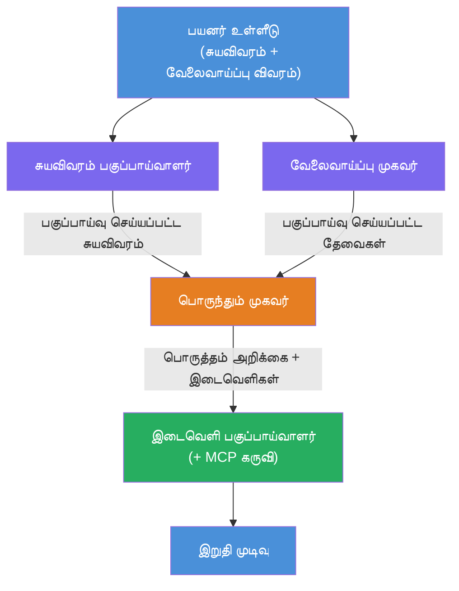
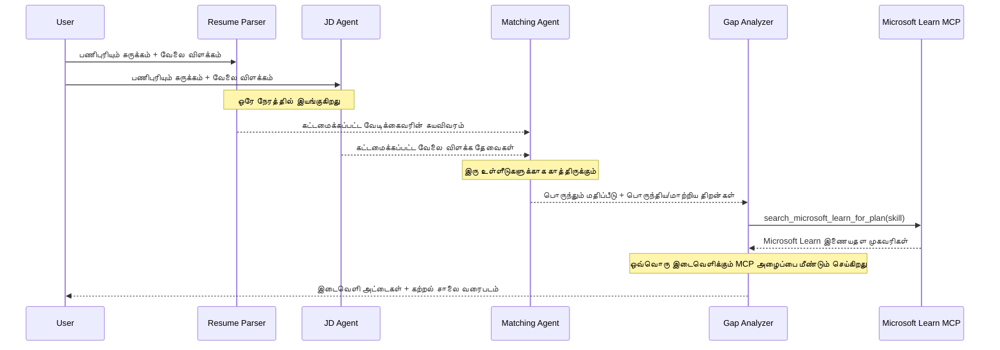
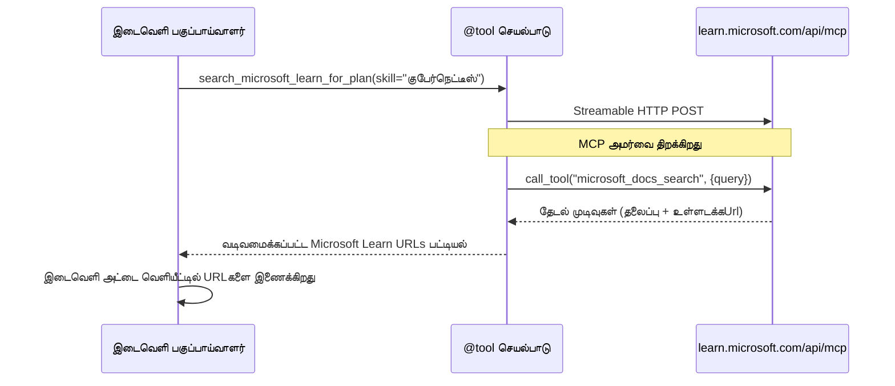

# Module 1 - மல்டி-ஏஜெண்ட் கட்டமைப்பை புரிந்து கொள்

இந்த moduleல், நீங்கள் Resume → Job Fit Evaluator என்ற அமைப்பை எந்த code எழுதுவதற்கு முன்பு கற்றுக்கொள்வீர்கள். ஒத்துழைப்பு வரைபடம், ஏஜெண்ட் பங்கை மற்றும் தரவு ஓட்டத்தை புரிந்து கொள்வது பெண்கொடுக்கும் மற்றும் விரிவாக்கம் செய்வதில் மிகவும் அவசியம் [multi-agent workflows](https://learn.microsoft.com/azure/architecture/ai-ml/idea/multiple-agent-workflow-automation) என்பதை புரிந்து கொள்வது அவசியம்.

---

## இதனாலான பிரச்சனையை எவ்வளவு தீர்க்கிறது

ஒரு Resume ஐ ஒரு Job Description உடன் பொருத்துவது பல்வேறு தனித்துவமான திறன்களை கொண்டுள்ளது:

1. **Parsing** - உரையாடலற்ற உரையிலிருந்து கட்டமைக்கப்பட்ட தரவை எடுத்துக் கொள் (resume)
2. **Analysis** - ஒரு job descriptionஇல் இருந்து தேவைகளை எடுத்து கொள்
3. **Comparison** - இரண்டிற்கும் இடையில் பொருத்தம் மதிப்பீடு செய்
4. **Planning** - இடைவெளிகளை மூடுவதற்கான கற்றல் திட்டத்தை உருவாக்கு

ஒரே ஒரு ஏஜெண்ட் அனைத்துக் காரியங்களையும் ஒரே ஒரு promptல் செய்யும் போது பெரும்பாலும்:
- முழுமையான எடுத்துரைகளற்றது (மதிப்பீட்டை எடுக்க parsing இல் விரைவாக செய்கிறது)
- அடிக்கடி மதிப்பீடு ஆழமற்றது (ஆதார-அடிப்படையிலான பணிக்கொள்வுகள் இல்லை)
- பொதுவான கோர்புகள் (குறிப்பிட்ட இடைவெளிகளுக்கு ஏற்பற்றவை அல்ல)

**நான்கு சிறப்பு ஏஜெண்ட்களாக பிரித்தால்**, ஒவ்வொன்றும் தன் நோக்கத்திற்கு தனிப்பட்ட வழிகாட்டுதல்களை கொண்டு, ஒவ்வொரு கட்டத்திலும் உயர்தர வெளியீட்டைக் கொடுக்கிறது.

---

## நான்கு ஏஜெண்ட்கள்

ஒவ்வொரு ஏஜெண்டும் முழுமையான [Microsoft Foundry](https://learn.microsoft.com/azure/foundry/agents/concepts/hosted-agents) ஏஜெண்டாக `AzureAIAgentClient.as_agent()` மூலம் உருவாக்கப்படுகிறார்கள். இவர்கள் அதே மாதிரியான மாடல் இந்தியமையை பகிர்கின்றனர் ஆனால் வேறு வழிமுறைகள் மற்றும் (தேர்ந்தெடுத்த) பல கருவிகளைக் கொண்டிருக்கலாம்.

| # | ஏஜெண்ட் பெயர் | பங்கு | உள்ளீடு | வெளியீடு |
|---|-----------|------|-------|--------|
| 1 | **ResumeParser** | Resume உரையிலிருந்து கட்டமைக்கப்பட்ட சுயவிவரத்தை எடுக்கிறது | Raw resume உரை (பயனரிடமிருந்து) | விண்ணப்பதாரர் சுயவிவரம், தொழில்நுட்ப திறன்கள், மென்மையான திறன்கள், சான்றிதழ்கள், துறை அனுபவம், சாதனைகள் |
| 2 | **JobDescriptionAgent** | ஒரு JDயிலிருந்து கட்டமைக்கப்பட்ட தேவைகளை எடுக்கிறது | Raw JD உரை (பயனரிடமிருந்து, ResumeParser வழியாக அனுப்பப்படுதல்) | பங்கின் பரிச்சயம், தேவையான திறன்கள், விருப்பத்தேர்வுகளுக்கான திறன்கள், அனுபவம், சான்றிதழ்கள், கல்வி, பொறுப்புகள் |
| 3 | **MatchingAgent** | ஆதாரமுடைய பொருந்தல் மதிப்பெண்ணை கணக்கிடுகிறது | ResumeParser + JobDescriptionAgent வெளியீடுகள் | பொருத்த மதிப்பெண் (0-100 உடன் உடைத்து), பொருத்தமான திறன்கள், காணாத திறன்கள், இடைவெளிகள் |
| 4 | **GapAnalyzer** | தனிப்பட்ட கற்றல் திட்டத்தை உருவாக்குகிறது | MatchingAgent வெளியீடு | இடைவெளி அட்டைகளை (திறன் அடிப்படையிலான), கற்றல் வழிசெலுத்தல், கால அட்டவணை, Microsoft Learn மூலம் வளங்கள் |

---

## ஒத்துழைப்பு வரைபடம்

ஒவ்வொரு தொகுப்பும் **இணைந்த தலைவி** உடன் தொடரும் **வரிசைப்படுத்தப்பட்ட ஒருங்கிணைப்பு** பயன்படுத்துகிறது:


> **குறிப்புரை:** Purple = இணையான ஏஜெண்ட்கள், Orange = ஒருங்கிணைப்பு புள்ளி, Green = கருவிகளுடன் இறுதி ஏஜெண்ட்

### தரவு ஓட்டம் எப்படிச் செல்கிறது


1. **பயனர்** resume மற்றும் job description உடைய செய்தி ஓர் செய்தியை அனுப்புகிறார்.
2. **ResumeParser** முழு பயனர் உள்ளீட்டைப் பெற்று கட்டமைக்கப்பட்ட விண்ணப்பதாரர் சுயவிவரத்தை எடுக்கிறது.
3. **JobDescriptionAgent** பயனர் உள்ளீட்டை இணைந்து பெறுகிறது மற்றும் கட்டமைக்கப்பட்ட தேவைகளை எடுக்கிறது.
4. **MatchingAgent** இரண்டு ResumeParser மற்றும் JobDescriptionAgent வெளியீடுகளை பெறுகிறது (framework இரண்டுமே முடிந்த பிறகு MatchingAgent ஓட உருவாக்கும்).
5. **GapAnalyzer** MatchingAgent வெளியீட்டை பெற்று ஒவ்வொரு இடைவெளிக்கும் உண்மையான கற்றல் வளங்களை பெற Microsoft Learn MCP கருவியை அழைக்கிறது.
6. **இறுதி வெளியீடு** GapAnalyzerக்கான பதிலாக பொருத்தமிருந்து மதிப்பெண், இடைவெளி அட்டைகள் மற்றும் முழுமையான கற்றல் திட்டம் அடங்கும்.

### இணைந்த தலைவி ஏன் முக்கியம்

ResumeParser மற்றும் JobDescriptionAgent இணைந்து இயங்குகின்றன ஏனெனில் இவர்கள் ஒன்றின் மற்றொன்றின் மீது சார்ந்தில்லை. இது:
- மொத்த பதிலுத்திறனை குறைக்கிறது (இரண்டும் ஒரே நேரத்தில் இயங்கும், தொடர்ச்சியாக அல்ல)
- இயல்பான பிரிவு ஆகும் (resume parsing மற்றும் JD parsing தனித்துவமான பணி)
- பொதுவான மல்டி-ஏஜெண்ட் வடிவமைப்பை காட்டுகிறது: **fan-out → aggregate → act**

---

## WorkflowBuilder கோடுகளில்

மேலிருந்த வரைபடம் `main.py` இல் உள்ள [`WorkflowBuilder`](https://learn.microsoft.com/agent-framework/workflows/agents-in-workflows) API அழைப்புடன் இப்படி பொருந்துகிறது:

```python
from agent_framework import WorkflowBuilder

workflow = (
    WorkflowBuilder(
        name="ResumeJobFitEvaluator",
        start_executor=resume_parser,       # பயனர் உள்ளீட்டை பெற முதற் ஏஜেন্ট்
        output_executors=[gap_analyzer],     # வெளியீடு திரும்ப வழங்கப்படும் கடைசி ஏஜென்ட்
    )
    .add_edge(resume_parser, jd_agent)      # ResumeParser → வேலை விளக்கம் ஏஜென்ட்
    .add_edge(resume_parser, matching_agent) # ResumeParser → பொருந்தும் ஏஜென்ட்
    .add_edge(jd_agent, matching_agent)      # வேலை விளக்கம் ஏஜென்ட் → பொருந்தும் ஏஜென்ட்
    .add_edge(matching_agent, gap_analyzer)  # பொருந்தும் ஏஜென்ட் → இடைவெளி பகுப்பாய்வாளர்
    .build()
)
```

**முக்கோணத் தொலைகள் புரிதலும்:**

| Edge | பொருள் |
|------|--------------|
| `resume_parser → jd_agent` | JD Agent ResumeParser வெளியீட்டை பெறுகிறது |
| `resume_parser → matching_agent` | MatchingAgent ResumeParser வெளியீட்டை பெறுகிறது |
| `jd_agent → matching_agent` | MatchingAgent JD Agent வெளியீட்டையும் பெறுகிறது (இரண்டையும் காத்திருக்கிறது) |
| `matching_agent → gap_analyzer` | GapAnalyzer MatchingAgent வெளியீட்டை பெறுகிறது |

MatchingAgentக்கு **இரண்டு வருகைத் தொலைகள்** இருப்பதால் (`resume_parser` மற்றும் `jd_agent`), மையமைப்பு இரண்டையும் முடித்து விட்ட பிறகு தான் Matching Agentஐ இயக்கு காத்திருக்கிறது.

---

## MCP கருவி

GapAnalyzer ஏஜெண்ட் ஒரு கருவி உள்ளது: `search_microsoft_learn_for_plan`. இது ஒரு **[MCP கருவி](https://learn.microsoft.com/agent-framework/agents/tools/hosted-mcp-tools)** ஆகும், Microsoft Learn APIயை அழைத்து சிறந்த கற்றல் வளங்களை பெறும்.

### இது எப்படி இயங்குகிறது

```python
@tool
async def search_microsoft_learn_for_plan(
    skill: str, role: str = "", max_results: int = 5
) -> str:
    """Search Microsoft Learn MCP and return curated official links."""
    # Streamable HTTP மூலம் https://learn.microsoft.com/api/mcp க்குச் இணைக்கிறது
    # MCP சேவையகத்தில் 'microsoft_docs_search' கருவியை அழைக்கிறது
    # Microsoft Learn URL களின் வடிவமைக்கப்பட்ட பட்டியலை 반환ிக்கிறது
```

### MCP அழைப்பு ஓட்டம்


1. GapAnalyzer ஒரு திறனுக்கான கற்றல் வளங்கள் தேவையாகிறது என்று தீர்மானிக்கிறது (எ.கா., "Kubernetes")
2. மையமைப்பு `search_microsoft_learn_for_plan(skill="Kubernetes")`ஐ அழைக்கிறது
3. செயலி [Streamable HTTP](https://learn.microsoft.com/agent-framework/agents/tools/hosted-mcp-tools) இணைப்பை `https://learn.microsoft.com/api/mcp`க்கு திறக்கிறது
4. அது [MCP சர்வர்](https://learn.microsoft.com/azure/foundry/agents/how-to/tools/model-context-protocol) இல் `microsoft_docs_search` கருவியை அழைக்கிறது
5. MCP சர்வர் தேடல் முடிவுகளைக் கொடுக்கிறது (தலைப்பு + URL)
6. செயலி முடிவுகளை எனப்படும் வடிவில் மாற்றி அவற்றை ஒரு stringஆக திருப்பி தருகிறது
7. GapAnalyzer வெளியீட்டில் URLகளை பயன்படுத்துகிறது

### எதிர்பார்க்கப்படும் MCP பதிவுகள்

கருவி இயங்கும்போது, நீங்கள் பின்வரும் பதிவுகளை காணலாம்:

```
GET https://learn.microsoft.com/api/mcp → 405 (Method Not Allowed)
POST https://learn.microsoft.com/api/mcp → 200
DELETE https://learn.microsoft.com/api/mcp → 405 (Method Not Allowed)
```

**இவை சாதாரணம்.** MCP கிளையண்ட் தொடக்கத்தில் GET மற்றும் DELETE வழியாக பரிசோதனை செய்கிறது - அதில் 405 திரும்புவது எதிர்பார்க்கப்படும் நடந்துதல். காரிய கருவி அழைப்பில் POST பயன்படுத்துகிறது மற்றும் 200 திரும்புகிறது. POST தோல்வி ஏற்பட்டால் மட்டும் கவலைப்பட வேண்டும்.

---

## ஏஜெண்ட் உருவாக்கும் முறை

ஒவ்வொரு ஏஜெண்டும் **[`AzureAIAgentClient.as_agent()`](https://learn.microsoft.com/python/api/overview/azure/ai-agents-readme) அசிங்க் காட்டும் நிரல் நிரல் மேலாண்மையாளர்** மூலம் உருவாக்கப்படுகிறது. இது Foundry SDKவின் ஏஜெண்ட்களை தானாகவும் சுத்தம் செய்யப்படும் வடிவமாக உருவாக்கும் முறை:

```python
async with (
    get_credential() as credential,
    AzureAIAgentClient(
        project_endpoint=PROJECT_ENDPOINT,
        model_deployment_name=MODEL_DEPLOYMENT_NAME,
        credential=credential,
    ).as_agent(
        name="ResumeParser",
        instructions=RESUME_PARSER_INSTRUCTIONS,
    ) as resume_parser,
    # ... ஒவ்வொரு முகவருக்குமான மீளுதல் ...
):
    # அனைத்து 4 முகவர்களும் இங்கே உள்ளனர்
    workflow = create_workflow(resume_parser, jd_agent, matching_agent, gap_analyzer)
```

**முக்கிய அம்சங்கள்:**
- ஒவ்வொரு ஏஜெண்டுக்கும் தனியான `AzureAIAgentClient` ஆகும் (SDKக்கு, ஏஜெண்ட் பெயர் க்ளையண்டுக்கு ஒத்தியானதும் வேண்டும்)
- அனைத்து ஏஜெண்ட்களும் ஒரே `credential`, `PROJECT_ENDPOINT`, மற்றும் `MODEL_DEPLOYMENT_NAME` பகிர்ந்துகொள்கின்றன
- `async with` பகுதியில் அனைத்து ஏஜெண்ட்களும் சர்வர் நிறுத்தும்போது சுத்தம் செய்யப்படும்
- GapAnalyzer கூடுதலாக `tools=[search_microsoft_learn_for_plan]` பெறுகிறது

---

## சர்வர் துவக்குதல்

ஏஜெண்ட்களை உருவாக்கி workflow அமைத்தபின் சர்வர் துவங்குகிறது:

```python
from azure.ai.agentserver.agentframework import from_agent_framework

agent = create_workflow(resume_parser, jd_agent, matching_agent, gap_analyzer)
await from_agent_framework(agent).run_async()
```

`from_agent_framework()` workflowஐ HTTP சர்வராக காட்டுகிறது, `/responses` எனும் endpointஐ 8088 போர்டில் திறக்கிறது. இது Lab 01 போலவே, ஆனால் இப்போது "ஏஜெண்ட்" என்பது முழு [workflow graph](https://learn.microsoft.com/agent-framework/workflows/as-agents).

---

### சரிபார்ப்பு

- [ ] நீங்கள் 4-ஏஜெண்ட் கட்டமைப்பையும் ஒவ்வொரு ஏஜெண்டின் பங்கையும் புரிந்துகொண்டீர்கள்
- [ ] நீங்கள் தரவு ஓட்டத்தை பின்தொடர முடியும்: பயனர் → ResumeParser → (இணைந்த) JD Agent + MatchingAgent → GapAnalyzer → வெளியீடு
- [ ] MatchingAgent ஏன் ResumeParser மற்றும் JD Agent இரண்டையும் காத்திருப்பதற்கான காரணம் புரியிறது (இரு வழிக் கோணங்கள்)
- [ ] MCP கருவி: அது என்ன செய்கிறது, எப்படி அழைக்கப்படுகிறது மற்றும் GET 405 பதிவுகள் சாதாரணம் என்று புரிந்துகொண்டீர்கள்
- [ ] `AzureAIAgentClient.as_agent()` முறை மற்றும் ஏன் ஒவ்வொரு ஏஜெண்டுக்கும் தனியான கிளையண்ட் உள்ளது என்பதை புரிந்துகொண்டீர்கள்
- [ ] `WorkflowBuilder` கோட்டை வாசித்து அதை காட்சி வரைபடத்துடன் இணைக்க முடியும்

---

**முந்தைய:** [00 - Prerequisites](00-prerequisites.md) · **அடுத்தது:** [02 - Scaffold the Multi-Agent Project →](02-scaffold-multi-agent.md)

---

<!-- CO-OP TRANSLATOR DISCLAIMER START -->
**தகவல்**:  
இந்த ஆவணம் AI மொழிபெயர்ப்பு சேவையான [Co-op Translator](https://github.com/Azure/co-op-translator) மூலம் மொழிபெயர்க்கப்பட்டுள்ளது. நாங்கள் துல்லியத்திற்காக முயற்சித்தாலும், தானியங்கி மொழிபெயர்ப்புகளில் பிழைகள் அல்லது தவறுகள் இருக்கலாம் என்பதைக் கருத்தில் கொள்ளவும். உள்ளூர் மொழியில் உள்ள அசல் ஆவணம் அதிகாரப்பூர்வ ஆதாரமாக கருதப்பட வேண்டும். முக்கியமான தகவல்களுக்காக, தொழில்முறை மனித மொழிபெயர்ப்பு பரிந்துரைக்கப்படுகிறது. இந்த மொழிபெயர்ப்பைப் பயன்படுத்துவதால் ஏற்படக்கூடிய புரிதலின்மைகள் அல்லது தவறான விளக்கங்களுக்காக நாங்கள் பொறுப்பேற்கவில்லை.
<!-- CO-OP TRANSLATOR DISCLAIMER END -->