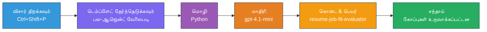
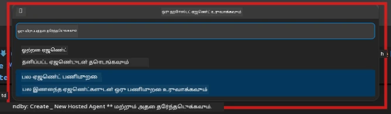

# Module 2 - பல்-எஜென்ட் திட்டத்தை கட்டமைக்கவும்

இந்த மொட்யூலில், நீங்கள் [Microsoft Foundry விரிவுரையை](https://marketplace.visualstudio.com/items?itemName=TeamsDevApp.vscode-ai-foundry) பயன்படுத்தி **பல-எஜென்ட் வேலைநடைத் திட்டத்தை கட்டமைக்கிறீர்கள்**. விரிவுரை முழு திட்டப் கட்டமைப்பையும் உருவாக்குகிறது - `agent.yaml`, `main.py`, `Dockerfile`, `requirements.txt`, `.env`, மற்றும் டிபக் கட்டமைப்புகள். பின்னர் நீங்கள் Module 3 மற்றும் 4-ல் இந்த கோப்புகளை தனிப்பயனாக்குகிறீர்கள்.

> **குறிப்பு:** இந்த பணிக் கூடத்தில் உள்ள `PersonalCareerCopilot/` கோப்புறை தனிப்பயனாக்கப்பட்ட பல்-எஜென்ட் திட்டத்தின் முழுமையான மற்றும் செயல்படும் எடுத்துக்காட்டாகும். புதிய திட்டத்தை கட்டமைக்கலாம் (கற்றுக்கொள்ள பரிந்துரைக்கப்படுகிறது) அல்லது நேரடியாக உள்ளமைவான குறியீட்டை படிக்கலாம்.

---

## படி 1: Create Hosted Agent விசாரத்தை திறக்கவும்


1. `Ctrl+Shift+P` அழுத்தி **Command Palette**-ஐ திறக்கவும்.
2. தட்டச்சு செய்யவும்: **Microsoft Foundry: Create a New Hosted Agent** மற்றும் அதை தேர்ந்தெடுக்கவும்.
3. ஹோஸ்டட் எஜென்ட் உருவாக்கும் விசார் திறக்கும்.

> **மாற்று வழி:** Activity Bar-இல் உள்ள **Microsoft Foundry** ஐகானை கிளிக் செய்யவும் → **Agents** அப்புறம் உள்ள **+** ஐ கிளிக் செய்யவும் → **Create New Hosted Agent**.

---

## படி 2: பல்-எஜென்ட் வேலைநடைத் வார்ப்புருவை தேர்ந்தெடுக்கவும்

விசார் உங்களுக்கு ஒரு வார்ப்புருவை தேர்வு செய்ய கேட்கிறது:

| வார்ப்புரு | விளக்கம் | எப்போது பயன்படுத்துவது |
|----------|-------------|-------------|
| ஒற்றை எஜென்ட் | ஒரே எஜென்ட் வழிமுறைகளுடன் மற்றும் விருப்பமான கருவிகள் | குறும்படி 01 |
| **பல்-எஜென்ட் வேலைநடை** | பல எஜென்ட்கள் WorkflowBuilder மூலம் இணைகின்றன | **இந்த குறும்படி (Lab 02)** |

1. **பல்-எஜென்ட் வேலைநடை** ஐ தேர்ந்தெடுக்கவும்.
2. **Next** கிளிக் செய்யவும்.



---

## படி 3: நிரலாக்க மொழியை தேர்ந்தெடுக்கவும்

1. **Python** ஐ தேர்ந்தெடுக்கவும்.
2. **Next** கிளிக் செய்யவும்.

---

## படி 4: உங்கள் மாதிரியை தேர்வுசெய்க

1. விசார் உங்கள் Foundry திட்டத்தில் செயல்படுத்தப்பட்ட மாதிரிகளை காட்டும்.
2. Lab 01-ல் பயன்படுத்திய அதே மாதிரியை தேர்ந்தெடுக்கவும் (உதாரணம், **gpt-4.1-mini**).
3. **Next** கிளிக் செய்யவும்.

> **குறிப்பு:** [`gpt-4.1-mini`](https://learn.microsoft.com/azure/foundry/foundry-models/concepts/models-sold-directly-by-azure#gpt-41-series) விருத்திக்குப் பரிந்துரைக்கப்படுகிறது - இது வேகமானது, மலிவானது, மற்றும் பல்-எஜென்ட் வேலைநடைகளை நன்றாக கையாள்கிறது. உச்ச தரம் தேவைப்பட்டால் இறுதி தயாரிப்பு வெளியீட்டிற்கு `gpt-4.1`க்கு மாறவும்.

---

## படி 5: கோப்புறை இடம் மற்றும் எஜென்ட் பெயரை தேர்ந்தெடுக்கவும்

1. ஒரு கோப்பு டயலாக் திறக்கப்படும். இலக்கு கோப்புறையை தேர்வு செய்யவும்:
   - பணிக் கூடக் கொள்கைப் படியைப் பின்பற்றியால்: `workshop/lab02-multi-agent/`-இல் செல்லவும் மற்றும் புதிய உபகோப்புறையை உருவாக்கவும்
   - புதிய திட்டத்தை தொடங்கினால்: எந்த கோப்புறையையும் தேர்ந்தெடுக்கலாம்
2. ஹோஸ்டட் எஜென்ட் **பெயர்** ஏற்கவும் (உதாரணமாக, `resume-job-fit-evaluator`).
3. **Create** கிளிக் செய்யவும்.

---

## படி 6: கட்டமைப்பு முடிவினைக் காத்திருங்கள்

1. VS Code புதிய ஜன்னல் (அல்லது தற்போதைய ஜன்னல் புதுப்பிப்பு) திறக்கும், கட்டமைக்கப்பட்ட திட்டத்துடன்.
2. இந்த கோப்பு கட்டமைப்பை நீங்கள் காண வேண்டும்:

```
resume-job-fit-evaluator/
├── .env                ← Environment variables (placeholders)
├── .vscode/
│   └── launch.json     ← Debug configuration
├── agent.yaml          ← Agent definition (kind: hosted)
├── Dockerfile          ← Container configuration
├── main.py             ← Multi-agent workflow code (scaffold)
└── requirements.txt    ← Python dependencies
```

> **பணிக்கூட்டக் குறிப்பு:** பணிக்கூடக் கொள்கை கோப்புறை `.vscode/` **வேலைப் பகுதி தளத்தில்** உள்ளது மற்றும் பொதுவான `launch.json` மற்றும் `tasks.json` கொண்டுள்ளது. Lab 01 மற்றும் Lab 02-க்கான டிபக் கட்டமைப்புகள் இரண்டும் உள்ளடக்கப்பட்டுள்ளன. F5-ஐ அழுத்தும்போது, கீழ் பட்டியலில் இருந்து **"Lab02 - Multi-Agent"** தேர்வு செய்யவும்.

---

## படி 7: கட்டமைக்கப்பட்ட கோப்புகளை புரிந்துகொள்ளவும் (பல்-எஜென்ட் சிறப்பம்சங்கள்)

பல-எஜென்ட் கட்டமைப்பு சில முக்கிய விதிகளில் ஒற்றை-எஜென்ட் கட்டமைப்பில் இருந்து வேறுபடுகிறது:

### 7.1 `agent.yaml` - எஜென்ட் வரையறை

```yaml
kind: hosted
name: resume-job-fit-evaluator
description: >
  A multi-agent workflow that evaluates resume-to-job fit.
metadata:
  authors:
    - Microsoft
  tags:
    - Multi-Agent Workflow
    - Resume Evaluator
protocols:
  - protocol: responses
    version: v1
environment_variables:
  - name: PROJECT_ENDPOINT
    value: ${PROJECT_ENDPOINT}
  - name: MODEL_DEPLOYMENT_NAME
    value: ${MODEL_DEPLOYMENT_NAME}
```

**Lab 01 உடன் முக்கிய வித்தியாசம்:** `environment_variables` பகுதியில் MCP முடிவுகளை அல்லது பிற கருவி அமைப்புகளுக்கான கூடுதல் மாறிலிகள் இருக்கலாம். `name` மற்றும் `description` பல்-எஜென்ட் பயன்பாட்டை பிரதிபலிக்கின்றன.

### 7.2 `main.py` - பல்-எஜென்ட் வேலைநடை குறியீடு

கட்டமைப்பில்:
- **பல எஜென்ட் வழிமுறை வாக்கியங்கள்** (எஜென்ட் ஒருதொகுதிக்கு ஒரு const)
- **பல [`AzureAIAgentClient.as_agent()`](https://learn.microsoft.com/python/api/overview/azure/ai-agents-readme) உள்ளமைவு மேலாளர்கள்** (ஒவ்வொரு எஜென்டுக்கும் ஓர்)
- **[`WorkflowBuilder`](https://learn.microsoft.com/agent-framework/workflows/agents-in-workflows)** மூலம் எஜென்ட்களை இணைத்தல்
- **`from_agent_framework()`** மூலம் HTTP முடிவுச்சுடரை வேலைநடையாக சேவை செய்யல்

```python
from agent_framework import WorkflowBuilder, tool
from agent_framework.azure import AzureAIAgentClient
from azure.ai.agentserver.agentframework import from_agent_framework
```

பகிர்ந்த இறக்குமதி [`WorkflowBuilder`](https://learn.microsoft.com/agent-framework/workflows/agents-in-workflows) Lab 01-ஐவிட புதியது.

### 7.3 `requirements.txt` - கூடுதல் சார்புறங்கள்

பல-எஜென்ட் திட்டம் Lab 01-இல் பயன்படுத்திய அடிப்படை தொகுப்புகளுடன், MCP தொடர்புடைய தொகுப்புகளையும் பயன்பாட்டில் கொண்டு வருகிறது:

```
agent-framework-azure-ai==1.0.0rc3
agent-framework-core==1.0.0rc3
azure-ai-agentserver-agentframework==1.0.0b16
azure-ai-agentserver-core==1.0.0b16
debugpy
agent-dev-cli --pre
```

> **முக்கிய பதிப்பு குறிப்பு:** `agent-dev-cli` தொகுப்பை நிறுவ `requirements.txt`-ல் `--pre` கொடியைப் பயன்படுத்த வேண்டும். இது `agent-framework-core==1.0.0rc3` உடன் Agent Inspector உடன் பொருந்தும். [Module 8 - Troubleshooting](08-troubleshooting.md) பார்க்கவும் பதிப்பு விவரங்களுக்கு.

| தொகுப்பு | பதிப்பு | நோக்கம் |
|---------|---------|---------|
| [`agent-framework-azure-ai`](https://learn.microsoft.com/agent-framework/overview/) | `1.0.0rc3` | [Microsoft Agent Framework](https://github.com/microsoft/agent-framework) உடன் Azure AI ஒருங்கிணைப்பு |
| [`agent-framework-core`](https://learn.microsoft.com/agent-framework/overview/) | `1.0.0rc3` | பிரதான ஓட்டவும் (WorkflowBuilder உட்பட) |
| `azure-ai-agentserver-agentframework` | `1.0.0b16` | ஹோஸ்டட் எஜென்ட் சேவை ஓட்டமும் |
| `azure-ai-agentserver-core` | `1.0.0b16` | பிரதான எஜென்ட் சேவை குறிப்புகள் |
| `debugpy` | புதியது | Python டிபக் (VS Code-இல் F5) |
| `agent-dev-cli` | `--pre` | உள்ளூர் dev CLI + Agent Inspector பின்புறம் |

### 7.4 `Dockerfile` - Lab 01 உடன் ஒரே மாதிரி

Dockerfile Lab 01-இன் அப்படியே உள்ளது - கோப்புகளை நகலெடுக்கிறது, `requirements.txt`-இன் சார்புறங்களை நிறுவுகிறது, 8088 போர்ட்டை வெளிப்படுத்துகிறது, மற்றும் `python main.py` இயக்குகிறது.

```dockerfile
FROM python:3.14-slim
WORKDIR /app
COPY ./ .
RUN pip install --upgrade pip && \
    if [ -f requirements.txt ]; then \
        pip install -r requirements.txt; \
    else \
      echo "No requirements.txt found" >&2; exit 1; \
    fi
EXPOSE 8088
CMD ["python", "main.py"]
```

---

### பரிசோதனை நிலை

- [ ] கட்டமைக்கல் விசார் முடிந்தது → புதிய திட்ட கட்டமைப்பு தெளிவாக உள்ளது
- [ ] அனைத்து கோப்புகளும் காணப்படுகிறது: `agent.yaml`, `main.py`, `Dockerfile`, `requirements.txt`, `.env`
- [ ] `main.py`ல் `WorkflowBuilder` இறக்குமதி உள்ளது (பல-எஜென்ட் வார்ப்புரு தேர்வு செய்யப்பட்டதை உறுதிப்படுத்துகிறது)
- [ ] `requirements.txt` இல் `agent-framework-core` மற்றும் `agent-framework-azure-ai` இரண்டுமே உள்ளன
- [ ] பல்-எஜென்ட் கட்டமைப்பு ஒற்றை-எஜென்ட் கட்டமைப்பிடம் எப்படி வேறுபடுகிறது (பல எஜென்ட்கள், WorkflowBuilder, MCP கருவிகள்) என்பதை நீங்கள் புரிந்து கொண்டுள்ளீர்கள்

---

**முந்தையது:** [01 - பல்-எஜென்டு கட்டமைப்பை புரிதல்](01-understand-multi-agent.md) · **அடுத்து:** [03 - எஜென்ட்கள் மற்றும் சூழல் அமைத்தல் →](03-configure-agents.md)

---

<!-- CO-OP TRANSLATOR DISCLAIMER START -->
**பதிவுறுதி**:  
இந்த ஆவணம் AI மொழிபெயர்ப்பு சேவை [Co-op Translator](https://github.com/Azure/co-op-translator) மூலம் மொழிபெயர்க்கப்பட்டதாகும். நாம் துல்லியத்திற்காக முயலுகின்றாலும், தானாக செய்யப்பட்ட மொழிபெயர்ப்புகளில் தவறுகள் அல்லது பிழைகள் இருக்கலாம் என்பதை தயவுசெய்து கவனத்தில் கொள்ளவும். முதல் ஆவணம் அதன் சொந்த மொழியில் அதிகாரப்பூர்வமான ஆதாரமாக கருதப்பட வேண்டும். முக்கியமான தகவலுக்கு, தொழில்முறை மனித மொழிபெயர்ப்பை பரிந்துரைக்கப்படுகின்றது. இந்த மொழிபெயர்ப்பைப் பயன்படுத்தியதனால் ஏற்பட்ட எந்த தவறான புரிதல்கள் அல்லது மறுபொருள் கொள்ளல்களுக்கு நாங்கள் பொறுப்பேற்கமாட்டோம்.
<!-- CO-OP TRANSLATOR DISCLAIMER END -->