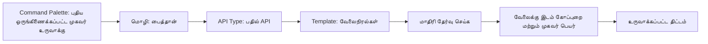
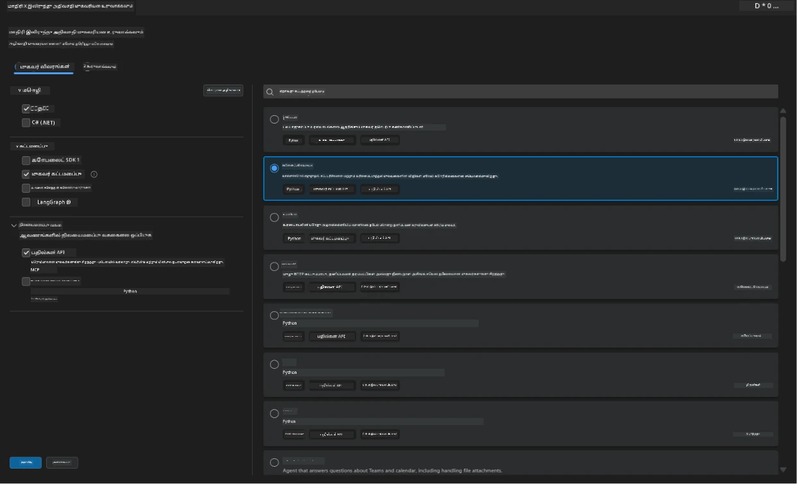
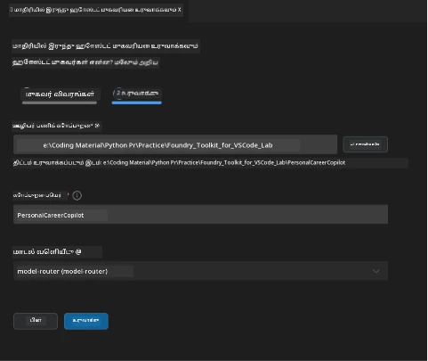

# Module 2 - பன்முக முகவர் திட்டத்திற்கான அடித்தளம்

⏱️ ~5 நிமிடங்கள்

இந்த தொகுதியில், நீங்கள் [Foundry Toolkit for VS Code](https://aka.ms/foundrytk) ஐ பயன்படுத்தி **பல முகவர் திட்டத்திற்கான அடித்தளத்தை உருவாக்குவீர்கள்**. வழிகாட்டி `agent.yaml`, `main.py`, `Dockerfile`, `requirements.txt`, `.env` மற்றும் VS Code டிபக் கட்டமைப்பை உருவாக்குகிறது - ஆகவே நீங்கள் தொகுதி 3 இல் 4-முகவர் வேலைப்பாட்டை இணைக்க கவனம் செலுத்தலாம்.

> **முக்கியக் கருத்து:** அடித்தளம் ஒரு முகவருடன் செயல்படும் ஸ்டப் ஆகும். நீங்கள் தொகுதி 3 இல் உள்ள `WorkflowBuilder` கிராப் மூலம் டெம்பிளேட் தர்க்கத்தை மாற்றுவீர்கள். நீங்கள் தொடக்ககட்டத்தில் இருந்து கையெழுத்து எழுத தேவையில்லை.

> **குறிப்புரை செயலாக்கம்:** [`PersonalCareerCopilot/`](../../../../../workshop/lab02-multi-agent/PersonalCareerCopilot) முழுமையான செயல்படும் எடுத்துக்காட்டு ஆகும். உங்கள் பணியை ஒப்பிட அதை பயன்படுத்தவும்.

### அடித்தளம் வழிகாட்டு ஓட்டம்


```mermaid
flowchart LR
    A[Command Palette: புதிய ஒருங்கிணைக்கப்பட்ட முகவர் உருவாக்கு] --> B[மொழி: பைத்தான்]
    B --> C[API Type: பதில் API]
    C --> D[Template: வேலைநிரல்கள்]
    D --> E[மாதிரி தேர்வு செய்க]
    E --> F[வேலைக்கு இடம் கோப்புறை மற்றும் முகவர் பெயர்]
    F --> G[உருவாக்கப்பட்ட திட்டம்]
```

---

## படி 1: Create Hosted Agent வizards ஐ திறக்கவும்

1. `Ctrl+Shift+P` அழுத்தி **கட்டளை பட்டியலை** திறக்கவும்.
2. தட்டச்சு செய்யவும்: **Foundry Toolkit: Create a New Hosted Agent** மற்றும் அதை தேர்ந்தெடுக்கவும்.
3. வழிகாட்டி **Agent Details** தாவலில் திறக்கிறது.

> **மாற்று வழி:** Activity பட்டியில் உள்ள **Foundry Toolkit** ஐகானை கிளிக் செய்யவும் → **Hosted Agents**க்கு அருகேயுள்ள **+** ஐகானை கிளிக் செய்யவும் → **Create New Hosted Agent**.

---

## படி 2: அமைப்புகளைத் தேர்வுசெய்யவும்



1. இடது வழிசெலுத்தல்/விருப்பப்பகுதியில் பின்வரும் தேர்வுகளை செய்யவும்:

| menyu | தேர்வு | குறிப்பு |
|--------|-----------|-------|
| **மொழி** | Python | C# (.NET) கூட ஆதரவு உள்ளது |
| **வடிவமைப்பு** | Agent Framework | `Agent`, `AgentExecutor`, `WorkflowBuilder` ஐ வழங்குகிறது |
| **API வகை** | பதில் API | `POST /responses` - மேடையில் பராமரிக்கப்பட்ட வரலாறு, ஸ்ட்ரீமிங் ஆதரவு |
| **டெம்பிளேட்** | **Workflows** | பல முகவர்களைக் கையாள பின்பற்றுதல் செய்கிறது |

2. தேர்ந்தெடுத்தவுடன், **Next** ஐ அழுத்தவும்



3. அடுத்த சாளரத்தில், பின்வருமாறு தேர்ந்தெடுக்கவும்:

| menyu | தேர்வு | குறிப்பு |
|--------|-----------|-------|
| **வேலைநிலைய கோப்பு** | இலக்கு கோப்புறையை உலாவவும் | உதாரணமாக, இந்த செயல் தொகுதியில் `workshop/lab02-multi-agent/` |
| **முகவர் பெயர்** | `PersonalCareerCopilot` | இது திட்ட கோப்புறையின் பெயராக மாறும் |
| **மாதிரி பயன்படுத்துதல்** | உங்கள் நிறுவப்பட்ட மாதிரியை தேர்ந்தெடுக்கவும் | உதாரணமாக, Lab 01 இல் இருந்து `gpt-4.1-mini` |

4. திட்டத்தை உருவாக்க **Create** ஐ அழுத்தவும். VS Code கோப்புகளை உருவாக்கி, கோப்புறையை திறக்கும்.

> **உதவி:** [`gpt-4.1-mini`](https://learn.microsoft.com/azure/foundry/foundry-models/concepts/models-sold-directly-by-azure#gpt-41-series) பல முகவர் மேம்பாட்டிற்கு வேகம் மற்றும் தரத்தை நல்ல முறையில் சமநிலைாக்குகிறது.

---

## படி 3: உருவாக்கப்பட்ட திட்டத்தை பரிசீலனை செய்யவும்

அடித்தளம் முடிந்த பின், பின்வரும் கோப்புகளை Explorer (`Ctrl+Shift+E`) இல் காணுகிறீர்களா என்று உறுதி செய்யவும்:

```
📂 <your-agent-name>/
├── .azdignore          ← Files excluded from Azure Developer CLI deployments
├── .dockerignore       ← Files excluded from Docker builds
├── .env                ← Environment variables (placeholders - fill in Module 3)
├── .vscode/
│   ├── launch.json     ← Debug config (F5 → run + Agent Inspector)
│   └── tasks.json      ← VS Code task definitions
├── agent.yaml          ← Agent definition (kind: hosted, protocol: responses)
├── Dockerfile          ← Container config for deployment
├── main.py             ← Stub agent entry point (replace with WorkflowBuilder in Module 3)
└── requirements.txt    ← Python dependencies
```

> **முக்கியம்:** `.vscode/launch.json` மற்றும் `tasks.json` சரியாக செயல்பட VS Code இல் இந்த அடித்தள கோப்புறையை நேரடியாக திறக்கவும்.

### முக்கிய கோப்புகள் விளக்கம்

| கோப்பு | நோக்கம் |
|------|---------|
| `agent.yaml` | `kind: hosted` என்பதை அறிவித்து, env மாற்றங்களை வரைபடம் செய்யும், `/responses` நடைமுறையை வரையறுக்கிறது |
| `main.py` | ஸ்டப்பாயுள்ளது : ஒரு `FoundryChatClient` → `Agent` → `ResponsesHostServer`. நீங்கள் தொகுதி 3 இல் 4 முகவர்கள் மற்றும் `WorkflowBuilder` சேர்க்கின்றீர்கள் |
| `Dockerfile` | `python:3.12-slim`, `requirements.txt` ஐ நிறுவுகிறது, போர்ட் 8088 ஓ픈்செய்கிறது, `python main.py` ஓட்டுகிறது |
| `requirements.txt` | `agent-framework-foundry`, `agent-framework-foundry-hosting`, `mcp<2,>=1.24.0`, `debugpy` |

> **குறிப்புரை:** முழுமையான உருவாக்கப்பட்ட உள்ளடக்கத்திற்காக [`PersonalCareerCopilot/agent.yaml`](../../../../../workshop/lab02-multi-agent/PersonalCareerCopilot/agent.yaml) மற்றும் [`PersonalCareerCopilot/requirements.txt`](../../../../../workshop/lab02-multi-agent/PersonalCareerCopilot/requirements.txt)ஐ பார்க்கவும்.

---

### ✅ சரிபார்ப்பு

- [ ] அடித்தளம் வழிகாட்டி முடிக்கப்பட்டது - புதிய திட்ட கோப்புறை Explorer இல் தெளிவாக காணப்படுகிறது
- [ ] எதிர்பார்க்கப்பட்ட அனைத்து கோப்புகளும் உள்ளன: `agent.yaml`, `main.py`, `Dockerfile`, `requirements.txt`, `.env`
- [ ] `agent.yaml` இல் `kind: hosted` மற்றும் `protocol: responses` காட்டப்படுகின்றன
- [ ] `main.py`இல் `Agent`, `FoundryChatClient`, `ResponsesHostServer` இறக்குமதி செய்யப்பட்டுள்ளது
- [ ] அடித்தள கோப்புறை VS Code வேலைநிலைய முகராக திறக்கப்பட்டுள்ளது
- [ ] நீங்கள் புரிந்துகொண்டீர்கள் `main.py` என்பது ஒரு ஸ்டப் - `WorkflowBuilder` தொகுதி 3 இல் சேர்க்கப்படுகிறது

---

**முந்தையது:** [01 - பன்முக முகவர் கட்டமைப்பை புரிந்துகொள்ளவும்](01-understand-multi-agent.md) · **அடுத்து:** [03 - முகவர்கள் & சூழலை கட்டமைக்கவும் →](03-configure-agents.md)

---

<!-- CO-OP TRANSLATOR DISCLAIMER START -->
**மறுப்பு**:
இந்த ஆவணம் AI மொழிபெயர்ப்பு சேவை [Co-op Translator](https://github.com/Azure/co-op-translator) பயன்படுத்தி மொழிபெயர்க்கப்பட்டுள்ளது. நாங்கள் துல்லியத்திற்காக முயற்சி செய்துள்ளோம், ஆனால் தானாக செய்யப்படும் மொழிபெயர்ப்புகளில் பிழைகள் அல்லது தவறுகள் இருக்கலாம் என்பதை கவனத்தில் கொள்ளவும். அசல் ஆவணம் அதன் தாய்மொழியில் அதிகாரப்பூர்வ ஆதாரமாக கருதப்பட வேண்டும். முக்கியமான தகவல்களுக்கு, தொழில்நுட்பமான மனித மொழிபெயர்ப்பு பரிந்துரைக்கப்படுகிறது. இந்த மொழிபெயர்ப்பைப் பயன்படுத்துவதால் ஏற்படும் எந்த தவறான புரிதல்கள் அல்லது தவறான விளக்கத்திற்கும் நாங்கள் பொறுப்பில்வில்லை.
<!-- CO-OP TRANSLATOR DISCLAIMER END -->