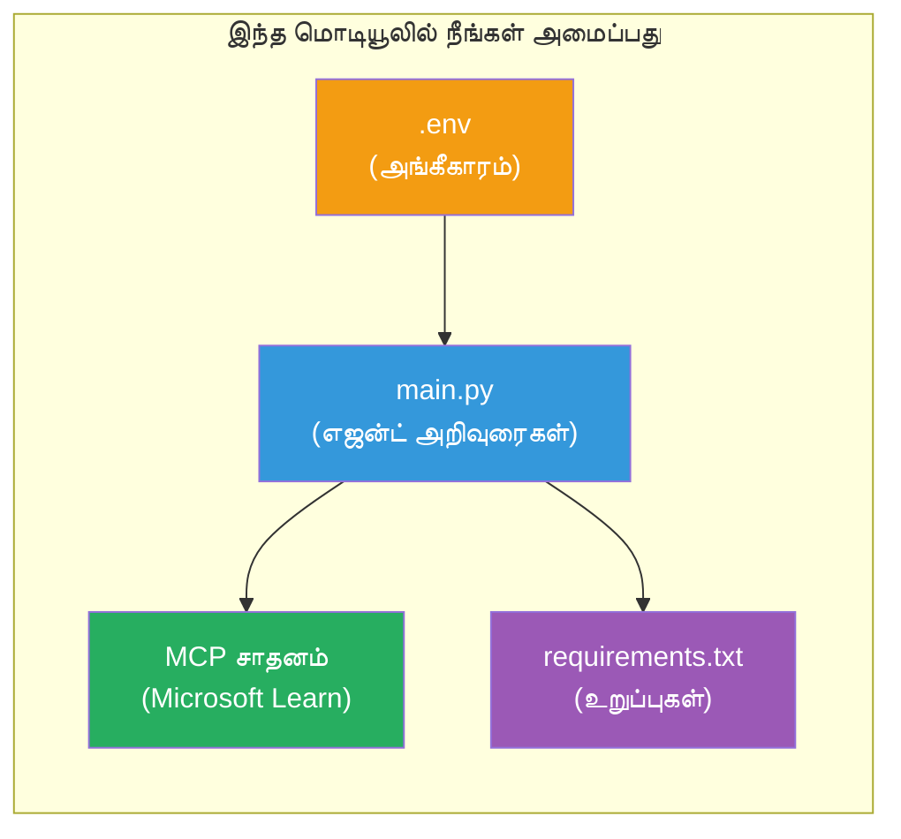

# Module 3 - முகவர்கள், MCP கருவி & சூழல் அமைக்கவும்

இந்த தொகுதியில், நீங்கள் வடிவமைக்கப்பட்ட பல முகவர் திட்டத்தை தனிப்பயனாக்குவீர்கள். நீங்கள் நான்கு முகவர்களுக்கும் வழிமுறைகளை எழுதுவீர்கள், Microsoft Learnக்கு MCP கருவியை அமைப்பீர்கள், சூழல் மாறிலிகளை கட்டமைப்பீர்கள் மற்றும் சார்முறை பொருட்களை நிறுவுவீர்கள்.


> **குறிப்பு:** முழுமையான செயல்பாட்டுக் குறியீடு [`PersonalCareerCopilot/main.py`](../../../../../workshop/lab02-multi-agent/PersonalCareerCopilot/main.py) இல் உள்ளது. உங்கள் சொந்தத்தை உருவாக்கும் போது அதை குறிப்பு ஆக பயன்படுத்துங்கள்.

---

## படி 1: சூழல் மாறிலிகளை அமைக்கவும்

1. உங்கள் திட்ட முதற்கட்டத்தில் உள்ள **`.env`** கோப்பை திறக்கவும்.
2. உங்கள் Foundry திட்ட விவரங்களை பூர்த்தி செய்யவும்:

   ```env
   PROJECT_ENDPOINT=https://<your-account>.services.ai.azure.com/api/projects/<your-project>
   MODEL_DEPLOYMENT_NAME=gpt-4.1-mini
   ```

3. கோப்பை சேமிக்கவும்.

### இவைகளை எங்கு காணலாம்

| மதிப்பு | எவ்வாறு காணலாம் |
|-------|-----------------|
| **திட்டம் எண்ட் பாயிண்ட்** | Microsoft Foundry பக்கவீதி → உங்கள் திட்டத்தை கிளிக் செய்யவும் → விவர பார்வையில் எண்ட் பாயிண்ட் URL |
| **மாதிரி வெளியீட்டு பெயர்** | Foundry பக்கவீதி → திட்டத்தை விரிவாக்கவும் → **மாதிரிகள் + எண்ட் பாயிண்டுகள்** → வெளியிடப்பட்ட மாதிரியின் அருகிலுள்ள பெயர் |

> **பாதுகாப்பு:** `.env`-ஐ பதிப்புப்பணியில் ஒருபோதும் சேர்க்க வேண்டாம். அது `.gitignore`-ல் சேர்க்கப்பட்டவாறு உறுதிசெய்க.

### சூழல் மாறிலி மேபிங்

பல முகவர் `main.py` சாதாரண மற்றும் பணிமனை-சிறப்பு env var பெயர்களை படிக்கிறது:

```python
PROJECT_ENDPOINT = os.getenv("AZURE_AI_PROJECT_ENDPOINT") or os.getenv("PROJECT_ENDPOINT")
MODEL_DEPLOYMENT_NAME = os.getenv(
    "AZURE_AI_MODEL_DEPLOYMENT_NAME",
    os.getenv("MODEL_DEPLOYMENT_NAME", "gpt-4.1-mini"),
)
MICROSOFT_LEARN_MCP_ENDPOINT = os.getenv(
    "MICROSOFT_LEARN_MCP_ENDPOINT", "https://learn.microsoft.com/api/mcp"
)
```

MCP எண்ட் பாயிண்டிற்கு பொருத்தமான இயல்புநிலை உள்ளது - `.env`-இல் நீங்கள் அதனை மீற விரும்பவில்லை என்றால் அமைக்க தேவையில்லை.

---

## படி 2: முகவர் வழிமுறைகளை எழுதவும்

இது மிகவும் முக்கியமான படி. ஒவ்வொரு முகவருக்கும் அதன் பங்கு, வெளியீட்டு வடிவம் மற்றும் விதிகளை வரையறுக்க கூர்மையான வழிமுறைகள் தேவை. `main.py`ஐ திறந்து வழிமுறை மாறிலிகளை உருவாக்கவும் (அல்லது திருத்தவும்).

### 2.1 பத்திரம் பகுப்பாய்வாளர் முகவர்

```python
RESUME_PARSER_INSTRUCTIONS = """\
You are the Resume Parser.
Extract resume text into a compact, structured profile for downstream matching.

Output exactly these sections:
1) Candidate Profile
2) Technical Skills (grouped categories)
3) Soft Skills
4) Certifications & Awards
5) Domain Experience
6) Notable Achievements

Rules:
- Use only explicit or strongly implied evidence.
- Do not invent skills, titles, or experience.
- Keep concise bullets; no long paragraphs.
- If input is not a resume, return a short warning and request resume text.
"""
```

**ஏன் இந்த பகுதிகள்?** MatchingAgent மதிப்பீடு செய்ய அமைந்த தரவு தேவை. ஒருங்கிணைந்த பகுதிகள் முகவர்களுக்கிடையில் நம்பகமான தொடர்பை கொண்டுவரும்.

### 2.2 வேலை விளக்கம் முகவர்

```python
JOB_DESCRIPTION_INSTRUCTIONS = """\
You are the Job Description Analyst.
Extract a structured requirement profile from a JD.

Output exactly these sections:
1) Role Overview
2) Required Skills
3) Preferred Skills
4) Experience Required
5) Certifications Required
6) Education
7) Domain / Industry
8) Key Responsibilities

Rules:
- Keep required vs preferred clearly separated.
- Only use what the JD states; do not invent hidden requirements.
- Flag vague requirements briefly.
- If input is not a JD, return a short warning and request JD text.
"""
```

**ஏன் அவசியம் மற்றும் முன்னுரிமை வேறு?** MatchingAgent ஒவ்வொரு பாகத்திற்கும் வெவ்வேறு மதிப்பீடுகளைக் (அவசியம் தேவைகள் = 40 புள்ளிகள், முன்னுரிமை தேவைகள் = 10 புள்ளிகள்) பயன்படுத்துகிறது.

### 2.3 பொருத்தம் முகவர்

```python
MATCHING_AGENT_INSTRUCTIONS = """\
You are the Matching Agent.
Compare parsed resume output vs JD output and produce an evidence-based fit report.

Scoring (100 total):
- Required Skills 40
- Experience 25
- Certifications 15
- Preferred Skills 10
- Domain Alignment 10

Output exactly these sections:
1) Fit Score (with breakdown math)
2) Matched Skills
3) Missing Skills
4) Partially Matched
5) Experience Alignment
6) Certification Gaps
7) Overall Assessment

Rules:
- Be objective and evidence-only.
- Keep partial vs missing separate.
- Keep Missing Skills precise; it feeds roadmap planning.
"""
```

**ஏன் தெளிவான மதிப்பீடு?** மறுபடியும்கொண்ட மதிப்பீடு மூலம் இயக்கங்களை ஒப்பிட்டு பிழைகளைத் திருத்த முடியும். 100 புள்ளி அளவீடு இறுதியில் பயனாளர்களுக்கு எளிதாக புரியும்.

### 2.4 இடைவெளி பகுப்பாய்வாளர் முகவர்

```python
GAP_ANALYZER_INSTRUCTIONS = """\
You are the Gap Analyzer and Roadmap Planner.
Create a practical upskilling plan from the matching report.

Microsoft Learn MCP usage (required):
- For EVERY High and Medium priority gap, call tool `search_microsoft_learn_for_plan`.
- Use returned Learn links in Suggested Resources.
- Prefer Microsoft Learn for free resources.

CRITICAL: You MUST produce a SEPARATE detailed gap card for EVERY skill listed in
the Missing Skills and Certification Gaps sections of the matching report. Do NOT
skip or combine gaps. Do NOT summarize multiple gaps into one card.

Output format:
1) Personalized Learning Roadmap for [Role Title]
2) One DETAILED card per gap (produce ALL cards, not just the first):
   - Skill
   - Priority (High/Medium/Low)
   - Current Level
   - Target Level
   - Suggested Resources (include Learn URL from tool results)
   - Estimated Time
   - Quick Win Project
3) Recommended Learning Order (numbered list)
4) Timeline Summary (week-by-week)
5) Motivational Note

Rules:
- Produce every gap card before writing the summary sections.
- Keep it specific, realistic, and actionable.
- Tailor to candidate's existing stack.
- If fit >= 80, focus on polish/interview readiness.
- If fit < 40, be honest and provide a staged path.
"""
```

**ஏன் "முக்கியமான" வலியுறுத்தல்?** அனைத்து இடைவெளி அட்டைகளையும் உருவாக்கும் தெளிவான வழிமுறைகள் இல்லாமல், மாதிரி 1-2 அட்டைகள் மட்டுமே செய்யும் மற்றும் மீதியை சுருக்குகிறது. "முக்கியமான" பகுதி இதைக் தடுக்கும்.

---

## படி 3: MCP கருவியை வரையறுத்தல்

GapAnalyzer [Microsoft Learn MCP சேவை](https://learn.microsoft.com/azure/foundry/agents/how-to/tools/model-context-protocol) உடன் தொடர்பு கொள்ளும் கருவியை பயன்படுத்துகிறது. இதை `main.py`க்கு சேர்க்கவும்:

```python
import json
from agent_framework import tool
from mcp.client.session import ClientSession
from mcp.client.streamable_http import streamable_http_client

@tool
async def search_microsoft_learn_for_plan(
    skill: str, role: str = "", max_results: int = 5
) -> str:
    """Search Microsoft Learn MCP and return curated official links for roadmap planning."""
    query = " ".join(part for part in [skill, role, "learning path module"] if part).strip()
    query = query or "job skills learning path"

    try:
        async with streamable_http_client(MICROSOFT_LEARN_MCP_ENDPOINT) as (
            read_stream, write_stream, _,
        ):
            async with ClientSession(read_stream, write_stream) as session:
                await session.initialize()
                result = await session.call_tool(
                    "microsoft_docs_search", {"query": query}
                )

        if not result.content:
            return (
                "No results returned from Microsoft Learn MCP. "
                "Fallback: https://learn.microsoft.com/training/support/catalog-api"
            )

        payload_text = getattr(result.content[0], "text", "")
        data = json.loads(payload_text) if payload_text else {}
        items = data.get("results", [])[:max(1, min(max_results, 10))]

        if not items:
            return f"No direct Microsoft Learn results found for '{skill}'."

        lines = [f"Microsoft Learn resources for '{skill}':"]
        for i, item in enumerate(items, start=1):
            title = item.get("title") or item.get("url") or "Microsoft Learn Resource"
            url = item.get("url") or item.get("link") or ""
            lines.append(f"{i}. {title} - {url}".rstrip(" -"))
        return "\n".join(lines)
    except Exception as ex:
        return (
            f"Microsoft Learn MCP lookup unavailable. Reason: {ex}. "
            "Fallbacks: https://learn.microsoft.com/api/mcp"
        )
```

### கருவி எப்படி செயல்படுகிறது

| படி | என்ன நடக்கும் |
|------|--------------|
| 1 | GapAnalyzer ஒரு திறனுக்கு (எ.கா., "Kubernetes") வளங்களை தேவைப்படுவதாக நினைக்கிறது |
| 2 | கட்டமைப்பு `search_microsoft_learn_for_plan(skill="Kubernetes")` ஐ அழைக்கும் |
| 3 | செயல்பாடு [Streamable HTTP](https://learn.microsoft.com/agent-framework/agents/tools/hosted-mcp-tools) இணைப்பை `https://learn.microsoft.com/api/mcp`க்கு திறக்கும் |
| 4 | [MCP சேவையகத்தில்](https://learn.microsoft.com/azure/foundry/agents/how-to/tools/model-context-protocol) `microsoft_docs_search` அழைக்கப்படுகிறது |
| 5 | MCP சேவையகம் தேடல் முடிவுகள் (தலைப்பு + URL) திருப்பி தருகிறது |
| 6 | செயல்பாடு முடிவுகளை எண்ணிக்கையிடப்பட்ட பட்டியலாக வடிவமைக்கிறது |
| 7 | GapAnalyzer URLகளை இடைவெளி அட்டையில் சேர்க்கிறது |

### MCP சார்முறை பொருட்கள்

MCP கிளையண்ட் நூலகங்கள் [`agent-framework-core`](https://learn.microsoft.com/agent-framework/overview/) மூலம் இடைநிலை வழியாக சேர்க்கப்பட்டுள்ளன. அவையை `requirements.txt`க்கு தனித்தனியாக சேர்ப்பது அவசியமில்லை. ஏதேனும் இறக்குமதி பிழைகள் இருந்தால் கீழேயுள்ளதை சரிபார்க்கவும்:

```powershell
pip list | Select-String "mcp"
```

எதிர்பார்ப்பு: `mcp` பெட்டி நிறுவப்பட்டிருக்க வேண்டும் (பதிப்பு 1.x அல்லது அதற்குக் மேலே).

---

## படி 4: முகவர்களையும் பணிக்கட்டமைப்பையும் இணைக்கவும்

### 4.1 உள்ளடக்க மேலாளர்களுடன் முகவர்களை உருவாக்கவும்

```python
from contextlib import asynccontextmanager

@asynccontextmanager
async def create_agents():
    async with (
        get_credential() as credential,
        AzureAIAgentClient(
            project_endpoint=PROJECT_ENDPOINT,
            model_deployment_name=MODEL_DEPLOYMENT_NAME,
            credential=credential,
        ).as_agent(
            name="ResumeParser",
            instructions=RESUME_PARSER_INSTRUCTIONS,
        ) as resume_parser,
        AzureAIAgentClient(
            project_endpoint=PROJECT_ENDPOINT,
            model_deployment_name=MODEL_DEPLOYMENT_NAME,
            credential=credential,
        ).as_agent(
            name="JobDescriptionAgent",
            instructions=JOB_DESCRIPTION_INSTRUCTIONS,
        ) as jd_agent,
        AzureAIAgentClient(
            project_endpoint=PROJECT_ENDPOINT,
            model_deployment_name=MODEL_DEPLOYMENT_NAME,
            credential=credential,
        ).as_agent(
            name="MatchingAgent",
            instructions=MATCHING_AGENT_INSTRUCTIONS,
        ) as matching_agent,
        AzureAIAgentClient(
            project_endpoint=PROJECT_ENDPOINT,
            model_deployment_name=MODEL_DEPLOYMENT_NAME,
            credential=credential,
        ).as_agent(
            name="GapAnalyzer",
            instructions=GAP_ANALYZER_INSTRUCTIONS,
            tools=[search_microsoft_learn_for_plan],
        ) as gap_analyzer,
    ):
        yield resume_parser, jd_agent, matching_agent, gap_analyzer
```

**முக்கிய குறிப்புகள்:**
- ஒவ்வொரு முகவருக்கும் தனித்தனியான `AzureAIAgentClient` உதாரணம் உள்ளது
- கொள்ளுதல்களுக்கு மட்டும் `tools=[search_microsoft_learn_for_plan]` வழங்கப்படுகிறது
- `get_credential()` Azure இல் [`ManagedIdentityCredential`](https://learn.microsoft.com/python/api/overview/azure/identity-readme#managed-identity-support), உள்ளூர் இடத்தில் [`DefaultAzureCredential`](https://learn.microsoft.com/azure/developer/python/sdk/authentication/credential-chains#defaultazurecredential-overview) திருப்புகிறது

### 4.2 பணிக்கட்டமைப்பு வரைபடத்தை உருவாக்கு

```python
def create_workflow(resume_parser, jd_agent, matching_agent, gap_analyzer):
    workflow = (
        WorkflowBuilder(
            name="ResumeJobFitEvaluator",
            start_executor=resume_parser,
            output_executors=[gap_analyzer],
        )
        .add_edge(resume_parser, jd_agent)
        .add_edge(resume_parser, matching_agent)
        .add_edge(jd_agent, matching_agent)
        .add_edge(matching_agent, gap_analyzer)
        .build()
    )
    return workflow.as_agent()
```

> `.as_agent()` வடிவமைப்பை புரிந்துகொள்ள [Workflows as Agents](https://learn.microsoft.com/agent-framework/workflows/as-agents) பார்க்கவும்.

### 4.3 சேவையகத்தை துவக்கவும்

```python
async def main() -> None:
    validate_configuration()
    async with create_agents() as (resume_parser, jd_agent, matching_agent, gap_analyzer):
        agent = create_workflow(resume_parser, jd_agent, matching_agent, gap_analyzer)
        from azure.ai.agentserver.agentframework import from_agent_framework
        await from_agent_framework(agent).run_async()

if __name__ == "__main__":
    asyncio.run(main())
```

---

## படி 5: மெய்நிகர் சூழலை உருவாக்கி செயலில் இறுக்கவும்

### 5.1 சூழலை உருவாக்குங்கள்

```powershell
cd workshop\lab02-multi-agent\PersonalCareerCopilot
python -m venv .venv
```

### 5.2 செயலில் இறுக்கவும்

**PowerShell (விண்டோஸ்):**
```powershell
.\.venv\Scripts\Activate.ps1
```

**macOS/Linux:**
```bash
source .venv/bin/activate
```

### 5.3 சார்முறை பொருட்களை நிறுவவும்

```powershell
pip install -r requirements.txt
```

> **குறிப்பு:** `requirements.txt`இல் உள்ள `agent-dev-cli --pre` வரைபடம் சமீபத்திய முன்னோட்ட பதிப்பை நிறுவுவதை உறுதி செய்கிறது. இது `agent-framework-core==1.0.0rc3` உடன் இணக்கமானது.

### 5.4 நிறுவலை உறுதிசெய்க

```powershell
pip list | Select-String "agent-framework|agentserver|agent-dev"
```

எதிர்பார்க்கப்படும் வெளியீடு:
```
agent-dev-cli                  0.0.1b260316
agent-framework-azure-ai       1.0.0rc3
agent-framework-core            1.0.0rc3
azure-ai-agentserver-agentframework 1.0.0b16
azure-ai-agentserver-core      1.0.0b16
```

> **`agent-dev-cli` பழைய பதிப்பை காட்டினால்** (எ.கா., `0.0.1b260119`), முகவர் பின்பாதுகாப்பாளர் 403/404 பிழைகளுடன் தோல்வியுறும். மேம்படுத்த: `pip install agent-dev-cli --pre --upgrade`

---

## படி 6: அங்கீகாரத்தை சரிபார்க்கவும்

Lab 01 இல் இருந்த அங்கீகார சோதனையை இயக்கவும்:

```powershell
az account show --query "{name:name, id:id}" --output table
```

இவை தோல்வியுற்றால், [`az login`](https://learn.microsoft.com/cli/azure/authenticate-azure-cli-interactively) ஐ இயக்கவும்.

பல முகவர் பணிக்கட்டமைப்புகளில், நான்கு முகவர்களும் ஒரே அங்கீகாரத்தை பகிர்கின்றன. ஒருவருக்கு அங்கீகாரம் வேலைசெய்வ다면, அனைவருக்கும் வேலைசெய்யும்.

---

### சரிபார்ப்பு பட்டியல்

- [ ] `.env`-ல் செல்லுபடியாகும் `PROJECT_ENDPOINT` மற்றும் `MODEL_DEPLOYMENT_NAME` மதிப்புகள் உள்ளன
- [ ] அனைத்து 4 முகவர் வழிமுறை மாறிலிகளும் `main.py`-ல் வரையறுக்கப்பட்டுள்ளன (ResumeParser, JD Agent, MatchingAgent, GapAnalyzer)
- [ ] `search_microsoft_learn_for_plan` MCP கருவி GapAnalyzer உடன் வரையறுக்கப்பட்டு பதிவு செய்யப்பட்டுள்ளது
- [ ] `create_agents()` தனித்தனி `AzureAIAgentClient` உதாரணங்களுடன் அனைத்து 4 முகவர்களையும் உருவாக்குகிறது
- [ ] `create_workflow()` சரியான வரைபடத்தை `WorkflowBuilder` உடன் கட்டமைக்கிறது
- [ ] மெய்நிகர் சூழல் உருவாக்கப்பட்டு செயல்படுத்தப்பட்டுள்ளது (`(.venv)` காட்சி)
- [ ] `pip install -r requirements.txt` பிழைகள் இல்லாமல் முடிந்துள்ளது
- [ ] `pip list` எதிர்பார்க்கப்படும் அனைத்து தொகுதிகளையும் சரியான பதிப்புகளில் காட்டுகிறது (rc3 / b16)
- [ ] `az account show` உங்கள் சந்தா தகவலை திருப்புகிறது

---

**முந்தய:** [02 - Scaffold Multi-Agent Project](02-scaffold-multi-agent.md) · **அடுத்து:** [04 - Orchestration Patterns →](04-orchestration-patterns.md)

---

<!-- CO-OP TRANSLATOR DISCLAIMER START -->
**தவறுநூல்**:  
இந்த ஆவணம் ஏ.ஐ. மொழிபெயர்ப்பு சேவை [Co-op Translator](https://github.com/Azure/co-op-translator) பயன்படுத்தி மொழிபெயர்க்கப்பட்டுள்ளது. நாங்கள் துல்லியத்தை நோக்கி முயலினாலும், தானியங்கி மொழிபெயர்ப்புகளில் பிழைகள் அல்லது தவறுகள் இருக்கலாம் என்பதை கவனிக்கவும். மூல ஆவணம் அதன் சொந்த மொழியில் அங்கீகாரம் பெற்ற ஆதாரமாக கருதப்பட வேண்டும். முக்கிய தகவல்களுக்கு, தொழில்முறை மனித மொழிபெயர்ப்பு பரிந்துரைக்கப்படுகிறது. இந்த மொழிபெயர்ப்பைப் பயன்படுத்தியதில் ஏற்படும் ஏதேனும் தவறான புரிதல்கள் அல்லது தவறான விளக்கங்களுக்கு நாங்கள் பொறுப்பு வహிப்பதில்லை.
<!-- CO-OP TRANSLATOR DISCLAIMER END -->