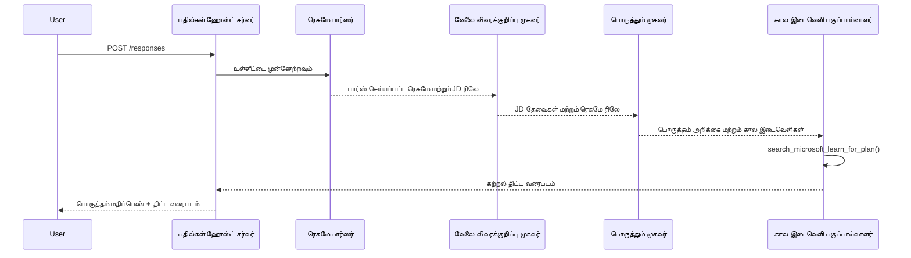

# மொட்யூல் 3 - கட்டளைகள், சுற்றுச்சூழல் & சார்புகள் நிறுவல் அமைக்க

⏱️ ~15 நிமிடங்கள்

இந்த மொட்யூலில், நீங்கள் உருவாக்கப்பட்ட துவக்கக் கட்டுரையை **உங்கள்** பல-ஏஜன்ட் பணித் தொடர் ஆக மாற்றுவீர்கள் - சுற்றுச்சூழல் மாறிலிகளை அமைத்தல், ஏஜன்ட் கட்டளைகள் எழுதுதல், MCP கருவியைச் சேர்த்தல், பணித் தொடர் வரைபடத்தை இணைத்தல் மற்றும் சார்புகள் நிறுவல்.

> **குறிப்பு:** முழு செயல்திறன் உள்ள குறியீடு [`PersonalCareerCopilot/main.py`](../../../../../workshop/lab02-multi-agent/PersonalCareerCopilot/main.py)ல் உள்ளது. உங்கள் சொந்த பணித் தொடர் வரைபடமும் முன்மொழிவு தொகுதிகளும் உருவாக்கும் போது இதைப் பரிந்துரை/reference ஆக பயன்படுத்துங்கள்.

---

## நான்கு ஏஜன்ட்கள் எப்படி ஒருங்கிணைக்கின்றன


```mermaid
sequenceDiagram
    participant User
    participant Server as பதில்கள் ஹோஸ்ட் சர்வர்
    participant RP as ரெசுமே பார்ஸர்
    participant JD as வேலை விவரக்குறிப்பு முகவர்
    participant MA as பொருத்தும் முகவர்
    participant GA as கால இடைவெளி பகுப்பாய்வாளர்

    User->>Server: POST /responses
    Server->>RP: உள்ளீட்டை முன்னேற்றவும்
    RP-->>JD: பார்ஸ் செய்யப்பட்ட ரெசுமே மற்றும் JD ரிலே
    JD-->>MA: JD தேவைகள் மற்றும் ரெசுமே ரிலே
    MA-->>GA: பொருத்தம் அறிக்கை மற்றும் கால இடைவெளிகள்
    GA->>GA: search_microsoft_learn_for_plan()
    GA-->>Server: கற்றல் திட்ட வரைபடம்
    Server-->>User: பொருத்தம் மதிப்பெண் + திட்ட வரைபடம்
```

---

## படி 1: சுற்றுச்சூழல் மாறிலிகளை அமைக்க

1. உங்கள் திட்ட மூலத்தில் உள்ள **`.env`** கோப்பை திறக்கவும் (துவக்கம் விசாரிச் சேவியால் உருவாக்கப்பட்டது).
2. இடம்காட்டிகள் இடத்தில் உங்கள் மெய்யான மதிப்புகளை Lab 01 இலிருந்து மாற்றவும்.

<details open>
<summary><strong>🅰️ பாதை A - Foundry சந்தா</strong></summary>

```env
FOUNDRY_PROJECT_ENDPOINT=https://<your-account>.services.ai.azure.com/api/projects/<your-project>
AZURE_AI_MODEL_DEPLOYMENT_NAME=gpt-4.1-mini
```

> **மதிப்புகளை எங்கு காணலாம்:** பார்க்கவும் [Lab 01, Module 1](../../lab01-single-agent/docs/01-setup.md#deploy-a-model--assign-rbac).

</details>

<details open>
<summary><strong>🅱️ பாதை B - Foundry நிறுவல் உள்ளூர்</strong></summary>

```env
FOUNDRY_PROJECT_ENDPOINT=http://localhost:5273/v1
AZURE_AI_MODEL_DEPLOYMENT_NAME=phi-4-mini
```

> அனைத்து ஊகக்கணக்குகளும் உங்கள் இயங்குதளத்தில் நடைபெறும் - எந்த தரவுகளும் உங்கள் சாதனத்தை விட்டு வெளியே செல்லாது. உறுதி செய்ய `foundry model list` இயக்கவும். ஒன்றுமே வெளியே செல்லுப பிற்படுத்தப்படும் கோரிக்கை MCP கருவி `https://learn.microsoft.com/api/mcp`க்கு அழைப்பு.

> **மதிப்புகளை எங்கு காணலாம்:** பார்க்கவும் [Lab 01, Module 1 - உள்ளூர் பாதை](../../lab01-single-agent/docs/01-setup.md#step-2-set-up-based-on-your-access).

</details>

> **பாதுகாப்பு:** `.env` அமைப்பு கோப்பை பதிப்பு கட்டுப்பாட்டில் சேர்க்கக்கூடாது. அது ஏற்கனவே `.gitignore`ல் இருக்க வேண்டும்.

---

## படி 2: ஏஜன்ட் கட்டளைகள் எழுதுக

கட்டளைகள் ஒவ்வொரு ஏஜன்டின் பங்கு, வெளிப்பாட்டு ஆகாரம் மற்றும் விதிகளை வர்ணிக்கின்றன. `main.py` திறந்து நான்கு கட்டளை நிலைகளை வரையறுக்கவும் (அல்லது மாற்றவும்) - முழுமையான உரைகள் [`PersonalCareerCopilot/main.py`](../../../../../workshop/lab02-multi-agent/PersonalCareerCopilot/main.py)ல் உள்ளன.

### 2.1 `RESUME_PARSER_INSTRUCTIONS`
ரெசுமேவை கட்டமைக்கப்பட்ட வேட்க்குருஞ் பரிமாற்றமாக பிரிக்கிறது **மற்றும்** வேலைவாய்ப்பு விளக்கத்தை சரியாக `[JOB DESCRIPTION PASS-THROUGH]` இல் பிரதியிடுகிறது. இரண்டு பிரிவுகளும் வெளியீட்டில் இருப்பது அவசியம்.

> **ஏன் பிரதியிடல்?** `context_mode="last_agent"` என்ற நிலையில் ResumeParser மட்டுமே அசல் பயனர் செய்தியைக் காண்பதற்கும். அது வேலை விளக்கத்தை முன்னுக்கு அனுப்பாவிட்டால், பிற ஏஜன்ட்கள் அதை பார்க்கமாட்டார்கள்.

### 2.2 `JOB_DESCRIPTION_INSTRUCTIONS`
ResumeParser வெளியீட்டிலிருந்து `[PARSED RESUME]` மற்றும் `[JOB DESCRIPTION PASS-THROUGH]`ஐ வாசிக்கிறது. `[JD REQUIREMENTS]` (கட்டமைக்கப்பட்ட தேவைப்பட்dம்) மற்றும் `[PARSED RESUME PASS-THROUGH]` (அதனுடன் பொருந்தும் MatchingAgentக்கான ரெசுமே பிரதியை) வெளியிடுகிறது.

### 2.3 `MATCHING_AGENT_INSTRUCTIONS`
`[JD REQUIREMENTS]` மற்றும் `[PARSED RESUME PASS-THROUGH]`ஐ வாசிக்கிறது. மதிப்பெண் நிர்வாகம் (0-100) மற்றும் விரிவான கணக்கீடு, பொருந்தும் திறன்கள், காணாமல் போன திறன்கள் மற்றும் அனுபவ ஒத்திசைவை கொண்ட அறிக்கை தயாரிக்கிறது.

### 2.4 `GAP_ANALYZER_INSTRUCTIONS`
பொருத்தம் அறிக்கையை வாசிக்கிறது. **ஒவ்வொரு** காணாமல் போன திறனுக்குமான Microsoft Learn வளங்களுக்கான `search_microsoft_learn_for_plan` அழைப்பை செய்கிறது. ஒவ்வொரு திறனிற்கும் விரிவான குறைபாடு அட்டை மற்றும் வாரம் வாரம் கற்றல் திட்டம் தயாரிக்கிறது.

---

## படி 3: MCP கருவியைச் சேர்க்க

GapAnalyzer [Microsoft Learn MCP சேவையகம்](https://learn.microsoft.com/azure/foundry/agents/how-to/tools/model-context-protocol)க்கு அழைத்து ஒவ்வொரு திறன் குறைபாடிற்கும் பாதுகாப்பான கற்றல் வளங்களை பெறுகிறது. முழு `search_microsoft_learn_for_plan` செயல்பாடு [`PersonalCareerCopilot/main.py`](../../../../../workshop/lab02-multi-agent/PersonalCareerCopilot/main.py)ல் உள்ளது.

ஏஜன்டை உருவாக்கும் போது காரியம் GapAnalyzer மீது பதிவு செய்க:

```python
gap_analyzer = Agent(
    client=client,
    instructions=GAP_ANALYZER_INSTRUCTIONS,
    name="GapAnalyzer",
    tools=[search_microsoft_learn_for_plan],
)
```

> முழு `WorkflowBuilder` வரைபடத்துக்கான `FoundryChatClient`, `AgentExecutor` மற்றும் அனைத்து `add_edge()` அழைப்புகளுக்கு பார்க்க [`PersonalCareerCopilot/main.py`](../../../../../workshop/lab02-multi-agent/PersonalCareerCopilot/main.py).

---

## படி 4: மெய்நிகர் சுற்றுச்சூழலை உருவாக்கி சார்புகளை நிறுவுக

> ⚠️ **இந்த படியை தவிர்த்துவிட வேண்டாம்.** சார்புகள் இல்லாமல், F5 வடிகட்டல் தோல்வியடையும்.

### 4.1 மெய்நிகர் சுற்றுச்சூழலை உருவாக்குக

```powershell
python -m venv .venv
```

### 4.2 அதை இயக்குக

| இயங்குதளம் | கட்டளை |
|----|---------|
| **விண்டோஸ் (PowerShell)** | `.\.venv\Scripts\Activate.ps1` |
| **விண்டோஸ் (CMD)** | `.venv\Scripts\activate.bat` |
| **macOS / Linux** | `source .venv/bin/activate` |

உங்கள் கட்டளைப் பாசம் முனையில் `(.venv)` தோன்றி இருக்க வேண்டும்.

### 4.3 சார்புகளை நிறுவுக

```powershell
pip install -r requirements.txt
```

### 4.4 சரிபார்க்கவும்

```powershell
pip list | Select-String "agent-framework|mcp|debugpy"
```

எதிர்பார்ப்பு: `agent-framework-foundry`, `agent-framework-foundry-hosting`, `mcp`, மற்றும் `debugpy` பட்டியலில் இருக்க வேண்டும்.

---

## படி 5: அங்கீகாரத்தை சரிபார்க்கவும்

<details open>
<summary><strong>🅰️ பாதை A - Azure அங்கீகாரம்</strong></summary>

```powershell
az account show --query "{name:name, id:id}" --output table
```

தோல்வியடையின், [`az login`](https://learn.microsoft.com/cli/azure/authenticate-azure-cli-interactively) இயக்குக.

நான்கு ஏஜன்ட்களும் ஒரே `FoundryChatClient` மற்றும் ஒரே `DefaultAzureCredential`களை பகிர்கின்றன. ஒருவருக்கு அங்கீகம் வேலை செய்தால், எல்லாவற்றுக்கும் வேலை செய்யும்.

</details>

<details open>
<summary><strong>🅱️ பாதை B - Foundry நிறுவல் உள்ளூர்</strong></summary>

உள்ளூர் சோதனைக்கு எந்த அங்கீகாரம் தேவையில்லை.

</details>

---

### ✅ சோதனை புள்ளி

> **தொடர 04 மொட்யூலுக்கு செல்லாதீர்கள்:** **(1)** `(.venv)` உங்கள் ப்ராம்ப்டில் தென்பட வேண்டும் மற்றும் **(2)** `pip install -r requirements.txt` வெற்றிகரமாக முடிந்திருக்கும்.

- [ ] `.env` இல் செல்லுபடி என்ட்பாயிண்ட் மற்றும் மாதிரியளவு பெயர் உள்ளது (இடம்காட்டிகள் அல்ல)
- [ ] நான்கு ஏஜன்ட் கட்டளை நிலைகள் `main.py`ல் வரையறுக்கப்பட்டவை (ResumeParser, JD Agent, MatchingAgent, GapAnalyzer)
- [ ] `search_microsoft_learn_for_plan` MCP கருவி GapAnalyzer இல் வரையறுக்கப்பட்டு பதிவு செய்யப்பட்டுள்ளதா
- [ ] `FoundryChatClient` + 4 `Agent` + 4 `AgentExecutor` பொருட்கள் `main()`ல் உருவாக்கப்பட்டுள்ளன
- [ ] `WorkflowBuilder` சரியான நேர்மறை படி வரைபடத்தை அனைத்துக் 3 `add_edge()` அழைப்புகளுடன் கட்டியது
- [ ] மெய்நிகர் சுற்றுச்சூழல் உருவாக்கப்பட்டு இயக்கப்பட்டிருக்க வேண்டும் (`(.venv)` ப்ராம்ப்டில் தென்பட வேண்டும்)
- [ ] `pip install -r requirements.txt` க்கு பிழை இல்லாமல் முடிந்தது
- [ ] **பாதை A:** `az account show` வெற்றியுடன் இயங்கல் அல்லது VS கோடு கணக்குகள் ஐகான் உள்நுழைந்த கணக்கை காட்டல்

---

**முந்தையது:** [02 - Scaffold Multi-Agent Project](02-scaffold-multi-agent.md) · **அடுத்தது:** [04 - Orchestration Patterns →](04-orchestration-patterns.md)

---

<!-- CO-OP TRANSLATOR DISCLAIMER START -->
**மறுப்பு**:
இந்த ஆவணம் AI மொழிபெயர்ப்பு சேவை [Co-op Translator](https://github.com/Azure/co-op-translator) பயன்படுத்தி மொழிபெயர்க்கப்பட்டுள்ளது. நாங்கள் துல்லியத்திற்காக முயற்சி செய்துள்ளோம், ஆனால் தானாக செய்யப்படும் மொழிபெயர்ப்புகளில் பிழைகள் அல்லது தவறுகள் இருக்கலாம் என்பதை கவனத்தில் கொள்ளவும். அசல் ஆவணம் அதன் தாய்மொழியில் அதிகாரப்பூர்வ ஆதாரமாக கருதப்பட வேண்டும். முக்கியமான தகவல்களுக்கு, தொழில்நுட்பமான மனித மொழிபெயர்ப்பு பரிந்துரைக்கப்படுகிறது. இந்த மொழிபெயர்ப்பைப் பயன்படுத்துவதால் ஏற்படும் எந்த தவறான புரிதல்கள் அல்லது தவறான விளக்கத்திற்கும் நாங்கள் பொறுப்பில்வில்லை.
<!-- CO-OP TRANSLATOR DISCLAIMER END -->