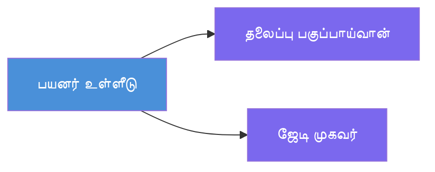
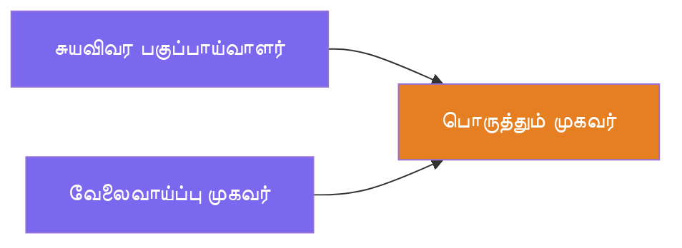
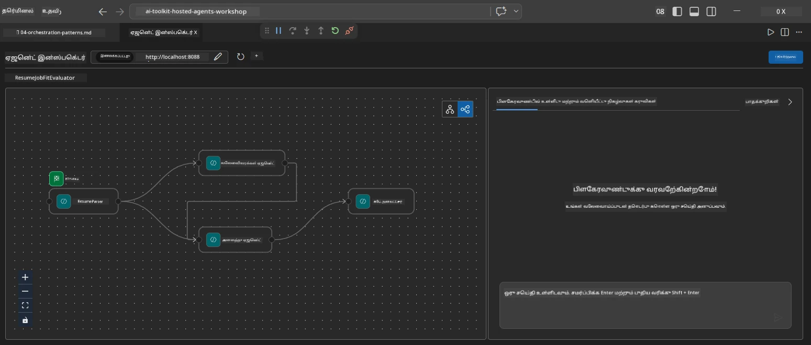
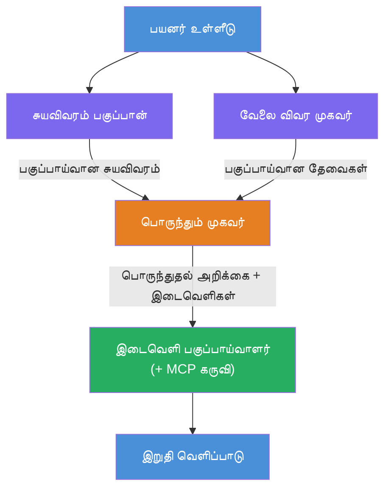
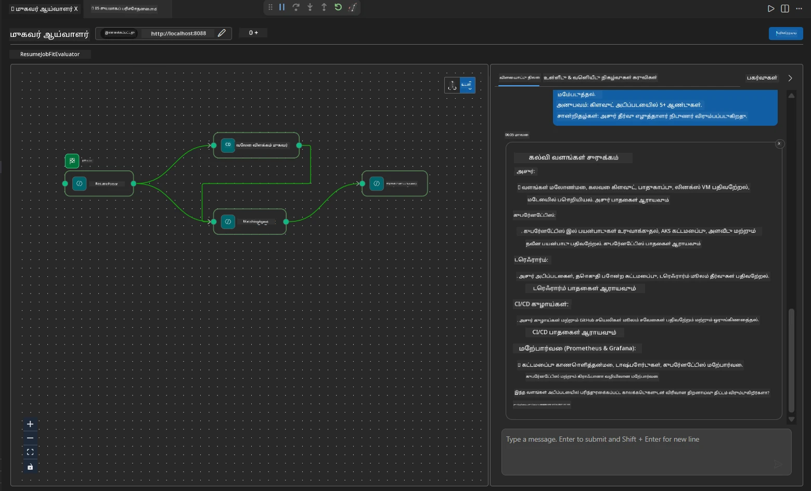

# Module 4 - ஒருக்குழும விதிகள்

இந்த தொகுதியில், நீங்கள் Resume Job Fit Evaluator இல் பயன்படுத்தப்படும் ஒருக்குழும விதிகளை ஆராய்ந்து, பண_FLOW வரைபடத்தை படிப்பது, மாற்றுவது மற்றும் விரிவுபடுத்துவது எப்படி என கற்றுக்கொள்வீர்கள். இந்த விதிகளை புரிந்துகொள்வது தரவு ஓட்ட வசதிகளை பிழைத்திருத்துவதற்கும் உங்கள் சொந்த [பன்முக நடுவர்கள் பண_FLOWகளை](https://learn.microsoft.com/agent-framework/workflows/) கட்டியமைப்பதற்கும் அவசியமானது.

---

## விதி 1: பங்கிடல் (சமநிலை பிரிப்பு)

பண_FLOW இல் முதல் விதி **பங்கிடல்** - ஒரு உள்ளீடு ஒரே நேரத்தில் பல நடுவர்களுக்கு அனுப்பப்படுகிறது.


குறியீட்டில், இது `resume_parser` என்பது `start_executor` என்பதால் நிகழ்கிறது - அது முதலில் பயனர் செய்தியை பெறுகிறது. பின்னர், `jd_agent` மற்றும் `matching_agent` இரண்டும் `resume_parser` இலிருந்து உள்விளக்கங்களைக் கொண்டிருப்பதால், கட்டமைப்பு `resume_parser`-இன் வெளியீட்டை இரு நடுவர்களுக்கு வழிமொழிகிறது:

```python
.add_edge(resume_parser, jd_agent)         # ResumeParser வெளியீடு → JD முகவர்
.add_edge(resume_parser, matching_agent)   # ResumeParser வெளியீடு → பொருத்தும் முகவர்
```

**ஏன் இது இயல்கிறது:** ResumeParser மற்றும் JD Agent ஒரே உள்ளீட்டின் வெவ்வேறு அம்சங்களை செயலாக்குகின்றன. அவற்றை சமநிலையில் இயக்குவதால் தொடர்ந்து இயக்குவதைவிட மொத்த தாமதம் குறைகிறது.

### பங்கிடலை எப்போது பயன்படுத்த வேண்டும்

| பயன்பாடு | உதாரணம் |
|----------|---------|
| சார்பற்ற துணையினங்கள் | மின்னூல் பகுப்பாய்வு மற்றும் JD பகுப்பாய்வு |
| மீளுரு / வாக்கெடுப்பு | இரண்டு நடுவர்கள் ஒரே தரவைக் பகுப்பாய்வு செய்கிறார்கள், மூன்றாவது சிறந்த பதிலை தேர்ந்தெடுக்கிறது |
| பன்முக வடிவ வெளியீடு | ஒரு நடுவர் உரை உருவாக்குகிறான், மற்றொன்று கட்டமைக்கப்பட்ட JSON உருவாக்குகிறது |

---

## விதி 2: சேர்க்கை (கூட்டுத்தொகுதி)

இரண்டாவது விதி **சேர்க்கை** - பல நடுவர் வெளியீடுகள் திரட்டி ஒரே கீழ்சார்ந்த நடுவருக்கு அனுப்பப்படுகிறது.


குறியீட்டில்:

```python
.add_edge(resume_parser, matching_agent)   # ResumeParser வெளியீடு → MatchingAgent
.add_edge(jd_agent, matching_agent)        # JD Agent வெளியீடு → MatchingAgent
```

**முக்கிய நடத்தை:** ஒரு நடுவருக்கு **இரு அல்லது அதற்கு மேற்பட்ட உள்ளீடு விளக்கங்கள்** இருந்தால், கட்டமைப்பு தானாகவே **அனைத்துப்** மேல்நிலை நடுவர்கள் முடிக்க காத்திருக்கிறது பின்னர் கீழ்நிலை நடுவர் இயக்கப்படும். MatchingAgent ResumeParser மற்றும் JD Agent இரண்டும் முடிக்கும்வரை துவங்காது.

### MatchingAgent பெறுவது என்ன

கட்டமைப்பு அனைத்து மேல்நிலை நடுவர்களின் வெளியீடுகளை இணைக்கிறது. MatchingAgent இன் உள்ளீடு பின்வருமாறு இருக்கும்:

```
[ResumeParser output]
---
Candidate Profile:
  Name: Jane Doe
  Technical Skills: Python, Azure, Kubernetes, ...
  ...

[JobDescriptionAgent output]
---
Role Overview: Senior Cloud Engineer
Required Skills: Python, Azure, Terraform, ...
...
```

> **குறிப்பு:** சரியான இணைக்கல் வடிவம் கட்டமைப்பு பதிப்பின்படி மாறுபடும். நடுவரின் வழிமுறைகள் அனைத்து கட்டமைக்கப்பட்ட மற்றும் கட்டமைக்கப்படாத மேல்நிலை வெளியீடுகளையும் கையாளும் விதமாக எழுதப்பட வேண்டும்.



---

## விதி 3: தொடர்ச்சியான சங்கிலி

மூன்றாவது விதி **தொடர்ச்சியான சங்கிலி** - ஒரு நடுவரின் வெளியீடு நேரடியாக அடுத்த நடுவருக்கு செல்லும்.


குறியீட்டில்:

```python
.add_edge(matching_agent, gap_analyzer)    # மேட்சிங் ஏஜென்ட் அவுட்புட் → கேப் அனலிசர்
```

இது எளிதான விதி. GapAnalyzer MatchingAgent இன் பொருத்த மதிப்பீடு, பொருந்திய/இல்லாத திறன்கள் மற்றும் தளர்வுகளைப் பெற்றுக் கொள்கிறது. பின்னர் ஒவ்வொரு தளர்விற்கும் Microsoft Learn வளங்களைப் பெற [MCP கருவியை](https://learn.microsoft.com/azure/foundry/agents/how-to/tools/model-context-protocol) அழைக்கிறது.

---

## முழுமையான வரைபடம்

மூன்று விதிகளையும் ஒன்றிணைத்தால் முழு பண_FLOW உருவாகிறது:


### செயலாக்க நேர வரிசை

```mermaid
gantt
    title முகவர் செயல்படுத்தும் காலக்கெடு
    dateFormat X
    axisFormat %s

    section ஒத்தரி
    Resume Parser       :rp, 0, 3
    JD Agent            :jd, 0, 2

    section தொடர்
    Matching Agent      :ma, 3, 5
    Gap Analyzer        :ga, 5, 9
```


> மொத்தக் காலம் சுமார் `max(ResumeParser, JD Agent) + MatchingAgent + GapAnalyzer`. GapAnalyzer பொதுவாக மெதுவாக இருக்கும் ஏனெனில் இது பல MCP கருவிப் பகுப்பாய்வுகளை செய்கிறது (ஒன்று தளர்வு ஒன்றுக்கு).

---

## WorkflowBuilder குறியீட்டை வாசித்தல்

`main.py` இல் இருந்து முழு `create_workflow()` செயல்பாடும் 注释付(ic) உள்ளது:

```python
def create_workflow(resume_parser, jd_agent, matching_agent, gap_analyzer):
    workflow = (
        WorkflowBuilder(
            name="ResumeJobFitEvaluator",

            # பயனர் உள்ளீட்டை பெற்ற முதல் முகவர்
            start_executor=resume_parser,

            # வெளியீடு இறுதி பதிலாக மாறும் முகவர்கள்
            output_executors=[gap_analyzer],
        )
        # பிரிப்பு: ResumeParser வெளியீடு JD முகவர் மற்றும் MatchingAgent இருவருக்கும் செல்லும்
        .add_edge(resume_parser, jd_agent)
        .add_edge(resume_parser, matching_agent)

        # இணைப்பு: MatchingAgent இராலும் ResumeParser மற்றும் JD முகவரையும் காத்திருக்கும்
        .add_edge(jd_agent, matching_agent)

        # தொடர்ச்சியான: MatchingAgent வெளியீடு GapAnalyzer க்கு ஊட்டமளிக்கும்
        .add_edge(matching_agent, gap_analyzer)

        .build()
    )
    return workflow.as_agent()
```

### விளக்கத்தொகுப்பு அட்டவணை

| # | விளக்கம் | விதி | விளைவு |
|---|----------|------|--------|
| 1 | `resume_parser → jd_agent` | பங்கிடல் | JD Agent ResumeParser வெளியீடு (மூல பயனர் உள்ளீடு உட்பட) பெறுகிறது |
| 2 | `resume_parser → matching_agent` | பங்கிடல் | MatchingAgent ResumeParser வெளியீடு பெறுகிறது |
| 3 | `jd_agent → matching_agent` | சேர்க்கை | MatchingAgent JD Agent வெளியீடு கூட பெறுகிறது (இரண்டும் காத்திருக்கிறது) |
| 4 | `matching_agent → gap_analyzer` | தொடர்ச்சி | GapAnalyzer பொருத்த அறிக்கை + தளர்வு பட்டியலைப் பெறுகிறது |

---

## வரைபடத்தை மாற்றுதல்

### புதிய நடுவரை சேர்த்தல்

ஐந்தாவது நடுவர் (எ.கா., **InterviewPrepAgent** – தளர்வு பகுப்பாய்வை அடிப்படையாகக் கொண்டு நேர்காணல் கேள்விகளை உருவாக்குகிறது) சேர்க்க:

```python
# 1. வழிமுறைகளை வரைவமைக்கவும்
INTERVIEW_PREP_INSTRUCTIONS = """\
You are the Interview Prep Agent.
Given a gap analysis and fit report, generate 10 targeted interview questions
the candidate should prepare for.
"""

# 2. முகவரியை உருவாக்கவும் (async with தொகுதியினுள்)
AzureAIAgentClient(
    project_endpoint=PROJECT_ENDPOINT,
    model_deployment_name=MODEL_DEPLOYMENT_NAME,
    credential=credential,
).as_agent(
    name="InterviewPrepAgent",
    instructions=INTERVIEW_PREP_INSTRUCTIONS,
) as interview_prep,

# 3. create_workflow()ல் ஓட்டுநிலைகள் சேர்க்கவும்
.add_edge(matching_agent, interview_prep)   # பொருத்தும் அறிக்கையை பெறுகிறது
.add_edge(gap_analyzer, interview_prep)     # இடைவெளி அட்டைகளையும் பெறுகிறது

# 4. output_executors ஐ புதுப்பிக்கவும்
output_executors=[interview_prep],  # இப்போது இறுதி முகவர்
```

### செயல்பாட்டு வரிசையை மாற்றுதல்

JD Agent ResumeParserக்கு **பின்பு** இயங்கக் காத்திருக்கச் செய்ய (சமநிலை அல்லாமல் தொடர்ச்சியாக):

```python
# அகற்று: .add_edge(resume_parser, jd_agent) ← 이미 존재함, இதனை வையுங்கள்
# jd_agent நேரடியாக பயனர் உள்ளீட்டை பெறாமல் பண்பட்ட ஒத்திசைவை அகற்றவும்
# start_executor முதலில் resume_parser க்கு அனுப்புகிறது மற்றும் jd_agent பெறுகிறது
# resume_parser இன் வெளியீட்டைக் கொண்டு எட்ஜ் மூலம். இது அவற்றை வரிசைப்படுத்துகிறது.
```

> **முக்கியம்:** `start_executor` மட்டுமே விழுவனைப்பதிவு செய்யும் பயனர் உள்ளீட்டை பெறுகிறது. மற்ற அனைத்து நடுவர்களும் மேல்நிலை விளக்கங்களிலிருந்து வெளியீட்டை பெறுகின்றன. ஒரு நடுவர் கச்சா பயனர் உள்ளீட்டையும் பெற விரும்பினால், அது `start_executor` இலிருந்து விளக்கத்தை கொண்டிருக்க வேண்டும்.

---

## பொதுவான வரைபட பிழைகள்

| பிழை | அறிகுறி | சரிசெய்தல் |
|---------|---------|------------|
| `output_executors`க்கு இணைப்பில்லாமை | நடுவர் இயங்கும், ஆனால் வெளியீடு வெறுமை | `start_executor` இலிருந்து `output_executors`ல் உள்ள ஒவ்வொரு நடுவர்களுக்கும் பாதை இருக்க.scipl |
| சுற்றுப்பயன்பாடு சிதறல் | முடிவில்லாமல் சுழற்சி அல்லது நேர அவகாசம் | ஒரு நடுவர் மேல்நிலை நடுவருக்குப் பின்வாங்கிக் கொடுக்கிறதா என சரிபார்க்கவும் |
| `output_executors`ல் உள்ள நடுவர், உள்ளீடு விளக்கம் இலாமை | வெளியீடு வெறுமை | குறைந்தது ஒரு `add_edge(source, that_agent)` சேர்க்கவும் |
| பல `output_executors` ன் fan-in இல்லாமை | வெளியீடு ஒரே நடுவரின் பதிலையே கொண்டிருக்கும் | நுழைவு நிர்வாகப்படுத்தும் ஒரே நடுவரை பயன்படுத்தவும் அல்லது பல வெளியீடுகளை ஏற்கவும் |
| `start_executor` இல்லாமை | கட்டுமான நேரத்தில் `ValueError` | எப்போதும் `WorkflowBuilder()`ல் `start_executor` ஐ குறிப்பிடவும் |

---

## வரைபடத்தை பிழைத்திருத்துதல்

### Agent Inspector பயன்படுத்துதல்

1. நடுவரை உள்ளூர் இயக்கு (F5 அல்லது டெர்மினல் - [Module 5](05-test-locally.md)யைப் பாருங்கள்).
2. Agent Inspector திறக்க (`Ctrl+Shift+P` → **Foundry Toolkit: Open Agent Inspector**).
3. ஒரு பரீட்சை செய்தி அனுப்பு.
4. ஆய்வுக் கருவி பதில்பிரிவில் **அலைவரிசை வெளியீடு** பார்த்து ஒவ்வொரு நடுவரின் பங்களிப்பு வரிசையாக காட்டும்.



### பதிவெழுத்து (logging) பயன்படுத்துதல்

`main.py` இல் பதிவெழுத்தைச் சேர்த்து தரவு ஓட்டத்தை பின்தொடர:

```python
import logging
logger = logging.getLogger("resume-job-fit")

# create_workflow()-இல், கட்டமைக்கப்பட்ட பிறகு:
logger.info("Workflow graph built with edges: RP→JD, RP→MA, JD→MA, MA→GA")
```

சேவையகம் பதிவுகள் நடுவர் செயலாக்க வரிசையும் MCP கருவி அழைப்புகளையும் காட்டுகிறது:

```
INFO:resume-job-fit:Starting Resume -> Job Fit Evaluator HTTP server...
INFO:resume-job-fit:Server running on http://localhost:8088
INFO:agent_framework:Executing agent: ResumeParser
INFO:agent_framework:Executing agent: JobDescriptionAgent
INFO:agent_framework:Waiting for upstream agents: ResumeParser, JobDescriptionAgent
INFO:agent_framework:Executing agent: MatchingAgent
INFO:agent_framework:Executing agent: GapAnalyzer
INFO:agent_framework:Tool call: search_microsoft_learn_for_plan(skill="Kubernetes")
POST https://learn.microsoft.com/api/mcp → 200
INFO:agent_framework:Tool call: search_microsoft_learn_for_plan(skill="Terraform")
POST https://learn.microsoft.com/api/mcp → 200
```

---

### சோதனை பட்டியல்

- [ ] பண_FLOW இல் மூன்று ஒருக்குழும விதிகளைக் கண்டுபிடிக்க முடியும்: பங்கிடல், சேர்க்கை, தொடர்ச்சி சங்கிலி
- [ ] ஒன்றுக்கு மேற்பட்ட உள்ளீடு விளக்கங்கள் கொண்ட நடுவர்கள் அனைத்துப் மேல்நிலை நடுவர்களும் முடிக்கும் வரை காத்திருப்பதை புரிந்துகொண்டிருக்கிறீர்கள்
- [ ] `WorkflowBuilder` குறியீட்டைப் படித்து ஒவ்வொரு `add_edge()` அழைப்பையும் வரைபட்டுடன் ஒப்பிட முடியும்
- [ ] செயலாக்க நேர வரிசையை புரிந்துகொண்டிருக்கிறீர்கள்: முதலில் சமநிலை நடுவர்கள், பின்னர் சேர்க்கை, பின்னர் தொடர்ச்சி
- [ ] புதிய நடுவரை வரைபாட்டில் சேர்ப்பது எப்படி என்று அறிவீர்கள் (வழிமுறைகளை நிர்ணயி, நடுவரை உருவாக்கி, விளக்கங்களைச் சேர்க்கவும், வெளியீட்டை மேம்படுத்து)
- [ ] பொதுவான வரைபட பிழைகள் மற்றும் அவற்றின் அறிகுறிகளை அறிந்திருப்பீர்கள்

---

**முன்பு:** [03 - வழிமுறை மற்றும் சுற்றுச்சூழல் அமைக்க](03-configure-agents.md) · **அடுத்து:** [05 - உள்ளூரில் சோதனை →](05-test-locally.md)

---

<!-- CO-OP TRANSLATOR DISCLAIMER START -->
**கடைசிக் குறிப்பு**:  
இந்த ஆவணம் AI மொழிபெயர்ப்பு சேவை [Co-op Translator](https://github.com/Azure/co-op-translator) பயன்படுத்தி மொழிமாற்றம் செய்யப்பட்டதாகும். நாங்கள் துல்லியத்திற்காக முயற்சித்தாலும், தானாக இயங்கும் மொழிபெயர்ப்பில் பிழைகள் அல்லது தவறுகள் இருக்க வாய்ப்பு உள்ளது என்பதை நினைவில் கொள்ளவும். அதே மொழியில் உள்ள அசல் ஆவணம் அதிகாரபூர்வ மூலமாகக் கருதப்பட வேண்டும். முக்கிய தகவல்களுக்கு, தொழில்முறை மனித மொழிபெயர்ப்பு பரிந்துரைக்கப்படுகிறது. இந்த மொழிபெயர்ப்பின் பயன்பாட்டினால் தவறான புரிதல்கள் அல்லது தவறான விளக்கங்களுக்கு எமது பொறுப்பில்லை.
<!-- CO-OP TRANSLATOR DISCLAIMER END -->