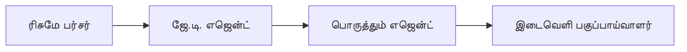
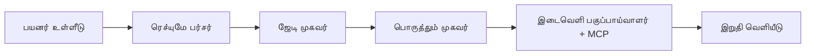

# தொகுதி 4 - ஒன்‌செற்றுமுறை வடிவங்கள்

⏱️ ~10 நிமிடங்கள்

இந்த தொகுதியில், நீங்கள் Resume Job Fit Evaluator இல் பயன்படுத்தப்படும் ஒன்‌செற்றுமுறை வடிவங்களை ஆராய்கிறீர்கள் மற்றும் வேலைநடைவரிசை வரைபடத்தை எப்படி வாசிப்பது, திருத்துவது மற்றும் விரிவுபடுத்துவது என்பதை கற்றுக்கொள்கிறீர்கள். இந்த வடிவங்களைப் புரிந்துகொள்வது தரவு ஓட்டப் பிரச்சனைகளை பிழைத்திருத்துவதற்கும் மற்றும் உங்கள் சொந்த [பன்முக முகவர் வேலைநடைகளை](https://learn.microsoft.com/agent-framework/workflows/) உருவாக்குவதற்கும் அவசியமாகும்.

---

## வடிவம் 1: தொடர் சங்கிலி

வேலைநடைவரிசையில் மூல வடிவம் ஒரு **தொடர் சங்கிலி** — ஒவ்வொரு முகவரின் வெளியீடு அடுத்ததுக்கு நேரடியாகப் பகிரப்படுகிறது.


```mermaid
flowchart LR
    RP[ரிசுமே பர்சர்] --> JD[ஜே.டி. எஜென்ட்]
    JD --> MA[பொருத்தும் எஜென்ட்]
    MA --> GA[இடைவெளி பகுப்பாய்வாளர்]
```

குறியீட்டில், ஒவ்வொரு `add_edge()` அழைப்பும் சங்கிலியில் ஒரு படியை உருவாக்குகிறது:

```python
.add_edge(resume_executor, jd_executor)       # ResumeParser வெளியீடு → ஜேடி முகவர்
.add_edge(jd_executor, matching_executor)     # ஜேடி முகவர் வெளியீடு → பொருத்து முகவர்
.add_edge(matching_executor, gap_executor)    # பொருத்து முகவர் வெளியீடு → இடைவெளி பகுப்பாய்வாளர்
```

> **ஏன் தொடர், fan-out/fan-in இல்லை?** `WorkflowBuilder` வரும் நீட்சிகள் க்கான **OR-அர்த்தங்கள்** பயன்படுத்துகிறது: முன்னணி எதாவது முடிந்ததும் கீழ்க்காணும் இயங்குபவர் இயக்கமாகிறது. `matching_executor`க்கு இரண்டு வரும் நீட்சிகள் இருந்தால் (`resume_executor` மற்றும் `jd_executor` இரண்டிலிருந்து), அது இரு முறை இயக்கப்படும் - ResumeParser முடிந்ததும் மற்றும் JD Agent முடிந்ததும் - இதனால் GapAnalyzer இரு முறை இயங்கும் மற்றும் வெளியீடு இரு முறை தோன்றும். தொடர் மிகையும் இதை முற்றிலும் தவிர்க்கிறது.

## வடிவம் 2: உள்ளடக்க பின்வாங்கல்

`context_mode="last_agent"` என்றது ஒவ்வொரு இயங்குபவரும் தமது **நேரடி முன்னணியின் வெளியீட்டை மட்டுமே** காண்பதால், தொடர் சங்கிலியில் உள்ள முகவர்கள் கீழ்க்காணும் முகவர்கள் தேவைப்படும் எந்தவொரு தரவையும் தெளிவாக முன்செல்ல வேண்டும்.

இந்த வேலைநடையில்:
- **ResumeParser** JDயை அசல் வடிவில் `[JOB DESCRIPTION PASS-THROUGH]` ல் நகலெடுக்கிறது (இதனால் JD Agent அதை காணலாம்).
- **JD Agent** `[PARSED RESUME]` ஐ அசல் வடிவில் `[PARSED RESUME PASS-THROUGH]` ல் நகலெடுக்கிறது (இதனால் MatchingAgent இரண்டு சுயவிவரங்களையும் ஒப்பிட முடியும்).

```
ResumeParser output
└─ [PARSED RESUME]               ← extracted by JD Agent
└─ [JOB DESCRIPTION PASS-THROUGH] ← extracted by JD Agent

JD Agent output
└─ [JD REQUIREMENTS]             ← extracted by MatchingAgent
└─ [PARSED RESUME PASS-THROUGH]  ← extracted by MatchingAgent
```

ஒவ்வொரு பின்வாங்கல் பகுதியில் **அசல் வடிவில்** நகலெடுக்க வேண்டும் - அதைப் சுருக்கவோ அல்லது மாற்றவோ செய்தால் அதை சார்ந்த கீழ்க்காணும் முகவர் செயல்படாது.

---

## முழுமையான வரைபடம்

தொடர் சங்கிலி மற்றும் உள்ளடக்க பின்வாங்கல் வடிவங்களை இணைக்கும்போது முழு வேலைநடையை உருவாக்குகிறது:


```mermaid
flowchart LR
    U[பயனர் உள்ளீடு] --> RP[ரெச்யுமே பர்சர்]
    RP --> JD[ஜேடி முகவர்]
    JD --> MA[பொருத்தும் முகவர்]
    MA --> GA[இடைவெளி பகுப்பாய்வாளர் + MCP]
    GA --> O[இறுதி வெளியீடு]
```

முகவர் ஆய்வாளர் முகவர் உள்ளூரில் இயங்கும்போது இதே வரைபட வடிவமைப்பை காட்டுகிறது. திரைப்படங்கள் க்காக [தொகுதி 5 - உள்ளூரில் சோதனை](05-test-locally.md) ஐ பார்க்கவும்.

---

## WorkflowBuilder குறியீட்டை வாசித்தல்

முழு `create_workflow()` செயல்பாடு [`PersonalCareerCopilot/main.py`](../../../../../workshop/lab02-multi-agent/PersonalCareerCopilot/main.py) இல் உள்ளது. மூன்று `add_edge()` அழைப்புகள் தொடர் மிகையை உருவாக்குகின்றன:

| # | நீட்சி | விளைவு |
|---|------|--------|
| 1 | `resume_executor → jd_executor` | JD முகவர் `[PARSED RESUME]` + `[JOB DESCRIPTION PASS-THROUGH]` பெறுகிறார் |
| 2 | `jd_executor → matching_executor` | MatchingAgent `[JD REQUIREMENTS]` + `[PARSED RESUME PASS-THROUGH]` பெறுகிறார் |
| 3 | `matching_executor → gap_executor` | GapAnalyzer பொருத்தல் அறிக்கை + விலக்கு பட்டியல் பெறுகிறார் |

---

## வரைபாட்டை மாற்றுதல்

### புதிய முகவரைக் கூட்டுதல்

ஐந்தாவது முகவரைக் (உதாரணமாக, GapAnalyzerக்கு பின் **InterviewPrepAgent**) சேர்க்க:

1. `INTERVIEW_PREP_INSTRUCTIONS` என்ற நிலையான மதிப்பை வரையறு.
2. `Agent` + `AgentExecutor` பொருட்களை உருவாக்கு (நான்கு இருந்த மாதிரியைப் போல).
3. `.add_edge(gap_executor, interview_exec)` ஐ `WorkflowBuilder` இல் சேர்க்க.
4. `output_executors=[interview_exec]` என்பதை புதுப்பி.

> **முக்கியம்:** `start_executor` மட்டுமே நேரடியாக பயனர் உள்ளீட்டை பெறும் முகவர். மற்ற அனைத்து முகவர்களும் தங்கள் மேல்நிலை நீட்சி வெளியீட்டை பெறுகிறார்கள்.

---

## பொதுவான வரைபாடு தவறுகள்

| தவறு | பாதிப்பு | சரி செயல் |
|---------|---------|-----|
| `output_executors`க்கு நீட்சி காணவில்லை | முகவர் இயங்கும் ஆனால் வெளியீடு வெறும் | `start_executor` இலிருந்து `output_executors` உள்ள எல்லா முகவர்களுக்கும் பாதை இருப்பதை உறுதிப்படுத்துக |
| சுழற்சி சார்ந்த சார்பு | முடிவற்ற சுற்றம் அல்லது நேரம் கடந்துவிடுதல் | எந்த முகவர் மேல்நிலைக் முகவரிக்கு பின்னுஇயக்கமளிப்பதில்லை என்பதை சோதிக்கவும் |
| `output_executors` இல் உள்ள முகவர்களுக்கு வரும் நீட்சி இல்லை | வெளியீடு வெறும் | குறைந்தது ஒரு `add_edge(source, that_agent)` சேர்க்கவும் |
| பல `output_executors` ஆனால் fan-in இல்லை | வெளியீடு ஒரே முகவரின் பதில் மட்டும் கொண்டுள்ளது | பன்முக வெளியீடு ஏற்றுக்கொள்ள, ஒரு ஒரே வெளியீடு முகவரை பயன்படுத்தவோ, அல்லது ஒன்றிணைக்கும் ஒரு முகவarya பயன்படுத்தவும் |
| `start_executor` காணாமல் போய்தல் | கட்டுமான காலத்தில் `ValueError` | எப்போதும் `WorkflowBuilder()` இல் `start_executor` ஐ குறிப்பிடவும் |

---

## வரைபாட்டைப் பிழைத்திருத்துதல்

### முகவர் ஆய்வாளர் பயன்படுத்துதல்

1. F5 மூலம் முகவரைப் உள்ளூரில் தொடங்கு.
2. முகவர் ஆய்வாளரை திறக்கவும் (`Ctrl+Shift+P` → **Foundry Toolkit: Open Agent Inspector**).
3. சோதனை செய்தி அனுப்பு.
4. ஆய்வாளரின் பதில் பலகையில் **ஸ்ட்ரீமிங் வெளியீடு** காணவும் - இது ஒவ்வொரு முகவரின் பங்களிப்பையும் தொடர்ச்சியாக காட்டும்.


### பதிவு பயன்பாடு

தரவு ஓட்டத்தை பின்தொடரும் வகையில் `main.py` இல் பதிவு சேர்:

```python
import logging
logger = logging.getLogger("resume-job-fit")

# main() இல், வேலைப்பாட்டை உருவாக்கிய பிறகு:
logger.info("Workflow graph built with edges: RP→JD, JD→MA, MA→GA")
```

சேவை பதிவுகள் முகவர் செயல்பாட்டு வரிசையையும் MCP கருவி அழைப்புகளையும் காண்பிக்கின்றன:

```
INFO:agent_framework:Executing agent: ResumeParser
INFO:agent_framework:Executing agent: JobDescriptionAgent
INFO:agent_framework:Executing agent: MatchingAgent
INFO:agent_framework:Executing agent: GapAnalyzer
INFO:agent_framework:Tool call: search_microsoft_learn_for_plan(skill="Kubernetes")
POST https://learn.microsoft.com/api/mcp → 200
INFO:agent_framework:Tool call: search_microsoft_learn_for_plan(skill="Terraform")
POST https://learn.microsoft.com/api/mcp → 200
```

---

### செக் பாயிண்ட்

- [ ] நீங்கள் வேலைநடைவில் இருக்கும் இரண்டு ஒன்‌செற்றுமுறை வடிவங்களை - தொடர்ச்சி சங்கிலி மற்றும் உள்ளடக்க பின்வாங்கல் - அடையாளம் காண முடியும்
- [ ] `context_mode="last_agent"` ஏன் முகவர்களுக்கு இடையிலான தெளிவான தரவு பின்வாங்கலை தேவையாக்கிறது என்பதை நீங்கள் புரிந்து கொண்டீர்கள்
- [ ] நீங்கள் `WorkflowBuilder` குறியீட்டை வாசித்து ஒவ்வொரு `add_edge()` அழைப்பையும் திரைப்பட வரைபாட்டுடன் போட்டுக் கொள்ள முடியும்
- [ ] நீங்கள் குழாயின் இறுதியில் புதிய முகவரைக் கூட்டுவது எப்படி என்பதை அறிந்துள்ளீர்கள்
- [ ] பொதுவான வரைபாடு தவறுகளையும் அவற்றின் அறிகுறிகளையும் நீங்கள் அடையாளம் காண முடியும்

---

**முந்தையது:** [03 - முகவர்களையும் சூழலையும் அமைத்தல்](03-configure-agents.md) · **அடுத்தது:** [05 - உள்ளூரில் சோதனை →](05-test-locally.md)

---

<!-- CO-OP TRANSLATOR DISCLAIMER START -->
**மறுப்பு**:
இந்த ஆவணம் AI மொழிபெயர்ப்பு சேவை [Co-op Translator](https://github.com/Azure/co-op-translator) பயன்படுத்தி மொழிபெயர்க்கப்பட்டுள்ளது. நாங்கள் துல்லியத்திற்காக முயற்சி செய்துள்ளோம், ஆனால் தானாக செய்யப்படும் மொழிபெயர்ப்புகளில் பிழைகள் அல்லது தவறுகள் இருக்கலாம் என்பதை கவனத்தில் கொள்ளவும். அசல் ஆவணம் அதன் தாய்மொழியில் அதிகாரப்பூர்வ ஆதாரமாக கருதப்பட வேண்டும். முக்கியமான தகவல்களுக்கு, தொழில்நுட்பமான மனித மொழிபெயர்ப்பு பரிந்துரைக்கப்படுகிறது. இந்த மொழிபெயர்ப்பைப் பயன்படுத்துவதால் ஏற்படும் எந்த தவறான புரிதல்கள் அல்லது தவறான விளக்கத்திற்கும் நாங்கள் பொறுப்பில்வில்லை.
<!-- CO-OP TRANSLATOR DISCLAIMER END -->