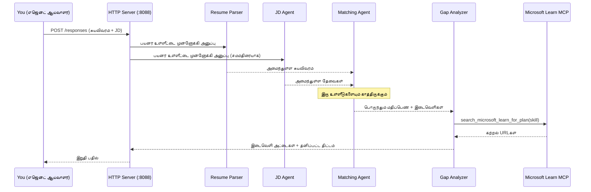
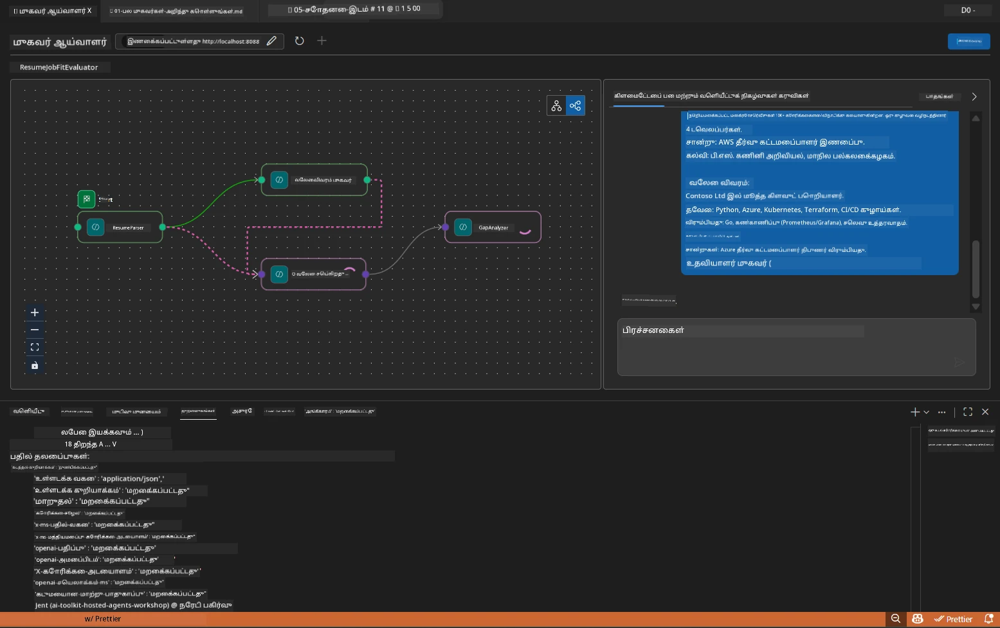

# Module 5 - உள்ளூரில் சோதனை செய் (பல-நிலையிçர்)

இந்த முன்மொழிவில், நீங்கள் பல-நிலையியர் பண்பாடுகளை உள்ளூரில் இயக்கி, Agent Inspector மூலம் சோதித்து, அனைத்து நான்கு நிலையியர்களும் MCP கருவியும் Foundry க்குச் செயல்படுவதற்கு முன்பு சரியாக உள்ளதா என உறுதி செய்கிறீர்கள்.

### உள்ளூர் சோதனை இயக்கத்தின் போது என்ன நடக்கிறது


---

## படி 1: நிலையியர் சர்வரை प्रारம்பி செய்

### விருப்பம் A: VS Code வேலை (task) பயன்படுத்தி (பரிந்துரைக்கப்பட்டது)

1. `Ctrl+Shift+P` அழுத்தி → **Tasks: Run Task** என்று தட்டச்சு செய் → **Run Lab02 HTTP Server** என்பதைத் தேர்வு செய்.
2. வேலையிçர் `5679` போர்டில் debugpy உடன், மற்றும் நிலையியர் `8088` போர்டில் சர்வரை துவக்குகிறது.
3. வெளியீடு பின்வருமாறு வரும் வரை காத்திருக்கவும்:

```
INFO:resume-job-fit:Starting Resume -> Job Fit Evaluator HTTP server...
INFO:resume-job-fit:Server running on http://localhost:8088
```

### விருப்பம் B: கமாண்டு வரியில் கைமுறையாக

```powershell
cd workshop\lab02-multi-agent\PersonalCareerCopilot
```

மெய்நிகர் சுற்றுச்சூழலை செயல்படுத்தவும்:

**PowerShell (Windows):**
```powershell
.\.venv\Scripts\Activate.ps1
```

**macOS/Linux:**
```bash
source .venv/bin/activate
```

சர்வரை துவக்கு:

```powershell
python -m debugpy --listen 127.0.0.1:5679 -m agentdev run main.py --verbose --port 8088
```

### விருப்பம் C: F5 பயன்படுத்தி (தவறான முறையில்)

1. `F5` அழுத்தவும் அல்லது **Run and Debug** (`Ctrl+Shift+D`) செல்.
2. பட்டியில் இருந்து **Lab02 - Multi-Agent** தொடக்க அமைப்பைத் தேர்ந்தெடு.
3. சர்வர் முழு இடைவெளி ஆதரவுடன் துவங்கும்.

> **குறிப்பு:** தவறான முறையில் நீங்கள் `search_microsoft_learn_for_plan()` உள் இடத்தில் இடைவேளைக் குறிப்புகளை அமைக்க முடியும், MCP பதில்களை ஆய்வு செய்ய, அல்லது ஒவ்வொரு நிலையியர் கட்டளைகளில் இருக்கும் எழுத்துக்களையும் பார்க்க.

---

## படி 2: Agent Inspector திறக்கவும்

1. `Ctrl+Shift+P` அழுத்தி → **Foundry Toolkit: Open Agent Inspector** என்று தட்டச்சு செய்.
2. Agent Inspector `http://localhost:5679` என்ற உலாவி தாவலில் திறக்கப்படும்.
3. நீங்கள் நிலையியரின் இனைப்பு செய்திகளை ஏற்க தயாராக உள்ள இடைமுகத்தை காணலாம்.

> **Agent Inspector திறக்காவிட்டால்:** சர்வர் முழுமையாக துவங்கியுள்ளதாக உறுதி செய்யவும் ("Server running" பதிவு காட்சியளிக்க வேண்டும்). போர்ட் 5679 already busy என்றால், [Module 8 - தவிர்க்கும் வழிகள்](08-troubleshooting.md) பார்க்கவும்.

---

## படி 3: தீய வழி சோதனைகள் ஓட்டவும்

இந்த மூன்று சோதனைகளை வரிசையாக ஓட்டவும். ஒவ்வொன்றும் பண்பாடின் அதிகபட்ச பகுதியை சோதிக்கிறது.

### சோதனை 1: அடிப்படை பூர்த்தி + வேலை விளக்கம்

Agent Inspector இல் கீழுள்ளதை ஒட்டவும்:

```
Resume:
Jane Doe
Senior Software Engineer with 5 years of experience in Python, Django, and AWS.
Built microservices handling 10K+ requests/second. Led a team of 4 developers.
Certifications: AWS Solutions Architect Associate.
Education: B.S. Computer Science, State University.

Job Description:
Senior Cloud Engineer at Contoso Ltd.
Required: Python, Azure, Kubernetes, Terraform, CI/CD pipelines.
Preferred: Go, monitoring (Prometheus/Grafana), cost optimization.
Experience: 5+ years in cloud infrastructure.
Certifications: Azure Solutions Architect Expert preferred.
```

**எதிர்பார்க்கப்படும் வெளியீடு அமைப்பு:**

வெளியீடு அனைத்து நான்கு நிலையியரின் தொடர்ச்சியான பதிலை கொண்டிருக்க வேண்டும்:

1. **Resume Parser வெளியீடு** - திறன்கள் வகைப்படுத்தப்பட்ட அமைப்பான விண்ணப்பதாரர் சுயவிவரம்
2. **JD Agent வெளியீடு** - தேவையான மற்றும் விரும்பப்படும் திறன்கள் வேறுபடுத்தப்பட்ட கட்டமைப்பு
3. **Matching Agent வெளியீடு** - பொருத்தத்தாள் மதிப்பெண் (0-100) உடன் விரிவாக்கம், பொருந்திய திறன்கள், இல்லாத திறன்கள், இடைவெளிகள்
4. **Gap Analyzer வெளியீடு** - ஒவ்வொரு இல்லாத திறனுக்கும் தனித்தனி இடைவெளிக் கார்டுகள், ஒவ்வொன்றுக்கும் Microsoft Learn URLகள்



### சோதனை 1ல் என்ன சரிபார்க்க வேண்டும்

| சரிபார்ப்பு | எதிர்பார்க்கப்பட்டது | பாஸ்? |
|-------|----------|-------|
| பதில் ஒரு பொருத்தத் தாள் மதிப்பெண் கொண்டுள்ளது | 0-100 இடையில் எண்ணிக்கை, விரிவாக்கம் உடன் | |
| பொருந்திய திறன்கள் பட்டியலிடப்பட்டுள்ளன | Python, CI/CD (பகுதி), மற்றும் பிற | |
| இல்லாத திறன்கள் பட்டியலிடப்பட்டுள்ளன | Azure, Kubernetes, Terraform, மற்றும் பிற | |
| ஒவ்வொரு இல்லாத திறனுக்கும் இடைவெளிக் கார்டுகள் உள்ளன | திறனுக்கு ஒரு கார்டு | |
| Microsoft Learn URLகள் உள்ளன | உண்மையான `learn.microsoft.com` இணைப்புகள் | |
| பதிலில் பிழை செய்திகள் இல்லை | சுத்தமான கட்டமைக்கப்பட்ட வெளியீடு | |

### சோதனை 2: MCP கருவி செயல்பாடு சரிபார்க்கவும்

சோதனை 1 ஓடும்போது, **சர்வர் டெர்மினல்** யில் MCP பதிவு குறிப்புகளை பாருங்கள்:

```
GET https://learn.microsoft.com/api/mcp → 405 (Method Not Allowed)
POST https://learn.microsoft.com/api/mcp → 200
DELETE https://learn.microsoft.com/api/mcp → 405 (Method Not Allowed)
```

| பதிவு குறிப்புகள் | பொருள் | எதிர்பார்ப்பு |
|-----------|---------|-----------|
| `GET ... → 405` | MCP கிளையண்ட் துவக்கத்தில் GET மூலம் சோதனை செய்கிறது | ஆம் - சாதாரணம் |
| `POST ... → 200` | மைக்ரோசாஃப்ட் லீன் MCP சர்வருக்கு உண்மையான கருவி அழைப்பு | ஆம் - இது உண்மையான அழைப்பு |
| `DELETE ... → 405` | MCP கிளையண்ட் தூய்மையான நிலையில் DELETE மூலம் சோதனை செய்கிறது | ஆம் - சாதாரணம் |
| `POST ... → 4xx/5xx` | கருவி அழைப்பு தோல்வியடைந்தது | இல்லை - பார்க்கவும் [தவிர்க்கும் வழிகள்](08-troubleshooting.md) |

> **முக்கிய குறிப்பு:** `GET 405` மற்றும் `DELETE 405` வரிகள் **எதிர்பார்க்கப்படும் நடத்தை** ஆகும். `POST` அழைப்புகள் 200 அல்லாத நிலைத்தட்டலை காண்பித்தால் கவலைப்படவும்.

### சோதனை 3: குறுக்குமுனை - உயர்ந்த பொருத்தத் தாள் விண்ணப்பதாரர்

பயோடேட்டையை ஓட்டவும், இது JDக்கு நெருக்கமாக பொருந்துவதை சரிபார்க்க:

```
Resume:
Alex Chen
Senior Cloud Engineer with 7 years of experience.
Skills: Python, Azure (AKS, Functions, DevOps), Kubernetes, Terraform, CI/CD (GitHub Actions, Azure Pipelines), Go, Prometheus, Grafana, cost optimization.
Certifications: Azure Solutions Architect Expert, Azure DevOps Engineer Expert.
Led infrastructure migration to Azure for 3 enterprise clients.
Education: M.S. Computer Science, Tech University.

Job Description:
Senior Cloud Engineer at Contoso Ltd.
Required: Python, Azure, Kubernetes, Terraform, CI/CD pipelines.
Preferred: Go, monitoring (Prometheus/Grafana), cost optimization.
Experience: 5+ years in cloud infrastructure.
Certifications: Azure Solutions Architect Expert preferred.
```

**எதிர்பார்க்கப்படும் நடத்தைகள்:**
- பொருத்தத் தாள் மதிப்பெண் **80+** இருக்க வேண்டும் (அதிகமான திறன்கள் பொருந்தும்)
- இடைவெளிக் கார்டுகள் அடிப்படை கற்றலில் இருந்து எனக்கு இன்னும் மேம்படுவதற்கும் முன்-தயாரிப்புக்கு கவனம் செலுத்தும்
- GapAnalyzer உத்தரவுகள் சொல்வதாவது: "வேறு நீக்குபவர்களுக்கு அதிகம் ≥ 80 என்றால், முடிவுரை மற்றும் நேர்காணல் தயார் மீது கவனம் செலுத்து"

---

## படி 4: வெளியீடு முழுமையாக உள்ளதா என சரிபார்க்கவும்

சோதனைகள் முடிந்த பின் வெளியீடு பின்வரும் அளவுகோல்களுக்கு ஒத்திருக்கிறது என்பதை உறுதி செய்யவும்:

### வெளியீடு அமைப்பு சரிபார்ப்பு பட்டியல்

| பிரிவு | நிலையியர் | உள்ளது? |
|---------|-------|----------|
| விண்ணப்பதாரர் சுயவிவரம் | Resume Parser | |
| தொழில்நுட்ப திறன்கள் (அருகியவாறு தொகுக்கப்பட்ட) | Resume Parser | |
| பங்கு கண்ணோட்டம் | JD Agent | |
| தேவையான மற்றும் விரும்பப்படும் திறன்கள் | JD Agent | |
| பொருத்தத் தாள் மதிப்பெண் மற்றும் விரிவாக்கம் | Matching Agent | |
| பொருந்திய / இல்லாத / பகுதி திறன்கள் | Matching Agent | |
| ஒவ்வொரு இல்லாத திறனுக்குமான இடைவெளிக் கார்ட்கள் | Gap Analyzer | |
| இடைவெளிக் கார்டுகளில் Microsoft Learn URLகள் | Gap Analyzer (MCP) | |
| கற்றல் ஒழுங்கு (எண் இடுகை) | Gap Analyzer | |
| நேரம் வரிசை சுருக்கம் | Gap Analyzer | |

### இப்போது பொதுவான பிரச்சினைகள்

| பிரச்சினை | காரணம் | தீர்வு |
|-------|-------|-----|
| ஒரே ஓர் இடைவெளிக் கார்டு மட்டுமே உள்ளது (மீதமுள்ளவை வெற்றிடம்) | GapAnalyzer உத்தரவுகளில் முக்கியமான பகுதி இல்லை | `GAP_ANALYZER_INSTRUCTIONS` இல் `CRITICAL:` பத்தியைச் சேர்க்கவும் - பாருங்கள் [Module 3](03-configure-agents.md) |
| Microsoft Learn URLக்கள் இல்லை | MCP இறுதி புள்ளி அணுக முடியவில்லை | இணைய இணைப்பைக் சரிபார்க்கவும். `.env` இல் `MICROSOFT_LEARN_MCP_ENDPOINT` `https://learn.microsoft.com/api/mcp` என உள்ளது என்பதை உறுதி செய்க |
| வெற்று பதில் | `PROJECT_ENDPOINT` அல்லது `MODEL_DEPLOYMENT_NAME` அமைக்கப்படவில்லை | `.env` கோப்பில் மதிப்புகளை சரிபார்க்கவும். டெர்மினலில் `echo $env:PROJECT_ENDPOINT` இயக்கவும் |
| பொருத்தத் தாள் மதிப்பெண் 0 அல்லது இல்லை | MatchingAgentக்கு மேல் நிலை தரவு கிடைக்கவில்லை | `create_workflow()` இல் `add_edge(resume_parser, matching_agent)` மற்றும் `add_edge(jd_agent, matching_agent)` உள்ளதா எனி உறுதி செய்க |
| நிலையியர் துவங்கி உடனே நிறுத்துகிறது | இறக்குமதி பிழை அல்லது பற்றாக்குறை | `pip install -r requirements.txt` மீண்டும் இயக்கவும். டெர்மினலில் பிழை அறிக்கைகளைப் பாருங்கள் |
| `validate_configuration` பிழை | சுற்றுச்சூழல் மாறிகள் இல்லை | `.env` உருவாக்கி `PROJECT_ENDPOINT=<your-endpoint>` மற்றும் `MODEL_DEPLOYMENT_NAME=<your-model>` சேர்க்கவும் |

---

## படி 5: உங்கள் சொந்த தரவுடன் சோதிக்கவும் (விருப்ப)

உங்கள் சொந்த பதிவு மற்றும் உண்மையான வேலை விளக்கத்தை ஒட்டுங்கள். இது சரிபார்க்க உதவும்:

- நிலையியர்கள் பல்வேறு வாழ்க்கை வரிசைகளைக் கையாளுகிறார்களா (வரிசைப்படுத்தப்பட்ட, செயல்பாட்டு, கலவை)
- JD Agent பல்வேறு JD பாணிகளை கையாளுகிறாரா (புள்ளி பாணிகள், பத்திகள், கட்டமைக்கப்பட்டவை)
- MCP கருவி உண்மையான திறன்களுக்கு பொருத்தமான வளங்களை வழங்குகிறதா
- இடைவெளிக் கார்டுகள் உங்கள் தனிப்பட்ட பின்னணிக்கு ஏற்றவையாக உள்ளன

> **தனிப்பட்ட தகவல் குறிப்பு:** உள்ளூரில் சோதனை செய்வதில், உங்கள் தரவு உங்கள் கணினியில் மட்டுமே இருப்பதோடு, அதை மட்டும் உங்கள் Azure OpenAI உத்தியோகப்படுத்தல் சேவைக்கு அனுப்புகிறது. இது வேலை குறியீட்டின் உள்ளமைவில் பதிவு செய்யப்படாது அல்லது சேமிக்கப்படாது. நீங்கள் விரும்பினால் பொது பெயர்களை பயன்படுத்தவும் (உதா. "ஜேன் டோ" உங்கள் உண்மையான பெயருக்கு பதிலாக).

---

### சரிபார்ப்பு பட்டியல்

- [ ] சர்வர் வெற்றிகரமாக `8088` போர்டில் துவங்கியது (பதிவு "Server running" காணப்படுகிறது)
- [ ] Agent Inspector திறக்கப்பட்டது மற்றும் நிலையியருடன் இணைந்தது
- [ ] சோதனை 1: பொருத்தப் புள்ளியுடன் முழுமையான பதில், பொருந்திய/இல்லாத திறன்கள், இடைவெளிக் கார்டுகள் மற்றும் Microsoft Learn URLகள்
- [ ] சோதனை 2: MCP பதிவுகள் `POST ... → 200` (கருவி அழைப்புகள் வெற்றிகரமாக நடைபெற்றன)
- [ ] சோதனை 3: உயர்ந்த பொருத்தத்துடன் விண்ணப்பதாரர் 80+ மதிப்பெண் பெற்றார் மற்றும் நன்முறைகளை பெற்றார்
- [ ] எல்லா இடைவெளிக் கார்டுகளும் உள்ளன (ஒவ்வொரு இல்லாத திறனுக்கும் ஒன்று, வெற்றிடமில்லை)
- [ ] சர்வர் டெர்மினலில் பிழைகள் அல்லது பின்வட்டார பதிவுகள் இல்லை

---

**முந்தைய:** [04 - Orchestration Patterns](04-orchestration-patterns.md) · **அடுத்தது:** [06 - Deploy to Foundry →](06-deploy-to-foundry.md)

---

<!-- CO-OP TRANSLATOR DISCLAIMER START -->
**கூறல்**:
இந்த ஆவணம் [Co-op Translator](https://github.com/Azure/co-op-translator) என்ற AI மொழிபெயர்ப்பு சேவையைப் பயன்படுத்தி மொழிபெயர்க்கப்பட்டுள்ளது. நாங்கள் துல்லியத்திற்கு முயற்சியிடுகிற போதும், சுயமாக செய்யப்பட்ட மொழிபெயர்ப்புகளில் பிழைகள் அல்லது தவறிகள் இருக்கக்கூடும் என்பதை மனதில் கொள்ளவும். அந்த ஆவணத்தின் அசல் மொழி பதிப்பு அதிகாரப்பூர்வ மூலமாக பார்க்கப்பட வேண்டும். முக்கியமான தகவல்களுக்கு, தொழில்முறை மனித மொழிபெயர்ப்பை பரிந்துரைக்கிறோம். இந்த மொழிபெயர்ப்பைப் பயன்படுத்துவதால் ஏற்பட்ட எந்தப் புரிதல் தவறுகளுக்கும் நாங்கள் பொறுப்பேற்போமா அல்ல.
<!-- CO-OP TRANSLATOR DISCLAIMER END -->