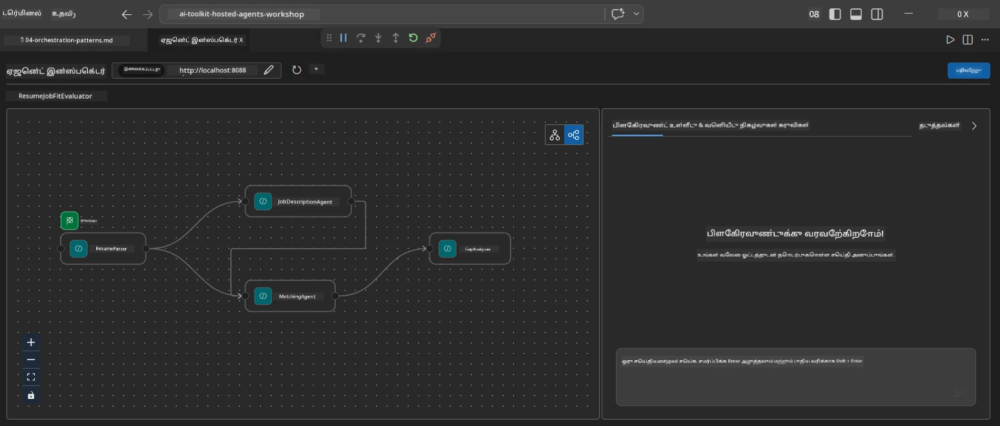
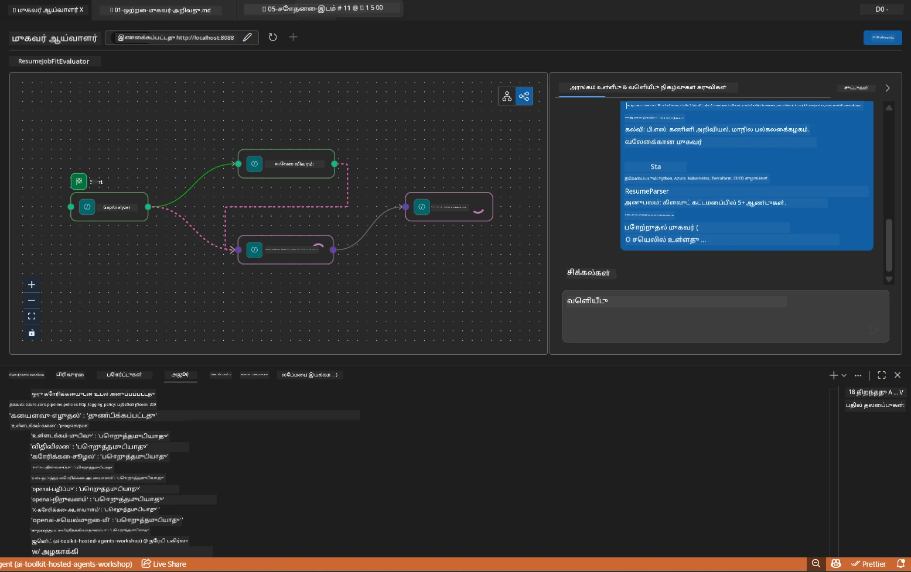
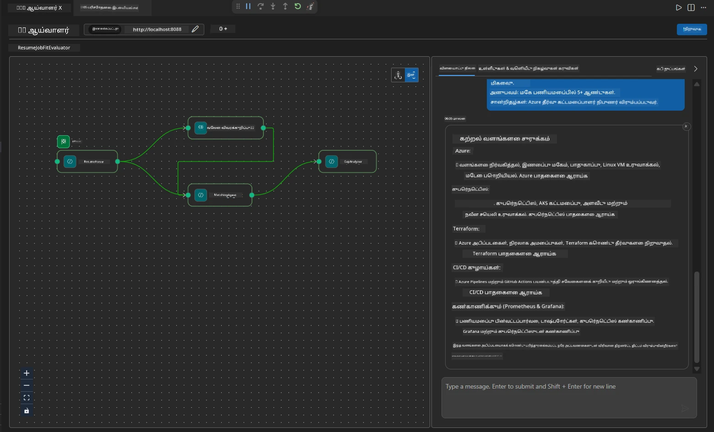

# Module 5 - உள்ளுறுதியாக சோதனை செய்யவும்

⏱️ ~15 நிமிடங்கள்

இந்த தொகுதியில், நீங்கள் பன்முக முகவர் பணியின்படியை உள்ளுறுதியாக இயக்கு, Agent Inspector மூலம் சோதனை செய்யவும், மற்றும் நான்கு முகவர்களும் MCP கருவியும் சரியாக வேலை செய்கின்றன என உறுதி செய்யவும், பிறகு செயல்படுத்தவும் செய்கிறீர்கள்.

---

## படி 1: முகவர் சேவையகத்தை துவக்கு

### விருப்பம் A: VS Code பண்படுத்தலைப் பயன்படுத்துதல் (பரிந்துரை செய்கிறது)

1. `workshop/lab02-multi-agent/PersonalCareerCopilot/` ஐ உங்கள் VS Code கோப்புறையாக திறக்கவும்.
2. `Ctrl+Shift+P` அழுத்தவும் → **Tasks: Run Task** Typed பண்ணவும் → **Run Agent HTTP Server** ஐத் தேர்ந்தெடுக்கவும்.
3. பண்படுத்தல் `5679` போர்டில் debugpy இணைக்கப்பட்டு, முகவர் `8088` போர்டில் இயங்க தொடங்கும்.
4. வெளியீடு இதுபோன்றதாக இருக்க காத்திருக்கவும்:

```
INFO:resume-job-fit:Starting Resume -> Job Fit Evaluator HTTP server...
INFO:resume-job-fit:Server running on http://localhost:8088
```

### விருப்பம் B: F5 (debug முறையில்) பயன்படுத்துதல்

1. `F5` அழுத்தவும் → **Debug Local Agent HTTP Server** ஐத் தேர்ந்தெடுக்கவும்.
2. சேவையகம் முழு breakpoint ஆதவையை உடையவாறு தொடங்கும் - இது MCP பதில்கள் அல்லது முகவர் வெளியீடுகளை ஆய்வு செய்ய உதவும்.

---

## படி 2: Agent Inspector ஐத் திறக்கவும்

1. `Ctrl+Shift+P` அழுத்தவும் → **Foundry Toolkit: Open Agent Inspector** Typed பண்ணவும்.
2. Agent Inspector என்பதன் VS Code பலகையாக திறக்கப்பட்டு `http://localhost:8088` க்கு இணைக்கப்படும்.
3. நீங்கள் முகவரின் இடைமுகத்தை செய்திகளை பெற தயாராக காண வேண்டும்.



> **Agent Inspector திறக்காமல் இருந்தால்:** சேவையகம் முழுமையாக தொடங்கியுள்ளது என்று உறுதிப்படுத்துக (நீங்கள் "Server running" பதிவை காண்கிறீர்கள்). போர்ட் 5679 செயல்பாட்டில் இருந்தால், [Module 8 - Troubleshooting](08-troubleshooting.md)ஐப் பார்க்கவும்.

---

## படி 2b: (விருப்பம்) Workflow Visualizer ஐ திறக்கவும்

Foundry Toolkit நேரடி **Workflow Visualizer** ஐ கொண்டுள்ளது, இது முகவர்கள் குறியீடு இயக்கும்போது எப்படி தொடர்பு கொள்கின்றன என்பதைக் காட்டுும். இது பன்முக முகவர் பிழைத்திருத்தத்திற்கு மிகவும் பயன்தருகிறது.

1. `Ctrl+Shift+P` அழுத்தவும் → **Foundry Toolkit: Open Visualizer for Hosted Agents** Typed பண்ணவும்.
2. ஒரு புதிய VS Code தாவல் நேரடி இயக்கக் குறியீட்டை காட்டி திறக்கும்.
3. நீங்கள் Agent Inspector இல் செய்திகளை அனுப்பும் போதே, visualizer தானாகவே புதுப்பிக்கப்படும் - பச்சை முடிவு பட்டைகள் முடித்த முகவர்களை காட்டும், மற்றும் இயக்கும் முனைகளில் தரவு போக்கை குறிப்பது செய்யப்படும்.

> **போர்ட் மோதல்:** visualizer போர்ட் ஏற்கனவே பயன்படுத்தப்பட்டு இருந்தால், அதை VS Code Settings → **Extensions** → **Microsoft Foundry Configuration** → **Hosted Agents: Visualizer Port** இல் மாற்றவும்.

---

## படி 3: நெருப்புச் சோதனைகள் இயக்கு

இவைகளை வரிசைப்படி இயக்கவும். ஒவ்வொன்றும் பணியின்படியின் மிகுதியான பகுதியை சோதிக்கும்.

### சோதனை 1: அடிப்படைவாய்ந்த சுயவிவரம் + வேலை விவரம்

கீழ்காணும் உரையை Agent Inspector இல் ஒட்டவும்:

```
Resume:
Jane Doe
Senior Software Engineer with 5 years of experience in Python, Django, and AWS.
Built microservices handling 10K+ requests/second. Led a team of 4 developers.
Certifications: AWS Solutions Architect Associate.
Education: B.S. Computer Science, State University.

Job Description:
Senior Cloud Engineer at Contoso Ltd.
Required: Python, Azure, Kubernetes, Terraform, CI/CD pipelines.
Preferred: Go, monitoring (Prometheus/Grafana), cost optimization.
Experience: 5+ years in cloud infrastructure.
Certifications: Azure Solutions Architect Expert preferred.
```

**எதிர்பார்க்கப்படும் வெளியீடு அமைப்பு:**

பதில் அனைத்து நான்கு முகவர்களின் வெளியீடுகளையும் தொடர்ச்சியாக கொண்டிருக்கும்:

1. **Resume Parser வெளியீடு** - இரண்டு குறிக்கப்பட்ட பிரிவுகள்: `[PARSED RESUME]` (காரியநுட்ப திறன்களுடன் வேடிக்கை சுயவிவரம்) மற்றும் `[JOB DESCRIPTION PASS-THROUGH]` (எழுத்துப்பிரதிகளின் முழு வேலையுரை, JD Agent க்கு ஊட்டமாகும்)
2. **JD Agent வெளியீடு** - கட்டமைக்கப்பட்ட தேவைகள், தேவையான மற்றும் விருப்பவையாக பிரிக்கப்பட்ட திறன்கள்
3. **Matching Agent வெளியீடு** - பொருந்தும் மதிப்பெண் (0-100) உடன் உடைத்தல், பொருந்தக்கூடிய திறன்கள், குறைவாக உள்ள திறன்கள், இடைவெளிகள்
4. **Gap Analyzer வெளியீடு** - எளிமைப்படுத்தப்பட்ட குறைவான திறன்களுக்கு தனி இடைவெளி அட்டைகள், ஒவ்வொன்றிலும் Microsoft Learn URLs





### சோதனை 1 இல் என்ன சரிபார்க்க வேண்டும்

| சரிபார்க்க வேண்டும் | எதிர்பார்க்கப்படும் | கடந்து விட்டீர்களா? |
|-------|----------|-------|
| பதில் பொருந்தும் மதிப்பெண் கொண்டது | 0-100 இடையிலான எண் உடன் உடைத்தல் | |
| பொருந்தக்கூடிய திறன்கள் பட்டியலிடப்பட்டுள்ளன | Python, CI/CD (பகுதி), மற்றும் பிற | |
| குறைவான திறன்கள் பட்டியலிடப்பட்டுள்ளன | Azure, Kubernetes, Terraform, மற்றும் பிற | |
| குறைபாடான திறன்கள் ஒவ்வொன்றுக்குமான இடைவெளி அட்டைகள் வழங்கப்பட்டுள்ளன | திறன் ஒன்றுக்கு ஒரு அட்டை | |
| Microsoft Learn URL கள் உள்ளன | உண்மையான `learn.microsoft.com` இணைப்புகள் | |
| பதிலில் தவறுகள் இல்லை | சுத்தமான கட்டமைக்கப்பட்ட வெளியீடு | |

### சோதனை 2: அரைமையாக பொருந்தும் வேடிக்கை - அதிக மதிப்பெண் உடைய வேடிக்கை

ஒரு வேடிக்கை ஜே.டி.க்கு நெருங்கிய பொருந்துகையை உறுதி செய்யக் கீழ்க்காணும் சுயவிவரத்தை ஒட்டவும்:

```
Resume:
Alex Chen
Senior Cloud Engineer with 7 years of experience.
Skills: Python, Azure (AKS, Functions, DevOps), Kubernetes, Terraform, CI/CD (GitHub Actions, Azure Pipelines), Go, Prometheus, Grafana, cost optimization.
Certifications: Azure Solutions Architect Expert, Azure DevOps Engineer Expert.
Led infrastructure migration to Azure for 3 enterprise clients.
Education: M.S. Computer Science, Tech University.

Job Description:
Senior Cloud Engineer at Contoso Ltd.
Required: Python, Azure, Kubernetes, Terraform, CI/CD pipelines.
Preferred: Go, monitoring (Prometheus/Grafana), cost optimization.
Experience: 5+ years in cloud infrastructure.
Certifications: Azure Solutions Architect Expert preferred.
```

**எதிர்பார்க்கப்படும் நடத்தை:**
- பொருந்தும் மதிப்பெண் **80+** ஆக இருக்க வேண்டும் (அதிகமான திறன்கள் பொருந்தும்)
- இடைவெளி அட்டைகள் அடிப்படை கற்றல் தவிர, மேம்படுத்தல்/நேர்காணல் தயாராக்கத் திருப்ப வேண்டும்
- GapAnalyzer வழிகாட்டிகள் சொல்வது: "பொருந்துதல் >= 80 என்றால், மேம்படுத்தல்/நேர்காணல் தயார் மீது கவனம் செலுத்தவும்"

---

## படி 4: உங்கள் சொந்த தரவுடன் சோதிக்கவும் (விருப்பம்)

உங்கள் சொந்த சுயவிவரம் மற்றும் உண்மையான வேலை விவரத்தை ஒட்டுகின்றீர்கள் முயற்சிக்கவும். இது உறுதி செய்ய உதவும்:

- முகவர்கள் שונים சுயவிவரம் வடிவமைப்புகளை கையாளுகின்றனர் (காலவரிசை, செயல்பாட்டு, கலப்பு)
- JD Agent வேறு வேறு JD பகுப்புருப் பாணிகளை கையாள்கிறது (பல முனைகளை, பண்புரை, கட்டமைக்கப்பட்டவைகள்)
- MCP கருவி உண்மையான திறன்களுக்கு பொருந்தக்கூடிய வளங்களை திருப்புகிறது
- இடைவெளி அட்டைகள் உங்கள் தனிப்பட்ட பின்னணிக்கு ஏற்ப தனிப்பயனாக்கப்படுள்ளன

> **தனியுரிமை - வழி A (Foundry cloud):** சுயவிவரம் மற்றும் வேலையுரை உரை உங்கள் Azure OpenAI பரவலுக்கு அனுப்பப்படுகிறது பகுப்பாய்வுக்காக. இது பட்டியலுக்குள் பதிவேற்றப்படாது அல்லது செயலாலய அமைப்பால் சேமிக்கப்படாது. நீங்கள் விரும்பினால் இடைநிலை பெயர்களை (எ.கா., "ஜேன் டோ") பயன்படுத்தலாம்.
>
> **தனியுரிமை - வழி B (Foundry Local):** அனைத்து நான்கு முகவர் பகுப்பாய்வுகள் முற்றிலும் உங்கள் சாதனத்திலேயே இயங்கும். உங்கள் சுயவிவரம் மற்றும் வேலையுரை உரை **உங்கள் இயந்திரத்தை ஒருபோதும் விட்டு வெளியே செல்லாது**. ஒரே வெளியே செல்லும் அழைப்பு MCP கருவி மூலம் `https://learn.microsoft.com/api/mcp` லிருந்து வளங்களை பெறுவது; அதில் அச்சிறப்பு பெயர் மட்டுமே உள்ளது, உங்கள் தனிப்பட்ட தரவு இல்லை.

---

### சரிபார்ப்பு

- [ ] சேவையகம் `8088` போர்டில் வெற்றிகரமாக தொடங்கப்பட்டது (பதிவில் "Server running" காணப்படுகிறது)
- [ ] Agent Inspector திறக்கப்பட்டு முகவருடன் இணைக்கப்பட்டது
- [ ] சோதனை 1: பொருந்தும் மதிப்பெண், பொருந்திய/குறைவான திறன்கள், இடைவெளி அட்டைகள், மற்றும் Microsoft Learn URL கள் கொண்ட முழுமையான பதில்
- [ ] சோதனை 2: அதிக பொருந்தும் வேடிக்கை 80+ மதிப்பெண் மற்றும் மேம்பாட்டுக்கான பரிந்துரைகள் பெற்றது
- [ ] அனைத்து இடைவெளி அட்டைகளும் உள்ளன (குறைவான திறனுக்கு ஒவ்வொன்றும், குறுக்குவெளி இல்லை)
- [ ] சேவையக காலியிடத்தில் தவறுகள் அல்லது ஸ்டாக் டிரேஸ் எதுவுமில்லை

---

**முந்தையது:** [04 - Orchestration Patterns](04-orchestration-patterns.md) · **அடுத்தவை:** [06 - Deploy to Foundry →](06-deploy-to-foundry.md)

---

<!-- CO-OP TRANSLATOR DISCLAIMER START -->
**மறுப்பு**:
இந்த ஆவணம் AI மொழிபெயர்ப்பு சேவை [Co-op Translator](https://github.com/Azure/co-op-translator) பயன்படுத்தி மொழிபெயர்க்கப்பட்டுள்ளது. நாங்கள் துல்லியத்திற்காக முயற்சி செய்துள்ளோம், ஆனால் தானாக செய்யப்படும் மொழிபெயர்ப்புகளில் பிழைகள் அல்லது தவறுகள் இருக்கலாம் என்பதை கவனத்தில் கொள்ளவும். அசல் ஆவணம் அதன் தாய்மொழியில் அதிகாரப்பூர்வ ஆதாரமாக கருதப்பட வேண்டும். முக்கியமான தகவல்களுக்கு, தொழில்நுட்பமான மனித மொழிபெயர்ப்பு பரிந்துரைக்கப்படுகிறது. இந்த மொழிபெயர்ப்பைப் பயன்படுத்துவதால் ஏற்படும் எந்த தவறான புரிதல்கள் அல்லது தவறான விளக்கத்திற்கும் நாங்கள் பொறுப்பில்வில்லை.
<!-- CO-OP TRANSLATOR DISCLAIMER END -->